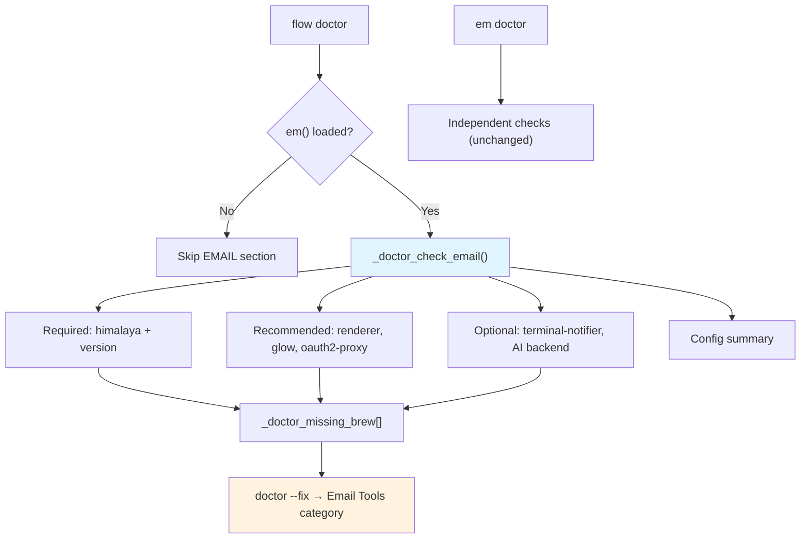

# SPEC: Integrate em doctor with flow doctor

| Field | Value |
|-------|-------|
| **Status** | draft |
| **Created** | 2026-02-12 |
| **From Brainstorm** | BRAINSTORM-em-doctor-flow-integration-2026-02-12.md |
| **Component** | `commands/doctor.zsh` |
| **Affects** | `flow doctor`, `flow doctor --fix` |

## Overview

Add an EMAIL section to `flow doctor` that checks himalaya and all email dependencies when the `em` dispatcher is loaded. This ensures email health is verified alongside core flow-cli tools, with full `--fix` support for installing missing email dependencies via brew/pip. In verbose mode, test IMAP connectivity (account config, message fetch, OAuth2 token validity, SMTP config validation). The `--fix` mode includes guided himalaya config creation with interactive prompts.

## Primary User Story

**As a** flow-cli user with the email dispatcher loaded,
**I want** `flow doctor` to check my email dependencies (himalaya, renderers, AI backends),
**So that** I get a complete health picture in one command instead of running `em doctor` separately.

### Acceptance Criteria

- [ ] `flow doctor` shows EMAIL section when `em()` function is loaded
- [ ] `flow doctor` does NOT show EMAIL section when em is not loaded (zero overhead)
- [ ] All email deps checked: himalaya (required), w3m/lynx/pandoc (any-of), glow, email-oauth2-proxy, terminal-notifier, AI backends
- [ ] Himalaya version >= 1.0.0 verified
- [ ] Config summary shown (AI backend, timeout, page size, config file)
- [ ] `flow doctor --fix` includes "Email Tools" category in fix menu
- [ ] Shared deps (fzf, bat, jq) not double-checked — only email-unique tools
- [ ] `em doctor` still works independently (no breaking change)
- [ ] Himalaya installed via `brew install himalaya` in --fix mode
- [ ] `flow doctor --verbose` tests IMAP connectivity (account list, fetch 1 message, OAuth2 token, SMTP config)
- [ ] Connectivity failures shown as warnings (yellow), not errors
- [ ] `flow doctor --fix` offers guided himalaya config creation (interactive prompts)
- [ ] `flow doctor --fix` offers OAuth2 proxy setup guidance
- [ ] `flow doctor --fix` runs connectivity test after setup completes

## Secondary User Stories

### First-time email setup

**As a** new flow-cli user who just enabled the email dispatcher,
**I want** `flow doctor --fix` to install himalaya and its dependencies,
**So that** I can get email working without manually looking up install commands.

### Ongoing health monitoring

**As a** daily email user,
**I want** `flow doctor` to warn me if himalaya is outdated or missing renderers,
**So that** I catch issues before they break my workflow.

### Verbose connectivity check

**As a** user troubleshooting email issues,
**I want** `flow doctor --verbose` to test actual IMAP/SMTP connectivity,
**So that** I can pinpoint whether the problem is config, network, or auth.

### Guided email setup

**As a** user setting up email for the first time,
**I want** `flow doctor --fix` to walk me through himalaya config creation,
**So that** I don't have to manually write TOML config or look up IMAP/SMTP settings.

## Architecture



### Section Placement in flow doctor

```
SHELL → REQUIRED → RECOMMENDED → OPTIONAL → INTEGRATIONS
→ 📧 EMAIL (new, conditional)
→ DOTFILES → PLUGIN MANAGER → ZSH PLUGINS → FLOW-CLI → GITHUB TOKEN → ALIASES
```

## API Design

### New Function: `_doctor_check_email()`

```zsh
_doctor_check_email()
# Purpose:  Check email dispatcher dependencies + optional connectivity
# Called by: doctor() main function, conditionally
# Uses:     _doctor_check_cmd() for consistent tracking
# Side effects: Populates _doctor_missing_brew[], _doctor_missing_pip[]
# Output:   Formatted status lines to stdout
# Verbose:  Tests IMAP connectivity (account, fetch, OAuth2, SMTP config)
```

### New Function: `_doctor_email_connectivity()`

```zsh
_doctor_email_connectivity()
# Purpose:  Test email connectivity (verbose mode only)
# Tests:    1. himalaya account list (config valid?)
#           2. himalaya envelope list --page-size 1 (IMAP reachable?)
#           3. OAuth2 proxy token validity (if email-oauth2-proxy running)
#           4. SMTP config validation (parse config.toml, verify host/port/auth set)
# Output:   Status lines with yellow warnings on failure
# Latency:  ~3-5s total (all 4 checks)
```

### New Function: `_doctor_email_setup()`

```zsh
_doctor_email_setup()
# Purpose:  Guided email configuration (--fix mode)
# Flow:     1. Install missing tools (brew/pip)
#           2. Check for himalaya config → if missing, guide creation
#           3. Interactive prompts: email, IMAP host/port, auth method
#           4. Generate ~/.config/himalaya/config.toml
#           5. Offer OAuth2 proxy setup (if Gmail/Outlook detected)
#           6. Run connectivity test to verify
# Output:   Step-by-step interactive prompts with colored feedback
```

### New Fix Category

```zsh
# In _doctor_select_fix_category():
if [[ ${#_doctor_missing_email_brew[@]} -gt 0 || "$_doctor_email_no_config" == true ]]; then
    categories+=("email")
    category_info[email]="📧 Email Tools + Setup ($detail, ~${time})"
fi
```

### New Flag (future): `--email`

```zsh
# Mirrors --dot pattern for isolated email check
doctor --email     # Check only EMAIL section
```

N/A for initial implementation — future enhancement.

## Data Models

N/A - No data model changes. Uses existing `_doctor_missing_brew[]`, `_doctor_missing_pip[]` arrays.

## Dependencies

| Dependency | Purpose | Required |
|-----------|---------|----------|
| `_doctor_check_cmd` | Existing helper for dep checking | Yes (already exists) |
| `_em_semver_lt` | Version comparison | Yes (already in email-dispatcher.zsh) |
| `FLOW_EMAIL_AI` | Determines which AI backend to check | No (env var, may be unset) |

## UI/UX Specifications

### Flow Doctor Output (EMAIL section)

```
📧 EMAIL (himalaya)
  ✓ himalaya          1.1.0
  ✓ himalaya version  >= 1.0.0
  ✓ w3m               0.5.3     (HTML rendering)
  ○ glow              (Markdown rendering)  ← brew install glow
  ✓ email-oauth2-proxy 2.2.0
  ○ terminal-notifier (Desktop notifications)  ← brew install terminal-notifier

  Config:
    AI backend:  claude
    AI timeout:  30s
    Page size:   25
    Folder:      INBOX
    Config file: (none — using env defaults)
```

### Fix Mode Menu (with email)

```
╭─ Select Category to Fix ─────────────────────╮
│                                                │
│  1. 📦 Missing Tools (2 tools, ~1m)           │
│  2. 📧 Email Tools (2 tools, ~1m)             │
│  3. ✨ Fix All Categories (~2m)                │
│                                                │
│  0. Exit without fixing                        │
╰───────────────────────────────────────────────╯
```

### Verbose Mode Output (--verbose)

```
📧 EMAIL (himalaya)
  ✓ himalaya          1.1.0
  ✓ himalaya version  >= 1.0.0
  ✓ w3m               0.5.3     (HTML rendering)
  ○ glow              (Markdown rendering)  ← brew install glow
  ✓ email-oauth2-proxy 2.2.0
  ○ terminal-notifier (Desktop notifications)  ← brew install terminal-notifier

  Connectivity:
    ✓ Account config valid (default account)
    ✓ IMAP reachable (fetched 1 message in 1.2s)
    ✓ OAuth2 token valid (email-oauth2-proxy running)
    △ SMTP config: host/port set, auth=oauth2

  Config:
    AI backend:  claude
    AI timeout:  30s
    Page size:   25
    Folder:      INBOX
    Config file: ~/.config/himalaya/config.toml
```

### Verbose Connectivity Failure (warning, not error)

```
  Connectivity:
    ✓ Account config valid (default account)
    △ IMAP: connection timed out (check network/firewall)
    △ OAuth2: email-oauth2-proxy not running
    ○ SMTP config: not configured (send may fail)
```

### Fix Mode Output (email setup)

```
🔧 Email Setup
━━━━━━━━━━━━━━━━━━━━━━━━━━━━━━━━━━━━━━━━

  Step 1: Installing missing tools...
  ✓ himalaya installed
  ✓ glow installed

  Step 2: himalaya configuration
  No config found at ~/.config/himalaya/config.toml

  ? Email address: user@gmail.com
  ? IMAP server: [auto-detected: imap.gmail.com]
  ? IMAP port: [auto-detected: 993]
  ? Auth method: (1) OAuth2  (2) App Password  (3) Plain
  > 1

  ✓ Config written to ~/.config/himalaya/config.toml

  Step 3: OAuth2 setup (Gmail detected)
  ? Set up email-oauth2-proxy for Gmail OAuth2? [Y/n]
  ✓ OAuth2 proxy configured

  Step 4: Testing connection...
  ✓ Account config valid
  ✓ IMAP connected (fetched 1 message)
  ✓ Email setup complete!
```

### Provider Auto-Detection

| Email Domain | IMAP Server | IMAP Port | SMTP Server | SMTP Port | Auth |
|-------------|-------------|-----------|-------------|-----------|------|
| gmail.com | imap.gmail.com | 993 | smtp.gmail.com | 587 | OAuth2 |
| outlook.com/hotmail.com | outlook.office365.com | 993 | smtp.office365.com | 587 | OAuth2 |
| yahoo.com | imap.mail.yahoo.com | 993 | smtp.mail.yahoo.com | 587 | App Password |
| icloud.com | imap.mail.me.com | 993 | smtp.mail.me.com | 587 | App Password |
| (other) | (ask user) | 993 | (ask user) | 587 | (ask user) |

### When em is NOT loaded

No EMAIL section appears. Zero output, zero overhead.

### Accessibility

N/A - CLI only, uses existing color scheme from `lib/core.zsh`.

## Open Questions

1. **Should `_em_semver_lt` be extracted to a shared utility?** Both `em doctor` and `flow doctor` need version comparison. Currently duplicating logic is fine, but a shared `_flow_semver_lt` in `lib/core.zsh` would be cleaner.
2. **Should `em doctor` eventually detect the flow doctor EMAIL section?** If so, `em doctor` could show "Email deps verified by flow doctor — run `em doctor` for email-specific diagnostics only" to reduce noise.

## Review Checklist

### Dep Checking
- [ ] `_doctor_check_email()` uses `_doctor_check_cmd` consistently
- [ ] Conditional gate: `(( $+functions[em] ))` tested both ways
- [ ] No duplicate checks for fzf, bat, jq (already in earlier sections)
- [ ] HTML renderer uses any-of logic (w3m OR lynx OR pandoc)
- [ ] AI backend check respects `$FLOW_EMAIL_AI` value
- [ ] Config summary matches em doctor's output format

### Verbose Connectivity
- [ ] Account config test: `himalaya account list` with timeout
- [ ] IMAP ping: `himalaya envelope list --page-size 1` with timeout
- [ ] OAuth2 check: detect if email-oauth2-proxy process running + token validity
- [ ] SMTP config validation: parse config.toml for host/port/auth fields
- [ ] All connectivity failures are warnings (yellow), not errors
- [ ] Connectivity tests only run in `--verbose` mode
- [ ] Reasonable timeout (5s per test, 15s total max)

### Fix Mode
- [ ] `--fix` mode installs email deps via brew/pip correctly
- [ ] Email category appears in fix menu with correct count/time estimate
- [ ] Guided config creation: interactive prompts for email/server/auth
- [ ] Provider auto-detection (gmail, outlook, yahoo, icloud)
- [ ] Config.toml generated at `~/.config/himalaya/config.toml`
- [ ] OAuth2 proxy setup offered for Gmail/Outlook
- [ ] Connectivity test runs after setup to verify

### General
- [ ] `em doctor` still works independently (no regressions)
- [ ] Doctor help text updated with EMAIL section mention
- [ ] Tests added for conditional gate and dep checking

## Implementation Notes

### Dedup Strategy

fzf, bat, and jq are already checked in REQUIRED/RECOMMENDED/OPTIONAL sections. The EMAIL section should NOT re-check them. Instead, email-unique tools only:
- himalaya (+ version), w3m/lynx/pandoc (any-of), glow, email-oauth2-proxy, terminal-notifier, AI backends

### HTML Renderer Any-Of Pattern

```zsh
# Check if ANY HTML renderer is available
if ! command -v w3m &>/dev/null && ! command -v lynx &>/dev/null && ! command -v pandoc &>/dev/null; then
    _doctor_check_cmd "w3m" "brew" "recommended"  # Suggest w3m as primary
else
    # Show which one is available
    for renderer in w3m lynx pandoc; do
        if command -v "$renderer" &>/dev/null; then
            _doctor_log_quiet "  ${FLOW_COLORS[success]}✓${FLOW_COLORS[reset]} $renderer ${FLOW_COLORS[muted]}(HTML rendering)${FLOW_COLORS[reset]}"
            break
        fi
    done
fi
```

### Fix Mode Tracking

Email deps automatically tracked via `_doctor_missing_brew[]` and `_doctor_missing_pip[]`. The fix category selection needs a new "email" category that filters these arrays to email-specific packages. Implementation approach:
- Track email-specific missing packages in a separate `_doctor_missing_email_brew[]` array
- OR tag email packages with a prefix in the existing arrays
- Simplest: use a separate `_doctor_missing_email_brew` array, add to category menu

### Verbose Connectivity Implementation

```zsh
_doctor_email_connectivity() {
    _doctor_log_verbose ""
    _doctor_log_verbose "  ${FLOW_COLORS[muted]}Connectivity:${FLOW_COLORS[reset]}"

    # 1. Account config valid?
    local acct_out
    acct_out=$(timeout 5 himalaya account list 2>&1)
    if [[ $? -eq 0 ]]; then
        local acct_name=$(echo "$acct_out" | head -1)
        _doctor_log_verbose "    ${FLOW_COLORS[success]}✓${FLOW_COLORS[reset]} Account config valid ($acct_name)"
    else
        _doctor_log_verbose "    ${FLOW_COLORS[warning]}△${FLOW_COLORS[reset]} Account config: ${acct_out:0:60}"
    fi

    # 2. IMAP reachable?
    local start_ms=$EPOCHREALTIME
    if timeout 5 himalaya envelope list --page-size 1 &>/dev/null; then
        local elapsed=$(printf "%.1f" $(( EPOCHREALTIME - start_ms )))
        _doctor_log_verbose "    ${FLOW_COLORS[success]}✓${FLOW_COLORS[reset]} IMAP reachable (${elapsed}s)"
    else
        _doctor_log_verbose "    ${FLOW_COLORS[warning]}△${FLOW_COLORS[reset]} IMAP: connection failed (check network/config)"
    fi

    # 3. OAuth2 proxy running?
    if command -v email-oauth2-proxy &>/dev/null; then
        if pgrep -f email-oauth2-proxy &>/dev/null; then
            _doctor_log_verbose "    ${FLOW_COLORS[success]}✓${FLOW_COLORS[reset]} OAuth2 proxy running"
        else
            _doctor_log_verbose "    ${FLOW_COLORS[warning]}△${FLOW_COLORS[reset]} OAuth2 proxy not running"
        fi
    fi

    # 4. SMTP config validation
    local config_file="${XDG_CONFIG_HOME:-$HOME/.config}/himalaya/config.toml"
    if [[ -f "$config_file" ]]; then
        if grep -q 'smtp' "$config_file" 2>/dev/null; then
            local smtp_host=$(grep -E 'host\s*=' "$config_file" | tail -1)
            _doctor_log_verbose "    ${FLOW_COLORS[success]}✓${FLOW_COLORS[reset]} SMTP configured ${FLOW_COLORS[muted]}${smtp_host:0:40}${FLOW_COLORS[reset]}"
        else
            _doctor_log_verbose "    ${FLOW_COLORS[warning]}△${FLOW_COLORS[reset]} SMTP: not configured in config.toml"
        fi
    fi
}
```

### Guided Setup Implementation Notes

The email setup wizard (`_doctor_email_setup`) should:

1. **Auto-detect provider** from email domain (gmail → imap.gmail.com, etc.)
2. **Suggest auth method** based on provider (Gmail/Outlook → OAuth2, others → App Password)
3. **Generate TOML** using heredoc with user values interpolated
4. **Handle existing config** — if config.toml exists, ask before overwriting
5. **OAuth2 proxy setup** is a separate step — only offered for providers that need it
6. **Post-setup test** runs `_doctor_email_connectivity` to verify

### Files to Modify

| File | Change |
|------|--------|
| `commands/doctor.zsh` | Add `_doctor_check_email()`, `_doctor_email_connectivity()`, `_doctor_email_setup()` |
| `commands/doctor.zsh` | Call `_doctor_check_email` conditionally in main `doctor()` |
| `commands/doctor.zsh` | Update `_doctor_select_fix_category()` for email category |
| `commands/doctor.zsh` | Update `_doctor_apply_fixes()` for email fix path |
| `commands/doctor.zsh` | Update `_doctor_help()` to mention EMAIL section |

### Files NOT Modified

| File | Reason |
|------|--------|
| `lib/dispatchers/email-dispatcher.zsh` | `em doctor` stays independent |
| `lib/em-himalaya.zsh` | Adapter layer unchanged |

## History

| Date | Change |
|------|--------|
| 2026-02-12 | Initial spec from brainstorm (draft) |
| 2026-02-12 | Added verbose connectivity checks (IMAP, OAuth2, SMTP config) |
| 2026-02-12 | Added guided email setup in --fix mode (interactive prompts, provider auto-detect) |
