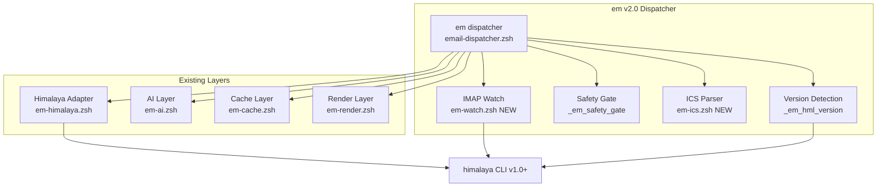

# SPEC: em Dispatcher v2.0

**Status:** draft
**Created:** 2026-02-26
**From Brainstorm:** BRAINSTORM-em-v2-2026-02-26.md
**Target Release:** flow-cli v7.5.0
**Estimated Code Delta:** ~770 lines (570 new features + 200 security fixes)

---

## Overview

Upgrade the `em` email dispatcher from v1.0 to v2.0, bringing feature parity with himalaya-mcp v1.3.1 (folder CRUD, compose safety gates, attachment improvements, ICS calendar parsing), adding real-time IMAP IDLE watch, himalaya version detection for progressive enhancement, and fixing 12 security findings (2 critical, 6 high) identified during the architecture audit.

---

## Primary User Story

**As a** terminal-first developer using flow-cli's email dispatcher,
**I want** safer email sending (preview before send), folder management, better attachments, calendar invite parsing, and real-time email notifications,
**So that** I can manage email entirely from the terminal without needing the himalaya-mcp plugin or a GUI client, with confidence that destructive operations require confirmation.

## Acceptance Criteria

- [ ] `em send` and `em reply` show preview before sending (breaking change, `--force` to bypass)
- [ ] `em create-folder <name>` and `em delete-folder <name>` work with confirmation
- [ ] `em attach list <ID>` shows filename, MIME type, size
- [ ] `em attach get <ID> <filename>` downloads specific attachment safely
- [ ] `em calendar <ID>` parses ICS attachment and displays event details
- [ ] `em watch start/stop/status/log` manages IMAP IDLE background notifications
- [ ] himalaya version auto-detected; v1.2 features used when available
- [ ] All 12 security findings resolved (2 critical, 6 high, 4 medium)
- [ ] All existing tests pass + new tests for all v2.0 features
- [ ] `em help` updated with new commands
- [ ] `em doctor` updated to check new dependencies (terminal-notifier)

## Secondary User Stories

**As a** power user, I want `--force` flag on send/reply to skip the preview gate for scripted workflows.

**As a** user receiving meeting invites, I want `em calendar <ID>` to parse the `.ics` file and optionally create an Apple Calendar event without relying on AI extraction.

**As a** user who wants real-time email awareness, I want `em watch` to show macOS notifications when new emails arrive, without leaving a browser open.

---

## Architecture



### Key Design Decisions

1. **Independent from himalaya-mcp** — No coupling. Both consume himalaya CLI directly.
2. **Temp file pattern for safety gate** — Draft stored in temp file, read into variable before confirm, sent from variable (prevents TOCTOU).
3. **PID file for IMAP watch** — Single-instance guard, lifecycle management, orphan detection.
4. **Pure ZSH ICS parser** — Handles 90% case (basic VEVENT). Optional Python `icalendar` enhancement detected at runtime.
5. **Version caching** — Session-scoped global variable, zero disk I/O, cleared by `em doctor`.

---

## API Design

### New Dispatcher Subcommands

| Command | Action | Return Codes |
|---------|--------|-------------|
| `em create-folder <name>` | Create IMAP folder | 0=created, 1=error |
| `em delete-folder <name>` | Delete IMAP folder (with type-to-confirm) | 0=deleted, 1=error, 2=abort |
| `em attach list <ID>` | List attachments with MIME info | 0=ok, 1=error |
| `em attach get <ID> <filename> [dir]` | Download specific attachment | 0=ok, 1=not found, 2=error |
| `em calendar <ID>` | Parse ICS attachment, display/create event | 0=ok, 1=no ICS, 2=error |
| `em watch [start\|stop\|status\|log]` | IMAP IDLE notification manager | 0=ok, 1=error |

### Modified Subcommands (Breaking Changes)

| Command | v1.0 Behavior | v2.0 Behavior |
|---------|--------------|---------------|
| `em send` | Opens `$EDITOR`, sends immediately | Opens `$EDITOR`, shows preview, requires `[y/N/e]` confirm |
| `em reply <ID>` | AI drafts, sends after basic confirm | AI drafts, shows full preview, requires `[y/N/e]` confirm |

**Migration:** `--force` or `--yes` flag restores v1.0 behavior. One-time notice on first v2.0 invocation.

### New Adapter Functions

```zsh
# Version detection
_em_hml_version()                           # -> "1.2.0"
_em_hml_version_gte "$min_version"          # -> rc 0/1
_em_require_version "$ver" "$feature"       # -> rc 0/1 (prints error)

# Folder CRUD
_em_hml_folder_create "$name"               # -> himalaya exit code
_em_hml_folder_delete "$name"               # -> himalaya exit code

# Attachments
_em_hml_attachment_list "$msg_id"            # -> JSON or plain (version-dependent)
_em_hml_attachment_download "$id" "$file" "$dir"

# Watch
_em_hml_watch "$folder"                     # -> blocking, pipe output
```

---

## Data Models

N/A — No persistent data model changes. Existing cache structure unchanged. New files:

| File | Purpose |
|------|---------|
| `~/.flow/email-watch.pid` | IMAP watch process ID |
| `~/.flow/email-watch.log` | Watch notification log |
| `~/.config/flow/em-v2-notice-shown` | One-time migration notice flag |

---

## Dependencies

| Dependency | Required | Purpose | Install |
|------------|----------|---------|---------|
| himalaya CLI v1.0+ | Yes | Email backend | `brew install himalaya` |
| terminal-notifier | For `em watch` only | macOS notifications | `brew install terminal-notifier` |
| python3 + icalendar | Optional | Enhanced ICS parsing | `pip install icalendar` |
| jq | Yes (existing) | JSON processing | `brew install jq` |

---

## UI/UX Specifications

### Safety Gate Flow

```
$ em send
[Opens $EDITOR for composition]

--- Send Preview ---
To:      user@example.com
Subject: Meeting notes
---
Here are the notes from today's meeting...

Send? [y/N/e(dit)] _
```

- `y` — sends immediately
- `N` (default) — aborts, prints "Draft saved: /tmp/em-draft-XXXXX.eml"
- `e` — re-opens `$EDITOR`, then re-displays preview

### Folder Delete Confirmation

```
$ em delete-folder Old-Archive
⚠ This will permanently delete folder "Old-Archive" and all its contents.
Type folder name to confirm: _
```

### Watch Status

```
$ em watch start
✓ Watching INBOX for new messages (PID 12345)

$ em watch status
✓ Watch running (PID 12345)

$ em watch stop
✓ Watch stopped
```

### Accessibility
- All confirmations have explicit default (N = safe)
- Color output respects `NO_COLOR` environment variable
- Screen reader: all status messages use text, not just color

---

## Security Requirements

### Critical (Must fix in v2.0)

1. **AppleScript injection** — Replace heredoc with `osascript -e` escaped statements in `_em_create_calendar_event`
2. **Folder name injection** — `_em_validate_folder_name()` + `--` terminator in all adapter calls

### High (Must fix in v2.0)

3. **jq injection** — `_em_validate_msg_id()` (numeric only) + `jq --argjson` in 6 locations
4. **Config source execution** — Replace `source "$config_file"` with key=value parser
5. **terminal-notifier injection** — Sanitize + truncate subjects before notification
6. **Safety gate TOCTOU** — Read draft into variable before confirm, send from variable
7. **IMAP IDLE lifecycle** — PID file, single-instance guard, static notification strings
8. **ICS attack surface** — 1MB size gate, 10-event limit, field sanitization
9. **Path traversal** — `realpath` containment check after attachment download

### Medium (Should fix in v2.0)

10. `$body` arg injection → pass via stdin/temp file
11. Snooze file race → `mktemp` for atomic write
12. Temp cleanup on SIGINT → `trap` in subshell
13. AI extra args → allowlist validation

---

## Open Questions

1. **himalaya `envelope watch` output format** — Is it stable across versions? Need to test with v1.2.0 and document format expectations.
2. **`--force` flag naming** — Should it be `--force`, `--yes`, or `-y`? Consistency with other flow-cli commands?
3. **ICS timezone handling** — Display raw UTC for v2.0 or attempt macOS `date -j` conversion?

---

## Review Checklist

- [ ] All security findings addressed (12 items)
- [ ] Breaking change documented in CHANGELOG
- [ ] `em help` updated with all new commands
- [ ] `em doctor` checks terminal-notifier + himalaya version
- [ ] Version detection tested with v1.0, v1.1, v1.2 (mocked)
- [ ] Safety gate tested: y/N/e paths, --force bypass, SIGINT cleanup
- [ ] Folder CRUD tested: create, delete, name validation, injection attempts
- [ ] Attachment tested: list, get by name, path traversal blocked
- [ ] ICS tested: valid ICS, malformed ICS, oversized, multi-event, line folding
- [ ] Watch tested: start, stop, status, log, orphan detection, duplicate guard
- [ ] All 46 existing test suites still pass
- [ ] New test suites for v2.0 features added
- [ ] Docs updated: REFCARD, MASTER-DISPATCHER-GUIDE, EMAIL-DISPATCHER-GUIDE, tutorials
- [ ] `em doctor` shows v2.0 version

---

## Implementation Notes

### File Changes

| File | Type | Est. Lines |
|------|------|-----------|
| `lib/em-himalaya.zsh` | Modified | +80 (version detect, folder CRUD, attach adapter) |
| `lib/dispatchers/email-dispatcher.zsh` | Modified | +200 (safety gate, folder/attach commands, security fixes) |
| `lib/em-ics.zsh` | **New** | ~120 (ICS parser) |
| `lib/em-watch.zsh` | **New** | ~150 (IMAP IDLE watcher) |
| `lib/em-render.zsh` | Modified | +15 (ICS content type) |
| `lib/em-cache.zsh` | Modified | +5 (version cache clear) |
| `lib/email-helpers.zsh` | Modified | +30 (config parser rewrite, security) |
| `tests/test-em-v2-*.zsh` | **New** | ~400 (new feature tests) |
| `docs/reference/REFCARD-EMAIL-DISPATCHER.md` | Modified | Update |
| `docs/guides/EMAIL-DISPATCHER-GUIDE.md` | Modified | Update |
| **Total** | | **~1000 lines** |

### Implementation Order (within single branch)

1. Security fixes (foundation — block injection vectors before adding new surfaces)
2. Version detection (required by folder CRUD + attachments)
3. Compose safety gate (highest user value)
4. Folder CRUD (quick win)
5. Attachment improvements
6. ICS parsing
7. IMAP IDLE watch (most experimental — last)
8. Tests + docs

---

## History

| Date | Change |
|------|--------|
| 2026-02-26 | Initial spec from max brainstorm (backend-architect + security-auditor agents) |

---

*Generated by /workflow:brainstorm max feat save*
