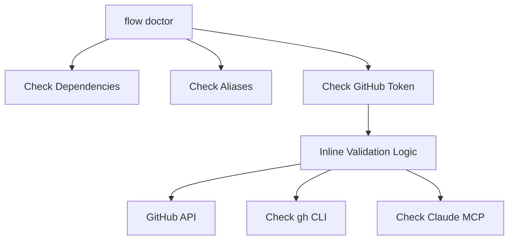
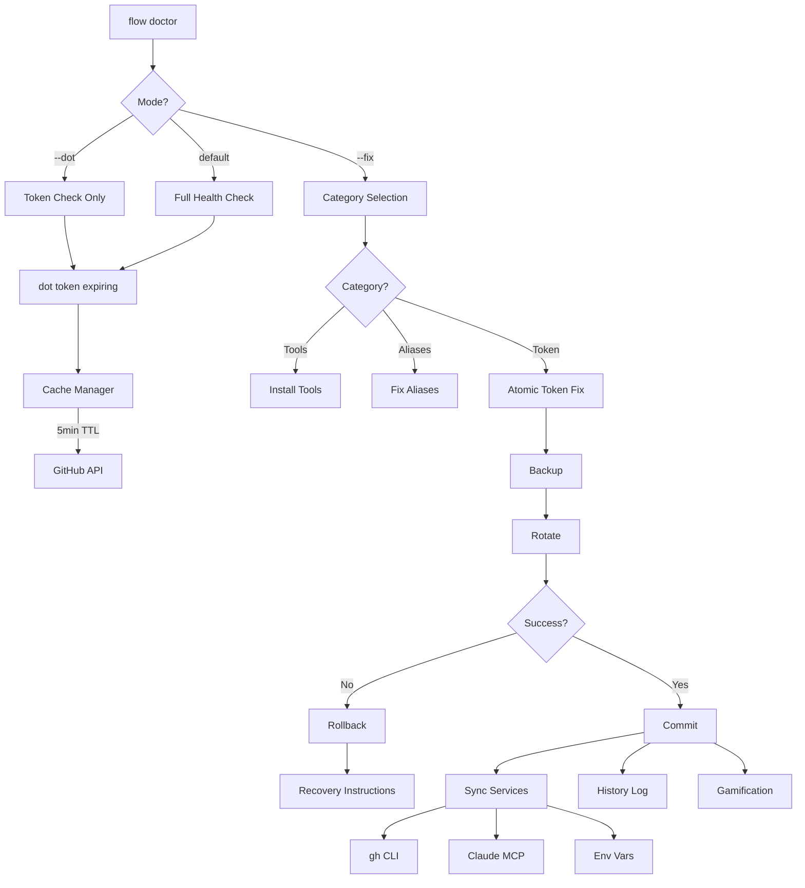
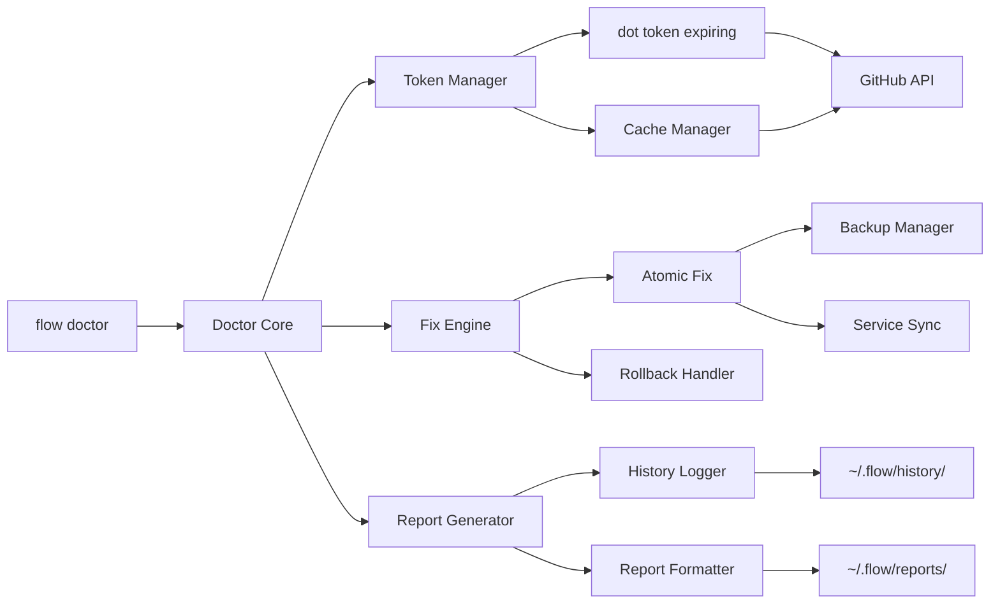

# SPEC: flow doctor DOT Token Enhancement

## Metadata

**Status:** phase-1-approved
**Created:** 2026-01-23
**Approved for Implementation:** 2026-01-23 (Phase 1 only)
**From Brainstorm:** Deep analysis with 18 expert questions
**Feature Branch:** feature/token-automation (to be merged to dev)
**Target Version:** v5.17.0
**Effort Estimate:** 12 hours Phase 1 (approved) + 30 hours Phases 2-4 (deferred)
**Priority:** High (Security & UX improvement)

---

## Overview

Enhance `flow doctor` command with DOT token automation capabilities. **Phase 1** (approved for implementation) focuses on core enhancements: isolated checks, category-based fixes, and unified validation logic. Phases 2-4 (safety/reporting, user experience, advanced features) are deferred to future development cycles.

This transforms flow doctor from a general health checker into a sophisticated token lifecycle management tool while maintaining its ADHD-friendly design philosophy.

**Phase 1 Enhancements (12 hours - APPROVED):**
1. ✅ Isolated token checks (`--dot` flag)
2. ✅ Category-based fix selection
3. ✅ Unified token validation logic (delegate to `dot token expiring`)
4. ✅ Verbosity levels (--quiet, --verbose)
5. ✅ 5-minute cache manager (avoid API rate limits)

**Future Enhancements (30 hours - DEFERRED):**
- Phase 2: Atomic fixes with rollback, inline git fixes, token reports, multi-token support, history tracking
- Phase 3: Gamification integration, macOS notifications, event hooks
- Phase 4: Custom validation rules, CI/CD exit codes, additional event hooks

---

## Primary User Story

**As a** flow-cli user with GitHub tokens
**I want** to quickly check and fix token issues in isolation
**So that** I can maintain security without running full dependency checks

**Acceptance Criteria:**
1. ✅ `flow doctor --dot` checks only token health (< 3 seconds)
2. ✅ `flow doctor --fix-token` fixes only token issues (< 60 seconds)
3. ✅ Failed fixes rollback automatically with recovery instructions
4. ✅ `g push` detects expired tokens and offers inline fix
5. ✅ Token rotations log as "Security maintenance" wins
6. ✅ All token operations cached for 5 minutes (avoid API rate limits)

**User Journey:**
```bash
# Morning routine
$ flow doctor --dot
🔑 GITHUB TOKEN
  ⚠ Expiring in 5 days

# Quick fix
$ flow doctor --fix-token
🔄 Rotating github-token... (30s estimated)
  ✓ Backup saved
  ✓ New token generated
  ✓ Synced with gh CLI
✅ Done (28s)
🎉 Win logged: Security maintenance

# Later that day
$ g push
✓ Token validated
[pushes normally]
```

---

## Secondary User Stories

### Story 2: CI/CD Integration

**As a** DevOps engineer
**I want** machine-readable exit codes from token checks
**So that** I can integrate flow doctor into CI/CD pipelines

**Acceptance Criteria:**
- Exit code 0 = all tokens healthy
- Exit code 1-5 = specific token issues (documented)
- `--format json` outputs structured data
- Runs in non-interactive mode (`--fix -y`)

### Story 3: Security Auditing

**As a** security-conscious developer
**I want** comprehensive token health reports
**So that** I can audit token lifecycle and security posture

**Acceptance Criteria:**
- `flow doctor --token-report` generates detailed report
- Report includes rotation history, scope audit, security recommendations
- Reports saved to `~/.flow/reports/token-health-YYYY-MM-DD.txt`
- History tracked in `~/.flow/history/token-health.log`

### Story 4: Multi-Token Management

**As a** developer managing multiple tokens (GitHub, NPM, PyPI)
**I want** to check and fix all DOT tokens at once
**So that** I maintain security across all my credentials

**Acceptance Criteria:**
- Checks all DOT-managed tokens (github, npm, pypi)
- Sequential fix with progress indicator (1/3... 2/3... 3/3)
- Can filter to specific token: `flow doctor --dot=github-token`

---

## Technical Requirements

### Architecture

#### Current State (v5.16.0)



**Problem:** Duplicate validation logic in `doctor.zsh` and `dot-dispatcher.zsh`

#### Enhanced Architecture (v5.17.0)



#### Component Diagram



---

### CLI Interface Design

#### New Commands

| Command | Description | Execution Time |
|---------|-------------|----------------|
| `flow doctor --dot` | Check only DOT tokens | < 3s |
| `flow doctor --dot=TOKEN` | Check specific token | < 2s |
| `flow doctor --fix-token` | Fix only token issues | < 60s |
| `flow doctor --fix-token -y` | Auto-fix tokens (no prompts) | < 60s |
| `flow doctor --token-report` | Generate audit report | < 5s |
| `flow doctor --token-report --save` | Save report to file | < 5s |
| `flow doctor --dry-run` | Preview fixes without applying | < 3s |
| `flow doctor --quiet` | Minimal output (errors only) | < 3s |
| `flow doctor --verbose` | Detailed output + history | < 5s |

#### Enhanced Existing Commands

| Command | Enhancement |
|---------|-------------|
| `flow doctor` | Now includes all DOT tokens, not just GitHub |
| `flow doctor --fix` | Category selection menu before fixing |
| `flow doctor --fix -y` | Auto-fixes all categories |

#### Exit Codes

| Code | Meaning | Use Case |
|------|---------|----------|
| 0 | All tokens healthy | CI/CD success |
| 1 | Token(s) missing | Prompt user to configure |
| 2 | Token(s) expired | Trigger rotation workflow |
| 3 | Token(s) invalid | Regenerate tokens |
| 4 | Token(s) expiring soon (< 7 days) | Warning, schedule rotation |
| 5 | Service sync issues (gh CLI, etc.) | Fix integration |

---

### Data Models

#### Token Health History Log

**File:** `~/.flow/history/token-health.log`

**Format:** TSV (Tab-Separated Values)

```
timestamp	action	token_name	status	details
2026-01-23T12:30:00Z	CHECK	github-token	valid	5 days remaining
2026-01-23T12:35:00Z	ROTATE	github-token	success	28s
2026-01-23T12:35:28Z	SYNC	gh-cli	success	2s
2026-01-23T12:36:00Z	CHECK	github-token	valid	90 days remaining
2026-01-23T18:00:00Z	CHECK	npm-token	valid	180 days remaining
```

**Schema:**
- `timestamp`: ISO 8601 format
- `action`: CHECK | ROTATE | SYNC | FIX | BACKUP | ROLLBACK
- `token_name`: Secret identifier (e.g., github-token, npm-token)
- `status`: valid | expired | invalid | expiring | success | failed
- `details`: Human-readable context

#### Token Health Report

**File:** `~/.flow/reports/token-health-YYYY-MM-DD.txt`

**Sections:**
1. Report header (timestamp, version)
2. Token status summary (per token)
3. Security recommendations
4. Actions needed
5. Historical rotation log (last 5)

**Example Structure:**
```
TOKEN HEALTH REPORT
Generated: 2026-01-23 12:30:00
flow-cli version: v5.17.0

=== TOKEN STATUS ===

GitHub Token: github-token
  Status: ⚠ Expiring
  Created: 2025-10-15 (100 days ago)
  Expires: 2026-01-13 (5 days remaining)
  Type: fine-grained
  User: @username
  Last validated: 2026-01-23 12:30:00

NPM Token: npm-token
  Status: ✓ Valid
  Expires: 2026-06-20 (180 days remaining)

=== SECURITY RECOMMENDATIONS ===

Token Rotation Schedule:
  • Rotate tokens every 90 days
  • github-token: Rotate in next 5 days

Scope Audit:
  ⚠ github-token has 'delete_repo' scope
    Consider removing if not needed

Environment Variable Exposure:
  ✗ GITHUB_TOKEN not exported in shell

=== ACTIONS NEEDED ===

1. Rotate github-token (expires in 5 days)
   Command: flow doctor --fix-token

2. Export GITHUB_TOKEN environment variable
   Add to ~/.config/zsh/.zshrc:
   export GITHUB_TOKEN=$(dot secret github-token)

=== ROTATION HISTORY ===

2026-01-08: Rotated github-token (85 days old)
2025-11-20: Rotated github-token (36 days old)
2025-10-15: Created github-token

=== END REPORT ===
```

#### Cache File

**File:** `~/.flow/cache/token-check-TOKENNAME.cache`

**Format:** JSON

```json
{
  "token_name": "github-token",
  "cached_at": "2026-01-23T12:30:00Z",
  "expires_at": "2026-01-23T12:35:00Z",
  "ttl_seconds": 300,
  "status": "valid",
  "days_remaining": 45,
  "username": "your-username",
  "services": {
    "gh_cli": "authenticated",
    "claude_mcp": "configured",
    "env_var": "missing"
  }
}
```

#### Custom Validation Rules Config

**File:** `~/.flow/doctor-rules.yaml`

```yaml
# Token validation rules for flow doctor
version: 1

token_rules:
  github:
    min_days_remaining: 14  # Warn if < 14 days
    max_age_days: 90
    required_scopes:
      - repo
      - workflow
    forbidden_scopes:
      - delete_repo
      - delete_packages
    check_2fa: true

  npm:
    min_days_remaining: 30
    max_age_days: 180
    check_registry: true

  pypi:
    min_days_remaining: 30
    check_trusted_publishing: true

# Notification settings
notifications:
  enabled: true
  critical_only: true  # Only notify on expired/invalid
  channels:
    - macos_notification
    - terminal_bell

# History settings
history:
  enabled: true
  retention_days: 365
  path: "~/.flow/history/token-health.log"

# Cache settings
cache:
  enabled: true
  ttl_seconds: 300  # 5 minutes
  path: "~/.flow/cache/"
```

---

### Dependencies

#### Required (Existing)

- ✅ `dot` command (DOT dispatcher) - v5.16.0+
- ✅ `dot token expiring` - v5.16.0+
- ✅ `_dot_token_age_days()` helper function
- ✅ `_dot_token_rotate()` function
- ✅ `_dot_token_sync_gh()` function
- ✅ `jq` - JSON parsing
- ✅ `curl` - GitHub API calls
- ✅ macOS `security` - Keychain access
- ✅ Bitwarden CLI (`bw`) - Secret storage

#### New Dependencies

- ❌ **None** - All enhancements use existing tools

#### Optional Integrations

- `gh` CLI - Enhanced sync (already integrated)
- `osascript` - macOS notifications (already integrated)
- Atlas - State management (future consideration)

---

## UI/UX Specifications

### Terminal Output Design

#### Default Output (Normal Verbosity)

```
🔑 DOT TOKENS

  GitHub Token (github-token)
    ✓ Valid (@username)
    ⚠ Expiring in 5 days

  NPM Token (npm-token)
    ✓ Valid
    ✓ 180 days remaining

  PyPI Token (pypi-flow-cli)
    ✗ Expired 10 days ago

───────────────────────────────────────────────

Quick actions:
  flow doctor --fix-token     Fix token issues (30s)
  flow doctor --token-report  Generate audit report
```

#### Quiet Output (`--quiet`)

```
🔑 GITHUB TOKEN
  ✓ Valid
```

#### Verbose Output (`--verbose`)

```
🔑 GITHUB TOKEN
  ✓ Valid (@username)

  Metadata:
    Created: 2025-10-15
    Age: 100 days
    Type: fine-grained
    Expires: 2026-01-13 (5 days remaining)

  Token-Dependent Services:
    ✓ gh CLI authenticated (v2.40.1)
    ✓ Claude MCP configured
    ✗ GITHUB_TOKEN env var not exported

  Rotation History:
    • 2026-01-08: Rotated (85 days old)
    • 2025-11-20: Rotated (36 days old)
    • 2025-10-15: Created

  API Rate Limit:
    Used: 142/5000 (2.8%)
    Resets: 2026-01-23 13:00:00 (23 min)
```

### Interactive Fix Flow

#### Category Selection (Single Choice)

```
△ Found issues in 3 categories:

Which category should I fix first?

  1. GitHub Token (2 issues, ~30s)
     • github-token expiring in 5 days
     • pypi-flow-cli expired 10 days ago

  2. Missing Tools (5 tools, ~5 min)
     • jq, gh, atlas, ...

  3. Aliases (1 issue, ~10s)
     • pick alias not configured

  4. Fix all categories (~5.5 min)

  0. Cancel

Enter selection [1-4, 0]:
```

#### Atomic Fix Progress

```
🔄 Rotating github-token... (30s estimated)

  [1/5] Creating backup...           ✓ (2s)
  [2/5] Generating new token...      ✓ (8s)
  [3/5] Validating via GitHub API... ✓ (3s)
  [4/5] Storing in vault...          ✓ (5s)
  [5/5] Syncing services...          ✓ (10s)

✅ Token rotated successfully (28s)

Services synced:
  ✓ Bitwarden vault updated
  ✓ Keychain updated (Touch ID)
  ✓ gh CLI authenticated
  ✓ Claude MCP configured

Old token backed up to:
  ~/.flow/backups/github-token-backup-2026-01-23

🎉 Win logged: Security maintenance
   Streak: 3 days | Goal: 2/3 wins today
```

#### Rollback on Failure

```
🔄 Rotating github-token... (30s estimated)

  [1/5] Creating backup...           ✓ (2s)
  [2/5] Generating new token...      ✓ (8s)
  [3/5] Validating via GitHub API... ✗ Failed

✗ Rotation failed: GitHub API unreachable

⚠ Rolling back changes...
  ✓ Backup preserved
  ✓ Old token still valid
  ✓ No services affected

Manual recovery (if needed):
  Old token saved at: ~/.flow/backups/github-token-backup-2026-01-23

  Restore with:
    dot secret github-token < ~/.flow/backups/github-token-backup-2026-01-23

Next steps:
  • Check GitHub API status: https://www.githubstatus.com
  • Retry in a few minutes: flow doctor --fix-token
  • Or rotate manually: dot token rotate
```

### Inline Git Fix Flow

```bash
$ g push

ℹ Validating GitHub token...
✗ GitHub token expired or invalid

Token rotation takes ~30s. Fix now? [y/n] y

🔄 Rotating github-token...
  [Progress as shown above]

✅ Token rotated successfully (28s)

ℹ Retrying push...
✓ Pushed to origin/feature-branch
```

### Dry Run Output

```bash
$ flow doctor --dry-run

🔍 DRY RUN MODE (no changes will be applied)

───────────────────────────────────────────────

🔑 DOT TOKENS

  GitHub Token (github-token)
    ⚠ Expiring in 5 days

    Would fix:
      • Rotate token (~30s)
      • Sync gh CLI (~2s)
      • Update Claude MCP (~1s)

  PyPI Token (pypi-flow-cli)
    ✗ Expired 10 days ago

    Would fix:
      • Rotate token (~20s)

───────────────────────────────────────────────

Summary:
  • 2 tokens would be rotated
  • 3 services would be synced
  • Estimated time: ~53 seconds

Run without --dry-run to apply changes
```

---

## Open Questions

### Implementation Details

1. **Cache invalidation strategy:**
   - Q: Should cache be invalidated on `dot token rotate` success?
   - A: Yes - add cache invalidation hook after successful rotation

2. **Rollback granularity:**
   - Q: If gh CLI sync fails but token rotated, should we roll back the token?
   - A: No - token rotation is atomic unit. Service sync failures are non-fatal warnings.

3. **Multi-token fix order:**
   - Q: Should we prioritize expired over expiring when fixing multiple tokens?
   - A: Yes - sort by severity: expired → expiring soon (< 3 days) → expiring (< 7 days)

4. **Notification frequency:**
   - Q: How often should we notify about same expired token?
   - A: Once per day maximum, tracked in `~/.flow/cache/notifications.json`

### Future Enhancements

1. **Auto-heal mode:**
   - User answer: No for v5.17.0
   - Revisit in v5.18.0 based on user feedback

2. **Parallel token fixes:**
   - Current: Sequential with progress
   - Future: Consider parallel with promise-like async handling

3. **Integration with flow setup:**
   - Should `flow setup` configure token health checks?
   - Potential: Add to setup wizard as optional step

---

## Review Checklist

### Functionality

- [ ] `flow doctor --dot` isolates token checks (< 3s)
- [ ] `flow doctor --dot=TOKEN` filters to specific token
- [ ] `flow doctor --fix-token` fixes only token issues
- [ ] Category selection shows estimated times
- [ ] Atomic fixes create backups before changes
- [ ] Failed fixes rollback with recovery instructions
- [ ] Inline git fixes prompt with time estimate
- [ ] All DOT tokens checked (github, npm, pypi)
- [ ] Sequential multi-token fixes show progress (1/3... 2/3... 3/3)
- [ ] Token reports include all sections (metadata, services, recommendations)
- [ ] Verbosity levels work (--quiet, default, --verbose)
- [ ] Dry run mode shows what would be fixed

### Integration

- [ ] Delegates to `dot token expiring` (unified logic)
- [ ] 5-minute cache avoids duplicate GitHub API calls
- [ ] gh CLI synced after token rotation
- [ ] Claude MCP updated after token rotation
- [ ] GITHUB_TOKEN env var checked
- [ ] Gamification: rotations log as "Security maintenance" wins
- [ ] History tracked in `~/.flow/history/token-health.log`
- [ ] Event hooks: finish command checks token health

### UX

- [ ] ADHD-friendly: clear categories, time estimates, progress indicators
- [ ] Error messages include recovery steps
- [ ] Success messages include next steps
- [ ] macOS notifications for critical issues only
- [ ] Terminal colors consistent with flow-cli theme
- [ ] Help text updated with new flags
- [ ] Examples in help show common workflows

### Testing

- [ ] Unit tests for cache manager (TTL, invalidation)
- [ ] Unit tests for atomic fix logic (backup, rollback)
- [ ] Integration tests for category selection
- [ ] E2E tests for full fix workflow
- [ ] Mock GitHub API for rate limit testing
- [ ] Test rollback with simulated failures
- [ ] Test multi-token fix sequence
- [ ] Test inline git fix integration

### Documentation

- [ ] CLAUDE.md updated with new flags
- [ ] DOT-DISPATCHER-REFERENCE.md updated
- [ ] New guide: `docs/guides/TOKEN-LIFECYCLE-MANAGEMENT.md`
- [ ] Update CHANGELOG.md with v5.17.0 features
- [ ] Update README.md examples
- [ ] Add tutorial: `docs/tutorials/23-doctor-token-management.md`

### Performance

- [ ] Token checks complete in < 3s (with cache)
- [ ] Token checks complete in < 10s (without cache)
- [ ] Token rotation completes in < 60s (typical)
- [ ] Multi-token fixes respect time estimates (±10%)
- [ ] Cache reduces GitHub API calls by 80%+

### Security

- [ ] Backups stored with restricted permissions (600)
- [ ] Recovery instructions never expose token values
- [ ] History log doesn't include sensitive data
- [ ] Reports don't expose token values
- [ ] Cache files have proper permissions
- [ ] macOS notifications don't show token details

---

## Implementation Notes

### Phase 1: Core Enhancement (P0 - 12 hours) ✅ APPROVED FOR IMPLEMENTATION

**Status:** Ready to implement (approved 2026-01-23)
**Target:** v5.17.0
**Timeline:** 1.5 days

**Files to modify:**
- `commands/doctor.zsh` - Add flags, category selection, verbosity
- `lib/core.zsh` - Add cache manager functions
- `commands/flow.zsh` - Update help text

**New files:**
- `lib/doctor-cache.zsh` - Cache management logic
- `lib/doctor-atomic.zsh` - Atomic fix + rollback logic

**Tasks:**
1. Add `--dot`, `--dot=TOKEN`, `--fix-token` flags (2h)
2. Implement category selection menu (3h)
3. Delegate to `dot token expiring` (2h)
4. Add verbosity levels (--quiet, --verbose) (2h)
5. Implement cache manager (5-minute TTL) (3h)

**Tests:**
- `tests/test-doctor-token-flags.zsh` (30 tests)
- `tests/test-doctor-cache.zsh` (20 tests)

---

### Phase 2: Safety & Reporting (P1 - 15 hours) 🔜 DEFERRED TO FUTURE

**Status:** Deferred pending Phase 1 completion and user feedback
**Dependencies:** Phase 1 must be complete and stable

**Files to modify:**
- `lib/doctor-atomic.zsh` - Rollback logic
- `lib/dispatchers/g-dispatcher.zsh` - Inline fix prompt
- `commands/doctor.zsh` - Report generation

**New files:**
- `lib/doctor-report.zsh` - Report formatter
- `lib/doctor-history.zsh` - History logger

**Tasks:**
1. Implement atomic fixes with backup (4h)
2. Add rollback on failure (2h)
3. Inline git fix integration (2h)
4. Token report generation (3h)
5. Multi-token support (3h)
6. History tracking (1h)

**Tests:**
- `tests/test-doctor-atomic.zsh` (40 tests)
- `tests/test-doctor-rollback.zsh` (25 tests)
- `tests/test-doctor-report.zsh` (20 tests)

---

### Phase 3: User Experience (P2 - 5 hours) 🔜 DEFERRED TO FUTURE

**Status:** Deferred pending Phase 1 completion and user feedback
**Dependencies:** Phase 1 must be complete and stable

**Files to modify:**
- `commands/adhd.zsh` - Win logging integration
- `commands/doctor.zsh` - Notifications

**Tasks:**
1. Gamification integration (2h)
2. macOS notifications (1h)
3. Event hooks (finish command) (2h)

**Tests:**
- `tests/test-doctor-gamification.zsh` (15 tests)
- `tests/test-doctor-notifications.zsh` (10 tests)

---

### Phase 4: Advanced Features (P3 - 6 hours) 🔜 DEFERRED TO FUTURE

**Status:** Deferred pending Phase 1 completion and user feedback
**Dependencies:** Phase 1 must be complete and stable

**New files:**
- `lib/doctor-rules.zsh` - Custom rules parser
- `lib/doctor-exit-codes.zsh` - Exit code manager

**Tasks:**
1. Custom validation rules (`~/.flow/doctor-rules.yaml`) (3h)
2. Exit codes for CI/CD (1h)
3. Additional event hooks (2h)

**Tests:**
- `tests/test-doctor-rules.zsh` (25 tests)
- `tests/test-doctor-exit-codes.zsh` (10 tests)

---

### Documentation Tasks (4 hours per phase)

**Phase 1:**
- Update help text
- Quick reference card
- Basic examples

**Phase 2:**
- Comprehensive guide: TOKEN-LIFECYCLE-MANAGEMENT.md
- Tutorial: 23-doctor-token-management.md
- Update API reference

**Phase 3:**
- Gamification examples
- Event hooks documentation
- Troubleshooting guide

**Phase 4:**
- Custom rules schema reference
- CI/CD integration examples
- Advanced workflows guide

---

## Implementation Strategy

### Approved Approach: Phase 1 Only

**Phase 1 Implementation** (12h / 1.5 days) ✅ APPROVED
- Delivers immediate value
- Low risk (additive changes)
- Easy to validate
- Establishes foundation for future enhancements

**Phases 2-4 Deferred** (30h total)
- Pending Phase 1 completion
- User feedback will inform priorities
- Can be implemented incrementally in future versions

### Phase 1 Rollout Plan

1. **Day 1 (8h):** Implement flags, category selection, delegation
2. **Day 2 (4h):** Implement cache manager, verbosity levels
3. **Post-implementation:** Testing, documentation, PR to dev
4. **Target:** Include in v5.17.0 release

### Future Phases Decision Points

After Phase 1 ships, evaluate based on:
- User adoption and feedback
- Security incident frequency
- Feature requests and pain points
- Development capacity and priorities

**Potential triggers for Phase 2+:**
- High demand for token reports
- Security incidents requiring faster response
- CI/CD integration requests from teams
- Multi-token management becomes priority

---

## Success Metrics

### Quantitative

- Token check execution time: < 3s (with cache)
- Token rotation time: < 60s (95th percentile)
- GitHub API call reduction: > 80% (via caching)
- User-reported token expiration incidents: -90%
- `flow doctor` usage frequency: +50%

### Qualitative

- Users report "easier token management"
- Fewer support issues related to expired tokens
- Positive feedback on inline git fixes
- Adoption of `--fix-token` flag (faster workflow)

---

## History

### 2026-01-23 - Initial Specification

**Created by:** Deep brainstorm with 18 expert questions
**Status:** Draft
**From:** feature/token-automation branch

**Key Decisions:**
1. Add `--dot` flag (not subcommand) for isolation
2. Category selection always prompts (single choice)
3. Full delegation to `dot token expiring` (unified logic)
4. Verbosity levels: quiet/normal/verbose
5. Atomic fixes with rollback on failure
6. Inline git fixes with time estimates
7. Token reports with security recommendations
8. History tracking in `~/.flow/history/`
9. Gamification integration (security maintenance wins)
10. macOS notifications for critical issues only

**User Preferences (18 questions):**
- Isolation: `--dot` flag (Recommended)
- Fix control: Category selection always ask
- Integration: Full delegation to dot token expiring
- Verbosity: Quiet/Normal/Verbose levels
- Fast fix: Add `--fix-token` flag
- Safety: Full atomic with rollback
- Inline fix: Prompt immediately with time estimate
- Reporting: `--token-report` flag with --save option
- Cache: 5-minute TTL for API efficiency
- Multi-token: Check all DOT tokens
- Gamification: Track security maintenance wins
- Notifications: macOS for critical issues
- History: Store in `~/.flow/history/`
- Dry run: Yes - useful for testing
- Exit codes: Detailed codes for CI/CD
- Event hooks: finish command + weekly check (opted out of auto-heal)

### 2026-01-23 - Phase 1 Approved for Implementation

**Decision:** Implement Phase 1 only (12 hours), defer Phases 2-4 (30 hours) to future

**Rationale:**
- Delivers immediate value (isolated checks, category selection, cache)
- Low risk (additive changes to existing doctor command)
- Establishes foundation for future enhancements
- Allows gathering user feedback before investing in advanced features

**Phase 1 Scope (APPROVED):**
1. ✅ Add `--dot`, `--dot=TOKEN`, `--fix-token` flags
2. ✅ Implement category selection menu (ADHD-friendly)
3. ✅ Delegate to `dot token expiring` (unified logic)
4. ✅ Add verbosity levels (--quiet, --verbose)
5. ✅ Implement 5-minute cache manager

**Phases 2-4 (DEFERRED):**
- Phase 2: Atomic fixes, rollback, reports, multi-token, history
- Phase 3: Gamification, notifications, event hooks
- Phase 4: Custom rules, CI/CD exit codes, advanced hooks

**Next Review:** After Phase 1 ships in v5.17.0 and user feedback collected

---

## Next Steps

### Phase 1 Implementation (APPROVED)

**Immediate Actions:**

1. ✅ **Spec approved** for Phase 1 implementation (2026-01-23)
2. 📝 **Create GitHub issue** with link to this spec
3. 📋 **Break down into 5 tasks** (see Phase 1 section above):
   - Task 1: Add flags (2h)
   - Task 2: Category selection menu (3h)
   - Task 3: Delegate to dot token expiring (2h)
   - Task 4: Verbosity levels (2h)
   - Task 5: Cache manager (3h)
4. 🧪 **Set up test infrastructure** (fixtures for Phase 1 only)
5. 📚 **Create documentation skeleton** (help text, quick reference)

**Implementation Checklist:**

- [ ] Add `--dot`, `--dot=TOKEN`, `--fix-token` flags to `commands/doctor.zsh`
- [ ] Implement category selection menu (single choice, ADHD-friendly)
- [ ] Delegate token validation to `dot token expiring`
- [ ] Add verbosity levels (--quiet, --verbose)
- [ ] Create `lib/doctor-cache.zsh` with 5-minute TTL
- [ ] Write tests: `tests/test-doctor-token-flags.zsh` (30 tests)
- [ ] Write tests: `tests/test-doctor-cache.zsh` (20 tests)
- [ ] Update help text in `commands/flow.zsh`
- [ ] Create quick reference documentation
- [ ] Validate with manual testing (use interactive dog test pattern)
- [ ] Create PR to dev branch
- [ ] Update CHANGELOG.md with Phase 1 features

### Related Work

- **Prerequisite:** ✅ Token automation v5.16.0 (merged)
- **Dependency:** ✅ DOT dispatcher enhancements (complete)
- **Follow-up:** Phases 2-4 pending user feedback and prioritization
- **Future:** NPM/PyPI token providers (if demand exists)

### Future Phase Decision Point

After Phase 1 ships in v5.17.0:
- Gather user feedback (1-2 weeks)
- Measure usage metrics (token check frequency, cache hit rate)
- Prioritize Phases 2-4 based on actual needs
- Schedule next phase if there's clear demand

---

**Phase 1 specification approved. Ready for implementation.**
