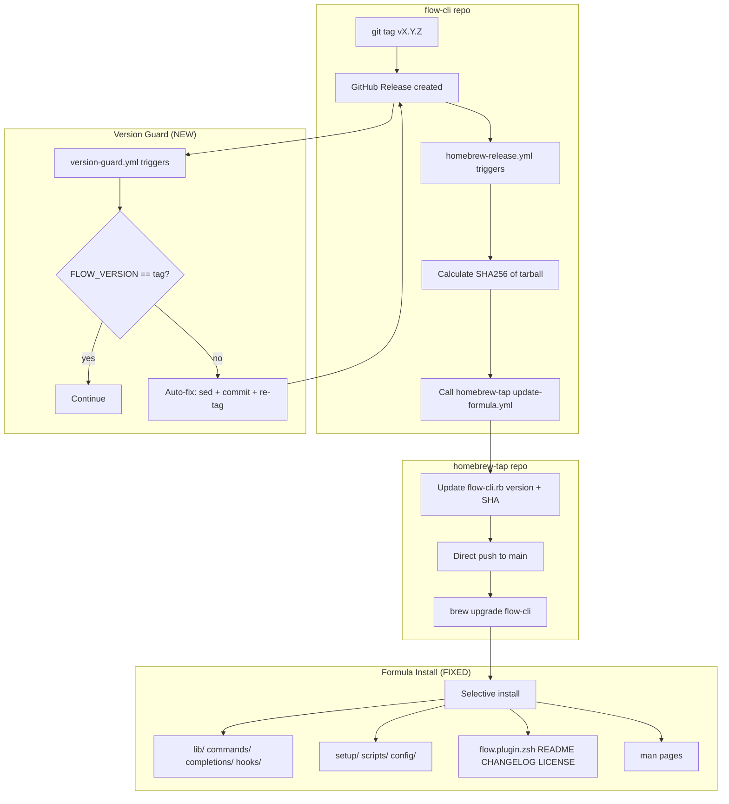

# SPEC: Fix Homebrew Release Pipeline

> **Status:** draft
> **Created:** 2026-02-21
> **From Brainstorm:** `BRAINSTORM-homebrew-release-fix-2026-02-21.md`
> **Version:** v7.4.1 (target)
> **Effort:** 2-3 hours

---

## Overview

The Homebrew install of flow-cli is 74MB due to blind `prefix.install Dir["*"]` in the formula, 55+ stale planning docs in the repo root, and 66MB of docs/demos/assets in the tarball. This spec covers: repo root cleanup, selective formula install, CI version guard, and a v7.4.1 patch release. Target install size: < 20MB (expected ~4MB).

---

## Primary User Story

**As a** flow-cli maintainer,
**I want** a clean, lean Homebrew release pipeline,
**So that** users get a fast install (< 20MB), version mismatches are auto-fixed, and the repo root isn't cluttered with historical artifacts.

## Acceptance Criteria

- [ ] `brew install data-wise/tap/flow-cli` produces Cellar < 20MB
- [ ] Formula installs only runtime files (lib/, commands/, completions/, hooks/, setup/, scripts/, config/, flow.plugin.zsh, README, CHANGELOG, LICENSE, man pages)
- [ ] No planning docs (BRAINSTORM-*, WAVE-*, IMPLEMENTATION-*, etc.) in repo root
- [ ] No Node.js artifacts (package.json, package-lock.json, eslint.config.js) in repo root
- [ ] No ad-hoc test scripts (test-*.zsh, test-*.sh) in repo root
- [ ] CI version guard auto-fixes FLOW_VERSION mismatch on release
- [ ] v7.4.1 released with clean tarball
- [ ] `flow --version` reports 7.4.1 after Homebrew install
- [ ] All tests pass (47/47 suites)
- [ ] CI green on both flow-cli and homebrew-tap repos

## Secondary User Stories

**As a** Homebrew user,
**I want** `brew install` to be fast and not waste disk space,
**So that** flow-cli doesn't stand out as bloated compared to other Homebrew packages.

**As a** maintainer,
**I want** releases to auto-guard against version string mismatches,
**So that** the v7.4.0 FLOW_VERSION bug never recurs.

---

## Architecture



## API Design

N/A — No API changes. This is a packaging/CI fix.

## Data Models

N/A — No data model changes.

## Dependencies

| Dependency | Purpose | Required? |
|-----------|---------|-----------|
| GitHub Actions | CI workflows | Yes |
| `gh` CLI | Release creation, PR management | Yes |
| Homebrew | Formula testing | Yes |
| `sha256sum` | Tarball hash (in CI) | Yes |

---

## UI/UX Specifications

N/A — CLI-only changes. No user-facing UX changes except faster install and correct `flow --version`.

---

## Implementation Plan

### Increment 1: Repo Root Cleanup

**Files to DELETE (55 files):**

Planning docs (45):
- `BRAINSTORM-teach-doctor-improvements-2026-02-07.md`
- `CC-UNIFICATION-IMPROVEMENTS.md`
- `DEPENDENCY-TRACKING-FIX.md`
- `DESIGN-DECISIONS-2026-01-09.md`
- `DOCUMENTATION-COMPLETE.md`
- `DOCUMENTATION-SUMMARY-v3.0.md`
- `DOCUMENTATION-SUMMARY.md`
- `DOCUMENTATION-UPDATE-2026-01-24.md`
- `FEATURE-REQUEST-teach-deploy-direct-mode.md`
- `FINAL-DOCUMENTATION-REPORT.md`
- `FIX-SUMMARY-index-helpers.md`
- `GIF-RECORDING-MIGRATION.md`
- `IDEAS.md`
- `IMPLEMENTATION-SUMMARY.md`
- `INSTALLATION-UPDATES-SUMMARY.md`
- `INTEGRATION-FIXES-CHECKLIST.md`
- `INTEGRATION-VERIFIED.md`
- `LEARNING-PATH-INTEGRATION-SUMMARY.md`
- `PARTIAL-DEPLOY-INDEX-MANAGEMENT.md`
- `PLAN-teach-analyze-phase0.md`
- `PLAN-teach-analyze-phase1.md`
- `PR-DESCRIPTION-UPDATE.md`
- `PR-SUBMISSION-COMPLETE.md`
- `PROJECT-HUB.md`
- `QUARTO-WORKFLOW-QUICK-START.md`
- `RELEASE-v4.8.0.md`
- `RELEASE-v4.9.1.md`
- `SITE-UPDATE-COMPLETE.md`
- `SITE-UPDATE-SUMMARY.md`
- `STAT-545-ANALYSIS-SUMMARY.md`
- `TEACH-DEPLOY-DEEP-DIVE.md`
- `TEACH-DOCTOR-QUICK-REF.md`
- `TEACHING-DOCS-REVIEW.md`
- `TEACHING-DOCUMENTATION-SUMMARY.md`
- `TEACHING-MENU-CONSOLIDATION-PLAN.md`
- `TEACHING-MENU-IMPLEMENTATION-COMPLETE.md`
- `TEACHING-MENU-MIGRATION-SUMMARY.md`
- `TEACHING-MENU-VISUAL-COMPARISON.md`
- `TEACHING-SYSTEM-ARCHITECTURE.md`
- `TEACHING-WORKFLOW-V3-COMPLETE.md`
- `TEST-RESULTS-SUMMARY.md`
- `TESTING-SUMMARY-v5.16.0.md`
- `TODO.md`
- `WAVE-1-COMPLETED.md`, `WAVE-2-COMPLETE.md`, `WAVE-3-DEMO.md`, `WAVE-3-TODO.md`, `WAVE-5-COMPLETE.md`
- `WAVE2-IMPLEMENTATION-SUMMARY.md`, `WAVE3-IMPLEMENTATION.md`
- `WORKFLOW-ENHANCEMENT-PLAN-SUMMARY.md`
- `WORKTREE-PLAN.md`, `WORKTREE-SETUP-COMPLETE.md`
- `WT-DOCUMENTATION-SUMMARY.md`

Old scripts/Node.js artifacts (10):
- `debug-context.zsh`
- `test-doctor-cache.zsh`
- `test-phase4.sh`
- `test-preview-functions.zsh`
- `test-preview-non-interactive.zsh`
- `test-task1-task4.zsh`
- `eslint.config.js`
- `package.json` (verify lint-staged config first — may need to keep or migrate)
- `package-lock.json`
- `flow-cli.code-workspace`

**Pre-flight:** Check if `package.json` is referenced by pre-commit hooks (lint-staged config). If so, migrate lint-staged config to `.lintstagedrc.json` or inline in a different format before deleting.

**Investigate:** `Formula/`, `data/`, `r-ecosystem/`, `plugins/`, `templates/`, `tui/`, `zsh/`, `site/` — determine what these root directories are and whether they should also be cleaned.

**Commit:** `chore: delete 55 stale root-level files`

### Increment 2: Formula Selective Install

**File:** `Formula/flow-cli.rb` in `Data-Wise/homebrew-tap`

**Replace** the current install block:

```ruby
def install
  # Man pages to proper Homebrew location
  man1.install Dir["man/man1/*"] if (buildpath/"man/man1").exist?

  # Core runtime files only
  prefix.install "flow.plugin.zsh"
  prefix.install "lib"
  prefix.install "commands"
  prefix.install "completions"
  prefix.install "hooks"
  prefix.install "setup"
  prefix.install "scripts"
  prefix.install "config" if (buildpath/"config").exist?

  # Essential docs
  prefix.install "README.md"
  prefix.install "CHANGELOG.md"
  prefix.install "LICENSE"

  # Installer scripts
  prefix.install "install.sh"
  prefix.install "uninstall.sh"

  # Loader script
  (prefix/"bin/flow-cli-init").write <<~EOS
    #!/bin/zsh
    echo "source #{prefix}/flow.plugin.zsh"
  EOS
  (prefix/"bin/flow-cli-init").chmod 0755
end
```

**Verify:** `brew install --build-from-source data-wise/tap/flow-cli` then `du -sh $(brew --prefix flow-cli)/`

**Commit in homebrew-tap:** `flow-cli: selective install, reduce 74MB to ~4MB`

### Increment 3: CI Version Guard

**New file:** `.github/workflows/version-guard.yml` in flow-cli repo

**Trigger:** `release: types: [created]`

**Logic:**
1. Extract tag version (strip `v` prefix)
2. Extract FLOW_VERSION from `flow.plugin.zsh`
3. If mismatch: `sed` to fix, commit with `[skip ci]`, delete tag, re-create tag, force-push tag, push commit to release branch

**Risk mitigation:**
- `[skip ci]` in commit message prevents infinite workflow loops
- Only triggers on `release.created`, not `release.published` (avoids double-fire)
- Force-push is tag-only (not branch) — safe for protected branches
- Add concurrency group to prevent parallel runs

**Commit:** `ci: add version guard with auto-fix for FLOW_VERSION mismatch`

### Increment 4: v7.4.1 Release

**Steps:**
1. Bump FLOW_VERSION in `flow.plugin.zsh` to `"7.4.1"`
2. Update CHANGELOG.md with v7.4.1 entry
3. Update CLAUDE.md version reference
4. PR feature → dev → main
5. Tag `v7.4.1`, create GitHub release
6. Verify: homebrew-release.yml fires, formula updates, `brew upgrade` works
7. Confirm: `du -sh $(brew --prefix flow-cli)/` < 20MB

**CHANGELOG entry:**
```markdown
### v7.4.1 (2026-02-XX) — Homebrew Cleanup

- chore: delete 55 stale root-level files (planning docs, scripts, Node.js artifacts)
- fix: formula selective install — reduce Homebrew install from 74MB to ~4MB
- ci: add version guard with auto-fix for FLOW_VERSION mismatch
```

---

## Open Questions

1. **`package.json` dependency:** Is lint-staged configured in package.json? If so, where should config migrate to?
2. **Root directories:** What are `Formula/`, `data/`, `r-ecosystem/`, `plugins/`, `templates/`, `tui/`, `zsh/`, `site/` in the repo root? Some may also need cleanup.
3. **Version guard complexity:** Auto-fix with re-tagging is complex and risky (infinite loops). Should we simplify to "block release" instead? The brainstorm chose auto-fix, but implementation may reveal it's better to just fail.
4. **`sbom.spdx.json`:** Should this be kept (supply chain compliance) or deleted (not actively maintained)?

---

## Review Checklist

- [ ] All 55 stale files deleted from repo root
- [ ] `package.json` lint-staged config migrated (if applicable)
- [ ] Mystery root directories investigated and cleaned
- [ ] Formula install block updated and tested locally
- [ ] Version guard workflow added and tested
- [ ] FLOW_VERSION bumped to 7.4.1
- [ ] CHANGELOG updated
- [ ] All tests pass (47/47)
- [ ] PR created: feature → dev
- [ ] PR created: dev → main
- [ ] GitHub release created
- [ ] Homebrew formula auto-updated
- [ ] Install size verified < 20MB
- [ ] `flow --version` reports 7.4.1

---

## Implementation Notes

- The formula fix (Increment 2) is the actual Homebrew fix — even without repo cleanup, selective install solves the size problem
- Repo cleanup (Increment 1) is hygiene — prevents future bloat and keeps the repo professional
- The version guard (Increment 3) is insurance — prevents the v7.4.0 FLOW_VERSION bug from recurring
- Auto-fix re-tagging needs careful testing — consider using a test tag first
- `node_modules/` should already be in `.gitignore` but appears in the Cellar listing — verify

---

## History

| Date | Change |
|------|--------|
| 2026-02-21 | Initial spec (from deep feat brainstorm) |
