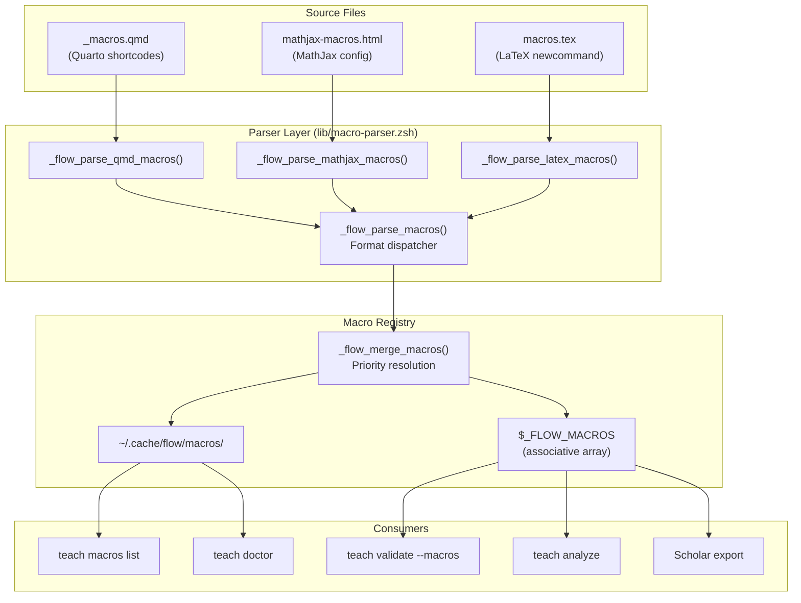
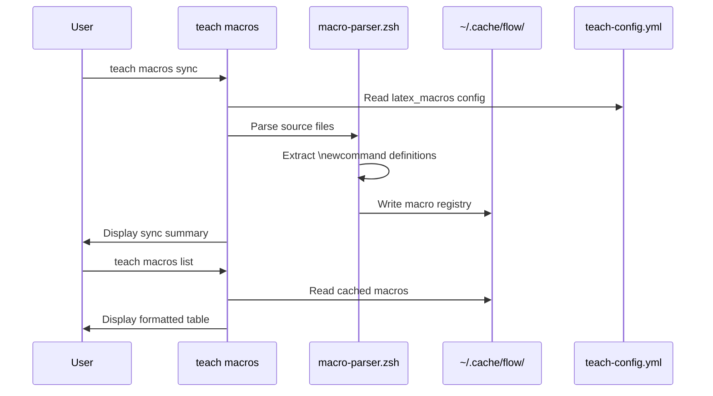

# SPEC: LaTeX Macro Configuration Support

**Status:** draft
**Created:** 2026-01-28
**Issue:** #305
**From Brainstorm:** BRAINSTORM-latex-macros-2026-01-28.md (inline, not saved separately)

---

## Overview

Add explicit LaTeX macro configuration to `teach-config.yml` enabling:
1. Consistent AI-generated content (correct notation like `\E{Y}` not `E[Y]`)
2. Macro validation (warn on undefined/unused macros)
3. Self-documenting configuration for instructors and TAs

---

## Primary User Story

**As a** course instructor using Scholar for AI content generation,
**I want** my custom LaTeX macros to be automatically used in generated content,
**So that** all course materials have consistent mathematical notation.

### Acceptance Criteria

- [ ] Config section `latex_macros` parsed from teach-config.yml
- [ ] `teach macros list` displays all macros with usage examples
- [ ] `teach doctor` shows macro health status
- [ ] Macros extracted from `_macros.qmd`, `.tex`, or `.html` files
- [ ] Warnings (not errors) for undefined/unused macros

---

## Secondary User Stories

### TA Creating Content

**As a** teaching assistant,
**I want** to see available macros and their usage,
**So that** I can use consistent notation when creating materials.

### AI Integration

**As the** Scholar plugin,
**I want** to receive a list of available macros in context,
**So that** I generate content using the correct notation conventions.

---

## Architecture



---

## API Design

### New Commands

| Command | Description | Response Time |
|---------|-------------|---------------|
| `teach macros list` | Show all macros with examples | < 10ms (cached) |
| `teach macros sync` | Extract from source files | < 500ms |
| `teach macros export` | Export for Scholar | < 50ms |
| `teach macros help` | Show usage help | < 10ms |

### New Flags

| Flag | Command | Description |
|------|---------|-------------|
| `--macros` | `teach validate` | Include macro validation |
| `--macros` | `teach status` | Show macro summary line |
| `--with-macros` | `teach exam` | Pass macros to Scholar |

### Config Schema

```yaml
teaching_style:
  latex_macros:
    enabled: true
    sources:
      - path: "_macros.qmd"
        format: "qmd"
      - path: "includes/mathjax-macros.html"
        format: "mathjax"
      - path: "tex/macros.tex"
        format: "latex"
    auto_discover: true
    validation:
      warn_undefined: true
      warn_unused: true
      warn_conflicts: true
    scholar:
      export_format: "json"
      include_in_prompts: true
```

---

## Data Models

### Macro Registry (ZSH associative arrays)

```zsh
# Name -> definition
typeset -gA _FLOW_MACROS=(
  [E]="\\mathbb{E}"
  [Var]="\\text{Var}"
  [indep]="\\perp\\!\\!\\!\\perp"
)

# Name -> source:line:args
typeset -gA _FLOW_MACRO_META=(
  [E]="_macros.qmd:5:0"
  [Var]="_macros.qmd:6:0"
  [indep]="_macros.qmd:10:0"
)
```

### Cache File (.flow/macros.yml)

```yaml
source_file: _macros.qmd
source_format: qmd
last_synced: 2026-01-28T14:32:05

macros:
  - name: \E
    expansion: \mathbb{E}
    description: Expectation operator
    category: operators
    args: 0

  - name: \Var
    expansion: \text{Var}
    description: Variance
    category: operators
    args: 0
```

---

## Dependencies

| Dependency | Purpose | Status |
|------------|---------|--------|
| yq | YAML parsing | Existing |
| shasum | Cache invalidation | macOS built-in |
| grep | Content scanning | Built-in |

**No new dependencies required.**

---

## UI/UX Specifications

### User Flow



### Output Examples

**teach macros list:**

```
LaTeX Macros (14 available)

OPERATORS
  \E             → \mathbb{E}           Expectation
  \Var           → \text{Var}           Variance
  \Cov           → \text{Cov}           Covariance

SYMBOLS
  \indep         → \perp\!\!\!\perp     Independence
  \iid           → \text{i.i.d.}        IID notation

Source: _macros.qmd (synced 2h ago)
```

**teach doctor (macro section):**

```
MACROS
  Source file     ✓ _macros.qmd exists
  Config sync     ✓ .flow/macros.yml up to date
  CLAUDE.md       ✓ Macro section present
  Usage check     ⚠ 2 macros unused in content
```

### Accessibility Checklist

- [x] No color-only indicators (icons + text)
- [x] Clear visual hierarchy (CAPS headers)
- [x] Actionable error messages with commands
- [x] Consistent with existing teach output patterns

---

## Open Questions

1. **Source file creation:** Should `teach macros sync` create a template source file if none exists?
2. **Per-macro warnings:** Should warnings be configurable per-macro (e.g., suppress specific warnings)?
3. **teach analyze timing:** Integrate macro check in Phase 3 or defer to later release?

---

## Review Checklist

- [ ] Config schema reviewed by maintainer
- [ ] Parser covers all three formats (qmd, html, tex)
- [ ] Performance targets met (< 10ms for list)
- [ ] Help text follows existing patterns
- [ ] Tests cover edge cases (empty files, malformed macros)
- [ ] Documentation updated (REFCARD, CLAUDE.md)

---

## Implementation Notes

### Phase 1: Core Parser (4h)
- Add schema to `lib/templates/teaching/teach-config.yml.template`
- Create `lib/macro-parser.zsh` with format-specific parsers
- Add unit tests in `tests/test-macro-parser.zsh`

### Phase 2: Commands (3h)
- Create `commands/teach-macros.zsh`
- Add `macros` case to `lib/dispatchers/teach-dispatcher.zsh`
- Add completions to `completions/_teach`

### Phase 3: Integration (3h)
- Add macro section to `teach doctor`
- Add `--macros` flag to `teach validate`
- Extend `teach analyze` for macro cross-reference

### Phase 4: Cache & Scholar (4h)
- Implement hash-based cache with mtime invalidation
- Add Scholar export formats (json, mathjax, latex)
- Auto-generate CLAUDE.md macro section

### Files to Create

| File | Lines | Purpose |
|------|-------|---------|
| `lib/macro-parser.zsh` | ~350 | Format parsers, registry |
| `commands/teach-macros.zsh` | ~200 | list, sync, export commands |
| `tests/test-macro-parser.zsh` | ~300 | Unit tests |
| `docs/reference/REFCARD-MACROS.md` | ~100 | Quick reference |

### Files to Modify

| File | Changes |
|------|---------|
| `lib/dispatchers/teach-dispatcher.zsh` | Add `macros` subcommand |
| `lib/config-validator.zsh` | Add macro schema validation |
| `commands/doctor.zsh` | Add macro health check |
| `lib/templates/teaching/teach-config.yml.template` | Add latex_macros section |
| `completions/_teach` | Add macros completion |

---

## History

| Date | Author | Change |
|------|--------|--------|
| 2026-01-28 | Claude | Initial spec from brainstorm (max depth, feature focus) |
ggest