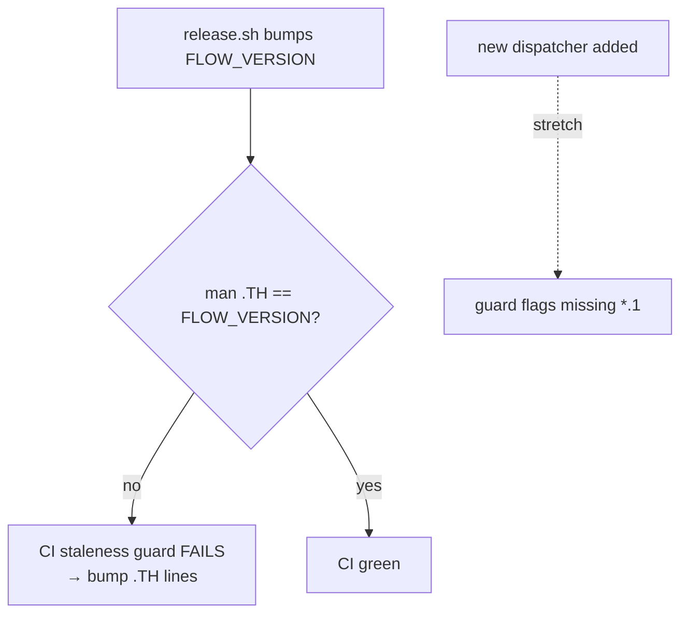

# SPEC: Man-Page Full Refresh + Anti-Drift Guard (Hybrid)

**Status:** draft
**Created:** 2026-06-04
**Type:** docs/tooling (man pages)
**Trigger:** man pages frozen at v3.0.0 (2025-12-26); `flow.1` lists only 5 of 15 dispatchers; no `tok.1` (so v7.8.0 `tok sync` commands are absent). Found during a post-v7.8.0 help-coverage audit.

---

## Overview

The `man/man1/` set is ~5 releases stale and partial. `flow.1` is labelled
`flow-cli 3.0.0` and its SMART DISPATCHERS section lists only `g`, `r`,
`qu`, `mcp`, `obs`. Ten dispatchers have no man page (`cc`, `tm`, `wt`,
`dots`, `sec`, `tok`, `teach`, `prompt`, `v`, `em`), and the `at` bridge.

**Hybrid approach (chosen):** hand-write/update every man page to v7.8.0
now (highest quality, ships immediately) AND add a CI **staleness guard**
so a man page whose `.TH` version diverges from `FLOW_VERSION` fails CI —
preventing the silent re-freeze that caused this.

The maintained surfaces (in-shell `<disp> help`, docs site, QUICK-REFERENCE,
refcards, dispatcher guide, completions) are already complete for v7.8.0;
this spec only closes the man-page gap.

---

## Primary User Story

**As a** CLI user who runs `man flow` / `man tok`,
**I want** man pages that match the installed v7.8.0 (all dispatchers,
incl. `tok sync`),
**so that** the offline reference is trustworthy — and a CI guard keeps it
that way release-over-release.

### Acceptance Criteria

- [ ] `flow.1`: `.TH` → `flow-cli 7.8.0`, dated; SMART DISPATCHERS lists
      **all 15** dispatchers + `at`; SEE ALSO references them.
- [ ] Existing pages updated to v7.8.0: `g.1`, `r.1`, `qu.1`, `mcp.1`,
      `obs.1` (`.TH` version + any drifted command lists).
- [ ] New pages created (troff, matching the existing NAME/SYNOPSIS/
      DESCRIPTION/COMMANDS/EXAMPLES/SEE ALSO/AUTHOR structure):
      `cc.1`, `tm.1`, `wt.1`, `dots.1`, `sec.1`, `tok.1`, `teach.1`,
      `prompt.1`, `v.1`, `em.1`, `at.1`.
- [ ] **`tok.1` includes** `tok sync push <name>`, `tok sync repos <name>`,
      `tok sync gh`, the `--no-sync` flag, and `FLOW_TOK_AUTOSYNC`.
- [ ] **CI staleness guard**: a check (test + workflow step) that fails if
      any `man/man1/*.1` `.TH` version string ≠ `FLOW_VERSION` in
      `flow.plugin.zsh`.
- [ ] Install path covers the new pages (README / `setup/` / Brewfile
      reference `man/man1/`).
- [ ] `man -l man/man1/tok.1` renders without troff errors (spot-check a few).

---

## Secondary User Stories

- **As a** maintainer, **I want** the staleness guard to point at the exact
  fix (bump `.TH` to `FLOW_VERSION`), so release prep is mechanical.
- **As a** future contributor adding a dispatcher, **I want** CI to remind
  me to add its man page (stretch: guard also flags a dispatcher with no
  `*.1`).

## Architecture / Approach

- Man pages stay **hand-written troff** (quality); the **guard** is the
  durable anti-drift mechanism (cheap, deterministic — a grep/awk over
  `.TH` lines vs `FLOW_VERSION`).
- Guard lives in `tests/` (e.g. `tests/test-manpage-version-sync.zsh`,
  source-scan style like `test-terminal-hygiene-regression.zsh`) AND is
  wired into `run-all.sh` + the CI workflow.

## Dependencies

- No new runtime deps. troff/`man` for local spot-checks. Pure-ZSH guard
  test using the shared `tests/` conventions.

## Data Models

N/A — static troff files + one grep-based guard.

## UI/UX Specifications

- Each man page mirrors the existing structure (see `g.1`): `.TH`, NAME,
  SYNOPSIS, DESCRIPTION, COMMANDS (`.TP`/`.B`), EXAMPLES, SEE ALSO, AUTHOR.
- COMMANDS content sourced from each dispatcher's `_<x>_help` (deduped of
  ANSI/emoji/box-drawing — the help output is NOT copy-pasteable).
- Consistent `.TH <NAME> 1 "Month Year" "flow-cli 7.8.0" "User Commands"`.

## Security Constraints

| Constraint | Enforcement |
|---|---|
| No secret values in examples | tok.1/sec.1 examples use placeholders only |
| Guard is read-only | grep/awk over `.TH` lines; never writes |

## Open Questions

1. Include the `at` bridge as `at.1`? *Recommendation: yes — it's a
   user-facing dispatcher even if optional.*
2. Stretch "missing-page" guard (dispatcher without `*.1`) in this pass or
   a follow-up? *Recommendation: version-sync guard now; missing-page guard
   as a noted follow-up to keep scope bounded.*
3. Auto-bump `.TH` in `release.sh`? *Recommendation: yes — add a sed step so
   the guard rarely fires (guard = backstop, not the primary path).*

## Review Checklist

- [ ] All 16 pages at v7.8.0; tok.1 covers sync push/repos + --no-sync.
- [ ] Guard fails on a deliberately-mismatched `.TH`, passes when synced.
- [ ] Guard wired into `run-all.sh` + CI; dogfood-clean.
- [ ] `release.sh` bumps `.TH` (Open Q3).
- [ ] New pages installed (README/setup/Brewfile).
- [ ] Spot-checked render (`man -l`).

## Implementation Notes

- New code/files → worktree `feature/manpage-refresh` off `dev`. This spec
  lands on `dev`. New `*.1` files are blocked on `dev` by branch guard —
  another reason this needs the worktree.
- ~11 new troff files + 6 updates + 1 guard test + release.sh + install
  refs. Sizeable but mechanical; good fit for subagent-driven work
  (one agent per cluster of pages).
- Wire the guard like `test-terminal-hygiene-regression.zsh` (source-scan,
  standalone harness, distinct function names to satisfy dogfood scanner).

## History

| Date | Event |
|---|---|
| 2026-06-04 | Draft from post-v7.8.0 help-coverage audit. Hybrid chosen: hand-write all pages now + CI staleness guard to prevent re-freeze. |
