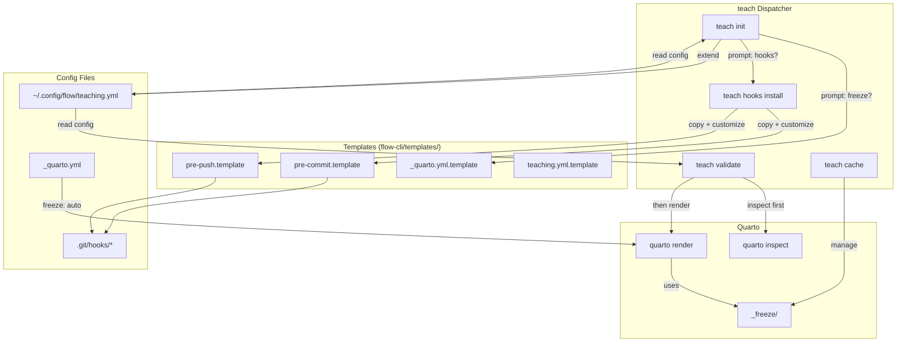
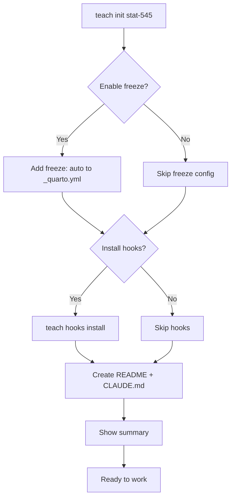
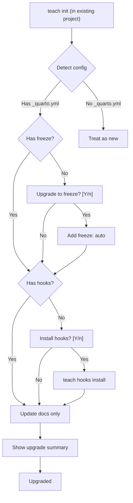

# SPEC: Quarto Workflow Enhancements for Teaching Sites

**Status:** Draft
**Priority:** Medium
**Target:** flow-cli v4.6.0+
**Created:** 2026-01-20
**From Brainstorm:** FEATURE-REQUEST-QUARTO-WORKFLOW-ENHANCEMENTS.md

---

## Overview

Integrate Quarto performance optimizations and validation workflows developed for STAT 545 into flow-cli's teaching system. This enhances the `teach` dispatcher with:
- Automatic Quarto freeze caching (10-100x faster rendering)
- Git hooks for pre-commit/pre-push validation
- Interactive cache management commands
- Teaching-specific validation workflows

**Value Proposition:** Faster development, earlier error detection, cleaner git history, best practices codified.

---

## Primary User Story

**As an instructor** managing Quarto-based course materials,
**I want** automatic freeze caching and git hooks that catch errors before commits,
**So that** I can iterate quickly (5-30s renders vs 5-10min) and never push broken content to production.

**Acceptance Criteria:**
1. ✅ `teach init` prompts for freeze setup and hook installation
2. ✅ Pre-commit hook validates and renders changed .qmd files with interactive error handling
3. ✅ Freeze caching works transparently (10-100x speedup on subsequent renders)
4. ✅ Existing projects can upgrade via auto-detect in `teach init`
5. ✅ All features documented in comprehensive guide before implementation

---

## Secondary User Stories

### 2. Migration Path

**As an instructor** with an existing STAT 545-style project,
**I want** to run `teach init` in my project and have it detect + add missing features,
**So that** I don't need to manually configure freeze/hooks.

**Acceptance:**
- `teach init` in existing project detects _quarto.yml, .git/
- Prompts: "Add freeze caching? Install hooks? Update docs?"
- Non-destructive: preserves existing config, adds missing pieces

### 3. Error Recovery Workflow

**As an instructor** who hits a render error during commit,
**I want** clear error output with line numbers and an interactive "Commit anyway?" prompt,
**So that** I can decide to fix now, commit with `--no-verify`, or abort.

**Acceptance:**
- Pre-commit shows full error output with file/line context
- Offers: Fix and retry, Commit anyway (--no-verify), Abort
- Error persists in terminal after abort (for debugging)

### 4. Cache Management

**As an instructor** working on a long course (50+ .qmd files),
**I want** an interactive `teach cache` menu to refresh/clear/inspect cache,
**So that** I can troubleshoot cache issues without memorizing Quarto internals.

**Acceptance:**
- `teach cache` shows menu: refresh/clear/stats/info
- `teach cache stats` shows cache size, file count, last updated
- `teach cache clear` prompts for confirmation (destructive)

---

## Architecture



**Key Components:**

1. **teach-dispatcher.zsh** - Enhanced with new subcommands
2. **teach-hooks-impl.zsh** - Hook installation logic
3. **templates/hooks/** - Git hook templates
4. **templates/quarto/_quarto.yml.template** - Freeze config
5. **teaching.yml** - Extended with quarto/hooks sections
6. **tests/fixtures/teaching-quarto-test/** - Mock project for testing

---

## API Design

### teach init (Enhanced)

**Behavior:**
- Detects if project is new or existing
- Prompts for freeze setup (if _quarto.yml exists or will be created)
- Prompts for hook installation (if .git/ exists)
- Auto-detect upgrade scenario

**Prompts:**

```bash
teach init stat-545

# New project:
→ "Enable Quarto freeze caching? [Y/n]"
→ "Install git hooks for validation? [Y/n]"

# Existing project (has _quarto.yml but no freeze):
→ "Detected existing Quarto project. Upgrade to freeze caching? [Y/n]"
→ "Install git hooks? [Y/n]"
```

**Config:**
```yaml
# ~/.config/flow/teaching.yml (extended)
quarto:
  freeze_enabled: true
  freeze_auto: true  # freeze: auto in _quarto.yml

hooks:
  auto_install: true
  pre_commit_render: true
  pre_push_full_site: true
  interactive_errors: true
```

### teach hooks install

**Behavior:**
- Copies templates from `templates/hooks/` to `.git/hooks/`
- Makes hooks executable
- Reads config from `teaching.yml`

**Implementation:**
```bash
teach hooks install

# Steps:
1. Check .git/ exists
2. Copy pre-commit.template → .git/hooks/pre-commit
3. Copy pre-push.template → .git/hooks/pre-push
4. chmod +x .git/hooks/*
5. Echo success + instructions
```

**Output:**
```
✅ Git hooks installed:
   • pre-commit: Validates + renders changed .qmd files
   • pre-push: Full site render (production only)

Disable anytime:
   git commit --no-verify
   teach hooks uninstall
```

### teach validate

**Behavior:**
- Staged validation: `quarto inspect` first, then `quarto render` if needed
- Only validates changed files (git status --porcelain)
- Uses freeze cache for speed

**Syntax:**
```bash
teach validate              # All changed .qmd files
teach validate lectures     # Only lectures/*.qmd
teach validate --full       # Full site render
```

**Implementation:**
```bash
teach validate

# Steps:
1. Find changed .qmd files: git diff --name-only --cached
2. For each file:
   a. Run: quarto inspect <file>
   b. If inspect passes → quarto render <file>
   c. Collect pass/fail status
3. Show summary:
   ✓ OK: 3 files
   ✗ FAILED: 1 file (lectures/week-05.qmd)
     Error: object 'data' not found (line 127)
```

### teach cache (Interactive Menu)

**Behavior:**
- Shows menu with cache operations
- Uses fzf or simple numbered menu

**Menu:**
```
teach cache

[1] Refresh cache - Re-render all files (uses freeze)
[2] Clear cache - Delete _freeze/ directory
[3] Show stats - Size, file count, last updated
[4] Show info - Explain freeze caching

Select [1-4]:
```

**Commands:**
```bash
teach cache refresh  # Direct invocation
teach cache clear    # With confirmation prompt
teach cache stats    # Size, count, mtime
```

---

## Data Models

### teaching.yml Schema (Extended)

```yaml
# ~/.config/flow/teaching.yml
version: "5.14.0"

# Existing sections (unchanged)
semester:
  current: "Spring 2025"
  courses:
    - stat-545

# NEW: Quarto section
quarto:
  freeze_enabled: true
  freeze_auto: true  # Adds "freeze: auto" to _quarto.yml
  freeze_method: "auto"  # auto | true | false

  # Validation
  validate_on_commit: true
  validate_show_output: true

# NEW: Hooks section
hooks:
  auto_install: true  # Prompt on teach init
  pre_commit_render: true
  pre_push_full_site: true
  interactive_errors: true  # Ask "Commit anyway?" on error

  # Bypass env vars (documented)
  env:
    disable_render: "QUARTO_PRE_COMMIT_RENDER=0"
    disable_hooks: "git commit --no-verify"
```

### _quarto.yml Template

```yaml
project:
  type: website
  output-dir: _site

  # Quarto freeze caching
  execute:
    freeze: auto  # Only re-execute changed files

format:
  html:
    theme: cosmo
    css: styles.css
    toc: true
```

### Hook Templates

**templates/hooks/pre-commit.template:**
```bash
#!/usr/bin/env zsh
# Installed by: teach hooks install
# Disable: QUARTO_PRE_COMMIT_RENDER=0 git commit -m "..."

# Read config
source ~/.config/flow/teaching.yml

# Find changed .qmd files
CHANGED_FILES=$(git diff --cached --name-only --diff-filter=ACM | grep '\.qmd$')

if [[ -z "$CHANGED_FILES" ]]; then
  exit 0  # No .qmd files changed
fi

echo "Validating changed Quarto files..."

FAILED=()

for file in ${(f)CHANGED_FILES}; do
  echo "  Checking: $file"

  # Step 1: Syntax check
  if ! quarto inspect "$file" &>/dev/null; then
    echo "    ✗ Syntax error"
    FAILED+=("$file")
    continue
  fi

  # Step 2: Render (uses freeze cache)
  if ! quarto render "$file" --quiet; then
    echo "    ✗ Render failed"
    FAILED+=("$file")
    continue
  fi

  echo "    ✓ OK"
done

if [[ ${#FAILED[@]} -gt 0 ]]; then
  echo ""
  echo "❌ Validation failed for ${#FAILED[@]} file(s):"
  for file in $FAILED; do
    echo "   • $file"
  done
  echo ""
  echo "Options:"
  echo "  1. Fix errors and retry commit"
  echo "  2. Bypass validation: git commit --no-verify"
  echo ""
  read "response?Commit anyway? [y/N] "

  if [[ "$response" =~ ^[Yy]$ ]]; then
    exit 0
  else
    exit 1
  fi
fi

exit 0
```

**templates/hooks/pre-push.template:**
```bash
#!/usr/bin/env zsh
# Installed by: teach hooks install
# Runs full site render before pushing to production

# Only run on production branch
BRANCH=$(git branch --show-current)
if [[ "$BRANCH" != "production" && "$BRANCH" != "main" ]]; then
  exit 0
fi

echo "Running full site render (production push)..."

if ! quarto render; then
  echo "❌ Full site render failed"
  echo "Fix errors or push to draft branch for testing"
  exit 1
fi

echo "✅ Full site render passed"
exit 0
```

---

## Dependencies

### Required

| Dependency | Version | Purpose |
|-----------|---------|---------|
| Quarto CLI | >= 1.3 | Rendering + freeze |
| Git | >= 2.0 | Hooks |
| ZSH | >= 5.8 | flow-cli runtime |
| yq | >= 4.0 | YAML config parsing |

### Optional

| Dependency | Purpose |
|-----------|---------|
| fzf | Interactive menus |
| bat | Syntax highlighting in diffs |

---

## UI/UX Specifications

### User Flow: New Project Setup



### User Flow: Existing Project Upgrade



### teach cache Menu (Interactive)

```
┌─────────────────────────────────────────────────┐
│  teach cache - Manage Quarto Freeze Cache       │
├─────────────────────────────────────────────────┤
│                                                 │
│  Cache: _freeze/                                │
│  Size: 147 MB (342 files)                       │
│  Last updated: 2 hours ago                      │
│                                                 │
│  [1] Refresh cache                              │
│      Re-render all files (respects freeze)      │
│                                                 │
│  [2] Clear cache                                │
│      Delete _freeze/ directory (destructive!)   │
│                                                 │
│  [3] Show stats                                 │
│      Detailed cache statistics                  │
│                                                 │
│  [4] Show info                                  │
│      Explain how freeze caching works           │
│                                                 │
│  [q] Quit                                       │
│                                                 │
├─────────────────────────────────────────────────┤
│  Select [1-4, q]:                               │
└─────────────────────────────────────────────────┘
```

### Error Output (Pre-commit Hook)

```
Validating changed Quarto files...
  Checking: lectures/week-05_factorial-anova.qmd
    ✓ OK
  Checking: syllabus/syllabus-final.qmd
    ✗ Render failed

════════════════════════════════════════════════════════
 Error in syllabus/syllabus-final.qmd (line 127)
════════════════════════════════════════════════════════

  Error: object 'exam_data' not found

  Context:
    125 | ## Exam Schedule
    126 |
  > 127 | table(exam_data)
        |       ^~~~~~~~~
    128 |
    129 | ### Midterm

════════════════════════════════════════════════════════
 Options
════════════════════════════════════════════════════════

  1. Fix error and retry commit
  2. Bypass validation: git commit --no-verify

Commit anyway? [y/N]
```

### Accessibility Checklist

- ✅ All prompts have clear Y/n defaults
- ✅ Error messages include file/line context
- ✅ Interactive menus support keyboard navigation
- ✅ Colors use sufficient contrast (green/red/yellow)
- ✅ Non-interactive mode available (--yes, --no flags)
- ✅ Screen reader friendly (structured output, no ASCII art)

---

## Open Questions

### 1. Template Customization

**Question:** Should hook templates support project-specific customization?

**Options:**
- A. Copy once, users edit `.git/hooks/pre-commit` directly
- B. Store customizations in `teaching.yml`, regenerate hooks on teach hooks install
- C. Hybrid: Templates have `# CUSTOM START/END` blocks preserved across reinstalls

**Recommendation:** Option A (simplest). Users who want custom logic can edit hooks directly. Document common patterns in guide.

---

### 2. Multi-Author Repos

**Question:** How should freeze caching work in multi-author teaching repos?

**Context:** `_freeze/` is gitignored, so each author has their own cache. If Alice renders `lecture-01.qmd`, Bob won't have that cache.

**Options:**
- A. Document limitation (current approach)
- B. Add `teach cache sync` to share cache via git-lfs or external storage
- C. Recommend single-author for teaching repos

**Recommendation:** Option A + C. Teaching repos are typically single-author. Document as known limitation.

---

## Review Checklist

- [ ] All 8 user questions integrated into spec
- [ ] Architecture diagram matches implementation plan
- [ ] API design covers all commands (init, hooks, validate, cache)
- [ ] Data models include teaching.yml schema + hook templates
- [ ] User flows documented (new project, upgrade, error handling)
- [ ] Error output UX designed
- [ ] Accessibility checklist complete
- [ ] Open questions identified
- [ ] Implementation notes cover edge cases
- [ ] Test strategy defined (mock project)

---

## Implementation Notes

### Phase 1 Scope (v4.6.0)

**From User Answers:**
- ✅ Priority: Freeze + Hooks first (core infrastructure)
- ✅ Freeze setup: Prompt on init (not auto-enable)
- ✅ Hook install: Auto-install with prompt (Y/n default)
- ✅ Pre-commit: Render by default (QUARTO_PRE_COMMIT_RENDER=0 to disable)
- ✅ Error handling: Interactive ("Commit anyway?")

**Tasks:**

1. **Create hook templates** (`templates/hooks/`)
   - pre-commit.template (syntax check + render)
   - pre-push.template (full site render)
   - Use ZSH, not bash (flow-cli is ZSH-native)

2. **Extend teach-dispatcher.zsh**
   - `teach init` enhancements (freeze + hooks prompts)
   - `teach hooks install` implementation
   - Auto-detect upgrade logic

3. **Extend teaching.yml schema**
   - Add `quarto:` section
   - Add `hooks:` section
   - Validate with yq

4. **Create teach-hooks-impl.zsh**
   - Hook installation logic
   - Template copying + chmod +x
   - Uninstall function

5. **Add _quarto.yml.template**
   - Include `freeze: auto` config
   - Document freeze in comments

6. **Update teach init**
   - Detect existing projects
   - Prompt for freeze: "Enable Quarto freeze caching? [Y/n]"
   - Prompt for hooks: "Install git hooks? [Y/n]"
   - Non-destructive upgrades

7. **Testing**
   - Create `tests/fixtures/teaching-quarto-test/` mock project
   - Unit tests for teach hooks install
   - Integration test: full workflow (init → commit → render)

8. **Documentation**
   - Write `docs/guides/TEACHING-QUARTO-WORKFLOW.md` (comprehensive)
   - Update `docs/reference/TEACH-DISPATCHER-REFERENCE.md`
   - Add examples to README

### Edge Cases

**1. No .git/ directory:**
- `teach hooks install` → Error: "Not a git repository. Run git init first."

**2. Hooks already exist:**
- Detect existing hooks
- Prompt: "Overwrite existing hooks? [y/N]"
- Backup existing hooks to `.git/hooks/pre-commit.backup`

**3. No _quarto.yml:**
- `teach init` → Offer to create _quarto.yml with freeze
- If declined, skip freeze setup

**4. Freeze cache corrupt:**
- `teach cache clear` → Delete _freeze/ and recommend `quarto render`
- `teach cache refresh` → Clear + full render

**5. Pre-commit render takes > 5 minutes:**
- Show progress spinner
- Allow Ctrl-C to abort
- Suggest: "This is slow. Run teach cache refresh to populate cache."

### Performance Targets

| Scenario | Time Budget | Notes |
|----------|-------------|-------|
| teach hooks install | < 1s | Template copy + chmod |
| Pre-commit (1 file, cached) | < 5s | inspect + render with freeze |
| Pre-commit (5 files, cached) | < 15s | Parallel render if possible |
| teach cache clear | < 1s | rm -rf _freeze/ |
| teach cache stats | < 1s | du -sh + file count |

### Testing Strategy

**1. Unit Tests:**
- `test-teach-hooks-unit.zsh` - Hook installation logic
- `test-teach-quarto-config-unit.zsh` - YAML config parsing
- `test-teach-cache-unit.zsh` - Cache commands

**2. Integration Tests:**
- Create mock project: `tests/fixtures/teaching-quarto-test/`
- Test full workflow: init → edit → commit → render
- Verify freeze caching works
- Test error scenarios (syntax error, render failure)

**3. Manual Testing:**
- Run on real STAT 545 project (~/projects/teaching/stat-545)
- Verify backward compatibility
- Test upgrade path (existing project)

---

---

## Advanced Features (Phase 2+)

### Quarto Profiles (v4.7.0)

**User Story:** As an instructor, I want dev builds to use freeze caching but production builds to always render fresh.

**Implementation:**
```yaml
# _quarto.yml
project:
  type: website

# Default (dev)
execute:
  freeze: auto

---
# Production profile
profile: production
execute:
  freeze: false  # Always fresh
```

**teach deploy enhancement:**
```zsh
_teach_deploy() {
    quarto render --profile production
    gh pr create --base production --head draft
}
```

**Config addition:**
```yaml
# teaching.yml
quarto:
  profiles:
    dev:
      freeze: auto
    production:
      freeze: false
```

**Rationale:** Dev needs speed (freeze), production needs correctness (no stale cache).

---

### R Package Dependency Management (v4.7.0)

**User Story:** As an instructor, I want pre-commit to detect missing R packages and offer to install them.

**Pre-commit Hook Addition:**
```zsh
check_r_dependencies() {
    local file="$1"
    local packages=($(grep -oP 'library\(\K[^)]+' "$file"))
    local missing=()

    for pkg in $packages; do
        Rscript -e "library($pkg)" &>/dev/null || missing+=("$pkg")
    done

    if [[ ${#missing[@]} -gt 0 ]]; then
        echo "⚠️  Missing R packages: ${missing[@]}"
        read "response?Install now? [Y/n] "
        if [[ "$response" =~ ^[Yy]?$ ]]; then
            for pkg in $missing; do
                Rscript -e "install.packages('$pkg')"
            done
        fi
    fi
}
```

**Edge Case:** Skip if renv detected (`.Rprofile` or `renv.lock` exists).

---

### teach doctor (v4.6.0)

**User Story:** As an instructor, I want to verify my Quarto/freeze/hooks setup with one command.

**Implementation:**
```zsh
_teach_doctor() {
    echo "┌─────────────────────────────────────────────┐"
    echo "│  teach doctor - Health Check                │"
    echo "├─────────────────────────────────────────────┤"

    local issues=0

    # Check Quarto
    if ! command -v quarto &>/dev/null; then
        echo "│  ✗ Quarto not found"
        ((issues++))
    else
        echo "│  ✓ Quarto $(quarto --version)"
    fi

    # Check Git
    if ! command -v git &>/dev/null; then
        echo "│  ✗ Git not found"
        ((issues++))
    else
        echo "│  ✓ Git $(git --version | awk '{print $3}')"
    fi

    # Check freeze config
    if [[ -f _quarto.yml ]]; then
        local freeze=$(yq '.project.execute.freeze' _quarto.yml)
        if [[ "$freeze" == "auto" ]]; then
            echo "│  ✓ Freeze caching enabled"
        else
            echo "│  ⚠  Freeze caching not enabled"
        fi
    fi

    # Check hooks
    [[ -x .git/hooks/pre-commit ]] && echo "│  ✓ Pre-commit hook installed" || echo "│  ⚠  Pre-commit hook missing"
    [[ -x .git/hooks/pre-push ]] && echo "│  ✓ Pre-push hook installed" || echo "│  ⚠  Pre-push hook missing"

    # Check cache
    if [[ -d _freeze ]]; then
        local size=$(du -sh _freeze | cut -f1)
        echo "│  ✓ Freeze cache: $size"
    else
        echo "│  ℹ  No freeze cache yet"
    fi

    echo "└─────────────────────────────────────────────┘"
    return $issues
}
```

**Usage:**
```bash
teach doctor           # Health check
teach doctor --fix     # Auto-fix issues (future)
```

---

### _freeze/ Commit Prevention (v4.6.0)

**User Story:** As an instructor, I want to be blocked from accidentally committing the 500MB _freeze/ cache.

**Pre-commit Hook Addition:**
```zsh
# Check if _freeze/ is staged
if git diff --cached --name-only | grep -q '^_freeze/'; then
    echo "❌ ERROR: _freeze/ directory is staged"
    echo ""
    echo "Fix:"
    echo "  git restore --staged _freeze/"
    echo "  echo '_freeze/' >> .gitignore"
    echo ""
    exit 1
fi
```

**Rationale:** Prevents catastrophic 500MB commits that bloat repo.

---

### Custom Validation Scripts (v4.8.0)

**User Story:** As an instructor, I want to run custom checks (e.g., "ensure all lectures have learning objectives").

**Config:**
```yaml
# teaching.yml
validation:
  commands:
    - name: "Check learning objectives"
      script: "./scripts/check-learning-objectives.sh"
      when: "lectures/*.qmd"

    - name: "Lint YAML frontmatter"
      script: "yamllint --strict"
      when: "*.qmd"
```

**teach validate enhancement:**
```zsh
_teach_validate() {
    # 1. Run Quarto validation (existing)
    # ...

    # 2. Run custom validators
    local validators=($(yq '.validation.commands[].name' teaching.yml))
    for i in {1..${#validators[@]}}; do
        local name=$(yq ".validation.commands[$((i-1))].name" teaching.yml)
        local script=$(yq ".validation.commands[$((i-1))].script" teaching.yml)

        echo "Running: $name"
        eval "$script" || ((failed++))
    done
}
```

**Example Custom Validator:**
```bash
#!/bin/bash
# scripts/check-learning-objectives.sh

for file in "$@"; do
    grep -q "^## Learning Objectives" "$file" || {
        echo "Missing 'Learning Objectives' in $file"
        exit 1
    }
done
```

**Rationale:** Course-specific checks without modifying flow-cli.

---

## History

- **2026-01-20**: Initial spec from deep brainstorm (10 questions)
- **2026-01-20**: User answers integrated into spec (Q1-12)
  - Freeze: Prompt on init
  - Hooks: Auto-install with prompt
  - Pre-commit: Render by default, interactive errors
  - Templates in repo
  - Validation: Staged (inspect → render)
  - Config: Extend teaching.yml
  - Cache: Interactive menu
  - Testing: Mock project
  - Docs: Comprehensive upfront
  - Migration: Auto-detect upgrade
  - Performance: Parallel rendering
  - Integration: teach deploy --validate (opt-in)
- **2026-01-20**: Advanced features from deep dive (Q13-17)
  - Profiles: Full profile support (dev vs production) → v4.7.0
  - Dependencies: Auto-install prompt for R packages → v4.7.0
  - Health check: teach doctor (full validation) → v4.6.0
  - Freeze conflicts: Pre-commit prevention → v4.6.0
  - Extensibility: Config-based custom validators → v4.8.0

---

**Ready for:** Implementation (v4.6.0 Phase 1)
**Next Steps:**
1. Review this spec
2. Create feature branch: `feature/quarto-workflow-v4.6.0`
3. Start with hook templates (Task 1)
4. Write comprehensive guide in parallel (Task 8)
