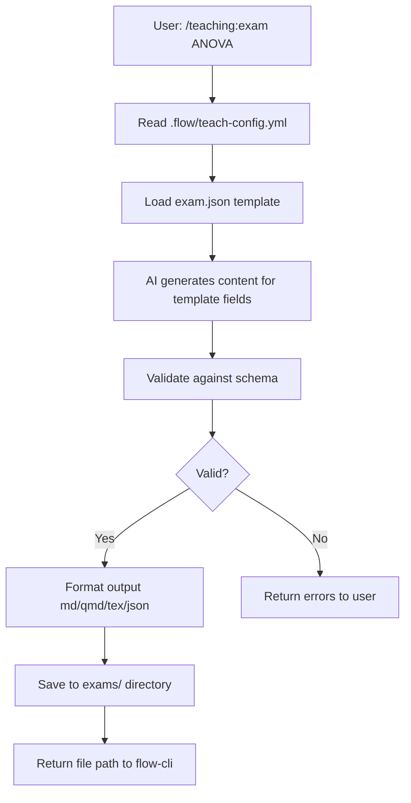

# SPEC: Scholar Plugin Teaching Features

**Feature:** Expand scholar plugin with teaching content generation
**Status:** draft
**Created:** 2026-01-11
**From Brainstorm:** BRAINSTORM-scholar-teaching-2026-01-11.md
**Branch Strategy:** feature/scholar-teaching → scholar dev → scholar main

---

## Metadata

| Field | Value |
|-------|-------|
| **Status** | draft |
| **Priority** | High (parallel with flow-cli teaching-workflow) |
| **Complexity** | Medium-High (28-38 hours, 5 weeks) |
| **Risk Level** | Low (standalone feature, optional integration) |
| **Dependencies** | Node.js >= 18.0.0, Claude API, examark (optional) |
| **Related Specs** | SPEC-teaching-workflow-v2.md (flow-cli) |
| **Target Release** | scholar v2.0.0 |

---

## Overview

Expand the scholar plugin (currently research-focused) to support teaching workflows by adding a `/teaching:*` namespace with 4-6 commands for generating educational materials. Scholar becomes a unified academic plugin supporting both research and teaching use cases.

**Key Features:**
- 5 teaching commands: `/teaching:exam`, `/teaching:quiz`, `/teaching:lecture`, `/teaching:assignment`, `/teaching:syllabus`
- 4 output formats: Markdown, Quarto, LaTeX, JSON/YAML
- Hybrid AI + template generation
- Critical quality validation before save
- Integration with flow-cli via `.flow/teach-config.yml`

**Current State:**
- Scholar has 14 research commands, 17 research skills
- Package.json mentions teaching keywords (quiz, exam, syllabus, rubric)
- **ZERO teaching commands implemented**

**Parallel Development:**
- Developed alongside flow-cli teaching-workflow (SPEC-teaching-workflow-v2.md)
- flow-cli wraps scholar commands for workflow automation
- Scholar provides content generation capabilities

---

## Primary User Story

**As a** course instructor using flow-cli for teaching workflow automation,
**I want** scholar to generate high-quality exam questions, lecture outlines, and assignments from topics,
**So that** I can create course materials efficiently without sacrificing quality or consistency.

**Acceptance Criteria:**
- Scholar generates valid exam with 10 questions in < 30 seconds
- Generated content passes schema validation (100% success rate)
- Output format matches requested format (md/qmd/tex/json)
- Integration with flow-cli's `teach-exam` command works seamlessly
- User can edit generated content before final save

---

## Secondary User Stories

### User Story 2: Quality Assurance
**As a** meticulous instructor,
**I want** scholar to validate generated content for completeness and format correctness,
**So that** I don't waste time fixing basic errors in AI-generated materials.

**Acceptance Criteria:**
- Validation catches missing answer keys
- Validation detects unbalanced LaTeX delimiters
- Validation warns about incomplete generation
- `--no-validate` flag allows skipping for experienced users

### User Story 3: Format Flexibility
**As an** instructor publishing to multiple platforms,
**I want** scholar to output in Markdown, Quarto, LaTeX, or JSON,
**So that** I can use the same generated content for Canvas, course website, and PDF handouts.

**Acceptance Criteria:**
- All 4 formats supported
- Format conversion maintains content fidelity
- Default format read from `.flow/teach-config.yml`

### User Story 4: Context-Aware Generation
**As an** instructor teaching at different levels,
**I want** scholar to read course context from flow-cli configuration,
**So that** generated materials match the course difficulty and style automatically.

**Acceptance Criteria:**
- Scholar reads `.flow/teach-config.yml`
- Generation respects course level (undergraduate/graduate)
- Difficulty setting affects question complexity
- Style (formal/conversational) affects tone

---

## Acceptance Criteria (Comprehensive)

### Functional Requirements
- [ ] `/teaching:exam` generates 10-question exam in < 30s
- [ ] `/teaching:quiz` generates 5-question quiz in < 15s
- [ ] `/teaching:lecture` generates lecture outline in < 20s
- [ ] `/teaching:assignment` generates problem set in < 25s
- [ ] `/teaching:syllabus` generates course syllabus in < 30s
- [ ] All commands support `--format md|qmd|tex|json`
- [ ] Validation catches 100% of schema violations
- [ ] Generated files have correct metadata (date, course, topic)

### Integration Requirements
- [ ] Scholar reads `.flow/teach-config.yml` successfully
- [ ] flow-cli's `teach-exam` wraps `/teaching:exam` correctly
- [ ] Generated markdown converts with examark (QTI validation)
- [ ] Generated Quarto renders without errors
- [ ] Generated LaTeX compiles to PDF

### Quality Requirements
- [ ] User rating of generated content > 8/10
- [ ] Edit time < 10 min from generation to finalized material
- [ ] AI generation failure rate < 5%
- [ ] Validation false positive rate < 1%

---

## Technical Requirements

### Architecture

**New Directory Structure:**
```
scholar/
├── src/
│   ├── teaching/              # NEW teaching namespace
│   │   ├── commands/
│   │   │   ├── exam.js
│   │   │   ├── quiz.js
│   │   │   ├── lecture.js
│   │   │   ├── assignment.js
│   │   │   └── syllabus.js
│   │   ├── templates/
│   │   │   ├── exam.json
│   │   │   ├── quiz.json
│   │   │   ├── lecture.json
│   │   │   ├── assignment.json
│   │   │   └── syllabus.json
│   │   ├── validators/
│   │   │   ├── schema.js
│   │   │   ├── latex.js
│   │   │   └── markdown.js
│   │   ├── generators/
│   │   │   ├── ai-generator.js
│   │   │   └── template-filler.js
│   │   └── formatters/
│   │       ├── markdown.js
│   │       ├── quarto.js
│   │       ├── latex.js
│   │       └── json.js
│   └── research/              # Existing research commands
│       └── ...
```

**Data Flow:**


### API Design

**Command Signature:**
```bash
/teaching:exam <topic> [options]
```

**Options:**
| Option | Type | Default | Description |
|--------|------|---------|-------------|
| `--format` | string | md | Output format (md\|qmd\|tex\|json) |
| `--duration` | number | 60 | Exam duration in minutes |
| `--points` | number | 100 | Total points |
| `--questions` | number | 10 | Number of questions |
| `--types` | string | mc,sa | Question types (mc=multiple-choice, sa=short-answer, essay, tf=true-false) |
| `--config` | path | .flow/teach-config.yml | Config file path |
| `--output` | path | exams/ | Output directory |
| `--no-validate` | flag | false | Skip validation |

**Return Value:**
```json
{
  "success": true,
  "file_path": "exams/anova-exam-2026-01-11.md",
  "metadata": {
    "topic": "ANOVA concepts",
    "questions": 10,
    "points": 100,
    "duration": 60,
    "format": "markdown"
  },
  "validation": {
    "schema_valid": true,
    "answer_key_complete": true,
    "latex_valid": true,
    "warnings": []
  }
}
```

---

## Data Models

### Exam Template Schema (`src/teaching/templates/exam.json`)

```json
{
  "schema_version": "1.0",
  "template_type": "exam",
  "metadata": {
    "title": {
      "type": "string",
      "required": true,
      "description": "Exam title (e.g., 'Midterm Exam - ANOVA')"
    },
    "course": {
      "type": "string",
      "required": true,
      "source": "config",
      "description": "Course name from .flow/teach-config.yml"
    },
    "date": {
      "type": "string",
      "required": true,
      "default": "auto",
      "description": "ISO 8601 date (auto-filled with today)"
    },
    "duration": {
      "type": "number",
      "required": true,
      "unit": "minutes",
      "description": "Exam duration"
    },
    "total_points": {
      "type": "number",
      "required": true,
      "description": "Total points for the exam"
    },
    "instructions": {
      "type": "string",
      "required": false,
      "description": "General exam instructions"
    }
  },
  "questions": {
    "type": "array",
    "minLength": 1,
    "items": {
      "id": {
        "type": "string",
        "auto": true,
        "pattern": "Q[0-9]+",
        "description": "Question ID (Q1, Q2, ...)"
      },
      "type": {
        "type": "string",
        "enum": ["multiple-choice", "short-answer", "essay", "true-false"],
        "required": true
      },
      "points": {
        "type": "number",
        "required": true,
        "min": 1
      },
      "text": {
        "type": "string",
        "required": true,
        "ai_generated": true,
        "description": "Question text"
      },
      "options": {
        "type": "array",
        "required_if": "type == multiple-choice",
        "items": {
          "type": "string"
        },
        "description": "Answer options for MC questions"
      },
      "answer": {
        "type": "string",
        "required": true,
        "description": "Correct answer or answer key"
      },
      "rubric": {
        "type": "string",
        "required_if": "type == essay",
        "description": "Grading criteria for essay questions"
      },
      "difficulty": {
        "type": "string",
        "enum": ["easy", "medium", "hard"],
        "required": false
      }
    }
  },
  "answer_key": {
    "type": "object",
    "required": true,
    "description": "Map of question IDs to correct answers"
  }
}
```

### Course Configuration Extension (`.flow/teach-config.yml`)

```yaml
# Existing flow-cli config...

# NEW: Scholar-specific section
scholar:
  course_info:
    level: "undergraduate"  # or "graduate"
    field: "statistics"
    difficulty: "intermediate"  # "beginner", "intermediate", "advanced"

  defaults:
    exam_format: "markdown"      # md, qmd, tex, json
    lecture_format: "quarto"
    question_types:
      - "multiple-choice"
      - "short-answer"
      - "essay"

  style:
    tone: "formal"               # "formal", "conversational"
    notation: "statistical"      # LaTeX math notation style
    examples: true               # Include worked examples
```

---

## Dependencies

### Required
| Dependency | Version | Purpose |
|------------|---------|---------|
| Node.js | >= 18.0.0 | Runtime environment |
| Claude API | Latest | AI content generation |
| js-yaml | Latest | YAML config parsing |
| ajv | Latest | JSON schema validation |

### Optional
| Dependency | Version | Purpose |
|------------|---------|---------|
| examark | Latest | Markdown → Canvas QTI conversion |
| quarto | >= 1.4 | Quarto format rendering |
| texlive | Latest | LaTeX → PDF compilation |

### Development Dependencies
| Dependency | Version | Purpose |
|------------|---------|---------|
| jest | Latest | Unit testing |
| eslint | Latest | Code linting |
| prettier | Latest | Code formatting |

---

## UI/UX Specifications

### Command Output (Terminal)

**Success Output:**
```
📝 Generating exam: ANOVA concepts

Context (from config):
  Course: STAT 545
  Level: Undergraduate
  Difficulty: Intermediate

Questions:
  ✓ 5 multiple-choice (5 points each)
  ✓ 2 short-answer (10 points each)
  ✓ 1 essay (25 points)

Validation:
  ✓ Schema valid
  ✓ Answer key complete
  ✓ LaTeX syntax valid

✅ Exam saved: exams/anova-exam-2026-01-11.md

Next steps:
  1. Review: cat exams/anova-exam-2026-01-11.md
  2. Edit: $EDITOR exams/anova-exam-2026-01-11.md
  3. Convert: examark exams/anova-exam-2026-01-11.md -o exam.qti.zip
```

**Error Output:**
```
📝 Generating exam: ANOVA concepts

Context (from config):
  Course: STAT 545
  Level: Undergraduate
  Difficulty: Intermediate

Questions:
  ✓ 5 multiple-choice (5 points each)
  ✓ 2 short-answer (10 points each)
  ✗ 1 essay (generation failed)

Validation:
  ✗ Schema invalid: Missing answer for Q8
  ⚠ LaTeX warning: Unbalanced $ delimiter in Q3

❌ Exam generation failed

Errors:
  1. Question Q8: Missing answer key
  2. Question Q3: LaTeX math syntax error (line 45)

Suggestions:
  • Retry with --questions 9 to skip failed question
  • Fix LaTeX manually after generation with --no-validate
```

### Generated File Format

**Markdown Output (`exams/anova-exam-2026-01-11.md`):**
```markdown
# Exam: ANOVA Concepts

**Course:** STAT 545 - Design of Experiments
**Date:** 2026-01-11
**Duration:** 60 minutes
**Total Points:** 100

---

## Instructions

Answer all questions. Show your work for full credit.

---

## Questions

### Q1 (5 points) - Multiple Choice

Which assumption is NOT required for one-way ANOVA?

a) Independence of observations
b) Normality of residuals
c) Equal group sizes
d) Homogeneity of variance

**Answer:** c

---

### Q2 (10 points) - Short Answer

Explain the purpose of post-hoc tests in ANOVA. Give an example of when you would use them.

**Answer:** Post-hoc tests are used after a significant F-test to determine which specific group means differ. Example: After finding a significant difference in mean test scores across three teaching methods, a Tukey HSD test identifies which pairs of methods differ significantly.

---

### Q3 (25 points) - Essay

Design a complete ANOVA study to test whether three different study techniques affect exam performance. Include:
- Null and alternative hypotheses
- Study design (sample size, randomization)
- Analysis plan
- Interpretation strategy

**Rubric:**
- Hypotheses clearly stated (5 points)
- Study design appropriate (10 points)
- Analysis plan detailed (5 points)
- Interpretation strategy sound (5 points)

---

## Answer Key

| Question | Answer |
|----------|--------|
| Q1 | c |
| Q2 | [See short answer above] |
| Q3 | [See essay rubric] |

---

**Generated by:** scholar v2.0.0
**Timestamp:** 2026-01-11T14:30:00Z
```

---

## Open Questions

### Resolved

1. **Integration model:** flow-cli wrapper ✅
2. **Output formats:** All 4 (md/qmd/tex/json) ✅
3. **Generation method:** Hybrid AI + templates ✅
4. **Validation:** Critical, with --no-validate override ✅
5. **Context storage:** Read from .flow/teach-config.yml ✅

### Still Open

1. **AI Provider:** Use Claude API directly or abstract for multi-provider support?
   - **Recommendation:** Claude only initially, abstract in v2.1.0
   - **Impact:** Low (internal implementation detail)

2. **Question Bank:** Store generated questions for reuse across exams?
   - **Recommendation:** Phase 2 feature (v2.1.0+)
   - **Impact:** Medium (requires database/storage design)

3. **Collaboration:** Multi-instructor question approval workflow?
   - **Recommendation:** Out of scope for v2.0.0
   - **Impact:** High (requires auth, permissions, git workflow)

4. **Licensing:** How to handle copyrighted exam content?
   - **Recommendation:** User responsibility, add disclaimer in generated files
   - **Impact:** Low (documentation only)

5. **Question Difficulty Calibration:** Use IRT (Item Response Theory) for difficulty?
   - **Recommendation:** Phase 3 feature (v3.0.0+)
   - **Impact:** High (requires psychometric expertise)

---

## Review Checklist

- [ ] **Architecture:** Mermaid diagram shows data flow clearly
- [ ] **API Design:** All 5 commands have consistent interface
- [ ] **Data Models:** JSON schemas complete and validated
- [ ] **Dependencies:** All required deps listed with versions
- [ ] **UI/UX:** Terminal output examples comprehensive
- [ ] **Testing:** Test strategy covers unit + integration
- [ ] **Documentation:** All sections complete
- [ ] **Open Questions:** Critical questions resolved
- [ ] **Acceptance Criteria:** Measurable and testable
- [ ] **Integration:** flow-cli wrapper interface specified

---

## Implementation Notes

### Week 1: `/teaching:exam` Pilot (6-8 hours)

**Critical Path:**
1. Create `src/teaching/commands/exam.js`
2. Implement `src/teaching/templates/exam.json`
3. Add `src/teaching/validators/schema.js`
4. Markdown formatter only
5. Unit tests (10+ tests)

**Validation:**
- Generate 5 sample exams
- Test with .flow/teach-config.yml
- Verify examark conversion works

### Week 2: Formats & Validation (6-8 hours)

**Add:**
- Quarto formatter (`src/teaching/formatters/quarto.js`)
- LaTeX formatter (`src/teaching/formatters/latex.js`)
- JSON formatter (`src/teaching/formatters/json.js`)
- Comprehensive validation rules
- LaTeX syntax checker
- Integration tests

**Validation:**
- Test all 4 formats with same exam
- Verify Quarto renders
- Verify LaTeX compiles

### Week 3: Additional Commands (8-10 hours)

**Implement:**
- `/teaching:quiz` (similar to exam, shorter)
- `/teaching:lecture` (outline structure)
- Refactor shared utilities
- Documentation (`docs/teaching-commands.md`)

**Validation:**
- Quiz: 5-question quiz in < 15s
- Lecture: 3-section outline in < 20s

### Week 4: Teaching Skills (4-6 hours)

**Create:**
- Auto-activating skills (exam-designer, lecture-planner, etc.)
- Skill coordination logic
- Examples and activation keywords

**Validation:**
- Skills activate on correct keywords
- Multiple skills coordinate properly

### Week 5: Polish & Integration (4-6 hours)

**Implement:**
- `/teaching:assignment` command
- `/teaching:syllabus` command
- flow-cli wrapper scripts
- E2E testing with flow-cli

**Validation:**
- Full pipeline: flow-cli → scholar → examark
- User acceptance testing

---

## History

| Date | Version | Author | Changes |
|------|---------|--------|---------|
| 2026-01-11 | 1.0 | DT | Initial spec from deep brainstorm |

---

**Spec Status:** ✅ Complete - Ready for Review
**Estimated Complexity:** Medium-High (28-38 hours)
**Risk Level:** Low (standalone feature, incremental delivery)
**Next Step:** Review spec → Create feature branch → Start Week 1 implementation
