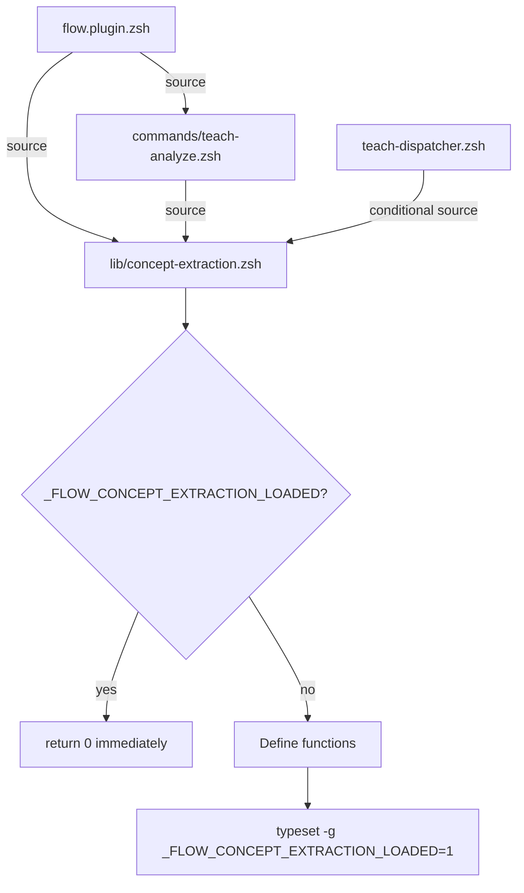

# SPEC: teach analyze PR #289 — Post-Merge Optimization

**Status:** draft
**Created:** 2026-01-22
**From Brainstorm:** PR #289 code review concerns
**Branch:** `feature/teach-analyze-optimize` (to be created from dev after #289 merge)
**Estimated Effort:** 2-3 hours
**Priority:** Low (quality/performance, no user-facing bugs)

---

## Overview

PR #289 introduces 6 new library files and a 1,203-line command file for `teach analyze`. While functionally correct, the integration has three structural issues: (1) libraries are sourced 2-3 times per shell startup due to missing load guards, (2) the display layer is embedded in the command file rather than extracted to a dedicated lib, and (3) the slide cache uses flat filenames that can collide across subdirectories.

---

## Primary User Story

**As a** flow-cli user with `teach analyze` installed,
**I want** the plugin to load efficiently without redundant file sourcing,
**so that** shell startup stays under 100ms and cache files never collide.

### Acceptance Criteria

- [ ] Each of the 6 new lib files is sourced exactly once per shell session
- [ ] Shell startup time is not regressed (verify with `time source flow.plugin.zsh`)
- [ ] Display functions extracted to `lib/analysis-display.zsh` (~270 lines)
- [ ] Slide cache mirrors source directory structure (no path collisions)
- [ ] All 362+ existing tests still pass
- [ ] No user-facing behavior changes

---

## Problem Analysis

### Issue 1: Triple-Sourcing (Performance)

**Current load chain on shell startup:**

```
flow.plugin.zsh
├── L49-54: source lib/concept-extraction.zsh     ← FIRST load
│           source lib/prerequisite-checker.zsh
│           source lib/analysis-cache.zsh
│           source lib/report-generator.zsh
│           source lib/ai-analysis.zsh
│           source lib/slide-optimizer.zsh
│
├── L56:   source commands/teach-analyze.zsh      ← Sources 5 libs AGAIN
│           └── source lib/concept-extraction.zsh  ← SECOND load
│               source lib/prerequisite-checker.zsh
│               source lib/report-generator.zsh
│               source lib/ai-analysis.zsh
│               source lib/slide-optimizer.zsh
│
├── L63:   for cmd_file in commands/*.zsh          ← THIRD load (glob matches teach-analyze.zsh)
│           └── source commands/teach-analyze.zsh
│               └── (5 libs sourced AGAIN)
│
└── L65:   for disp_file in lib/dispatchers/*.zsh
            └── source teach-dispatcher.zsh
                └── Conditional source (3 libs with guards)
                    └── Guards check _FLOW_*_LOADED... but libs never set them!
```

**Impact:** ~5,500 lines of ZSH re-parsed 2-3 times on every shell startup. Functions are re-defined (harmless but wasteful). The `(( ${+VAR} )) || readonly` pattern prevents errors but doesn't prevent re-parsing.

**Root causes:**
1. `flow.plugin.zsh` explicitly sources `commands/teach-analyze.zsh` (L56) AND also globs `commands/*.zsh` (L63) — so teach-analyze.zsh runs twice
2. `teach-analyze.zsh` unconditionally sources 5 libs (no guard checks)
3. The 6 lib files have NO self-protection guards (unlike teach-validate.zsh's pattern)
4. Dispatcher guards check variables that are never set by the libs themselves

### Issue 2: Command File Size (Maintainability)

**Current `commands/teach-analyze.zsh` structure (1,203 lines):**

| Section | Lines | Function Count | Purpose |
|---------|-------|----------------|---------|
| Display layer | 27-299 | 7 functions | UI rendering |
| Main command | 301-632 | 1 function | Core logic |
| Help text | 633-758 | 1 function | --help output |
| Interactive mode | 759-863 | 1 function | Guided workflow |
| Interactive helpers | 864-1203 | 10 functions | Interactive support |

The 7 display functions (272 lines) are pure presentation — they read a JSON results file and render colored tables. They have no business logic and are reusable by other commands (`teach status`, `teach validate --deep`).

**Comparison with existing pattern:**
- `teach-validate.zsh`: 546 lines (command) + 1,024 lines (`lib/validation-helpers.zsh`) + 700 lines (`lib/custom-validators.zsh`)
- Pattern: Command file is thin orchestrator; display/logic in `lib/`

### Issue 3: Slide Cache Path Collision

**Current path construction:**
```zsh
local slide_cache_file="$course_dir/.teach/slide-optimization-${file_path:t:r}.json"
```

`${file_path:t:r}` extracts just the filename stem. This collides when files in different directories share a name:

| File Path | Cache Key | Collision? |
|-----------|-----------|------------|
| `lectures/week-05/lecture.qmd` | `slide-optimization-lecture.json` | ← |
| `labs/week-05/lecture.qmd` | `slide-optimization-lecture.json` | COLLISION |
| `lectures/week-05-regression.qmd` | `slide-optimization-week-05-regression.json` | OK |

---

## Architecture

### Load Guard Pattern (Self-Protecting Libraries)



### File Organization (After Refactor)

```
lib/
├── analysis-display.zsh          # NEW: 7 display functions (~270 lines)
├── concept-extraction.zsh        # + load guard added
├── prerequisite-checker.zsh      # + load guard added
├── analysis-cache.zsh            # + load guard added
├── report-generator.zsh          # + load guard added
├── ai-analysis.zsh               # + load guard added
└── slide-optimizer.zsh           # + load guard added

commands/
└── teach-analyze.zsh             # Reduced: ~930 lines (removed display layer)
```

### Slide Cache Directory Structure

```
.teach/
├── analysis-cache/
│   ├── cache-index.json
│   ├── lectures/                    # Mirrors source tree
│   │   ├── week-05-regression.json
│   │   └── week-05/
│   │       └── lecture.json
│   └── labs/
│       └── week-05/
│           └── lecture.json         # No collision
├── concepts.json
└── reports/
```

---

## Implementation Plan

### Task 1: Add Self-Protecting Load Guards to 6 Lib Files

**Files to modify:** `lib/{concept-extraction,prerequisite-checker,analysis-cache,report-generator,ai-analysis,slide-optimizer}.zsh`

**Pattern (add to top of each file, after shebang and comments):**

```zsh
# Guard against double-sourcing
if [[ -n "$_FLOW_CONCEPT_EXTRACTION_LOADED" ]]; then
    return 0 2>/dev/null || true
fi
typeset -g _FLOW_CONCEPT_EXTRACTION_LOADED=1
```

**Guard variable names:**

| File | Guard Variable |
|------|---------------|
| `concept-extraction.zsh` | `_FLOW_CONCEPT_EXTRACTION_LOADED` |
| `prerequisite-checker.zsh` | `_FLOW_PREREQUISITE_CHECKER_LOADED` |
| `analysis-cache.zsh` | `_FLOW_ANALYSIS_CACHE_LOADED` |
| `report-generator.zsh` | `_FLOW_REPORT_GENERATOR_LOADED` |
| `ai-analysis.zsh` | `_FLOW_AI_ANALYSIS_LOADED` |
| `slide-optimizer.zsh` | `_FLOW_SLIDE_OPTIMIZER_LOADED` |

### Task 2: Remove Redundant Explicit Source from flow.plugin.zsh

**Remove line 56:**
```zsh
# REMOVE: source "$FLOW_PLUGIN_DIR/commands/teach-analyze.zsh"
```

The glob on line 63 (`for cmd_file in commands/*.zsh`) already sources all command files including teach-analyze.zsh. The explicit source was added to ensure load order, but with load guards in the libs, order no longer matters.

**Also remove lines 49-54** (explicit lib sources):
```zsh
# REMOVE: These are sourced by teach-analyze.zsh when it loads
# source "$FLOW_PLUGIN_DIR/lib/concept-extraction.zsh"
# source "$FLOW_PLUGIN_DIR/lib/prerequisite-checker.zsh"
# source "$FLOW_PLUGIN_DIR/lib/analysis-cache.zsh"
# source "$FLOW_PLUGIN_DIR/lib/report-generator.zsh"
# source "$FLOW_PLUGIN_DIR/lib/ai-analysis.zsh"
# source "$FLOW_PLUGIN_DIR/lib/slide-optimizer.zsh"
```

**Result:** Libs are sourced exactly once when `commands/teach-analyze.zsh` is loaded by the glob. Guards prevent re-sourcing if dispatcher also tries.

### Task 3: Extract Display Layer to lib/analysis-display.zsh

**New file:** `lib/analysis-display.zsh` (~270 lines)

**Functions to move:**
1. `_display_analysis_header()` (lines 27-41)
2. `_display_concepts_section()` (lines 43-62)
3. `_display_prerequisites_section()` (lines 64-103)
4. `_display_violations_section()` (lines 104-126)
5. `_display_ai_section()` (lines 127-190)
6. `_display_slide_section()` (lines 191-234)
7. `_display_summary_section()` (lines 235-299)

**Add to new file header:**
```zsh
#!/usr/bin/env zsh
# lib/analysis-display.zsh
# Display formatting for teach analyze results
# Extracted from commands/teach-analyze.zsh for reuse

# Guard
if [[ -n "$_FLOW_ANALYSIS_DISPLAY_LOADED" ]]; then
    return 0 2>/dev/null || true
fi
typeset -g _FLOW_ANALYSIS_DISPLAY_LOADED=1

# Color scheme (use FLOW_COLORS from core.zsh if available)
: ${FLOW_GREEN:='\033[38;5;154m'}
: ${FLOW_BLUE:='\033[38;5;75m'}
: ${FLOW_YELLOW:='\033[38;5;221m'}
: ${FLOW_RED:='\033[38;5;203m'}
: ${FLOW_BOLD:='\033[1m'}
: ${FLOW_RESET:='\033[0m'}
```

**Update `commands/teach-analyze.zsh`:**
```zsh
# Replace inline display functions with:
source "${0:A:h:h}/lib/analysis-display.zsh"
```

**Reuse opportunity:** `teach status`, `teach validate --deep` can also source this file for consistent analysis display.

### Task 4: Fix Slide Cache Path to Mirror Source Directory

**Current (in `_teach_analyze()`):**
```zsh
local slide_cache_file="$course_dir/.teach/slide-optimization-${file_path:t:r}.json"
```

**New:**
```zsh
# Mirror source directory structure in cache
local relative_path="${file_path#$course_dir/}"
local cache_subdir="${relative_path:h}"  # directory portion
local cache_name="${relative_path:t:r}"  # filename stem
local slide_cache_dir="$course_dir/.teach/analysis-cache/$cache_subdir"
mkdir -p "$slide_cache_dir" 2>/dev/null
local slide_cache_file="$slide_cache_dir/${cache_name}-slides.json"
```

**Examples after fix:**

| Source File | Cache File |
|------------|------------|
| `lectures/week-05-regression.qmd` | `.teach/analysis-cache/lectures/week-05-regression-slides.json` |
| `lectures/week-05/lecture.qmd` | `.teach/analysis-cache/lectures/week-05/lecture-slides.json` |
| `labs/week-05/lecture.qmd` | `.teach/analysis-cache/labs/week-05/lecture-slides.json` |

**Note:** This aligns with the existing `analysis-cache/` directory structure already defined in `lib/analysis-cache.zsh` (lines 21-27 of that file describe mirroring source structure).

### Task 5: Remove Redundant Guards from teach-dispatcher.zsh

**Remove lines 113-133** from the dispatcher (the conditional source blocks for analysis-cache, concept-extraction, prerequisite-checker). With self-protecting libs, these are unnecessary overhead — the guard logic runs in the lib files themselves.

```zsh
# REMOVE these blocks:
if [[ -z "$_FLOW_ANALYSIS_CACHE_LOADED" ]]; then
    local analysis_cache_path="${0:A:h:h}/analysis-cache.zsh"
    [[ -f "$analysis_cache_path" ]] && source "$analysis_cache_path"
    typeset -g _FLOW_ANALYSIS_CACHE_LOADED=1
fi
# ... (same for concept-extraction, prerequisite-checker)
```

The libs will already be loaded by the time the dispatcher runs (loaded by flow.plugin.zsh → glob → teach-analyze.zsh → source libs). If somehow the dispatcher runs first (unlikely but possible in edge cases), the source in teach-analyze.zsh will handle it.

---

## Dependencies

- PR #289 must be merged to `dev` first
- No external dependencies
- Tests should pass without modification (behavior unchanged)

---

## Verification

```bash
# 1. Startup performance (before and after)
time (source flow.plugin.zsh)

# 2. Load guard verification
source flow.plugin.zsh
echo $_FLOW_CONCEPT_EXTRACTION_LOADED  # Should print 1
echo $_FLOW_ANALYSIS_CACHE_LOADED      # Should print 1

# 3. Source count verification (should be exactly 1 per lib)
FLOW_DEBUG=1 source flow.plugin.zsh 2>&1 | grep -c "concept-extraction"  # Should be 1

# 4. Slide cache collision test
teach analyze lectures/week-05/lecture.qmd --slide-breaks
teach analyze labs/week-05/lecture.qmd --slide-breaks
ls .teach/analysis-cache/lectures/week-05/  # lecture-slides.json
ls .teach/analysis-cache/labs/week-05/      # lecture-slides.json (different!)

# 5. Full test suite
./tests/run-all.sh
```

---

## Open Questions

1. **Should `_teach_validate_deep` and `_teach_validate_concepts` also use the display lib?** — They currently have inline formatting. Could be a follow-up.
2. **Should we add FLOW_DEBUG tracing to load guards?** — e.g., `[[ "$FLOW_DEBUG" == "1" ]] && echo "Loading concept-extraction.zsh" >&2`

---

## Review Checklist

- [ ] All 6 lib files have self-protecting load guards
- [ ] `flow.plugin.zsh` no longer explicitly sources teach-analyze libs
- [ ] `commands/teach-analyze.zsh` sources `lib/analysis-display.zsh` instead of defining display functions inline
- [ ] `lib/analysis-display.zsh` has its own load guard
- [ ] Slide cache uses mirrored directory structure
- [ ] Dispatcher redundant guards removed
- [ ] No user-facing behavior changes
- [ ] All 362+ tests pass
- [ ] Shell startup time not regressed

---

## Implementation Notes

- The `return 0 2>/dev/null || true` pattern in guards is needed because `return` inside a sourced file exits the source, but outside a function it would error — the `2>/dev/null || true` handles both cases safely.
- The color variable pattern (`: ${FLOW_GREEN:=...}`) is already correct — it only sets if unset, which is the right behavior for a file that might be sourced before or after `core.zsh`.
- The glob pattern in `flow.plugin.zsh` (`commands/*.zsh(N)`) already handles the loading — the explicit source line was a belt-and-suspenders approach that's now unnecessary with guards.

---

## History

| Date | Action |
|------|--------|
| 2026-01-22 | Initial spec from PR #289 review concerns |
