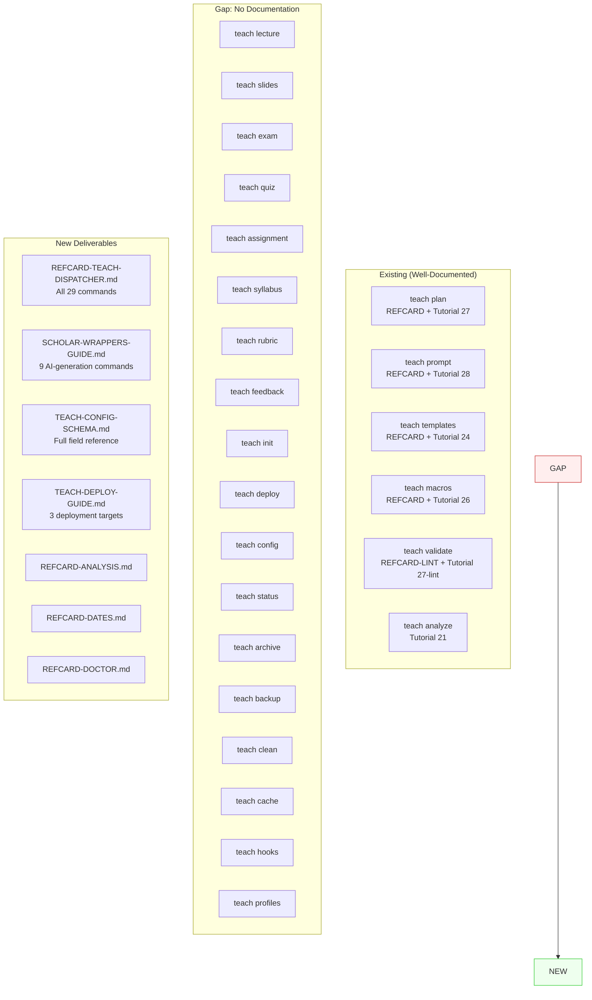
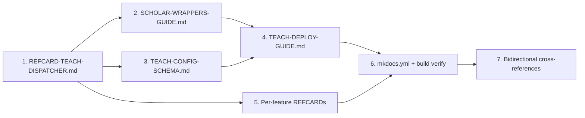

# SPEC: Comprehensive Teaching System Documentation

> **Status:** draft
> **Created:** 2026-02-02
> **Branch:** `feature/teach-comprehensive`
> **From Brainstorm:** Interactive deep brainstorm session
> **Target Version:** v6.2.0

---

## Overview

The flow-cli teaching system has 29 subcommands across two categories (9 Scholar AI-generation wrappers + 20 local commands), but documentation coverage is uneven. The 9 Scholar wrappers -- the primary reason users adopt the teaching system -- have zero documentation. Core workflow commands (init, deploy, config) have only brief mentions. This spec defines a documentation-only effort to bring comprehensive, publication-ready coverage to all teach subcommands.

**Scope:** Documentation only. No code changes to teach commands.

---

## Primary User Story

**As a** statistics instructor using flow-cli,
**I want** comprehensive documentation for every teach subcommand,
**So that** I can discover, learn, and effectively use all teaching features without reading source code.

### Acceptance Criteria

- [ ] Unified REFCARD-TEACH-DISPATCHER.md covers all 29 subcommands
- [ ] Scholar wrappers guide with setup prerequisites + usage examples
- [ ] Config schema reference with every field, types, defaults, validation rules
- [ ] Deploy guide covering GitHub Pages + local preview + CI/CD
- [ ] 4 Mermaid diagrams (workflow overview, Scholar arch, config chain, command taxonomy)
- [ ] Missing per-feature REFCARDs created (analyze, dates, doctor)
- [ ] mkdocs.yml navigation updated with all new pages
- [ ] `mkdocs build` passes without errors
- [ ] Bidirectional cross-references between new and existing docs
- [ ] All examples use STAT-101 demo course fixture

---

## Secondary User Stories

### Story 2: Quick Reference Lookup

**As a** daily flow-cli user,
**I want** a single reference card that covers ALL teach commands,
**So that** I can quickly look up syntax without navigating multiple pages.

**Acceptance Criteria:**
- [ ] REFCARD-TEACH-DISPATCHER.md has table of all 29 commands
- [ ] Commands grouped by category (Scholar, workflow, content, infrastructure)
- [ ] Each entry: command, aliases, synopsis, brief description
- [ ] Consistent format matching existing REFCARDs

### Story 3: Scholar Integration Understanding

**As a** user generating course content,
**I want** to understand how teach wrappers connect to the Scholar plugin,
**So that** I can configure prompts, macros, and templates correctly.

**Acceptance Criteria:**
- [ ] Scholar architecture diagram shows data flow
- [ ] Config resolution chain diagram shows precedence
- [ ] Each wrapper documents required config fields
- [ ] Setup section covers Scholar plugin prerequisites

---

## System Architecture

### Teaching Documentation Landscape



### Deliverable Dependencies



---

## Deliverables

### D1: REFCARD-TEACH-DISPATCHER.md (Unified Reference Card)

**File:** `docs/reference/REFCARD-TEACH-DISPATCHER.md`
**Purpose:** Single page covering all 29 teach subcommands
**Format:** Grouped tables with command, aliases, synopsis, description

**Structure:**

```
# Teach Dispatcher Quick Reference

## Scholar Wrappers (AI Content Generation)
| Command | Aliases | Synopsis | Description |
| teach lecture | lec | teach lecture [WEEK] [TOPIC] [--style TYPE] | Generate lecture content |
| ... | ... | ... | ... |

## Course Management
| teach init | i | teach init [--with-templates] | Initialize teaching project |
| teach deploy | d | teach deploy [--preview] | Deploy course website |
| teach config | c | teach config [view|edit|cat] | Manage teach-config.yml |
| teach status | s | teach status [--performance] | Show project status |

## Content Management
| teach plan | pl | teach plan [create|list|show|edit|delete] | Lesson plan CRUD |
| teach templates | tmpl,tpl | teach templates [list|new|validate|sync] | Template management |
| teach macros | macro,m | teach macros [list|sync|export] | LaTeX macro management |
| teach prompt | pr | teach prompt [list|show|edit|validate|export] | AI prompt management |
| teach analyze | concept | teach analyze [WEEK] [--phase N] | Content analysis |
| teach validate | val,v | teach validate [--lint] [FILE] | Content validation |

## Infrastructure
| teach doctor | doc | teach doctor [--fix] | Health check |
| teach dates | - | teach dates [set|show|shift] | Date management |
| teach cache | - | teach cache [clear|status] | Cache management |
| teach clean | cl | teach clean [--all] | Clean build artifacts |
| teach backup | bk | teach backup [create|list|restore] | Backup management |
| teach archive | a | teach archive [SEMESTER] | Archive course |
| teach hooks | hook | teach hooks [install|remove|status] | Git hooks |
| teach profiles | prof | teach profiles [list|switch|create] | Profile management |
```

**Cross-references:** Link each command to its detailed documentation (guide, tutorial, or REFCARD).

---

### D2: SCHOLAR-WRAPPERS-GUIDE.md (Scholar Integration Guide)

**File:** `docs/guides/SCHOLAR-WRAPPERS-GUIDE.md`
**Purpose:** Complete documentation for the 9 AI-generation commands
**Audience:** Primary user (stat courses, Quarto, Scholar)

**Structure:**

```
# Scholar Wrappers Guide

## Prerequisites
- Scholar plugin installed and configured
- teach-config.yml with course metadata
- (Optional) Custom prompts, macros, templates

## Quick Setup
- Verify: teach doctor
- Config requirements per command

## Commands

### teach lecture [WEEK] [TOPIC] [--style TYPE]
- What it generates
- Required config fields
- Style options (conceptual, computational, rigorous, applied)
- Example with STAT-101 demo course
- Output format

### teach exam [TOPIC] [--format TYPE]
- What it generates
- Required config fields
- Format options
- Example with STAT-101
- Integration with teach macros

### teach quiz [TOPIC]
... (same pattern for all 9)

## Configuration Reference
- Which teach-config.yml fields each command reads
- scholar.latex_macros interaction
- Prompt resolution (Course > User > Plugin)

## Common Workflows
- Generating a full week of content
- Creating an exam from lesson plan
- Customizing output with prompts and macros
```

**Mermaid Diagrams Required:**

1. **Scholar Integration Architecture:**
```
teach exam → Scholar Plugin → Claude → Output
                ↑
         teach-config.yml + prompts + macros
```

2. **Config Resolution Chain:**
```
Course (.flow/prompts/) > User (~/.flow/prompts/) > Plugin (defaults)
```

---

### D3: TEACH-CONFIG-SCHEMA.md (Config Schema Reference)

**File:** `docs/reference/TEACH-CONFIG-SCHEMA.md`
**Purpose:** Formal documentation of every teach-config.yml field

**Structure:**

```
# teach-config.yml Schema Reference

## Top-Level Keys

### course (required)
| Field | Type | Required | Default | Description |
| name | string | yes | - | Short course identifier (e.g., "STAT-101") |
| full_name | string | yes | - | Full course name |
| semester | string | yes | - | One of: fall, spring, summer |
| year | integer | yes | - | Academic year |
| credits | integer | no | 3 | Credit hours |
| instructor | string | no | - | Instructor name |
| description | string | no | - | Course description |

### locations (required)
| Field | Type | Required | Default | Description |
| lectures | string | yes | "lectures" | Lecture directory path |
| concepts | string | no | ".teach/concepts.json" | Concepts JSON path |
| slides_output | string | no | "_site/slides" | Slides output directory |

### settings (optional)
...

### scholar (optional)
...

### semester_info (required for dates)
...

## lesson-plans.yml Schema
...

## Validation Rules
- course.semester must be one of: fall, spring, summer
- semester_info.weeks[].number must be unique integers
- semester_info.weeks[].style must be one of: conceptual, computational, rigorous, applied
- ...
```

**Example:** Full annotated STAT-101 demo course config.

---

### D4: TEACH-DEPLOY-GUIDE.md (Deployment Guide)

**File:** `docs/guides/TEACH-DEPLOY-GUIDE.md`
**Purpose:** Document deployment workflow and strategies

**Structure:**

```
# Teaching Deployment Guide

## Local Preview
- teach deploy --preview (quarto preview)
- teach validate before deploying

## GitHub Pages Deployment
- teach deploy (default target)
- Configuration in teach-config.yml
- Branch setup (gh-pages)
- Custom domain setup

## CI/CD Automation
- GitHub Actions workflow
- Auto-deploy on push to main
- Preview deployments for PRs
- teach validate in CI pipeline

## Troubleshooting
- Common deployment issues
- Permission errors
- Build failures
```

---

### D5: Per-Feature REFCARDs

**Files:**

| File | Command | Format |
|------|---------|--------|
| `docs/reference/REFCARD-ANALYSIS.md` | teach analyze | Phases, options, output format |
| `docs/reference/REFCARD-DATES.md` | teach dates | Subcommands, date formats, examples |
| `docs/reference/REFCARD-DOCTOR.md` | teach doctor | Check categories, fix options, exit codes |

**Format:** Match existing REFCARD style (REFCARD-TEACH-PLAN.md as template).

---

### D6: Mermaid Diagrams

Four diagrams distributed across deliverables:

| Diagram | Location | Type |
|---------|----------|------|
| Teaching Workflow Overview | SCHOLAR-WRAPPERS-GUIDE.md | flowchart |
| Scholar Integration Architecture | SCHOLAR-WRAPPERS-GUIDE.md | flowchart |
| Config Resolution Chain | TEACH-CONFIG-SCHEMA.md | flowchart |
| Command Taxonomy | REFCARD-TEACH-DISPATCHER.md | mindmap or flowchart |

**Teaching Workflow Overview:**
```
init → config → plan → [generate content] → validate → deploy
                         ↓
              lecture / exam / quiz / slides / ...
```

**Command Taxonomy:**
```
teach
├── Scholar Wrappers (AI)
│   ├── lecture, slides, exam, quiz
│   ├── assignment, syllabus, rubric
│   └── feedback, demo
├── Course Management
│   ├── init, deploy, config, status
│   └── archive, backup
├── Content Management
│   ├── plan, templates, macros, prompt
│   └── analyze, validate
└── Infrastructure
    ├── doctor, dates, cache, clean
    └── hooks, profiles
```

---

### D7: Navigation & Build Integration

**mkdocs.yml changes:**

Add to the `Teaching > Reference > Quick Reference Cards` section:
```yaml
- All Commands: reference/REFCARD-TEACH-DISPATCHER.md
- Content Analysis: reference/REFCARD-ANALYSIS.md
- Date Management: reference/REFCARD-DATES.md
- Health Check: reference/REFCARD-DOCTOR.md
```

Add to the `Teaching > Core Workflows` section:
```yaml
- Scholar Wrappers: guides/SCHOLAR-WRAPPERS-GUIDE.md
- Deployment: guides/TEACH-DEPLOY-GUIDE.md
```

Add to the `Teaching > Reference` section:
```yaml
- Config Schema: reference/TEACH-CONFIG-SCHEMA.md
```

**Verification:** `mkdocs build` must pass with zero errors.

---

### D8: Bidirectional Cross-References

Update existing docs to link to new docs:

| Existing Doc | Add Link To |
|--------------|-------------|
| Tutorial 14 (teach-dispatcher) | REFCARD-TEACH-DISPATCHER.md, SCHOLAR-WRAPPERS-GUIDE.md |
| Tutorial 28 (teach-prompt) | SCHOLAR-WRAPPERS-GUIDE.md (prompt resolution) |
| Tutorial 24 (templates) | SCHOLAR-WRAPPERS-GUIDE.md (template usage in generation) |
| Tutorial 26 (macros) | SCHOLAR-WRAPPERS-GUIDE.md (macro usage in generation) |
| MASTER-DISPATCHER-GUIDE.md | REFCARD-TEACH-DISPATCHER.md |
| Scholar Enhancement tutorials | SCHOLAR-WRAPPERS-GUIDE.md |

---

## Out of Scope

Explicitly **NOT** included in this branch:

| Item | Reason |
|------|--------|
| New code/features for teach commands | Documentation-only effort |
| E2E/unit tests for undocumented commands | Future branch |
| MASTER-API-REFERENCE.md function updates | Future branch |
| VHS tape recordings / demo GIFs | Separate effort |
| CLI help text improvements | Code changes, future branch |
| teach profiles Phase 2 completion | Feature work, future branch |
| teach dashboard implementation (#275) | Feature work, future branch |

---

## Data Models

N/A - Documentation-only effort. No data model changes.

---

## API Design

N/A - No API changes. This spec documents existing APIs.

---

## Dependencies

| Dependency | Purpose | Required |
|------------|---------|----------|
| mkdocs | Build verification | Yes |
| mkdocs-material | Theme | Yes |
| pymdownx.superfences | Mermaid diagram rendering | Yes |
| STAT-101 demo course fixture | Example content | Yes (exists at tests/fixtures/demo-course/) |

---

## UI/UX Specifications

N/A - CLI documentation only. No UI changes.

---

## Open Questions

1. **teach profiles documentation depth:** Profiles is a Phase 2 feature that may be incomplete. Document current state only, or note it as "experimental"?
2. **Archived REFCARDs:** Should REFCARD-TEACHING.md and REFCARD-TEACHING-V3.md in .archive/ be deleted now that REFCARD-TEACH-DISPATCHER.md replaces them?
3. **teach-config.yml vs .flow/teach-config.yml:** The config schema guide should clarify when each location is used.

---

## Review Checklist

- [ ] All 29 teach subcommands appear in REFCARD-TEACH-DISPATCHER.md
- [ ] Scholar wrappers have working examples using STAT-101 fixture
- [ ] Config schema covers every field in tests/fixtures/demo-course/.flow/teach-config.yml
- [ ] All 4 Mermaid diagrams render correctly in mkdocs
- [ ] mkdocs.yml navigation is logical and complete
- [ ] `mkdocs build` passes with zero warnings
- [ ] Bidirectional cross-references don't create broken links
- [ ] Consistent formatting across all new REFCARDs
- [ ] No orphan pages (every new page in navigation)
- [ ] Publication-ready quality (polished prose, consistent formatting)

---

## Implementation Notes

### File Creation Order

1. REFCARD-TEACH-DISPATCHER.md (foundation -- all commands catalogued)
2. TEACH-CONFIG-SCHEMA.md (required by Scholar guide)
3. SCHOLAR-WRAPPERS-GUIDE.md (requires config schema references)
4. TEACH-DEPLOY-GUIDE.md (standalone)
5. REFCARD-ANALYSIS.md, REFCARD-DATES.md, REFCARD-DOCTOR.md (standalone)
6. mkdocs.yml navigation update
7. Bidirectional cross-reference updates
8. Build verification

### Quality Standards

- **Prose:** Clear, direct, no filler. Match existing tutorial quality.
- **Formatting:** Consistent with existing REFCARDs (tables, code blocks, admonitions).
- **Examples:** All use STAT-101 demo course data. Real command output where possible.
- **Diagrams:** Mermaid syntax verified to render in mkdocs-material.
- **Links:** All internal links verified. All external links to stable URLs only.

### Source of Truth for Command Documentation

Read actual implementations to document behavior accurately:

| Command Group | Source Files |
|---------------|-------------|
| Scholar wrappers | `lib/dispatchers/teach-dispatcher.zsh` (wrapper functions) |
| teach init | `lib/dispatchers/teach-dispatcher.zsh` (_teach_init) |
| teach deploy | `lib/dispatchers/teach-deploy-enhanced.zsh` |
| teach config | `lib/dispatchers/teach-dispatcher.zsh` (_teach_config_*) |
| teach doctor | `lib/dispatchers/teach-doctor-impl.zsh` |
| teach dates | `lib/dispatchers/teach-dates.zsh` |
| teach analyze | `commands/teach-analyze.zsh` |
| teach cache | `commands/teach-cache.zsh` |
| teach profiles | `commands/teach-profiles.zsh` |

---

## History

| Date | Author | Change |
|------|--------|--------|
| 2026-02-02 | DT + Claude | Initial spec from interactive deep brainstorm |
