# Implementation Spec: Automated Date/Deadline Management for Teaching Workflows

**Status:** draft
**Created:** 2026-01-16
**From Brainstorm:** BRAINSTORM-teach-dates-automation-2026-01-16.md (project root)
**Target Release:** v5.12.0
**Effort Estimate:** 12-17 hours (5 phases)
**Priority:** High

---

## Overview

Add intelligent date/deadline synchronization to flow-cli's teaching workflow. Instructors define dates once in `teach-config.yml` (weeks, holidays, deadlines, exams) and automatically propagate them to syllabus, schedule, assignments, and lecture files. Support relative dates (week + offset), conflict resolution, and one-command semester rollover.

**Key Value Proposition:** Eliminate 40+ manual date updates per semester, prevent inconsistencies, reduce semester rollover from 2 hours to 5 minutes.

---

## Primary User Story

**As a course instructor managing teaching materials,**
**I want** to define my semester schedule once in teach-config.yml and sync dates to all files automatically,
**So that** I never have date inconsistencies between syllabus, assignments, and lectures,
**And** I can roll over courses to new semesters in one command.

**Acceptance Criteria:**
1. teach-config.yml has extended schema for weeks, holidays, deadlines, exams
2. `teach dates sync` finds all teaching files and shows date mismatches
3. File-by-file prompts allow selective date updates
4. Relative dates (week: 3, offset: +2 days) are computed correctly
5. `teach semester new "Spring 2026"` shifts all dates and syncs files

---

## Secondary User Stories

### User Story 2: Preventing Date Inconsistencies

**As a course instructor with materials across many files,**
**I want** an automated check that all my dates match the course config,
**So that** students never see conflicting deadlines.

**Acceptance Criteria:**
- teach status shows date sync status
- teach dates sync --preview shows mismatches without modifying files
- Mismatches are clearly presented with file:field:old_date→new_date

### User Story 3: Semester Rollover

**As an instructor teaching the same course each semester,**
**I want** to copy my course and update all dates automatically,
**So that** I don't spend 2 hours manually updating 40+ dates.

**Acceptance Criteria:**
- `teach semester new "Spring 2026"` calculates date shift automatically
- All config dates (weeks, holidays, exams) are shifted
- All file dates are synced via teach dates sync
- One command, complete rollover in < 5 minutes

---

## Technical Requirements

### Architecture

#### Component Diagram


#### Data Flow: Date Sync Process

```mermaid
sequenceDiagram
    actor User
    participant CMD as teach dates sync
    participant Parser as date-parser.zsh
    participant Config as teach-config.yml
    participant Files as *.qmd files

    User->>CMD: teach dates sync
    CMD->>Files: Find all teaching files
    Files-->>CMD: List of 23 files

    loop For each file
        CMD->>Parser: Extract dates from file
        Parser->>Files: Read YAML + markdown
        Parser-->>CMD: File dates {due: 2025-01-20}

        CMD->>Config: Load config dates
        Config-->>CMD: Config dates {hw1: week 2 + 2 days}

        CMD->>Parser: Compute relative date
        Parser-->>CMD: 2025-01-22

        CMD->>CMD: Compare: 2025-01-20 vs 2025-01-22
        CMD->>CMD: Flag mismatch
    end

    CMD->>User: Show 5 files with mismatches

    loop For each mismatched file
        CMD->>User: File: hw1.qmd<br/>due: 2025-01-20 → 2025-01-22<br/>Apply? [y/N]
        User->>CMD: y

        CMD->>Parser: Apply date changes
        Parser->>Files: Update YAML + content
        Parser-->>CMD: ✓ Updated

        CMD->>User: ✓ Updated hw1.qmd
    end

    CMD->>User: ✅ Applied 3 updates, skipped 2
```



---

### API Design

#### New Module: lib/date-parser.zsh

| Function | Parameters | Returns | Description |
|----------|-----------|---------|-------------|
| `_date_parse_quarto_yaml` | file, field | ISO date | Extract date from YAML frontmatter |
| `_date_parse_markdown_inline` | file, pattern | date array | Find inline dates in markdown |
| `_date_normalize` | date_string | ISO date | Convert any format to YYYY-MM-DD |
| `_date_compute_from_week` | week_start, offset | ISO date | Calculate week + offset days |
| `_date_find_teaching_files` | [path] | file array | Find all teaching files to sync |
| `_date_load_config` | - | config hash | Load all dates from teach-config.yml |
| `_date_compare` | file, file_dates, config_dates | diff string | Compare and flag mismatches |
| `_date_apply_to_file` | file, changes | 0/1 | Apply date changes to file |
| `_teach_dates_sync` | [--preview] | 0/1 | Main sync command |
| `_teach_semester_new` | semester, year | 0/1 | Semester rollover command |

#### teach-config.yml Schema Extensions

```yaml
semester_info:
  start_date: string (YYYY-MM-DD)
  end_date: string (YYYY-MM-DD)

  weeks:                          # NEW
    - number: integer
      start_date: string (YYYY-MM-DD)
      topic: string

  holidays:                       # NEW
    - name: string
      date: string (YYYY-MM-DD)
      type: enum(break|holiday|no_class)

  deadlines:                      # NEW
    <assignment_id>:
      due_date: string (YYYY-MM-DD)  # Absolute
      # OR
      week: integer                   # Relative
      offset_days: integer

  exams:                          # NEW
    - name: string
      date: string (YYYY-MM-DD)
      time: string
      location: string
```

#### Command Enhancements

| Command | New Behavior | Flags |
|---------|-------------|-------|
| `teach dates sync` | Sync dates from config to files | `--preview` - show changes only |
| `teach dates sync` | File-by-file prompts for updates | `--no-prompt` - auto-apply all |
| `teach semester new <sem> <year>` | Shift all dates and sync files | - |
| `teach init` | Prompt for start date, generate weeks | - |
| `teach status` | Show date sync status | - |

---

### Data Models

#### Config Schema (JSON Schema)

```json
{
  "semester_info": {
    "type": "object",
    "properties": {
      "start_date": {
        "type": "string",
        "pattern": "^\\d{4}-\\d{2}-\\d{2}$"
      },
      "end_date": {
        "type": "string",
        "pattern": "^\\d{4}-\\d{2}-\\d{2}$"
      },
      "weeks": {
        "type": "array",
        "items": {
          "type": "object",
          "required": ["number", "start_date"],
          "properties": {
            "number": {"type": "integer", "minimum": 1},
            "start_date": {"type": "string", "pattern": "^\\d{4}-\\d{2}-\\d{2}$"},
            "topic": {"type": "string"}
          }
        }
      },
      "holidays": {
        "type": "array",
        "items": {
          "type": "object",
          "required": ["name", "date"],
          "properties": {
            "name": {"type": "string"},
            "date": {"type": "string", "pattern": "^\\d{4}-\\d{2}-\\d{2}$"},
            "type": {"enum": ["break", "holiday", "no_class"]}
          }
        }
      },
      "deadlines": {
        "type": "object",
        "additionalProperties": {
          "type": "object",
          "properties": {
            "due_date": {"type": "string", "pattern": "^\\d{4}-\\d{2}-\\d{2}$"},
            "week": {"type": "integer", "minimum": 1},
            "offset_days": {"type": "integer"}
          },
          "oneOf": [
            {"required": ["due_date"]},
            {"required": ["week", "offset_days"]}
          ]
        }
      },
      "exams": {
        "type": "array",
        "items": {
          "type": "object",
          "required": ["name", "date"],
          "properties": {
            "name": {"type": "string"},
            "date": {"type": "string", "pattern": "^\\d{4}-\\d{2}-\\d{2}$"},
            "time": {"type": "string"},
            "location": {"type": "string"}
          }
        }
      }
    }
  }
}
```

#### Date Mismatch Record

```yaml
file: assignments/hw1.qmd
mismatches:
  - field: due
    file_date: "2025-01-20"
    config_date: "2025-01-22"
    source: "week 2 + 2 days"
  - field: inline_date (line 45)
    file_date: "January 20, 2025"
    config_date: "2025-01-22"
    source: "week 2 + 2 days"
```

---

### Dependencies

#### External Tools

| Tool | Version | Required | Purpose |
|------|---------|----------|---------|
| yq | ≥ 4.0 | Yes | YAML parsing and manipulation |
| date / gdate | Any | Yes | Date arithmetic (GNU or BSD date) |
| sed | Any | Yes | File content replacement |
| find | Any | Yes | Recursive file search |

#### Internal Dependencies

| Module | Dependency Type | Reason |
|--------|----------------|--------|
| `lib/config-validator.zsh` | Required | Validate extended date schema |
| `lib/core.zsh` | Required | Logging, error handling |
| `lib/dispatchers/teach-dispatcher.zsh` | Modified | Add dates and semester subcommands |
| `commands/teach-init.zsh` | Modified | Add date setup wizard |

---

## UI/UX Specifications

### User Flow: teach dates sync

```
┌─────────────────────────────────────────────────────────────┐
│ teach dates sync                                            │
└─────────────────────────────────────────────────────────────┘
                          ↓
┌─────────────────────────────────────────────────────────────┐
│ 🔍 Scanning for teaching files...                           │
│ Found 23 files in:                                          │
│   - assignments/ (8 files)                                  │
│   - lectures/ (12 files)                                    │
│   - exams/ (2 files)                                        │
│   - Root (syllabus.qmd, schedule.qmd)                       │
└─────────────────────────────────────────────────────────────┘
                          ↓
┌─────────────────────────────────────────────────────────────┐
│ 📊 Analyzing dates...                                       │
│ [████████████████████████████████] 23/23                    │
└─────────────────────────────────────────────────────────────┘
                          ↓
┌─────────────────────────────────────────────────────────────┐
│ ⚠️  Date Mismatches Found                                   │
├─────────────────────────────────────────────────────────────┤
│ 5 files have dates that differ from teach-config.yml:      │
│                                                             │
│   1. assignments/hw1.qmd (1 mismatch)                       │
│   2. assignments/hw2.qmd (2 mismatches)                     │
│   3. lectures/week02.qmd (1 mismatch)                       │
│   4. syllabus.qmd (3 mismatches)                            │
│   5. schedule.qmd (8 mismatches)                            │
│                                                             │
│ Total: 15 date differences                                  │
└─────────────────────────────────────────────────────────────┘
                          ↓
┌─────────────────────────────────────────────────────────────┐
│ File: assignments/hw1.qmd                                   │
├─────────────────────────────────────────────────────────────┤
│                                                             │
│ YAML Frontmatter:                                           │
│   due: 2025-01-20 → 2025-01-22                             │
│   Source: week 2 (2025-01-20) + 2 days                     │
│                                                             │
│ Apply changes to this file? [y/N]                           │
│   y - Yes, update this file                                 │
│   n - No, skip this file                                    │
│   d - Show diff                                             │
│   q - Quit (no more changes)                                │
└─────────────────────────────────────────────────────────────┘
                          ↓
                  [User presses 'y']
                          ↓
┌─────────────────────────────────────────────────────────────┐
│ ✓ Updated: assignments/hw1.qmd                              │
│   - due: 2025-01-20 → 2025-01-22                           │
└─────────────────────────────────────────────────────────────┘
                          ↓
                  [Repeat for each file]
                          ↓
┌─────────────────────────────────────────────────────────────┐
│ ✅ Date Sync Complete                                       │
├─────────────────────────────────────────────────────────────┤
│                                                             │
│ Summary:                                                    │
│   Applied: 3 files (8 date changes)                         │
│   Skipped: 2 files (7 date changes)                         │
│                                                             │
│ Next Steps:                                                 │
│   1. Review changes: git diff                               │
│   2. Commit: git add -A && git commit                       │
│                                                             │
│ Modified Files:                                             │
│   M assignments/hw1.qmd                                     │
│   M lectures/week02.qmd                                     │
│   M syllabus.qmd                                            │
└─────────────────────────────────────────────────────────────┘
```

### Wireframe: teach semester new

```
┌─────────────────────────────────────────────────────────────┐
│ teach semester new "Spring 2026"                            │
└─────────────────────────────────────────────────────────────┘
                          ↓
┌─────────────────────────────────────────────────────────────┐
│ 🗓️  Semester Rollover                                       │
├─────────────────────────────────────────────────────────────┤
│                                                             │
│ Current Semester: Fall 2025                                 │
│   Start: 2025-08-18                                         │
│   End: 2025-12-12                                           │
│                                                             │
│ New Semester: Spring 2026                                   │
│   Start: 2026-01-13 (calculated)                            │
│   End: 2026-05-01 (calculated)                              │
│                                                             │
│ Date Shift: +148 days (21 weeks, 1 day)                    │
│                                                             │
├─────────────────────────────────────────────────────────────┤
│ Will update:                                                │
│   ✓ teach-config.yml (semester, year, all dates)           │
│   ✓ 23 teaching files (via teach dates sync)               │
│                                                             │
│ Proceed with semester rollover? [Y/n]                       │
└─────────────────────────────────────────────────────────────┘
                          ↓
                  [User presses 'Y']
                          ↓
┌─────────────────────────────────────────────────────────────┐
│ 🔄 Shifting Config Dates...                                 │
│   ✓ Semester start/end dates                                │
│   ✓ 15 week dates                                           │
│   ✓ 3 holidays                                              │
│   ✓ 8 assignment deadlines                                  │
│   ✓ 2 exam dates                                            │
└─────────────────────────────────────────────────────────────┘
                          ↓
┌─────────────────────────────────────────────────────────────┐
│ 📝 Updating teach-config.yml...                             │
│   ✓ course.semester = "Spring"                              │
│   ✓ course.year = 2026                                      │
│   ✓ All dates shifted by +148 days                          │
└─────────────────────────────────────────────────────────────┘
                          ↓
┌─────────────────────────────────────────────────────────────┐
│ 🔍 Syncing dates to files...                                │
│ (runs: teach dates sync --no-prompt)                        │
│                                                             │
│ [████████████████████████████████] 23/23                    │
│                                                             │
│ Updated 23 files automatically                              │
└─────────────────────────────────────────────────────────────┘
                          ↓
┌─────────────────────────────────────────────────────────────┐
│ ✅ Semester Rollover Complete!                              │
├─────────────────────────────────────────────────────────────┤
│                                                             │
│ Spring 2026 course ready:                                   │
│   - Config updated (semester, year, dates)                  │
│   - All files synced (23 files)                             │
│   - Total time: 8 seconds                                   │
│                                                             │
│ Next:                                                       │
│   1. Review: git diff                                       │
│   2. Update topics: edit teach-config.yml                   │
│   3. Commit: git add -A && git commit                       │
└─────────────────────────────────────────────────────────────┘
```

### Accessibility Checklist

- [x] All prompts use clear y/N format
- [x] Color not sole indicator (uses ✓, ⚠️, ✗ symbols)
- [x] Progress bars show numeric completion (23/23)
- [x] Error messages include actionable next steps
- [x] File paths are absolute or relative to project root
- [x] Date formats are ISO (universally parsable)
- [x] --preview flag for read-only preview

---

## Open Questions

1. **Should we validate that week dates are actually 7 days apart?**
   - **Recommendation:** No, allow flexibility for courses with variable schedules

2. **How to handle courses with 2 meetings per week?**
   - Week 1 Monday + Week 1 Wednesday
   - **Recommendation:** Phase 6, use `lectures` array with multiple dates per week

3. **Should teach dates sync backup files before modifying?**
   - Create `.bak` files as safety net
   - **Recommendation:** Yes, remove backups after successful update

4. **What about dates embedded in prose (not YAML)?**
   - "The assignment is due on January 22, 2025."
   - **Recommendation:** Phase 2 handles this with inline markdown parsing

---

## Review Checklist

### Design Review

- [x] All user stories have acceptance criteria
- [x] Architecture diagram shows component relationships
- [x] Data flow diagrams illustrate key workflows
- [x] API design is consistent with existing conventions
- [x] Config schema validated against JSON Schema spec
- [x] UI/UX wireframes for all interactive prompts

### Security Review

- [ ] File writes use atomic operations (write temp, then rename)
- [ ] sed operations use backup files (.bak)
- [ ] No shell injection in date string parsing
- [ ] Config validation prevents malicious YAML
- [ ] File paths are validated (no directory traversal)

### Performance Review

- [ ] File scanning uses find (efficient for large repos)
- [ ] YAML parsing cached (don't re-parse same file)
- [ ] Date computations are O(1) (not O(n))
- [ ] teach dates sync completes in < 10s for 50 files

### Testing Review

- [ ] Test suite covers all 5 phases
- [ ] Mock yq operations in tests (no real file writes)
- [ ] Test date parsing for all supported formats
- [ ] Test relative date computation with offsets
- [ ] Test semester rollover with various date shifts
- [ ] Test conflict resolution (file vs config dates)

### Documentation Review

- [ ] TEACHING-DATES-GUIDE.md created
- [ ] Tutorial 14 updated with date management examples
- [ ] DISPATCHER-REFERENCE.md updated for teach dates
- [ ] Migration guide for adding dates to existing courses
- [ ] FAQ section for common date issues
- [ ] Video walkthrough of semester rollover

### Accessibility Review

- [x] All interactive prompts use y/N format
- [x] Clear option labels with descriptions
- [x] Status symbols not emoji-only
- [x] Error messages actionable
- [ ] Tested with screen reader (manual test needed)

---

## Implementation Notes

### Critical Path

1. **Phase 1 (Date Schema)** must be completed first
   - Foundation for all date management
   - Config validation ensures data quality
   - Can ship independently (no breaking changes)

2. **Phase 2 (Date Parser)** depends on Phase 1
   - Needs schema to know what dates to extract
   - Pure functions, easy to test

3. **Phase 3 (Date Sync)** depends on Phases 1-2
   - Uses date parser to extract and compare
   - High-value feature (eliminates manual updates)

4. **Phase 4 (Semester Rollover)** depends on Phases 1-3
   - Uses date shifting + sync
   - Can be developed in parallel with Phase 5

5. **Phase 5 (teach init)** depends on Phase 1
   - Uses date schema
   - Independent of Phases 2-4

### Testing Strategy

**Unit Tests:**
- date-parser.zsh: Test each function with mocked files
- config-validator.zsh: Test extended schema validation
- Date arithmetic: Test week + offset calculations

**Integration Tests:**
- Full workflow: Create config → Sync dates → Verify files
- Semester rollover: Shift dates → Sync → Verify consistency
- Conflict resolution: Manual edit → Sync → Prompt user

**Manual Tests:**
- Test with real course (STAT 545)
- Test semester rollover (Fall 2025 → Spring 2026)
- Test with various file formats (Quarto, Markdown)
- Test date formats (ISO, long, short)

### Migration Guide (v5.10.0 → v5.12.0)

**For existing teaching projects:**

1. **Add dates to teach-config.yml:**

   ```yaml
   semester_info:
     start_date: "2025-01-13"
     weeks:
       - number: 1
         start_date: "2025-01-13"
       # ... add all 15 weeks
   ```

2. **Run initial sync (preview):**

   ```bash
   teach dates sync --preview
   # Review what would change
   ```

3. **Apply sync:**

   ```bash
   teach dates sync
   # Confirm file-by-file
   ```

4. **Commit changes:**

   ```bash
   git add -A
   git commit -m "chore: centralize course dates in config"
   ```

**Rollback plan:**
- Remove `semester_info` extended fields from config
- teach dates sync will not find config dates (no-op)
- Manual dates in files preserved

---

## History

### 2026-01-16 - Command Naming Decision

**Decision:** Use `teach dates` subcommand hierarchy (Option A)

**Rationale:**
1. **Discoverability**: Natural fit under existing `teach` dispatcher
2. **Clarity**: `dates` clearly indicates the domain (date management)
3. **Consistency**: Matches existing patterns (`teach status`, `teach deploy`, `teach exam`)
4. **Extensibility**: Easy to add new date operations without breaking changes
5. **ADHD-Friendly**: Clear, predictable structure with safe defaults

**Command Structure:**

```bash
teach dates sync              # Main sync command (interactive)
teach dates sync --dry-run    # Preview changes (safe mode)
teach dates status            # Check date consistency
teach dates rollover          # Semester rollover wizard
teach dates init              # Initial setup wizard
teach dates validate          # Validate date config
```

**Alternatives Considered:**
- **Option B** (`teach semester`): Less clear about date management focus
- **Option C** (`teach sync dates`): Action-first, but doesn't scale well for non-sync operations
- **Option D** (`dates` dispatcher): Shorter, but breaks flow-cli convention and less discoverable

**References:**

- Command naming brainstorm: BRAINSTORM-teach-dates-command-naming-2026-01-16.md (project root)
- [Dispatcher reference](../reference/DISPATCHER-REFERENCE.md)

---

### 2026-01-16 - Initial Draft

- **Created by:** Claude Code (Deep Feature Brainstorm)
- **Reviewed by:** (pending)
- **Changes:** N/A - initial version

**From Brainstorm Findings:**
- 8 expert questions completed
- Pain points: Manual updates, inconsistencies, semester rollover
- Source of truth: Config + external calendar
- Date types: All (weeks, deadlines, exams, holidays)
- UX: File-by-file prompts
- Triggers: Manual command + semester rollover

**Next Steps:**
1. Review spec with flow-cli maintainer
2. Get approval for Phase 1 (Date schema)
3. Create feature branch for implementation
4. Begin Phase 1 development (2-3 hours)
