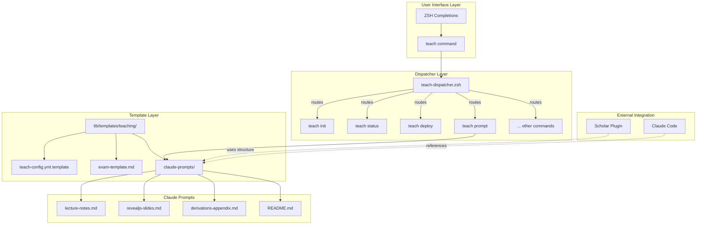
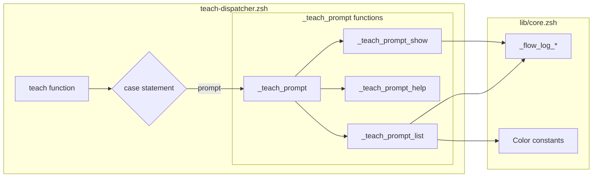
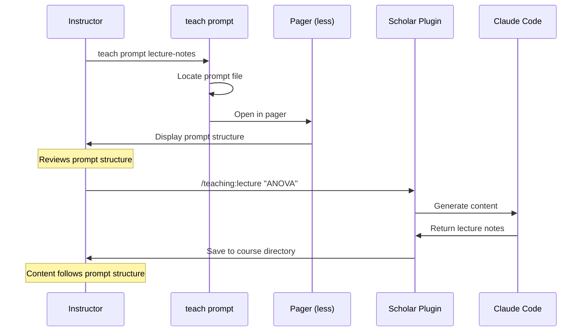
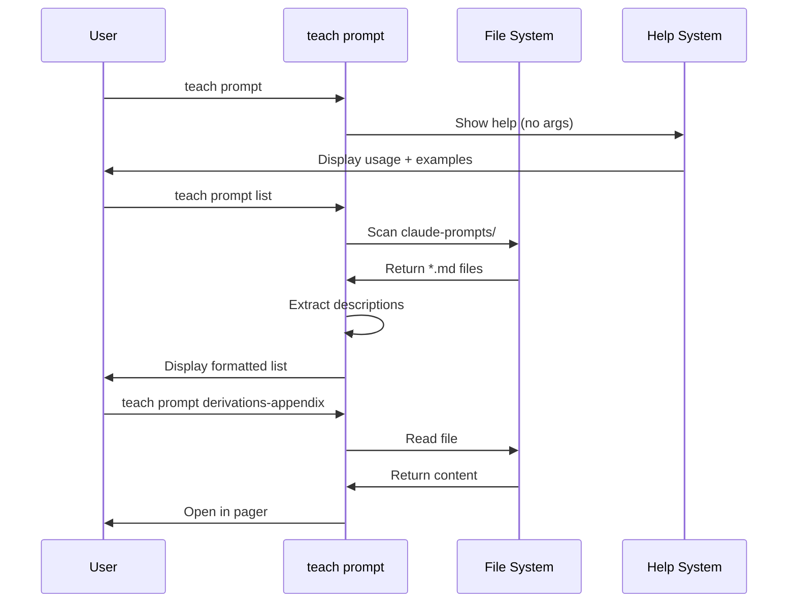
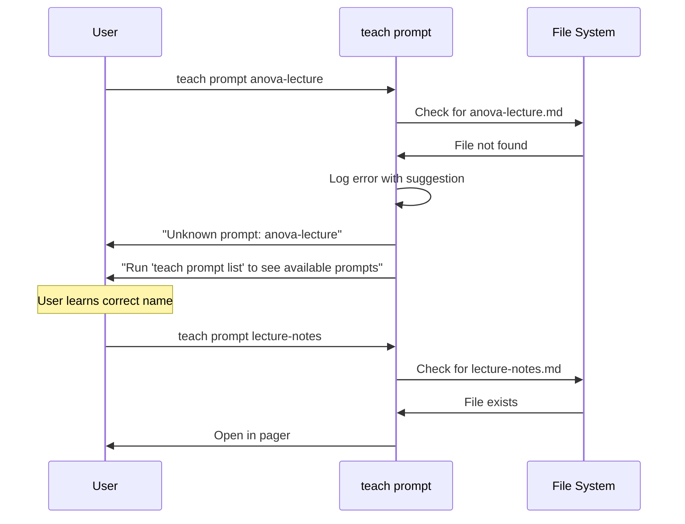
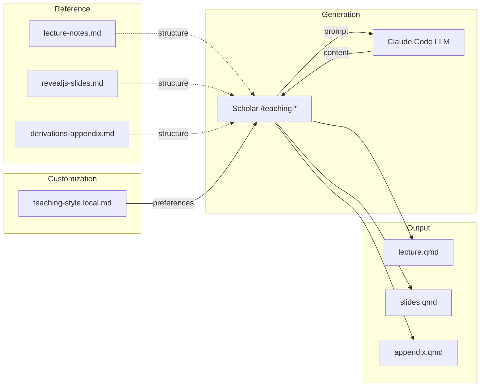
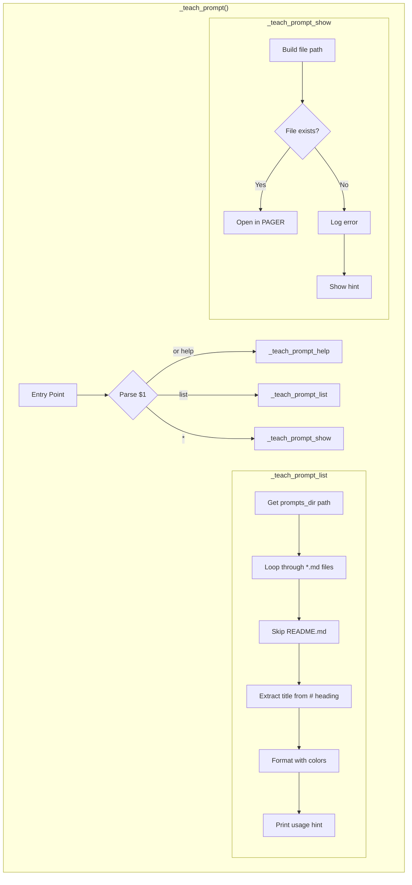
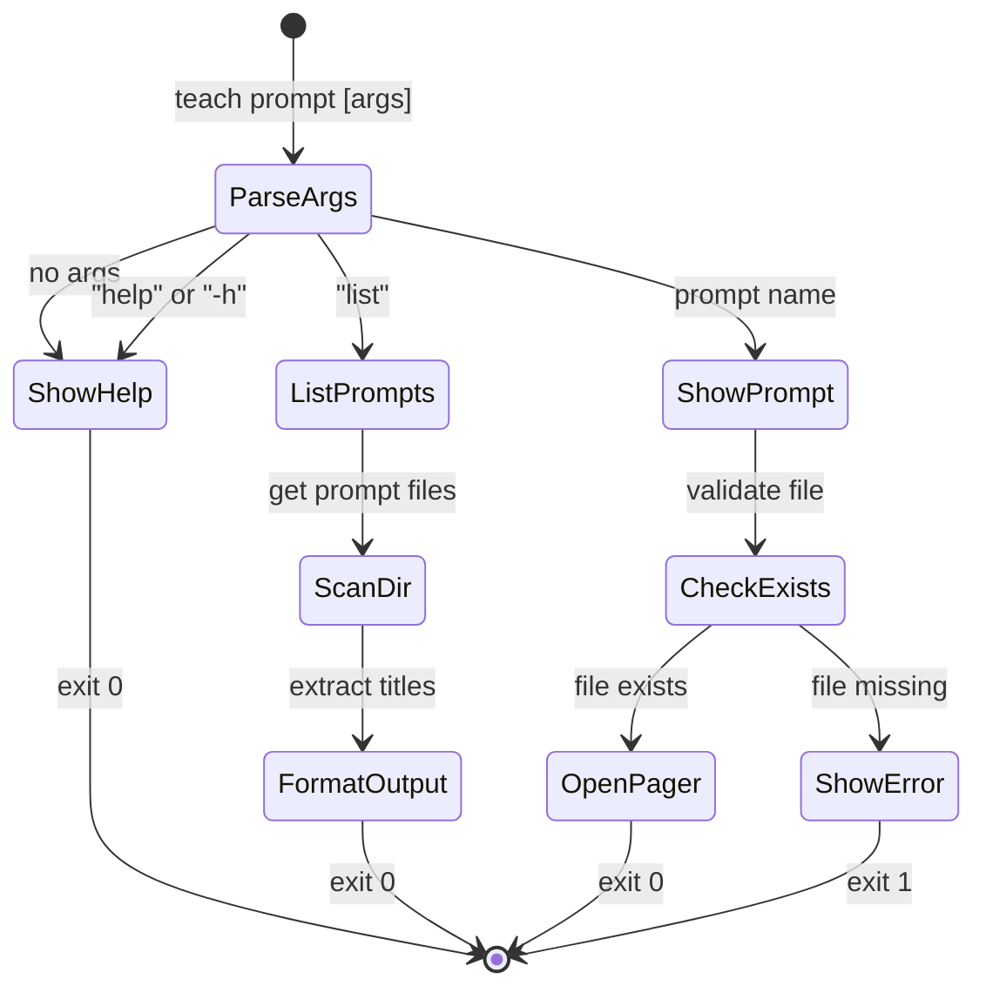
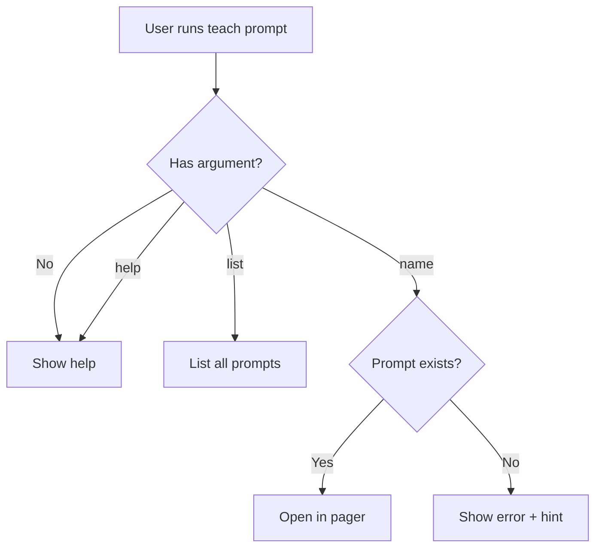
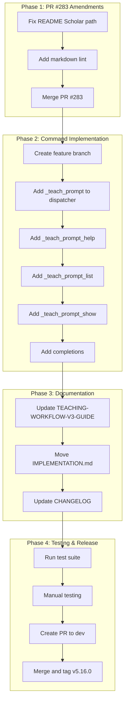

# SPEC: teach prompt Command

**Status:** draft
**Created:** 2026-01-21
**From Brainstorm:** [BRAINSTORM-pr283-improvements-2026-01-21.md](BRAINSTORM-pr283-improvements-2026-01-21.md)
**Target Version:** v5.16.0

---

## Overview

Add a `teach prompt` subcommand to the teach dispatcher that allows users to list and view Claude Code teaching prompts. This complements PR #283 which adds the prompt template files.

---

## Primary User Story

**As a** statistics instructor using flow-cli,
**I want to** quickly view Claude Code teaching prompts from the command line,
**So that** I can reference the prompt structure when generating course content with Scholar.

### Acceptance Criteria

- [ ] `teach prompt list` displays all available prompts with descriptions
- [ ] `teach prompt <name>` opens the prompt file in a pager
- [ ] `teach prompt help` shows usage documentation
- [ ] Unknown prompt names show helpful error message
- [ ] Tab completion works for prompt names

---

## Secondary User Stories

### Story 2: Documentation Integration

**As a** new flow-cli user,
**I want to** find teaching prompt documentation in the workflow guide,
**So that** I understand how prompts integrate with Scholar commands.

**Acceptance Criteria:**
- [ ] TEACHING-WORKFLOW-V3-GUIDE.md includes prompts section
- [ ] Documentation explains Scholar integration
- [ ] Cross-references to Scholar plugin docs

### Story 3: PR #283 Cleanup

**As a** repository maintainer,
**I want to** have implementation docs in the proper location,
**So that** the repo structure is consistent and discoverable.

**Acceptance Criteria:**
- [ ] IMPLEMENTATION.md moved to docs/specs/
- [ ] README.md Scholar path reference clarified
- [ ] Markdown lint validation passes

---

## System Architecture

### flow-cli Teaching Ecosystem



### Component Hierarchy



---

## Workflow Processes

### Workflow 1: Content Creation with Prompts

**Goal:** Instructor creates lecture notes using Claude Code prompt as reference



### Workflow 2: Discovering Available Prompts

**Goal:** New user explores what prompts are available



### Workflow 3: Error Recovery

**Goal:** User types invalid prompt name, gets helpful guidance



---

## Integration Architecture

### Scholar Plugin Integration

```mermaid
flowchart TB
    subgraph "flow-cli (This Project)"
        TP[teach prompt command]
        PROMPTS[claude-prompts/*.md]
        TP --> |reads| PROMPTS
    end

    subgraph "Scholar Plugin (External)"
        SC[/teaching:* commands]
        TS[teaching-style.local.md]
        SC --> |uses structure from| PROMPTS
        SC --> |customized by| TS
    end

    subgraph "User's Course Repo"
        COURSE[course directory]
        TS --> |lives in| COURSE
        OUTPUT[generated content]
        SC --> |creates| OUTPUT
    end

    USER((Instructor))
    USER --> |references| TP
    USER --> |invokes| SC
    USER --> |configures| TS
```

### Data Flow: Prompt to Content



---

## Command Architecture

### Internal Function Design



### State Diagram: Command Execution



---

## API Design

### Command Interface

| Command | Description | Exit Code |
|---------|-------------|-----------|
| `teach prompt` | Show help | 0 |
| `teach prompt list` | List available prompts | 0 |
| `teach prompt <name>` | Display prompt in pager | 0 or 1 |
| `teach prompt help` | Show detailed help | 0 |

### Function Signatures

```zsh
# Main router
_teach_prompt() {
    # Args: $@ - subcommand and arguments
    # Returns: 0 on success, 1 on error
}

# List all prompts
_teach_prompt_list() {
    # Args: none
    # Output: formatted list to stdout
    # Returns: 0
}

# Show specific prompt
_teach_prompt_show() {
    # Args: $1 - prompt name (without .md)
    # Output: opens file in $PAGER
    # Returns: 0 if found, 1 if not found
}

# Display help
_teach_prompt_help() {
    # Args: none
    # Output: help text to stdout
    # Returns: 0
}
```

### Output Format

**`teach prompt list`:**
```
Available Teaching Prompts

  lecture-notes             Comprehensive Lecture Notes Generator
  revealjs-slides           RevealJS Presentation Generator
  derivations-appendix      Mathematical Derivations & Theory Appendix Generator

Usage: teach prompt <name> to view a prompt
```

**`teach prompt <name>` (error):**
```
✗ Unknown prompt: foo

Run teach prompt list to see available prompts
```

---

## Data Models

N/A - No data model changes. Command reads existing markdown files from `lib/templates/teaching/claude-prompts/`.

### File Discovery Logic

```
prompts_dir = ${FLOW_ROOT}/lib/templates/teaching/claude-prompts

for each file in prompts_dir/*.md:
    if file.name == "README.md":
        skip
    else:
        name = file.basename without .md
        title = first line matching /^# .*/
        yield (name, title)
```

---

## Dependencies

| Dependency | Type | Purpose |
|------------|------|---------|
| `lib/core.zsh` | Internal | Logging, colors |
| `$PAGER` or `less` | External | Display prompt content |
| Prompt files | Internal | Content source |
| `$FLOW_ROOT` | Environment | Plugin root path |

---

## UI/UX Specifications

### User Flow



### Wireframe (Terminal Output)

**Help Output:**
```
┌────────────────────────────────────────────────────────────┐
│ teach prompt - Display Claude Code teaching prompts        │
├────────────────────────────────────────────────────────────┤
│ USAGE:                                                     │
│     teach prompt <command>                                 │
│                                                            │
│ COMMANDS:                                                  │
│     list              List available prompts               │
│     <name>            Display prompt in pager              │
│     help              Show this help                       │
│                                                            │
│ AVAILABLE PROMPTS:                                         │
│     lecture-notes         Lecture documents (20-40 pages)  │
│     revealjs-slides       Presentations (25+ slides)       │
│     derivations-appendix  Mathematical theory appendices   │
│                                                            │
│ EXAMPLES:                                                  │
│     teach prompt list                                      │
│     teach prompt lecture-notes                             │
│                                                            │
│ INTEGRATION:                                               │
│     These prompts complement Scholar plugin commands:      │
│     - /teaching:lecture uses lecture-notes.md structure    │
│     - /teaching:slides uses revealjs-slides.md structure   │
└────────────────────────────────────────────────────────────┘
```

**List Output:**
```
┌────────────────────────────────────────────────────────────┐
│ $ teach prompt list                                        │
├────────────────────────────────────────────────────────────┤
│ Available Teaching Prompts                                 │
│                                                            │
│   lecture-notes           Comprehensive Lecture Notes...   │
│   revealjs-slides         RevealJS Presentation Generator  │
│   derivations-appendix    Mathematical Derivations & ...   │
│                                                            │
│ Usage: teach prompt <name> to view a prompt                │
└────────────────────────────────────────────────────────────┘
```

### Accessibility

- Uses standard terminal colors from `lib/core.zsh`
- Works with screen readers (plain text output)
- Respects `$PAGER` environment variable
- No flashing or animation

---

## Process Workflows

### Implementation Process



### User Workflow: First-Time Setup

```mermaid
flowchart TD
    START([Instructor wants to create content])

    START --> Q1{Familiar with prompts?}

    Q1 -->|No| DISCOVER[teach prompt list]
    DISCOVER --> REVIEW[teach prompt lecture-notes]
    REVIEW --> UNDERSTAND[Understand structure]

    Q1 -->|Yes| UNDERSTAND

    UNDERSTAND --> CONFIG{Has teaching style?}

    CONFIG -->|No| CREATE[Create .claude/teaching-style.local.md]
    CONFIG -->|Yes| GENERATE

    CREATE --> GENERATE[/teaching:lecture "Topic"]

    GENERATE --> RESULT[Content generated]
    RESULT --> END([Review and publish])
```

### User Workflow: Daily Usage

```mermaid
flowchart LR
    subgraph "Quick Reference"
        A[teach prompt list] --> B[See available prompts]
    end

    subgraph "Content Generation"
        C[/teaching:lecture] --> D[Claude generates]
        D --> E[Review output]
    end

    subgraph "Customization"
        F[Edit teaching-style.local.md]
        F --> G[Re-run command]
    end

    B -.->|informs| C
    E -->|needs adjustment| F
    G --> C
```

---

## Open Questions

1. **Prompt copying:** Should `teach prompt copy <name>` copy to current directory for customization? → *Deferred to future*
2. **Scholar integration:** Should `teach prompt` launch Scholar command directly? → *No, keep separation of concerns*

---

## Review Checklist

- [ ] Code follows project conventions (ZSH style)
- [ ] Help function follows teach-dispatcher pattern
- [ ] Tab completions added to `completions/_teach`
- [ ] Tests cover list, show, error cases
- [ ] Documentation updated
- [ ] CHANGELOG.md entry added

---

## Implementation Notes

### Key Considerations

1. **PAGER handling:** Use `${PAGER:-less}` for portability
2. **README exclusion:** Skip README.md when listing prompts
3. **Description extraction:** Parse first `# ` heading from each file
4. **Error messages:** Include actionable hint (run `teach prompt list`)
5. **FLOW_ROOT:** Use plugin root for portable path resolution

### File Changes

| File | Change |
|------|--------|
| `lib/dispatchers/teach-dispatcher.zsh` | Add `prompt)` case + functions |
| `completions/_teach` | Add prompt subcommand completions |
| `docs/guides/TEACHING-WORKFLOW-V3-GUIDE.md` | Add prompts section |
| `lib/templates/teaching/claude-prompts/README.md` | Fix Scholar path note |
| `IMPLEMENTATION.md` | Move to `docs/specs/SPEC-teaching-prompts.md` |

### Implementation Order

1. Add `_teach_prompt()` function to teach-dispatcher.zsh
2. Add `_teach_prompt_help()` function
3. Add `_teach_prompt_list()` function
4. Add `_teach_prompt_show()` function
5. Update completions
6. Update documentation
7. Move IMPLEMENTATION.md
8. Test all scenarios

### Code Template

```zsh
# Add to teach-dispatcher.zsh case statement:
prompt) shift; _teach_prompt "$@" ;;

# Main function
_teach_prompt() {
    local prompts_dir="${FLOW_ROOT}/lib/templates/teaching/claude-prompts"

    case "$1" in
        list)
            _teach_prompt_list
            ;;
        help|--help|-h|"")
            _teach_prompt_help
            ;;
        *)
            _teach_prompt_show "$1"
            ;;
    esac
}

_teach_prompt_list() {
    local prompts_dir="${FLOW_ROOT}/lib/templates/teaching/claude-prompts"

    _flow_log_header "Available Teaching Prompts"
    echo ""

    for f in "$prompts_dir"/*.md; do
        [[ "$(basename "$f")" == "README.md" ]] && continue
        local name=$(basename "$f" .md)
        local desc=$(head -5 "$f" | grep -E "^# " | head -1 | sed 's/^# //')
        printf "  ${CYAN}%-25s${RESET} %s\n" "$name" "$desc"
    done

    echo ""
    echo "Usage: ${BOLD}teach prompt <name>${RESET} to view a prompt"
}

_teach_prompt_show() {
    local name="$1"
    local prompts_dir="${FLOW_ROOT}/lib/templates/teaching/claude-prompts"
    local prompt_file="$prompts_dir/$name.md"

    if [[ -f "$prompt_file" ]]; then
        ${PAGER:-less} "$prompt_file"
    else
        _flow_log_error "Unknown prompt: $name"
        echo ""
        echo "Run ${BOLD}teach prompt list${RESET} to see available prompts"
        return 1
    fi
}

_teach_prompt_help() {
    cat << 'EOF'
teach prompt - Display Claude Code teaching prompts

USAGE:
    teach prompt <command>

COMMANDS:
    list              List available prompts
    <name>            Display prompt content (opens in pager)
    help              Show this help

AVAILABLE PROMPTS:
    lecture-notes         Comprehensive lecture documents (20-40 pages)
    revealjs-slides       Visual presentations (25+ slides)
    derivations-appendix  Mathematical theory appendices

EXAMPLES:
    teach prompt list                    # See all prompts
    teach prompt lecture-notes           # View lecture prompt
    teach prompt derivations-appendix    # View derivations prompt

INTEGRATION:
    These prompts complement Scholar plugin commands:
    - /teaching:lecture uses lecture-notes.md structure
    - /teaching:slides uses revealjs-slides.md structure

    Customize output via .claude/teaching-style.local.md
EOF
}
```

---

## History

| Date | Change | Author |
|------|--------|--------|
| 2026-01-21 | Initial spec from brainstorm | Claude Code |
| 2026-01-21 | Added architecture & workflow diagrams | Claude Code |

---

## Related

- **PR #283:** Teaching prompts addition (prerequisite)
- **Brainstorm:** [BRAINSTORM-pr283-improvements-2026-01-21.md](BRAINSTORM-pr283-improvements-2026-01-21.md)
- **Guide:** [TEACHING-WORKFLOW-V3-GUIDE.md](../guides/TEACHING-WORKFLOW-V3-GUIDE.md)
