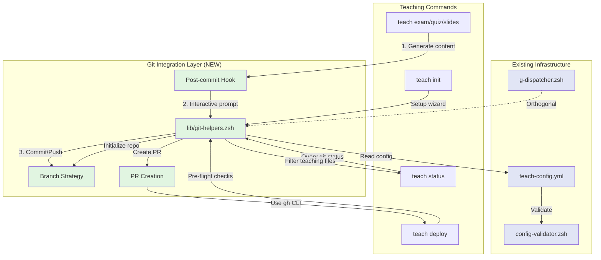
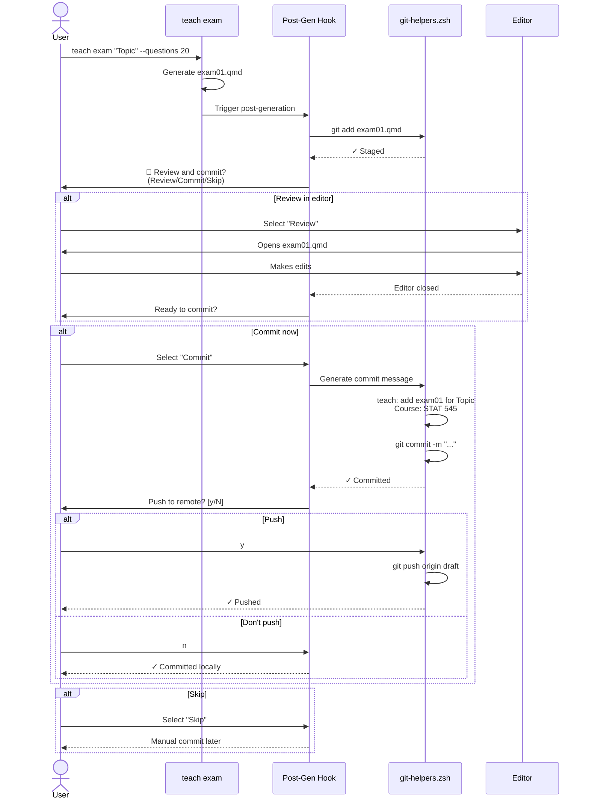

# Implementation Spec: Teaching + Git Integration Enhancement

**Status:** draft
**Created:** 2026-01-16
**From Brainstorm:** BRAINSTORM-teaching-git-integration-2026-01-16.md (project root)
**Target Release:** v5.11.0
**Effort Estimate:** 11-16 hours (5 phases)
**Priority:** High
**Worktree:** `~/.git-worktrees/flow-cli/teaching-git-integration`
**Branch:** `feature/teaching-git-integration`

---

## Overview

Enhance flow-cli's teaching dispatcher with seamless git integration featuring smart automation, safety checks, and PR-based deployment workflows. Transform the teaching content creation experience from manual git operations to a streamlined "generate → review → commit → deploy" flow that preserves user control while eliminating friction.

**Key Value Proposition:** Reduce 5 manual git steps per content generation to 0, while maintaining safety through interactive confirmations. Enable git novices and empower experts.

---

## Primary User Story

**As a course instructor creating teaching materials,**
**I want** teaching commands to handle git operations intelligently with interactive prompts,
**So that** I can focus on content creation without manual commit/push context switching,
**And** my course repository maintains a clean PR-based workflow for production deployments.

**Acceptance Criteria:**
1. After generating content (teach exam/quiz/slides), I can review and commit in < 30 seconds via interactive prompt
2. teach deploy creates a PR from draft → production branch (never direct push)
3. teach status shows uncommitted teaching files and offers to commit/stash them
4. Teaching mode can be enabled for auto-commit (opt-in, with push confirmations)
5. teach init sets up git structure (draft/main branches) automatically

---

## Secondary User Stories

### User Story 2: Git Novice Onboarding

**As a git novice starting my first course repository,**
**I want** teach init to set up branching structure automatically,
**So that** I don't need to learn git commands to have a professional workflow.

**Acceptance Criteria:**
- teach init offers git setup wizard (detect existing repo or create new)
- Creates draft/main branches with appropriate .gitignore
- Optionally creates GitHub repo via gh CLI
- Initial commit with course structure

### User Story 3: Collaborative Course Development

**As a TA collaborating on a shared course repository,**
**I want** conflict detection before deployment,
**So that** I don't accidentally overwrite my instructor's changes.

**Acceptance Criteria:**
- teach deploy checks if production branch has new commits
- If conflicts detected, prompts to rebase before creating PR
- Shows clear instructions for resolving conflicts
- PR workflow enables code review before production

---

## Technical Requirements

### Architecture

#### Component Diagram



#### Data Flow: Post-Generation Workflow



---

### API Design

#### New Module: lib/git-helpers.zsh

| Function | Parameters | Returns | Description |
|----------|-----------|---------|-------------|
| `_git_teaching_commit_message` | type, topic, course | string | Generate conventional commit message |
| `_git_is_clean` | - | 0/1 | Check if working tree is clean |
| `_git_is_synced` | - | 0/1 | Check if remote is up-to-date |
| `_git_teaching_files` | - | array | List uncommitted teaching files |
| `_git_create_deploy_pr` | title, body | 0/1 | Create PR via gh CLI |
| `_git_detect_conflicts` | - | 0/1 | Check if production has new commits |
| `_git_interactive_commit` | files | 0/1 | Prompt user for commit workflow |
| `_git_setup_teaching_repo` | draft_branch, prod_branch | 0/1 | Initialize repo with branches |

#### teach-config.yml Schema Updates

```yaml
# NEW: Git configuration section
git:
  draft_branch: draft           # Branch for content development
  production_branch: main       # Branch for site deployment
  auto_pr: true                 # Auto-create PR on teach deploy
  require_clean: true           # Abort if uncommitted changes

# NEW: Workflow configuration section
workflow:
  teaching_mode: false          # Enable streamlined workflow
  auto_commit: false            # Auto-commit after generation
  auto_push: false              # Auto-push commits (not recommended)
```

#### Command Enhancements

| Command | New Behavior | Flags |
|---------|-------------|-------|
| `teach exam/quiz/slides/...` | Interactive commit after generation | (existing flags preserved) |
| `teach status` | Show git status + cleanup prompts | `--git-only` - show only git info |
| `teach deploy` | Create PR, conflict detection | `--direct-push` - bypass PR (advanced) |
| `teach init` | Git setup wizard | `--no-git` - skip git setup |

---

### Data Models

#### Config Schema Additions

```json
{
  "$schema": "http://json-schema.org/draft-07/schema#",
  "properties": {
    "git": {
      "type": "object",
      "properties": {
        "draft_branch": {
          "type": "string",
          "default": "draft",
          "pattern": "^[a-zA-Z0-9_-]+$",
          "description": "Branch for content development"
        },
        "production_branch": {
          "type": "string",
          "default": "main",
          "pattern": "^[a-zA-Z0-9_-]+$",
          "description": "Branch for site deployment"
        },
        "auto_pr": {
          "type": "boolean",
          "default": true
        },
        "require_clean": {
          "type": "boolean",
          "default": true
        }
      }
    },
    "workflow": {
      "type": "object",
      "properties": {
        "teaching_mode": {
          "type": "boolean",
          "default": false
        },
        "auto_commit": {
          "type": "boolean",
          "default": false
        },
        "auto_push": {
          "type": "boolean",
          "default": false
        }
      }
    }
  }
}
```

#### Commit Message Template

```
teach: <action> <content-type> for <topic>

Generated via: teach <command> "<topic>" <flags>
Course: <course-name> (<semester> <year>)

<optional-details>

Co-Authored-By: Scholar <scholar@example.com>
```

**Examples:**

```
teach: add exam01 for Hypothesis Testing

Generated via: teach exam "Hypothesis Testing" --questions 20
Course: STAT 545 (Fall 2024)

Co-Authored-By: Scholar <scholar@example.com>
```

```
teach: update slides for Week 3

Generated via: teach slides "Regression Models" --theme academic
Course: STAT 440 (Spring 2025)

Modified existing slides to include new examples.

Co-Authored-By: Scholar <scholar@example.com>
```

---

### Dependencies

#### External Tools

| Tool | Version | Required | Purpose |
|------|---------|----------|---------|
| git | ≥ 2.25 | Yes | Version control |
| gh | ≥ 2.0 | Optional | PR creation (teach deploy) |
| fzf | Latest | No | Enhanced interactive prompts (future) |

#### Internal Dependencies

| Module | Dependency Type | Reason |
|--------|----------------|--------|
| `lib/config-validator.zsh` | Required | Validate git/workflow config |
| `lib/core.zsh` | Required | Logging, error handling |
| `lib/dispatchers/teach-dispatcher.zsh` | Modified | Add git integration hooks |
| `commands/teach-init.zsh` | Modified | Add git setup wizard |

---

## UI/UX Specifications

### User Flow: Post-Generation Commit

```
┌─────────────────────────────────────────────────────────────┐
│ teach exam "Hypothesis Testing" --questions 20              │
└─────────────────────────────────────────────────────────────┘
                          ↓
┌─────────────────────────────────────────────────────────────┐
│ ⏳ Generating exam with Scholar...                          │
│ [████████████████████                    ] 75%              │
└─────────────────────────────────────────────────────────────┘
                          ↓
┌─────────────────────────────────────────────────────────────┐
│ ✅ Generated: exams/exam01.qmd                              │
│                                                             │
│ 📝 Next steps:                                              │
│    1. Review content (opens in $EDITOR)                     │
│    2. Commit to git                                         │
│                                                             │
│ AskUserQuestion:                                            │
│   question: "Review and commit this content?"               │
│   header: "Next"                                            │
│   options:                                                  │
│     ○ Review in editor first (Recommended)                  │
│     ○ Commit now with auto-generated message                │
│     ○ Skip commit (I'll do it manually)                     │
└─────────────────────────────────────────────────────────────┘
                          ↓
                  [User selects option]
                          ↓
┌─────────────────────────────────────────────────────────────┐
│ If "Review in editor":                                      │
│   → Opens nvim exams/exam01.qmd (blocking)                  │
│   → After editor closes:                                    │
│     "Ready to commit? [Y/n]"                                │
│                                                             │
│ If "Commit now":                                            │
│   → Generates commit message                                │
│   → git commit -m "teach: add exam01 for Hypothesis..."    │
│   → "Push to remote? [y/N]"                                 │
│                                                             │
│ If "Skip":                                                  │
│   → "✓ File staged. Commit manually when ready."            │
└─────────────────────────────────────────────────────────────┘
```

### Wireframe: Enhanced teach status

```
┌─────────────────────────────────────────────────────────────┐
│ 📚 Teaching Project Status                                  │
├─────────────────────────────────────────────────────────────┤
│                                                             │
│ Course:    STAT 545 - Data Science                          │
│ Semester:  Fall 2024                                        │
│ Branch:    draft                                            │
│ Remote:    ✓ Up-to-date with origin/draft                   │
│ Mode:      🎓 Teaching mode enabled                          │
│                                                             │
├─────────────────────────────────────────────────────────────┤
│ 📊 Course Progress                                          │
├─────────────────────────────────────────────────────────────┤
│                                                             │
│ Current Week: 3 of 15                                       │
│ Next Class:   Jan 22, 2026 (2 days)                        │
│                                                             │
│ Content Status:                                             │
│   Lectures:     3/15 complete                               │
│   Assignments:  2/5 released                                │
│   Exams:        0/3 scheduled                               │
│                                                             │
├─────────────────────────────────────────────────────────────┤
│ 🔧 Git Status                                               │
├─────────────────────────────────────────────────────────────┤
│                                                             │
│ ⚠️  3 uncommitted changes (teaching content)                │
│                                                             │
│   M  exams/exam01.qmd                                       │
│   A  slides/week03-slides.qmd                               │
│   M  teach-config.yml                                       │
│                                                             │
│ AskUserQuestion:                                            │
│   question: "Clean up uncommitted changes?"                 │
│   header: "Action"                                          │
│   options:                                                  │
│     ○ Commit teaching files (Recommended)                   │
│     ○ Stash teaching files                                  │
│     ○ View diff first                                       │
│     ○ Leave as-is                                           │
│                                                             │
└─────────────────────────────────────────────────────────────┘
```

### ASCII Wireframe: teach deploy PR Flow

```
┌─────────────────────────────────────────────────────────────┐
│ teach deploy                                                │
└─────────────────────────────────────────────────────────────┘
                          ↓
┌─────────────────────────────────────────────────────────────┐
│ 🔍 Pre-flight Checks                                        │
├─────────────────────────────────────────────────────────────┤
│                                                             │
│ ✓ On draft branch (draft)                                  │
│ ✓ No uncommitted changes                                   │
│ ✓ Remote is up-to-date                                     │
│ ⚠️  Production (main) has 2 new commits                     │
│                                                             │
│ AskUserQuestion:                                            │
│   question: "Production branch has updates. Rebase first?"  │
│   header: "Conflict"                                        │
│   options:                                                  │
│     ○ Yes - Rebase draft onto main (Recommended)            │
│     ○ No - Continue anyway (may have conflicts)             │
│     ○ Cancel deployment                                     │
└─────────────────────────────────────────────────────────────┘
                          ↓
                  [User selects "Yes"]
                          ↓
┌─────────────────────────────────────────────────────────────┐
│ 🔄 Rebasing draft onto origin/main...                       │
│                                                             │
│ Fetching latest from origin...                             │
│ Applying 5 commits from draft...                           │
│ ✓ Rebase successful (no conflicts)                         │
└─────────────────────────────────────────────────────────────┘
                          ↓
┌─────────────────────────────────────────────────────────────┐
│ 🏗️  Building Site                                           │
├─────────────────────────────────────────────────────────────┤
│                                                             │
│ Running: quarto render                                      │
│ [████████████████████████████████████] 100%                 │
│                                                             │
│ ✓ Build successful                                          │
│ Output: _site/ (42 files)                                   │
└─────────────────────────────────────────────────────────────┘
                          ↓
┌─────────────────────────────────────────────────────────────┐
│ 📋 Creating Pull Request                                    │
├─────────────────────────────────────────────────────────────┤
│                                                             │
│ Title: Deploy: Week 3 Content Updates                       │
│                                                             │
│ Body:                                                       │
│   ## Changes                                                │
│   - Add exam01 for Hypothesis Testing                      │
│   - Add slides for Week 3 Regression Models                │
│   - Update syllabus schedule                                │
│                                                             │
│   ## Commits (5)                                            │
│   - teach: add exam01 for Hypothesis Testing               │
│   - teach: add slides for Regression Models                │
│   - teach: update syllabus with Week 3 dates               │
│   - fix: typo in assignment 2 instructions                 │
│   - docs: update office hours in contact page              │
│                                                             │
│   ## Build Status                                           │
│   ✓ Site builds successfully (42 files)                    │
│                                                             │
│   Generated via: teach deploy                               │
│                                                             │
│ AskUserQuestion:                                            │
│   question: "Create PR and push?"                           │
│   header: "Deploy"                                          │
│   options:                                                  │
│     ○ Yes - Create PR (Recommended)                         │
│     ○ Push to draft only (no PR)                            │
│     ○ Cancel                                                │
└─────────────────────────────────────────────────────────────┘
                          ↓
                  [User selects "Yes"]
                          ↓
┌─────────────────────────────────────────────────────────────┐
│ ✅ Pull Request Created                                     │
├─────────────────────────────────────────────────────────────┤
│                                                             │
│ PR #42: Deploy: Week 3 Content Updates                      │
│ https://github.com/user/stat545/pull/42                     │
│                                                             │
│ Status: ● Open                                              │
│ Labels: teaching, deploy                                    │
│ Reviewers: (none assigned)                                  │
│                                                             │
│ Next steps:                                                 │
│   1. Review PR on GitHub                                    │
│   2. Merge when ready                                       │
│   3. Site will auto-deploy after merge                      │
│                                                             │
└─────────────────────────────────────────────────────────────┘
```

### Accessibility Checklist

- [x] Interactive prompts use AskUserQuestion (keyboard accessible)
- [x] Clear option labels with descriptions
- [x] Status indicators use both emoji + text (not emoji-only)
- [x] Error messages include actionable next steps
- [x] Success messages confirm what was done
- [x] Color not sole indicator (uses ✓, ⚠️, ✗ symbols)
- [x] Verbose output available via --verbose flag

---

## Open Questions

1. **Should teaching mode be enabled by default in new projects?**
   - **Pro:** Best UX for most users, guides toward good practice
   - **Con:** Unexpected auto-commits might surprise users
   - **Current Recommendation:** Default off, prompt during teach init
   - **Decision needed:** User research with 5 instructors

2. **How to handle merge conflicts during teach deploy?**
   - **Option A:** Show git instructions, abort
   - **Option B:** Offer interactive conflict resolution
   - **Option C:** Auto-rebase, abort if conflicts
   - **Current Recommendation:** Option C (safest)
   - **Decision needed:** Test with real conflicts

3. **Should teach commands work in non-git repos?**
   - **Pro:** Lower barrier to entry, works everywhere
   - **Con:** Missing git benefits
   - **Current Recommendation:** Work without git, prompt to enable
   - **Decision needed:** None (implement as recommended)

4. **Co-authored-by tag for Scholar?**
   - **Pro:** Transparency, AI credit, accurate contribution history
   - **Con:** Extra line in commit messages
   - **Current Recommendation:** Yes, always include
   - **Decision needed:** None (implement as recommended)

---

## Review Checklist

### Design Review

- [x] All user stories have acceptance criteria
- [x] Architecture diagram shows component relationships
- [x] Data flow diagrams illustrate key workflows
- [x] API design is consistent with existing conventions
- [x] Config schema validated against JSON Schema spec
- [x] UI/UX wireframes for all interactive prompts

### Security Review

- [ ] Git operations never expose credentials
- [ ] teach commands validate branch names (prevent injection)
- [ ] PR creation uses gh CLI (audited tool)
- [ ] No auto-push without confirmation (prevent data loss)
- [ ] teach deploy requires clean state (prevent accidental commits)
- [ ] Config validation prevents malicious YAML

### Performance Review

- [ ] Git operations are non-blocking where possible
- [ ] teach status caches git status (< 100ms)
- [ ] PR creation is asynchronous (doesn't block terminal)
- [ ] teach deploy pre-flight checks are parallelized

### Testing Review

- [ ] Test suite covers all 5 phases
- [ ] Mock git operations in tests (no real repos)
- [ ] Test interactive prompts with canned responses
- [ ] Test conflict scenarios
- [ ] Test non-git repo behavior
- [ ] Test teaching mode on/off

### Documentation Review

- [ ] TEACHING-GIT-WORKFLOW.md guide created
- [ ] Tutorial 14 updated with git integration examples
- [ ] DISPATCHER-REFERENCE.md updated for teach commands
- [ ] Migration guide for v5.10.0 → v5.11.0 users
- [ ] FAQ section for common git issues
- [ ] Video walkthrough of PR workflow

### Accessibility Review

- [x] All interactive prompts use AskUserQuestion
- [x] Clear option labels with descriptions
- [x] Status symbols not emoji-only
- [x] Error messages actionable
- [ ] Tested with screen reader (manual test needed)

---

## Implementation Notes

### Critical Path

1. **Phase 1 (Quick Win)** must be completed first
   - Foundation for all other phases
   - Tests interactive commit workflow
   - Can ship independently

2. **Phase 2 (PR workflow)** depends on Phase 1
   - Uses git-helpers.zsh functions
   - Requires teach deploy to be stable

3. **Phase 3 (teach status)** is independent
   - Can be developed in parallel with Phase 1
   - No dependencies on other phases

4. **Phase 4 (teaching mode)** depends on Phases 1-3
   - Consolidates all git integration
   - Requires config validation

5. **Phase 5 (teach init)** depends on Phase 1
   - Uses git setup functions from Phase 1
   - Can be developed early

### Testing Strategy

**Unit Tests:**
- git-helpers.zsh: Test each function with mocked git
- config-validator.zsh: Test git/workflow schema validation
- teach-dispatcher.zsh: Test post-generation hooks

**Integration Tests:**
- Full workflow: teach exam → review → commit → push
- teach deploy: PR creation flow
- teach status: Git status display + cleanup

**Manual Tests:**
- Test with real course repository
- Test conflict scenarios (manual conflicts)
- Test with gh CLI authentication
- Test non-git repo behavior

### Migration Guide (v5.10.0 → v5.11.0)

**For existing users:**

1. **No breaking changes** - All v5.10.0 commands work unchanged

2. **Enable git integration** (optional):

   ```yaml
   # Add to teach-config.yml
   git:
     draft_branch: draft
     production_branch: main
     auto_pr: true
     require_clean: true
   ```

3. **Enable teaching mode** (optional):

   ```yaml
   # Add to teach-config.yml
   workflow:
     teaching_mode: true
     auto_commit: true
     auto_push: false  # Recommended: keep false
   ```

4. **Install gh CLI** (for teach deploy PR creation):

   ```bash
   brew install gh
   gh auth login
   ```

5. **Set up branches** (if not already):

   ```bash
   git branch draft
   git checkout draft
   ```

**Rollback plan:**
- Remove git/workflow sections from teach-config.yml
- Commands revert to v5.10.0 behavior (no git integration)
- No data loss (git operations are non-destructive)

---

## History

### 2026-01-16 - Initial Draft

- **Created by:** Claude Code (Deep Feature Brainstorm)
- **Reviewed by:** (pending)
- **Changes:** N/A - initial version

**From Brainstorm Findings:**
- 8 expert questions completed
- User preference: Generate → Review → Commit → Deploy
- All users want: Auto-commit, smart branches, conflict detection, PRs
- Teaching mode desired: Yes, with confirmations

**Next Steps:**
1. Review spec with flow-cli maintainer
2. Get approval for Phase 1 (Quick Win)
3. Create feature branch for implementation
4. Begin Phase 1 development (Smart post-generation workflow)

