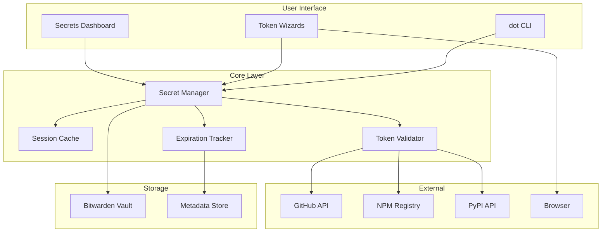

# SPEC: DOT Secret Management v2.0

**Status:** Draft
**Created:** 2026-01-10
**From Brainstorm:** Deep feature exploration session
**Author:** DT + Claude

---

## Overview

Comprehensive secret management for the DOT dispatcher, enabling full token lifecycle management (create, store, use, rotate, revoke) with expiration tracking, time-based caching, and integrations for GitHub, NPM, and PyPI tokens.

**Target Users:** Developers managing tokens for CI/CD, publishing, and API access
**Key Benefit:** Single command interface for all token operations with security best practices built-in

---

## Primary User Story

**As a** developer who regularly rotates tokens for security,
**I want to** manage my GitHub, NPM, and PyPI tokens from the command line,
**So that** I can create, store, use, and rotate tokens without manual Bitwarden app interaction.

### Acceptance Criteria

- [ ] Can create new tokens with guided wizard (`dot token github`)
- [ ] Can store arbitrary secrets (`dot secret add <name>`)
- [ ] Can retrieve secrets on-demand (`$(dot secret <name>)`)
- [ ] Can see expiration warnings (`dot secret check`)
- [ ] Can view all secrets with status (`dot secrets`)
- [ ] Can rotate expiring tokens (`dot token <name> --refresh`)
- [ ] Session auto-locks after 15 minutes of inactivity
- [ ] No secrets appear in shell history or logs

---

## Secondary User Stories

### Story 2: CI/CD Pipeline Developer

**As a** CI/CD pipeline developer,
**I want to** sync local secrets to GitHub repository secrets,
**So that** my workflows have access to the same tokens I use locally.

**Acceptance Criteria:**
- [ ] Can sync secrets to GitHub repo (`dot secrets sync github`)
- [ ] Sync is selective (choose which secrets)
- [ ] Existing secrets are updated, not duplicated

### Story 3: Project Maintainer

**As a** project maintainer with multiple packages,
**I want to** track which tokens expire when,
**So that** I don't have publishing failures due to expired tokens.

**Acceptance Criteria:**
- [ ] Dashboard shows all tokens with expiration dates
- [ ] Warnings appear for tokens expiring within 30 days
- [ ] Can filter by token type (github, npm, pypi)

---

## Architecture



### Component Responsibilities

| Component | Responsibility |
|-----------|----------------|
| **Secret Manager** | Core CRUD operations on secrets |
| **Session Cache** | 15-minute unlock window tracking |
| **Token Validator** | Verify token scopes/permissions with APIs |
| **Expiration Tracker** | Store and check expiry dates |
| **Token Wizards** | Guided creation flow per service |
| **Secrets Dashboard** | Aggregate view of all secrets |

---

## API Design

### New Commands

| Command | Description | Phase |
|---------|-------------|-------|
| `dot secret add <name>` | Store a secret with hidden input | 1 |
| `dot secret check` | Show expiring tokens | 1 |
| `dot secrets` | Dashboard of all secrets | 2 |
| `dot token github` | GitHub token creation wizard | 2 |
| `dot token npm` | NPM token creation wizard | 2 |
| `dot token pypi` | PyPI token creation wizard | 2 |
| `dot token <name> --refresh` | Rotate a token | 3 |
| `dot env init` | Generate .envrc for direnv | 3 |
| `dot secrets sync github` | Sync secrets to GitHub repo | 3 |

### Command Details

#### `dot secret add <name>`

```bash
# Usage
dot secret add <name> [--expires <days>] [--notes <text>]

# Examples
dot secret add github-token
dot secret add anthropic-key --expires 365
dot secret add npm-token --notes "automation token for CI"

# Flow
1. Prompt for secret value (hidden input, no echo)
2. Optional: prompt for expiration
3. Store in Bitwarden with metadata
4. Confirm storage
```

#### `dot token github`

```bash
# Usage
dot token github [--type classic|fine-grained] [--scopes <list>]

# Flow
1. Ask token type (classic vs fine-grained)
2. Show recommended scopes based on project type
3. Open browser to github.com/settings/tokens/new
4. Wait for user to paste token
5. Validate token against GitHub API
6. Store with expiration date
7. Show usage example
```

#### `dot secrets`

```bash
# Output
🔐 Secret Status
━━━━━━━━━━━━━━━━━━━━━━━━━━━━━━━━━━━━━━━━━

  Token              Type      Status      Expires
  ─────────────────────────────────────────────────
  github-token       github    ✓ Valid     in 45 days
  npm-token          npm       ⚠ Expiring  in 12 days
  pypi-flow-cli      pypi      ✓ Valid     in 180 days
  anthropic-key      api       ✓ Valid     never

  Vault: 🔓 Unlocked (12 min remaining)

  ⚠ 1 token expiring soon. Run: dot token npm --refresh
```

---

## Data Models

### Secret Metadata Schema

Stored alongside secret in Bitwarden notes field:

```json
{
  "dot_version": "2.0",
  "type": "github|npm|pypi|api|custom",
  "created": "2026-01-10T12:00:00Z",
  "expires": "2026-04-10T12:00:00Z",
  "scopes": ["repo", "workflow"],
  "project": "flow-cli",
  "notes": "user notes here"
}
```

### Session Cache

File-based cache at `~/.cache/dot/session`:

```
BW_SESSION_TOKEN=<encrypted>
UNLOCK_TIME=1704888000
IDLE_TIMEOUT=900
```

---

## Dependencies

| Dependency | Purpose | Required |
|------------|---------|----------|
| **bitwarden-cli (bw)** | Secret storage | Yes |
| **jq** | JSON parsing | Yes |
| **gh** | GitHub API validation | For GitHub tokens |
| **npm** | NPM token validation | For NPM tokens |
| **curl** | API calls | Yes |

---

## UI/UX Specifications

### User Flow: Create GitHub Token

```
┌─────────────────────────────────────────────────────────────┐
│ $ dot token github                                          │
├─────────────────────────────────────────────────────────────┤
│                                                             │
│ 🔐 GitHub Token Setup                                       │
│ ━━━━━━━━━━━━━━━━━━━━━━━━━━━━━━━━━━━━━━━━━                   │
│                                                             │
│ Token type:                                                 │
│   [1] Classic PAT (broad permissions)                       │
│   [2] Fine-grained PAT (recommended)                        │
│                                                             │
│ Select [1/2]: █                                             │
│                                                             │
└─────────────────────────────────────────────────────────────┘
          │
          ▼ (user selects 2)
┌─────────────────────────────────────────────────────────────┐
│ Recommended scopes for this project (flow-cli):             │
│   ✓ Contents (read/write) - push code                       │
│   ✓ Workflows - GitHub Actions                              │
│   ✓ Metadata (read) - basic repo info                       │
│                                                             │
│ Press Enter to open github.com...                           │
└─────────────────────────────────────────────────────────────┘
          │
          ▼ (browser opens)
┌─────────────────────────────────────────────────────────────┐
│ Paste your new token: ······································│
│                                                             │
│ Expiration (days, 0=never) [90]: █                          │
└─────────────────────────────────────────────────────────────┘
          │
          ▼
┌─────────────────────────────────────────────────────────────┐
│ ✓ Token validated (scopes: repo, workflow)                  │
│ ✓ Stored in Bitwarden as "github-token"                     │
│ ✓ Expires: 2026-04-10 (90 days)                             │
│                                                             │
│ 💡 Usage: GITHUB_TOKEN=$(dot secret github-token)           │
└─────────────────────────────────────────────────────────────┘
```

### Wireframe: Secrets Dashboard

```
┌─────────────────────────────────────────────────────────────┐
│ 🔐 Secret Status                                            │
│ ━━━━━━━━━━━━━━━━━━━━━━━━━━━━━━━━━━━━━━━━━                   │
│                                                             │
│   Token              Type      Status      Expires          │
│   ─────────────────────────────────────────────────         │
│   github-token       github    ✓ Valid     in 45 days       │
│   npm-token          npm       ⚠ Expiring  in 12 days       │
│   pypi-flow-cli      pypi      ✓ Valid     in 180 days      │
│   anthropic-key      api       ✓ Valid     never            │
│                                                             │
│   Vault: 🔓 Unlocked (12 min remaining)                     │
│                                                             │
│   ⚠ 1 token expiring soon                                   │
│   💡 Run: dot token npm --refresh                           │
│                                                             │
└─────────────────────────────────────────────────────────────┘
```

### Accessibility Checklist

- [ ] All output uses semantic colors (green=success, yellow=warning, red=error)
- [ ] Hidden input for secret entry (no terminal echo)
- [ ] Clear keyboard navigation for wizards
- [ ] Non-interactive mode available (`--non-interactive`)
- [ ] Screen reader friendly output (no ASCII art required)

---

## Security Considerations

### Must Have

- [ ] Secrets NEVER appear in shell history (`HISTIGNORE` patterns)
- [ ] Secrets NEVER logged to files
- [ ] Session auto-locks after 15 minutes idle
- [ ] Token validation before storage
- [ ] Bitwarden master password never stored

### Should Have

- [ ] Clipboard cleared after 30 seconds if used
- [ ] Warning if running in insecure terminal
- [ ] Audit log of secret access (opt-in)

### Won't Do

- [ ] Custom encryption layer (rely on Bitwarden)
- [ ] Syncing across machines (Bitwarden handles this)

---

## Open Questions

1. **Metadata storage**: Store expiry in Bitwarden notes field, or separate local DB?
   - *Leaning:* Bitwarden notes (portable, syncs)

2. **Multi-account support**: What if user has personal + work GitHub?
   - *Idea:* `dot token github --profile work`

3. **Token validation frequency**: Validate on every access or just creation?
   - *Leaning:* Creation + expiry check, not every access

4. **Browser automation**: Use `open` command or AppleScript for reliability?
   - *Decision:* AppleScript for macOS (more reliable)

---

## Review Checklist

- [ ] Security review: No secrets in logs/history
- [ ] UX review: Wizard flows are intuitive
- [ ] Integration test: Full lifecycle works end-to-end
- [ ] Documentation: All commands documented
- [ ] Backward compatibility: Existing `dot secret` commands still work

---

## Implementation Notes

### Phase 1 Priority

1. `dot secret add` - Foundation for all storage
2. Session cache with 15-min timeout
3. `dot secret check` - Expiration awareness

### Key Technical Decisions

- **Session tracking**: File-based at `~/.cache/dot/session` with timestamp
- **Idle detection**: Check file mtime on each `dot` command
- **Metadata format**: JSON in Bitwarden notes field (portable)
- **Browser opening**: AppleScript on macOS, `xdg-open` on Linux

### Testing Strategy

- Unit tests: Mock Bitwarden CLI responses
- Integration tests: Real Bitwarden with test vault
- E2E tests: Full wizard flows (interactive dogfooding)

---

## History

| Date | Change | Author |
|------|--------|--------|
| 2026-01-10 | Initial spec from deep brainstorm | DT + Claude |

---

## Related Documents

- [DOT-DISPATCHER-REFERENCE.md](../../reference/MASTER-DISPATCHER-GUIDE.md#dot-dispatcher) - Current implementation
- [DOT Dispatcher Tutorial](../../tutorials/12-dot-dispatcher.md) - Usage guide

