# Tutorial 20: Teaching Dates Automation

**Learn to centralize and sync semester dates across all course materials**

**Level:** Intermediate
**Time:** 15-20 minutes
**Prerequisites:** [Tutorial 14: Teach Dispatcher](14-teach-dispatcher.md)

---

## What You'll Learn

By the end of this tutorial, you'll know how to:

- ✅ Initialize centralized date configuration
- ✅ Define semester dates, deadlines, and exams
- ✅ Preview date changes before applying
- ✅ Sync dates across all course files automatically
- ✅ Check date consistency status
- ✅ Handle semester rollover efficiently

---

## Workflow Overview

```mermaid
flowchart TD
    Start([Start: Semester Planning]) --> Init[teach dates init]
    Init --> Config[Edit teach-config.yml<br/>Add deadlines & exams]
    Config --> Preview[teach dates sync --dry-run]
    Preview --> Review{Changes<br/>look good?}
    Review -->|No| Config
    Review -->|Yes| Sync[teach dates sync]
    Sync --> Confirm{Apply to<br/>each file?}
    Confirm -->|Yes| Apply[✓ Apply changes]
    Confirm -->|Skip| Skip[Skip file]
    Confirm -->|Diff| Diff[Show differences]
    Diff --> Confirm
    Apply --> Status[teach dates status]
    Skip --> Status
    Status --> Done([✅ All dates synchronized])

    style Init fill:#a6e3a1
    style Preview fill:#89b4fa
    style Sync fill:#f9e2af
    style Status fill:#a6e3a1
    style Done fill:#a6e3a1
```



---

## Step 1: Why Centralize Dates?

### The Problem

Teaching a course means managing dates in dozens of files:

```
❌ syllabus.qmd:        "Homework 1 due Jan 22"
❌ assignments/hw1.qmd:  due: "2025-01-20"  # ← Mismatch!
❌ schedule.qmd:        "Week 2: January 22, 2025"
❌ lectures/week02.qmd: "Due: Jan 22, 2025"
```

**Issues:**
- 📅 40+ dates to update manually each semester
- ⚠️ Date inconsistencies between files
- 🕐 2+ hours for semester rollover
- 🐛 Students see conflicting deadlines

### The Solution

**One source of truth** in `teach-config.yml`:

```yaml
semester_info:
  start_date: "2025-01-13"
  deadlines:
    hw1:
      week: 2
      offset_days: 2  # Friday of Week 2 = Jan 22
```

Run `teach dates sync` and all files update automatically! ⚡

---

## Step 2: Prerequisites Check

Before starting, verify you have the required tools:

```bash
# Check yq (YAML processor)
yq --version
# Required: v4.0 or higher

# Check flow-cli version
flow --version
# Required: v5.12.0 or higher

# Test teach dates command
teach dates help
```

**If missing:**

```bash
# Install yq
brew install yq

# Install GNU date (macOS only)
brew install coreutils
```

!!! tip "Why yq?"
    yq is a powerful YAML processor that safely reads and updates structured data without corrupting your config files.

---

## Step 3: Initialize Date Configuration

Navigate to your teaching repository and initialize the date system:

```bash
# Navigate to course directory
cd ~/projects/teaching/stat-545

# Initialize dates
teach dates init
```

**The wizard will ask:**

```
Semester start date (YYYY-MM-DD): 2025-01-13
```

**What happens:**

1. ✅ Creates `.flow/teach-config.yml` (if doesn't exist)
2. ✅ Adds `semester_info` section
3. ✅ Generates 15 weeks with auto-calculated start dates
4. ✅ Sets `start_date` and `end_date`
5. ✅ Creates empty sections for `holidays`, `deadlines`, `exams`

**Verify it worked:**

```bash
cat .flow/teach-config.yml
```

**Expected output:**

```yaml
semester_info:
  start_date: "2025-01-13"
  end_date: "2025-04-28"
  weeks:
    - number: 1
      start_date: "2025-01-13"
      topic: ""
    - number: 2
      start_date: "2025-01-20"
      topic: ""
    # ... 15 total weeks
  holidays: []
  deadlines: {}
  exams: []
```

**Demo:**


The `teach dates init` wizard walks you through setting up your semester configuration interactively.

!!! success "Checkpoint"
    You now have a centralized date configuration! Next, we'll add deadlines and exams.

---

## Step 4: Understanding Config Structure

The `semester_info` section has 5 key parts:

### 1. Semester Boundaries

```yaml
semester_info:
  start_date: "2025-01-13"
  end_date: "2025-04-28"
```

- `start_date`: First day of classes
- `end_date`: Last day of classes (auto-calculated: start + 15 weeks)

### 2. Weekly Schedule

```yaml
  weeks:
    - number: 1
      start_date: "2025-01-13"
      topic: "Introduction to R"
    - number: 2
      start_date: "2025-01-20"
      topic: "Data Visualization"
```

- Auto-generated for 15 weeks
- You can add `topic` for each week
- Used for relative date calculations

### 3. Holidays

```yaml
  holidays:
    - name: "Spring Break"
      date: "2025-03-10"
```

- Optional section
- Helps explain schedule gaps
- Not synced to files (informational only)

### 4. Deadlines

```yaml
  deadlines:
    hw1:
      week: 2
      offset_days: 2  # Friday of Week 2
    midterm_project:
      date: "2025-03-05"  # Absolute date
```

**Two ways to specify:**
- **Relative:** `week` + `offset_days` (flexible, adjusts automatically)
- **Absolute:** `date` (fixed date, useful for finals)

### 5. Exams

```yaml
  exams:
    - name: "Midterm Exam"
      date: "2025-03-07"
      time: "14:00-15:50"
    - name: "Final Exam"
      date: "2025-05-02"
      time: "10:00-12:00"
```

---

## Step 5: Add Deadlines and Exams

Let's add some real deadlines and exams. Open your config:

```bash
vim .flow/teach-config.yml
# Or: code .flow/teach-config.yml
# Or: open -a "iA Writer" .flow/teach-config.yml
```

**Add these sections:**

```yaml
semester_info:
  start_date: "2025-01-13"
  end_date: "2025-04-28"

  weeks:
    - number: 1
      start_date: "2025-01-13"
      topic: "Introduction to R"
    - number: 2
      start_date: "2025-01-20"
      topic: "Data Visualization"
    # ... (keep all 15 weeks)

  holidays:
    - name: "Spring Break"
      date: "2025-03-10"

  deadlines:
    hw1:
      week: 2
      offset_days: 2  # Due Friday of Week 2
    hw2:
      week: 4
      offset_days: 2
    midterm_project:
      week: 8
      offset_days: 5  # Sunday of Week 8
    final_project:
      date: "2025-05-05"  # Fixed finals week date

  exams:
    - name: "Midterm Exam"
      date: "2025-03-07"
      time: "14:00-15:50"
    - name: "Final Exam"
      date: "2025-05-02"
      time: "10:00-12:00"
```

**Save the file.**

!!! tip "Relative vs Absolute Dates"
    - Use **relative** (`week` + `offset_days`) for regular assignments - they auto-adjust if semester dates change
    - Use **absolute** (`date`) for finals or events tied to university calendar

**Validate your config:**

```bash
teach dates validate
```

**Expected output:**

```
✅ Config Validation Passed
✓ Valid YAML syntax
✓ All required fields present
✓ All dates in valid format (YYYY-MM-DD)
✓ Week numbers sequential (1-15)
✓ Deadline references valid weeks
```

---

## Step 6: Preview Changes (Dry Run)

Before applying changes, let's preview what would change:

```bash
teach dates sync --dry-run
```

**Example output:**

```
🔍 Scanning for teaching files...
✓ Found 25 files

📊 Analyzing dates...

⚠️  Date Mismatches Found

1. assignments/hw1.qmd (1 mismatch)
   Line 5: due: 2025-01-20 → 2025-01-22

2. syllabus.qmd (3 mismatches)
   Line 42: "Homework 1 due Jan 20" → "Homework 1 due Jan 22"
   Line 48: "Homework 2 due Feb 5" → "Homework 2 due Feb 7"
   Line 67: "Midterm: March 5" → "Midterm: March 7"

3. schedule.md (2 mismatches)
   Line 15: Week 2: January 20, 2025 → Week 2: January 22, 2025
   Line 29: Week 4: February 5, 2025 → Week 4: February 7, 2025

DRY RUN MODE - No changes applied
Run without --dry-run to apply changes
```

**Demo:**


The `teach dates sync --dry-run` command previews all changes before applying them, showing exactly which files and dates will be updated.

!!! warning "Check Before Applying"
    The dry-run shows exactly what will change. Review carefully!

    - ✅ Changes look correct? Proceed to Step 7
    - ❌ Unexpected changes? Review your `teach-config.yml`

---

## Step 7: Apply Changes Interactively

Now let's apply the changes. The command will ask for confirmation on each file:

```bash
teach dates sync
```

**Interactive prompts:**

```
🔍 Scanning for teaching files...
✓ Found 25 files

📊 Analyzing dates...

⚠️  Date Mismatches Found

━━━━━━━━━━━━━━━━━━━━━━━━━━━━━━━━━━━━━━━━━━━━━━━━━━━━
File: assignments/hw1.qmd (1 mismatch)
━━━━━━━━━━━━━━━━━━━━━━━━━━━━━━━━━━━━━━━━━━━━━━━━━━━━

Line 5: due: 2025-01-20 → 2025-01-22

Apply changes to this file? [y/n/d/q]
  y = yes, apply
  n = no, skip
  d = diff, show full changes
  q = quit
```

**Choose your action:**

- `y` - Apply changes to this file
- `n` - Skip this file (leave unchanged)
- `d` - Show full diff before deciding
- `q` - Quit (no more changes)

**After choosing 'y' for all files:**

```
✅ Date Sync Complete

Applied changes to 3 files:
  ✓ assignments/hw1.qmd
  ✓ syllabus.qmd
  ✓ schedule.md

Skipped: 0 files
```

**Demo:**


The interactive sync mode prompts you to review and approve each change before applying it.

!!! success "Changes Applied"
    All dates are now consistent across your course! 🎉

### Force Mode (Skip Prompts)

If you're confident and want to apply all changes without prompts:

```bash
teach dates sync --force
```

!!! warning "Use Force Carefully"
    Force mode applies all changes without asking. Only use if you've reviewed the dry-run output.

---

## Step 8: Check Status

Verify everything is synchronized:

```bash
teach dates status
```

**Expected output:**

```
📊 Date Configuration Status

Config: .flow/teach-config.yml
Last validated: 2 minutes ago ✓

Semester: Spring 2025
  Start: 2025-01-13
  End:   2025-04-28

Deadlines: 4
  ✓ hw1: Week 2 + 2 days (2025-01-22)
  ✓ hw2: Week 4 + 2 days (2025-02-07)
  ✓ midterm_project: Week 8 + 5 days (2025-03-09)
  ✓ final_project: 2025-05-05

Exams: 2
  ✓ Midterm Exam: 2025-03-07 14:00-15:50
  ✓ Final Exam: 2025-05-02 10:00-12:00

✅ All dates synchronized

Files checked: 25
Mismatches: 0
```

!!! tip "Run status anytime"
    Run `teach dates status` after editing files manually to catch any inconsistencies.

---

## Step 9: Next Steps & Advanced Usage

Congratulations! You've mastered teaching dates automation. 🎓

### What You Learned

- ✅ Initialize centralized date config with `teach dates init`
- ✅ Define deadlines using relative (`week` + `offset`) or absolute (`date`) formats
- ✅ Preview changes safely with `--dry-run`
- ✅ Apply changes interactively or with `--force`
- ✅ Verify consistency with `teach dates status`

### Advanced Techniques

#### 1. Selective Sync

Sync only specific file types:

```bash
# Only assignments
teach dates sync --assignments

# Only lectures
teach dates sync --lectures

# Only syllabus
teach dates sync --syllabus

# Single file
teach dates sync --file syllabus.qmd
```

#### 2. Verbose Mode

See detailed processing:

```bash
teach dates sync --verbose
```

Shows:
- Which files are being scanned
- Date extraction details
- Replacement logic

#### 3. Semester Rollover

When starting a new semester:

```bash
# Step 1: Update start date
vim .flow/teach-config.yml
# Change start_date: "2025-08-25"

# Step 2: Preview all changes
teach dates sync --dry-run

# Step 3: Apply (5 minutes vs 2 hours manual!)
teach dates sync --force
```

#### 4. Complex Date Patterns

Handle multiple date formats:

```yaml
deadlines:
  hw1:
    week: 2
    offset_days: 2
    display_format: "MMMM d, yyyy"  # January 22, 2025

  midterm:
    date: "2025-03-07"
    time: "14:00-15:50"
    location: "Room 301"
```

### Troubleshooting

**Problem:** `teach dates sync` finds no files

```bash
# Check you're in the course root
pwd
# Should show: ~/projects/teaching/stat-545

# Check for teaching files
find . -name "*.qmd" -o -name "*.md" | head
```

**Problem:** Dates not updating in file

```bash
# Check file uses recognized date patterns
teach dates sync --file syllabus.qmd --verbose

# Supported patterns:
# - YAML: due: "2025-01-22"
# - Inline: "due Jan 22, 2025"
# - Inline: "January 22, 2025"
```

**Problem:** Config validation fails

```bash
# Check YAML syntax
yq eval .flow/teach-config.yml

# Common issues:
# - Missing quotes around dates
# - Invalid week numbers (must be 1-15)
# - Deadline references non-existent week
```

### Related Documentation

- **[Teaching Dates Guide](../guides/TEACHING-DATES-GUIDE.md)** - Complete 1,885-line guide with all features
- **[Date Parser API Reference](../reference/MASTER-API-REFERENCE.md#teaching-libraries)** - Technical details
- **[Teach Config Schema](../reference/MASTER-API-REFERENCE.md#config-validation)** - Full YAML schema
- **[Quick Reference Card](../reference/MASTER-API-REFERENCE.md#teaching-libraries)** - Command cheat sheet

### What's Next?

**Continue learning:**
- **[Tutorial 19: Teaching Git Integration](19-teaching-git-integration.md)** - Auto-commit teaching content
- **[Tutorial 14: Teach Dispatcher](14-teach-dispatcher.md)** - Core teaching commands

**Ready to use it:**
- Add all your course deadlines to `teach-config.yml`
- Run `teach dates sync --force` for semester rollover
- Use `teach dates status` to verify before publishing

---

## Summary

**Commands learned:**

| Command | Purpose |
|---------|---------|
| `teach dates init` | Initialize date configuration |
| `teach dates sync --dry-run` | Preview changes |
| `teach dates sync` | Apply changes interactively |
| `teach dates sync --force` | Apply all changes without prompts |
| `teach dates status` | Check date consistency |
| `teach dates validate` | Validate config syntax |

**Key concepts:**

- ✅ **Centralized dates** - One source of truth in `teach-config.yml`
- ✅ **Relative dates** - `week` + `offset_days` auto-adjust
- ✅ **Absolute dates** - Fixed dates for finals/exams
- ✅ **Safety first** - Always `--dry-run` before applying
- ✅ **Semester rollover** - 2 hours → 5 minutes

**Impact:**
- 📅 40+ dates synchronized automatically
- ⏱️ 95% time savings on semester rollover
- ✅ Zero date inconsistencies
- 🎯 Students see correct deadlines everywhere

---

**Questions or issues?** Open an issue on [GitHub](https://github.com/Data-Wise/flow-cli/issues)

**Last Updated:** 2026-01-17
**Version:** v5.12.0
