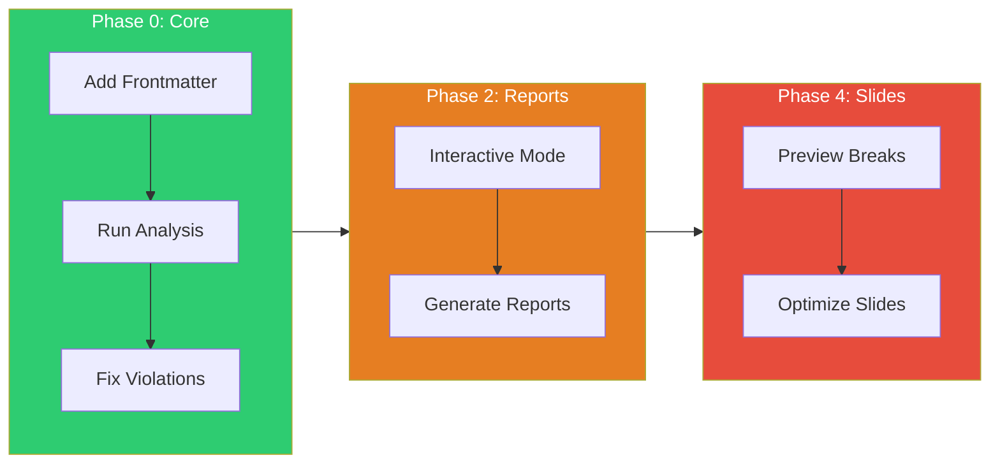

# Tutorial: Intelligent Content Analysis

> **What you'll learn:** Validate lecture prerequisites, detect concept gaps, and generate optimized slides using `teach analyze`
>
> **Time:** ~15 minutes | **Level:** Beginner → Intermediate
> **Version:** v5.16.0

---

## Prerequisites

Before starting, you should:

- [ ] Have a Quarto course website with `.qmd` lecture files
- [ ] Have `yq` and `jq` installed (`brew install yq jq`)
- [ ] Optionally have Claude CLI for AI analysis

**Verify your setup:**

```bash
# Check dependencies
teach doctor

# Check you're in a course directory
ls lectures/*.qmd
```

---

## What You'll Learn

By the end of this tutorial, you will:

1. Add concept metadata to lecture frontmatter
2. Run prerequisite validation across your course
3. Read and understand the concept graph
4. Fix prerequisite violations
5. Use interactive mode for guided analysis
6. Generate analysis reports
7. Preview slide break suggestions
8. Generate optimized slides with key concept callouts

---

## Learning Path



---

## Step 1: Introduction

The `teach analyze` command helps you ensure students learn concepts in the right order. It works by:

1. **Extracting concepts** from lecture YAML frontmatter
2. **Building a concept graph** showing what each week introduces and requires
3. **Validating prerequisites** — catching cases where you use a concept before teaching it
4. **Optimizing slides** — detecting where content is too dense for one slide

**The problem it solves:** Without this tool, you might accidentally reference "regression" in Week 3 before teaching it in Week 5 — confusing students.

---

## Step 2: Add Concepts to Frontmatter

Each lecture file needs a `concepts:` block in its YAML frontmatter. This tells the system what concepts are taught and what prior knowledge is assumed.

**Edit your lecture file** (e.g., `lectures/week-03-correlation.qmd`):

```yaml
---
title: "Week 3: Correlation and Covariance"
week: 3
concepts:
  introduces:
    - correlation
    - covariance
    - scatter-plots
  requires:
    - mean
    - variance
---
```

**Naming conventions:**
- Use lowercase, hyphenated names: `chi-squared` not `Chi Squared`
- Be specific: `simple-regression` not just `regression`
- Match names exactly across files (they're identifiers, not display labels)

**Tip:** Start with your later weeks — they have the most prerequisites and will reveal gaps first.

---

## Step 3: Run Basic Analysis

Now run the analysis on a single file:

```bash
teach analyze lectures/week-03-correlation.qmd
```

**Expected output:**

```
┌─────────────────────────────────────────────────────────────┐
│  CONCEPT ANALYSIS: week-03-correlation.qmd                   │
╰─────────────────────────────────────────────────────────────╯

📊 CONCEPT COVERAGE
┌────────────────────────────────────────────────────┐
│ Introduces: correlation, covariance, scatter-plots │
│ Requires:   mean, variance                         │
├────────────────────────────────────────────────────┤
│ PREREQUISITES                                      │
│ ✓ mean (Week 1)                                    │
│ ✓ variance (Week 1)                                │
├────────────────────────────────────────────────────┤
│ Phase: 0 (concept-validated)                       │
╰────────────────────────────────────────────────────╯
```

**What to look for:**
- Green checkmarks (✓) mean prerequisites are satisfied
- Red crosses (✗) mean a concept is used before being taught
- Yellow warnings mean a concept is used the same week it's taught

---

## Step 4: Understand the Concept Graph

After running analysis, check the generated concept graph:

```bash
# View the concept graph
cat .teach/concepts.json | jq '.'
```

**The concept graph maps:**
- Which week introduces each concept
- Which file teaches each concept
- The dependency chain between concepts

```json
{
  "mean": {"week": 1, "file": "lectures/week-01-basics.qmd"},
  "variance": {"week": 1, "file": "lectures/week-01-basics.qmd"},
  "correlation": {"week": 3, "file": "lectures/week-03-correlation.qmd"}
}
```

**Run analysis on your full course** to build the complete graph:

```bash
teach analyze
```

This scans all `.qmd` files in `lectures/` and validates cross-file prerequisites.

---

## Step 5: Fix Prerequisite Violations

If analysis finds violations, you'll see:

```
✗ regression (required in Week 3, introduced in Week 5)
  → Move regression introduction to Week 1-2, or
  → Remove from Week 3 requirements
```

**Common fixes:**

| Violation | Fix |
|-----------|-----|
| Concept used before taught | Reorder lectures or add prerequisite lecture |
| Missing concept entirely | Add to an earlier week's `introduces:` |
| Circular dependency | Restructure to break the cycle |
| Same-week dependency | Usually OK — mark as warning with `--mode relaxed` |

**Strictness modes:**

```bash
# Relaxed: only show errors, not warnings
teach analyze --mode relaxed lectures/week-05.qmd

# Strict: treat warnings as errors
teach analyze --mode strict lectures/week-05.qmd
```

---

## Step 6: Interactive Mode

For a guided walkthrough, use interactive mode:

```bash
teach analyze --interactive
```

**This walks you through:**

```
Select analysis scope:
  1) Single file
  2) Single week
  3) Full course

> 3

Select strictness mode:
  1) Relaxed (errors only)
  2) Moderate (errors + warnings)
  3) Strict (all issues)

> 2
```

Then it shows results and offers to step through each violation:

```
Found 2 issues. Review each? (y/n)

[1/2] regression used in Week 3 but taught in Week 5
  [y] Apply fix  [n] Skip  [s] Skip all  [q] Quit
```

**Best for:** First-time analysis of a new course, or when you have many violations to triage.

---

## Step 7: Generate Reports

Generate a persistent report for documentation or CI:

```bash
# Markdown report
teach analyze --report analysis-report.md

# JSON report (for CI/automation)
teach analyze --report results.json --format json
```

**Markdown report includes:**
- Summary statistics (concepts, weeks, violations)
- Violations table with locations and severity
- Concept graph visualization
- Week-by-week breakdown
- Recommendations for fixes

**Use in CI:**

```bash
# Block deploys on errors
teach analyze --report /dev/null --format json | jq '.error_count'
# Returns 0 if no errors
```

---

## Step 8: Preview Slide Breaks

Before making slides, check where content is too dense:

```bash
teach analyze --slide-breaks lectures/week-05-regression.qmd
```

**Output shows suggested breaks:**

```
SLIDE OPTIMIZATION
  Suggested breaks: 3

  Section            Priority  Reason
  Regression Intro   high      312 words (>300 threshold)
  Model Diagnostics  medium    4 code chunks (>3 threshold)
  Assumptions        low       Dense text, no code

  Key concepts: regression-coefficient, residuals, r-squared
  Estimated time: 28 min
```

**For detailed preview:**

```bash
teach analyze --preview-breaks lectures/week-05-regression.qmd
```

This shows each suggested break with:
- Exact location (heading and line)
- How many sub-slides are suggested
- Content density metrics

---

## Step 9: Generate Optimized Slides

Now use the slides integration for end-to-end generation:

```bash
# See key concepts for callout boxes
teach slides --optimize --key-concepts lectures/week-05-regression.qmd
```

**Output:**

```
🔑 Key Concepts for Callout Boxes:
─────────────────────────────────────
  • regression-coefficient (concept_graph)
  • residuals (definition)
  • r-squared (emphasis)

  3 concept(s) identified
  ⏱️  Estimated presentation time: 28 min
```

**Generate slides with optimizations applied:**

```bash
teach slides --optimize --apply-suggestions lectures/week-05-regression.qmd
```

**Full workflow with callouts:**

```bash
teach slides --optimize --key-concepts --apply-suggestions lectures/week-05-regression.qmd
```

This generates `slides/week-05-regression_slides.qmd` with:
- Slides split at suggested break points
- Callout boxes for key concepts
- Balanced content density per slide

---

## Step 10: Next Steps

You've learned the core `teach analyze` workflow. Here's what to explore next:

### AI-Powered Analysis (Phase 3)

```bash
# Get Claude-powered pedagogical insights
teach analyze --ai lectures/week-05-regression.qmd

# Check AI usage costs
teach analyze --costs
```

AI analysis provides:
- Learning objective alignment scoring
- Difficulty level assessment
- Pedagogical improvement suggestions
- Missing scaffolding detection

### Course-Wide Validation

```bash
# Validate before deployment
teach deploy --check-prereqs

# Deep validation (all layers)
teach validate --deep
```

### Automation

```bash
# Add to pre-commit hook
teach validate --concepts

# Use with teach status
teach status  # Shows concept coverage in dashboard
```

---

## Quick Reference

| Task | Command |
|------|---------|
| Basic analysis | `teach analyze lectures/week-05.qmd` |
| Full course | `teach analyze` |
| Interactive | `teach analyze --interactive` |
| Report | `teach analyze --report report.md` |
| Slide breaks | `teach analyze --slide-breaks lectures/week-05.qmd` |
| Key concepts | `teach slides --optimize --key-concepts lectures/week-05.qmd` |
| Optimized slides | `teach slides --optimize --apply-suggestions lectures/week-05.qmd` |
| AI insights | `teach analyze --ai lectures/week-05.qmd` |
| Deploy check | `teach deploy --check-prereqs` |

---

## Troubleshooting

| Problem | Solution |
|---------|----------|
| "yq not installed" | `brew install yq` |
| "jq not installed" | `brew install jq` |
| "No .qmd files found" | Run from course root (where `lectures/` exists) |
| "File not found" | Check path — did you mean `lectures/week-05.qmd`? |
| Empty concept graph | Add `concepts:` to at least 2 lecture files |
| All prerequisites missing | Start with Week 1 — it needs no `requires:` |

---

## Related

- [Intelligent Content Analysis Guide](../guides/INTELLIGENT-CONTENT-ANALYSIS.md) — Complete user guide
- [API Reference](../reference/MASTER-API-REFERENCE.md#teaching-libraries) — Function documentation
- [Architecture](../reference/MASTER-ARCHITECTURE.md#component-design) — System design with diagrams
- [Quick Reference Card](../reference/MASTER-API-REFERENCE.md#teaching-libraries) — One-page cheat sheet
