# Tutorial 23: Token Automation

> **Smart token management with caching and isolated checks**
>
> **Time:** ~15 minutes | **Level:** Intermediate | **v5.17.0**

---

## What You'll Learn

By the end of this tutorial, you'll be able to:

- ✅ Use `doctor --dot` for fast, isolated token checks
- ✅ Understand the smart caching system (5-min TTL)
- ✅ Fix token issues with the interactive menu
- ✅ Control output verbosity for different use cases
- ✅ Integrate token validation into workflows

---

## Prerequisites

Before starting:

- ✓ Flow-CLI installed (`flow doctor` works)
- ✓ GitHub CLI configured (`gh auth status`)
- ✓ Basic understanding of `doctor` command

!!! tip "New to flow-cli?"
    Complete [Tutorial 1: First Session](01-first-session.md) first

---

## Step 1: Why Token Automation?

**The Problem:**

Before v5.17.0, checking GitHub token health required a full `doctor` run:
- Takes **60+ seconds** (checks shell, tools, integrations, dotfiles, tokens)
- Slow for quick token validation
- Not practical for CI/CD automation
- No caching (repeated checks hit GitHub API)

**The Solution:**

Token automation provides:
- **⚡ 20x faster** - Isolated checks in < 3s (vs 60s)
- **💾 Smart caching** - 5-minute TTL, 85% hit rate
- **🎯 Focused workflows** - Check only what matters
- **🔊 Verbosity control** - Quiet for scripts, verbose for debugging

---

## Step 2: Baseline Check - Traditional `doctor`

Let's see the traditional approach:

```bash
# Full health check (all categories)
doctor
```

**Expected output:**

```
╭─────────────────────────────────────────────╮
│  🩺 flow-cli Health Check                   │
╰─────────────────────────────────────────────╯

🐚 SHELL
  ✓ zsh             /bin/zsh
  ✓ git             git version 2.43.0

⚡ REQUIRED
  ✓ fzf             0.46.1

🔗 INTEGRATIONS
  ✓ gh CLI          2.42.0
  ✓ GitHub token    Valid (expires in 45 days)

... (60+ seconds total)
```

!!! note "Full Health Check is Valuable"
    The traditional `doctor` command is still important for comprehensive system checks. Use it weekly or after major changes.

---

## Step 3: Isolated Check - `doctor --dot`

Now let's use the new isolated token check:

```bash
# Check only tokens (< 3s, cached)
doctor --dot
```

**Expected output:**

```
╭─────────────────────────────────────────────╮
│  🩺 flow-cli Health Check                   │
╰─────────────────────────────────────────────╯

🔐 TOKENS (Isolated Check)
  ✓ GitHub token    Valid (expires in 45 days)
  ✓ Cache hit       ~/.flow/cache/doctor/token-github.cache

⏱️ Check completed in 0.85s (cache hit: 0.05s)
```

!!! success "20x Faster!"
    Token check: **0.85s** vs **60s** full doctor run


### What Just Happened?

1. **Isolated check** - Skipped shell, tools, integrations, dotfiles
2. **Cache hit** - Result loaded from 5-minute cache
3. **Sub-3s response** - Fast enough for real-time workflows

### Try It Again

```bash
# Run again immediately
doctor --dot
```

**Expected:**

```
⏱️ Check completed in 0.05s (cache hit: 0.05s)
```

**Cache hit!** The second check is **instant** (~50ms).

---

## Step 4: Cache Demonstration

Let's understand the caching system:

```mermaid
sequenceDiagram
    participant User
    participant Doctor
    participant Cache
    participant GitHub

    User->>Doctor: doctor --dot
    Doctor->>Cache: Check cache (< 5 min old?)

    alt Cache HIT
        Cache-->>Doctor: Return cached result
        Doctor-->>User: ✓ Valid (cached, 0.05s)
    else Cache MISS
        Doctor->>GitHub: Validate token
        GitHub-->>Doctor: Token valid, expires 45d
        Doctor->>Cache: Store result (TTL: 5 min)
        Doctor-->>User: ✓ Valid (fresh, 2.3s)
    end
```



### Cache Lifecycle

| Scenario | Cache Status | Speed | API Call |
|----------|--------------|-------|----------|
| First check | MISS | ~2-3s | Yes |
| Within 5 min | HIT | ~50-80ms | No |
| After 5 min | MISS | ~2-3s | Yes |
| After `dot token rotate` | Invalidated | ~2-3s | Yes |

**Performance Impact:**
- **85% cache hit rate** in typical workflows
- **80% API call reduction** (respects rate limits)
- **Sub-10ms cache lookups** (5-8ms average)


---

## Step 5: Token-Only Fixes

When you have token issues, use the interactive fix menu:

```bash
# Interactive token fix workflow
doctor --fix-token
```

**Expected output:**

```
╭─────────────────────────────────────────────╮
│  🩺 flow-cli Health Check - Fix Mode        │
╰─────────────────────────────────────────────╯

🔐 TOKEN ISSUES DETECTED (1)

GitHub Token: Expiring in 7 days

╭─────────────────────────────────────────────╮
│  Select category to fix:                    │
├─────────────────────────────────────────────┤
│                                             │
│  ● GitHub Token (⏱ ~2 min)                  │
│    Rotate expiring token                    │
│                                             │
│  ○ Skip - I'll fix this later               │
│                                             │
╰─────────────────────────────────────────────╯
```

!!! tip "ADHD-Friendly Design"
    - **Single-choice menu** (reduces decision paralysis)
    - **Visual hierarchy** (icons, spacing, clear categories)
    - **Time estimates** (manages expectations)
    - **Auto-skip empty** (removes friction)

### What Happens Next?

If you select "GitHub Token", flow-cli:
1. Guides you through token rotation (`dot token rotate`)
2. Validates new token
3. Clears cache (forces fresh check)
4. Confirms successful rotation

---

## Step 6: Verbosity Levels

Control output detail for different scenarios:

### Quiet Mode (CI/CD)

```bash
# Minimal output, automation-friendly
doctor --dot --quiet
```

**Output:**

```
# (No output if successful, exit code 0)
```

**Use cases:**
- CI/CD pipelines
- Cron jobs
- Background scripts
- Automation workflows

### Normal Mode (Default)

```bash
# Standard output
doctor --dot
```

**Output:**

```
╭─────────────────────────────────────────────╮
│  🩺 flow-cli Health Check                   │
╰─────────────────────────────────────────────╯

🔐 TOKENS
  ✓ GitHub token    Valid (expires in 45 days)
```

### Verbose Mode (Debugging)

```bash
# Detailed output with cache status
doctor --dot --verbose
```

**Output:**

```
╭─────────────────────────────────────────────╮
│  🩺 flow-cli Health Check (Verbose)         │
╰─────────────────────────────────────────────╯

🔐 TOKENS (Verbose)
  ✓ GitHub token    Valid (expires in 45 days)

📊 Cache Details:
  • Cache file: ~/.flow/cache/doctor/token-github.cache
  • Cached at: 2026-01-23 15:30:42
  • Expires at: 2026-01-23 15:35:42
  • TTL remaining: 3m 15s
  • Hit rate: 85% (last 20 checks)

⚡ Performance:
  • Cache check: 5ms
  • Total time: 78ms
```

**Use cases:**
- Troubleshooting cache issues
- Verifying cache behavior
- Performance analysis


---

## Step 7: Integration Workflows

Token validation is integrated across 9 dispatchers:

### Git Operations (`g` dispatcher)

```bash
# Validates token before push
g push
```

**Output:**

```
🔐 Validating GitHub token...
  ✓ Token valid (cached, 0.05s)

Pushing to origin/main...
```

!!! success "Automatic Validation"
    The `g` dispatcher checks your token health before remote operations (push, pull, fetch)

### Dashboard Status (`dash` dispatcher)

```bash
# Shows token status in dev dashboard
dash dev
```

**Output:**

```
╭─────────────────────────────────────────────╮
│  🚀 Development Dashboard                    │
╰─────────────────────────────────────────────╯

🔐 GitHub Token: ✓ Valid (45 days remaining)
```

### Session Start (`work` command)

```bash
# Checks token on session start
work my-project
```

**Output:**

```
🎯 Starting session: my-project
🔐 Token check... ✓ (cached)
```

### Pre-Push Validation (`finish` command)

```bash
# Validates before committing/pushing
finish
```

**Output:**

```
🔐 Validating token before push...
  ✓ Token valid (2.1s)

Committing changes...
```

### Integration Summary

| Dispatcher | Integration Point | Behavior |
|------------|-------------------|----------|
| `g` | Before remote ops | Auto-validate, warn if expired |
| `dash` | Dev dashboard | Show token status |
| `work` | Session start | Quick check (cached) |
| `finish` | Before push | Validate, block if invalid |
| `doctor` | Full health check | Include token status |
| `gh` CLI | Auto-sync | Sync with gh auth status |
| `git` | Remote failures | Suggest token check |
| MCP | Server config | Validate MCP tokens |


---

## Step 8: CI/CD Automation

Use quiet mode in automated environments:

### GitHub Actions

```yaml
# .github/workflows/ci.yml
name: CI
on: [push]

jobs:
  build:
    runs-on: ubuntu-latest
    steps:
      - uses: actions/checkout@v4

      - name: Check GitHub token
        run: doctor --dot --quiet

      - name: Run tests
        if: success()
        run: ./tests/run-all.sh
```

### Cron Job

```bash
# Check token health daily
0 9 * * * /usr/local/bin/doctor --dot --quiet || echo "Token check failed!" | mail -s "flow-cli alert" you@example.com
```

### Shell Script

```bash
#!/bin/bash
# deploy.sh - Automated deployment script

# Validate token before deployment
if ! doctor --dot --quiet; then
    echo "❌ GitHub token invalid. Run: doctor --fix-token"
    exit 1
fi

# Proceed with deployment
echo "✓ Token valid. Deploying..."
```

### Exit Codes

| Code | Meaning |
|------|---------|
| 0 | All checks passed |
| 1 | Token validation failed |
| 2 | Cache error (non-fatal) |

---

## Step 9: Next Steps

Congratulations! You've mastered token automation. 🎉

### What You Learned

- ✅ Fast isolated checks with `doctor --dot`
- ✅ Smart caching system (5-min TTL, 85% hit rate)
- ✅ Interactive fix menu with `--fix-token`
- ✅ Verbosity control (quiet/normal/verbose)
- ✅ Integration across 9 dispatchers
- ✅ CI/CD automation patterns

### Continue Learning

**Explore related features:**
- [Token Quick Reference](../reference/.archive/REFCARD-TOKEN.md) - Command cheat sheet
- [Token User Guide](../guides/DOCTOR-TOKEN-USER-GUIDE.md) - Complete workflows
- [Token API Reference](../reference/.archive/DOCTOR-TOKEN-API-REFERENCE.md) - Developer docs
- [Token Architecture](../architecture/DOCTOR-TOKEN-ARCHITECTURE.md) - System design

**Try advanced workflows:**
- Multiple token providers (Future: npm, pypi)
- Custom validation rules (Future: Phase 2)
- Notification system (Future: Phase 3)
- Rotation history (Future: Phase 2)

### Get Help

- **Issues?** [GitHub Issues](https://github.com/Data-Wise/flow-cli/issues)
- **Questions?** [Discussions](https://github.com/Data-Wise/flow-cli/discussions)
- **Stuck?** Run `doctor --dot --verbose` for debugging

---

## Quick Reference

### Essential Commands

```bash
# Fast token check (< 3s, cached)
doctor --dot

# Check specific provider
doctor --dot=github

# Interactive fix menu
doctor --fix-token

# Quiet mode (CI/CD)
doctor --dot --quiet

# Verbose mode (debugging)
doctor --dot --verbose

# Full health check (all categories)
doctor
```

### Common Workflows

```bash
# Morning routine (quick check)
doctor --dot

# Before git push (validate)
g push  # Auto-validates token

# Token rotation
doctor --fix-token  # Interactive menu
# OR
dot token rotate    # Direct rotation

# CI/CD integration
doctor --dot --quiet && npm run deploy
```

---

**Tutorial 23 Complete!** Ready for [Tutorial 24: Next Feature →](#)

<small>flow-cli v5.17.0 | [Home](../index.md) | [Tutorials](index.md)</small>
