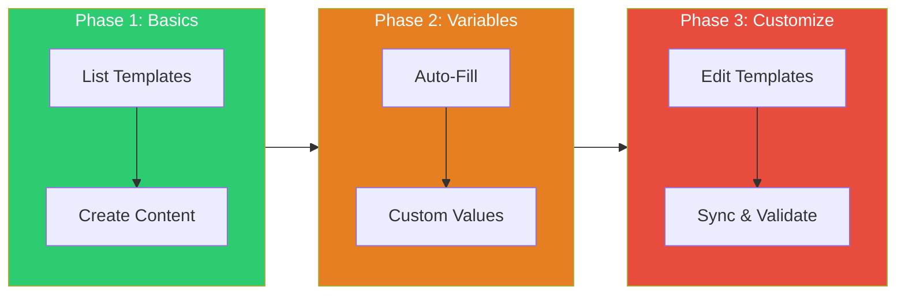

# Tutorial: Template Management

> **What you'll learn:** Create and manage teaching content templates with `teach templates`
>
> **Time:** ~15 minutes | **Level:** Beginner → Intermediate
> **Version:** v5.20.0

---

## Prerequisites

Before starting, you should:

- [ ] Have an initialized course (`teach init`)
- [ ] Have flow-cli v5.20.0+ installed

**Verify your setup:**

```bash
# Check version
flow --version  # Should show 5.20.0+

# Check you're in a course directory
ls .flow/teach-config.yml
```

---

## What You'll Learn

By the end of this tutorial, you will:

1. List available templates
2. Create content from templates
3. Use variable substitution
4. Customize project templates
5. Sync templates from plugin defaults
6. Validate template syntax

---

## Learning Path



---

## Step 1: Understanding Templates

Templates are reusable starting points for course content. They save time by:

1. **Pre-filling** common structure (YAML frontmatter, sections)
2. **Auto-substituting** variables like `{{WEEK}}` and `{{TOPIC}}`
3. **Ensuring consistency** across lectures, labs, and assignments

**Template types:**

| Type | Directory | Purpose |
|------|-----------|---------|
| `content` | `.flow/templates/content/` | .qmd starters |
| `prompts` | `.flow/templates/prompts/` | AI generation prompts |
| `metadata` | `.flow/templates/metadata/` | _metadata.yml files |
| `checklists` | `.flow/templates/checklists/` | QA checklists |

---

## Step 2: List Available Templates

See what templates are available:

```bash
# List all templates
teach templates

# Or use the full command
teach templates list
```

**Example output:**

```
╭─────────────────────────────────────────────────────────────╮
│ AVAILABLE TEMPLATES                                         │
├─────────────────────────────────────────────────────────────┤
│ CONTENT (.flow/templates/content/)                          │
│   lecture.qmd     v1.0  Standard lecture template       [P] │
│   lab.qmd         v1.0  R lab exercise template         [P] │
│   slides.qmd      v1.0  RevealJS slides template            │
│   assignment.qmd  v1.0  Homework assignment                 │
│                                                             │
│ PROMPTS (.flow/templates/prompts/)                          │
│   generate-exam.md    v1.0  Scholar exam generation         │
│   enhance-lecture.md  v1.0  Scholar lecture enhancement     │
│                                                             │
│ Legend: [P] = Project override exists                       │
╰─────────────────────────────────────────────────────────────╯
```

**Filter by type:**

```bash
# Only content templates
teach templates list --type content

# Only project templates (your overrides)
teach templates list --source project

# Only plugin defaults
teach templates list --source plugin
```

---

## Step 3: Create Content from Template

Use `teach templates new` to create files:

```bash
# Create a lecture for week 5
teach templates new lecture week-05

# Create a lab for week 3
teach templates new lab week-03

# Create slides
teach templates new slides week-05
```

**What happens:**

1. Template is copied to destination
2. Variables are substituted (see next step)
3. File is ready to edit

**Example:**

```bash
$ teach templates new lecture week-05

✓ Created: lectures/week-05.qmd
  From: .flow/templates/content/lecture.qmd
  Variables filled:
    {{WEEK}} → 05
    {{DATE}} → 2026-01-28
    {{COURSE}} → STAT-545
```

---

## Step 4: Variable Substitution

Templates use `{{VARIABLE}}` syntax. Variables are auto-filled from:

| Variable | Source | Example |
|----------|--------|---------|
| `{{WEEK}}` | CLI argument | `05` |
| `{{TOPIC}}` | CLI argument or prompt | `Linear Regression` |
| `{{COURSE}}` | teach-config.yml | `STAT-545` |
| `{{DATE}}` | Auto-generated | `2026-01-28` |
| `{{INSTRUCTOR}}` | teach-config.yml | `Dr. Smith` |
| `{{SEMESTER}}` | teach-config.yml | `Spring 2026` |

**Specify topic explicitly:**

```bash
# Pass topic as argument
teach templates new lecture week-05 --topic "Linear Regression"

# Or be prompted
teach templates new lecture week-05
# → Enter topic (or press Enter to skip): Linear Regression
```

**Example template content:**

```yaml
---
title: "Week {{WEEK}}: {{TOPIC}}"
course: "{{COURSE}}"
date: "{{DATE}}"
instructor: "{{INSTRUCTOR}}"
---

# Learning Objectives

By the end of this lecture, students will be able to:

1. [First objective for {{TOPIC}}]
2. [Second objective]
```

---

## Step 5: Customize Project Templates

Override plugin defaults with project-specific templates.

**Resolution order:**

1. **Project** (`.flow/templates/`) - highest priority
2. **Plugin** (`lib/templates/teaching/`) - fallback

**To customize a template:**

```bash
# 1. Copy plugin template to project
cp ~/.flow-cli/lib/templates/teaching/content/lecture.qmd \
   .flow/templates/content/lecture.qmd

# 2. Edit your copy
edit .flow/templates/content/lecture.qmd

# 3. Your version is now used for all new lectures
teach templates new lecture week-06  # Uses YOUR template
```

**Verify override:**

```bash
teach templates list
# Look for [P] marker indicating project override
```

---

## Step 6: Sync Templates

Update your project templates from plugin defaults:

```bash
# Preview what would change
teach templates sync --dry-run

# Apply updates
teach templates sync
```

**Example output:**

```
╭─────────────────────────────────────────────────────────────╮
│ TEMPLATE SYNC                                               │
├─────────────────────────────────────────────────────────────┤
│ Checking for updates...                                     │
│                                                             │
│ Updates available:                                          │
│   lecture.qmd: v1.0 → v1.1 (new sections added)            │
│   slides.qmd: v1.0 → v1.2 (RevealJS 5 support)             │
│                                                             │
│ No changes:                                                 │
│   lab.qmd: v1.0 (up to date)                               │
│                                                             │
│ Skipped (project override):                                 │
│   assignment.qmd: [P] won't overwrite your customizations   │
╰─────────────────────────────────────────────────────────────╯
```

**Force sync (overwrite project templates):**

```bash
teach templates sync --force
```

---

## Step 7: Validate Templates

Check template syntax and metadata:

```bash
# Validate all templates
teach templates validate

# Validate specific template
teach templates validate lecture.qmd
```

**What's checked:**

- YAML frontmatter is valid
- Required metadata present (template_version, template_type)
- Variables use correct syntax (`{{VARIABLE}}`)
- No undefined variables

**Example output:**

```
✓ lecture.qmd - Valid
✓ lab.qmd - Valid
✗ slides.qmd - Invalid
    Line 15: Unknown variable {{WEEK_NUM}} (did you mean {{WEEK}}?)
```

---

## Step 8: Initialize Course with Templates

When creating a new course:

```bash
# Create course with full template structure
teach init "STAT 545" --with-templates
```

**Creates:**

```
.flow/
├── teach-config.yml
├── templates/
│   ├── content/
│   │   ├── lecture.qmd
│   │   ├── lab.qmd
│   │   └── slides.qmd
│   ├── prompts/
│   │   └── generate-exam.md
│   ├── metadata/
│   │   └── _metadata.yml
│   └── checklists/
│       └── pre-publish.md
```

---

## Quick Reference

| Command | Description |
|---------|-------------|
| `teach templates` | List all templates |
| `teach templates list --type content` | Filter by type |
| `teach templates new lecture week-05` | Create from template |
| `teach templates new lab week-03 --topic "ANOVA"` | With topic |
| `teach templates sync --dry-run` | Preview sync |
| `teach templates validate` | Check syntax |
| `teach tmpl` | Shortcut |

---

## Common Patterns

### Weekly Content Creation

```bash
# Create all materials for week 5
teach templates new lecture week-05 --topic "Hypothesis Testing"
teach templates new lab week-05 --topic "t-tests in R"
teach templates new slides week-05
```

### Template Customization Workflow

```bash
# 1. Copy default
cp ~/.flow-cli/lib/templates/teaching/content/lecture.qmd \
   .flow/templates/content/lecture.qmd

# 2. Edit
edit .flow/templates/content/lecture.qmd

# 3. Validate
teach templates validate

# 4. Use
teach templates new lecture week-06
```

---

## Troubleshooting

### "Template not found"

```bash
# Check template exists
teach templates list

# Check path
ls .flow/templates/content/
```

### Variables not substituted

```bash
# Check variable syntax (must be {{VAR}} not ${VAR})
grep '{{' .flow/templates/content/lecture.qmd

# Validate template
teach templates validate lecture.qmd
```

### Sync not updating

```bash
# Force sync (overwrites project templates)
teach templates sync --force
```

---

## Next Steps

- **Customize templates** for your teaching style
- **Create prompts** for Scholar integration
- **Add checklists** for content QA
- See [REFCARD-TEMPLATES.md](../reference/REFCARD-TEMPLATES.md) for quick reference

---

**Version:** v5.20.0
**Last Updated:** 2026-01-28
