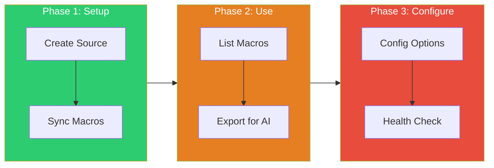

# Tutorial: LaTeX Macro Management

> **What you'll learn:** Configure LaTeX macros for consistent AI-generated notation with `teach macros`
>
> **Time:** ~15 minutes | **Level:** Beginner → Intermediate
> **Version:** v5.21.0

---

## Prerequisites

Before starting, you should:

- [ ] Have an initialized course (`teach init`)
- [ ] Have flow-cli v5.21.0+ installed
- [ ] Have a macro source file (we'll create one if needed)

**Verify your setup:**

```bash
# Check version
flow --version  # Should show 5.21.0+

# Check you're in a course directory
ls .flow/teach-config.yml
```

---

## What You'll Learn

By the end of this tutorial, you will:

1. Understand why macro management matters
2. Create a macro source file
3. Sync macros from source files
4. List and filter macros
5. Export macros for Scholar integration
6. Configure macro settings

---

## Learning Path



---

## Why Macro Management Matters

When you use `teach exam` or `teach quiz` to generate content via Scholar, the AI needs to know your notation preferences.

**Without macros:**
```latex
E[Y] = \mu        % Generic notation
Var(X) = \sigma^2
```

**With macros:**
```latex
\E{Y} = \mu       % Your course notation
\Var{X} = \sigma^2
```

Macro management ensures **consistent notation** across all AI-generated content.

---

## Step 1: Create a Macro Source File

Create a `_macros.qmd` file in your course root:

```bash
# Create the macros file
cat > _macros.qmd << 'EOF'
---
# LaTeX Macros for Course
# Included via: 
---

```{=tex}
% Operators
\newcommand{\E}{\mathbb{E}}
\newcommand{\Var}{\operatorname{Var}}
\newcommand{\Cov}{\operatorname{Cov}}
\newcommand{\Corr}{\operatorname{Corr}}

% Distributions
\newcommand{\Normal}{\mathcal{N}}
\newcommand{\Binomial}{\operatorname{Bin}}

% Symbols
\newcommand{\indep}{\perp\!\!\!\perp}
\newcommand{\iid}{\stackrel{\text{iid}}{\sim}}

% Matrices (bold)
\newcommand{\bX}{\mathbf{X}}
\newcommand{\bY}{\mathbf{Y}}
\newcommand{\bbeta}{\boldsymbol{\beta}}
```
EOF
```

**Alternative: LaTeX format** (`macros.tex`):

```latex
% macros.tex
\newcommand{\E}{\mathbb{E}}
\newcommand{\Var}{\operatorname{Var}}
\DeclareMathOperator{\Cov}{Cov}
```

---

## Step 2: Sync Macros from Source

Extract macros from your source file:

```bash
# Sync macros
teach macros sync

# Preview without changes
teach macros sync --dry-run
```

**Expected output:**

```
Syncing macros from _macros.qmd...

Found 12 macros:
  + \E, \Var, \Cov, \Corr           (4 operators)
  + \Normal, \Binomial              (2 distributions)
  + \indep, \iid                    (2 symbols)
  + \bX, \bY, \bbeta, \bepsilon     (4 matrices)

Updated .flow/macros/cache.yml
Done in 0.23s
```

---

## Step 3: List Your Macros

View all synced macros:

```bash
# List all macros
teach macros list
```

**Output:**

```
LaTeX Macros (12 available)

OPERATORS
  \E             → \mathbb{E}           Expectation
  \Var           → \operatorname{Var}   Variance
  \Cov           → \operatorname{Cov}   Covariance
  \Corr          → \operatorname{Corr}  Correlation

DISTRIBUTIONS
  \Normal        → \mathcal{N}          Normal distribution
  \Binomial      → \operatorname{Bin}   Binomial distribution

SYMBOLS
  \indep         → \perp\!\!\!\perp     Independence
  \iid           → \stackrel{iid}{\sim} IID notation

MATRICES
  \bX            → \mathbf{X}           Bold X matrix
  \bY            → \mathbf{Y}           Bold Y vector
  \bbeta         → \boldsymbol{\beta}   Bold beta

Source: _macros.qmd (synced just now)
```

**Filter by category:**

```bash
# Only operators
teach macros list --category operators

# JSON output
teach macros list --json
```

---

## Step 4: Export for Scholar Integration

Export macros so Scholar can use them when generating content:

```bash
# Export as JSON (default)
teach macros export

# Export to file
teach macros export --format json > .flow/macros.json

# Different formats available
teach macros export --format mathjax  # For web
teach macros export --format latex    # For .tex files
teach macros export --format qmd      # For Quarto
```

**JSON output example:**

```json
{
  "macros": [
    {"name": "E", "expansion": "\\mathbb{E}", "category": "operators"},
    {"name": "Var", "expansion": "\\operatorname{Var}", "category": "operators"}
  ],
  "source": "_macros.qmd",
  "synced": "2026-01-28T16:30:00Z"
}
```

---

## Step 5: Configure Macro Settings

Edit `.flow/teach-config.yml` to customize macro behavior:

```yaml
scholar:
  latex_macros:
    enabled: true

    # Source files (searched in order)
    sources:
      - path: "_macros.qmd"
        format: "qmd"
      - path: "includes/mathjax-macros.html"
        format: "mathjax"

    # Auto-discover common locations
    auto_discover: true

    # Validation warnings
    validation:
      warn_undefined: true   # Warn if macro used but not defined
      warn_unused: true      # Warn if defined but never used
      warn_conflicts: true   # Warn if same macro defined differently

    # Export settings
    export:
      format: "json"
      include_in_prompts: true  # Include in Scholar context
```

**Key settings:**

| Setting | Purpose |
|---------|---------|
| `sources` | List of macro source files |
| `auto_discover` | Scan common locations automatically |
| `warn_undefined` | Alert when using undefined macros |
| `include_in_prompts` | Send macros to Scholar |

---

## Step 6: Check Macro Health

The `teach doctor` command now includes macro health checks:

```bash
teach doctor
```

**Macros section output:**

```
MACROS
  Source file     ✓ _macros.qmd exists
  Config sync     ✓ .flow/macros/cache.yml up to date
  Macro count     ✓ 12 macros defined
  CLAUDE.md       ⚠ Macro section not found
                    Consider adding to CLAUDE.md for AI context
```

---

## Workflow Integration

### With Scholar Content Generation

When macros are configured, Scholar commands use your notation:

```bash
# Generate exam with your macros
teach exam "Hypothesis Testing"

# The generated content uses \E{Y} not E[Y]
```

### Include in Quarto Documents

Add to your `.qmd` files:

```markdown


The expected value $\E{Y}$ equals...
```

---

## Common Patterns

### Statistics Course Macros

```latex
% Operators
\newcommand{\E}{\mathbb{E}}
\newcommand{\Var}{\operatorname{Var}}
\newcommand{\Cov}{\operatorname{Cov}}
\newcommand{\Corr}{\operatorname{Corr}}
\newcommand{\SE}{\operatorname{SE}}

% Distributions
\newcommand{\Normal}{\mathcal{N}}
\newcommand{\Binomial}{\operatorname{Bin}}
\newcommand{\Poisson}{\operatorname{Pois}}

% Estimators
\newcommand{\bhat}{\hat{\boldsymbol{\beta}}}
\newcommand{\yhat}{\hat{y}}

% Independence
\newcommand{\indep}{\perp\!\!\!\perp}
\newcommand{\iid}{\stackrel{\text{iid}}{\sim}}
```

### Linear Algebra Macros

```latex
% Matrices
\newcommand{\bA}{\mathbf{A}}
\newcommand{\bX}{\mathbf{X}}
\newcommand{\bI}{\mathbf{I}}

% Vectors
\newcommand{\bx}{\mathbf{x}}
\newcommand{\by}{\mathbf{y}}

% Operations
\newcommand{\tr}{\operatorname{tr}}
\newcommand{\rank}{\operatorname{rank}}
```

---

## Troubleshooting

| Issue | Cause | Solution |
|-------|-------|----------|
| `No macros found` | Source file missing | Create `_macros.qmd` |
| `Sync failed` | Invalid format | Check `{=tex}` block syntax |
| `Scholar ignores macros` | Export not run | Run `teach macros export` |
| `Wrong notation in output` | Cache stale | Run `teach macros sync` |

---

## Summary

You've learned to:

1. ✅ Create macro source files (QMD, LaTeX, MathJax)
2. ✅ Sync macros with `teach macros sync`
3. ✅ List and filter macros
4. ✅ Export for Scholar integration
5. ✅ Configure macro settings
6. ✅ Check macro health with `teach doctor`

---

## Next Steps

- [ ] Add your course-specific macros
- [ ] Run `teach exam` to see macros in action
- [ ] Add macro reference to your CLAUDE.md
- [ ] Explore: [REFCARD-MACROS.md](../reference/REFCARD-MACROS.md)

---

## See Also

- [teach macros command](../commands/teach.md#teach-macros-v5210)
- [REFCARD-MACROS.md](../reference/REFCARD-MACROS.md)
- [teach doctor](../commands/teach.md#teach-doctor)
- [Tutorial 24: Template Management](24-template-management.md)
- [Scholar Wrappers Guide](../guides/SCHOLAR-WRAPPERS-GUIDE.md) - How macros integrate with AI content generation
- [Config Schema Reference](../reference/TEACH-CONFIG-SCHEMA.md) - `scholar.latex_macros` configuration
