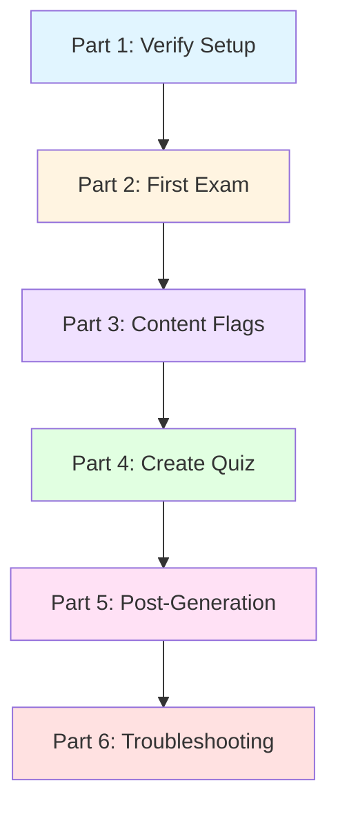

# Tutorial 29: Create Your First Exam

> **What you'll learn:** Generate exams and quizzes using Scholar AI wrappers with flow-cli
>
> **Time:** ~20 minutes | **Level:** Beginner → Intermediate
> **Version:** v6.1.0+

---

## Prerequisites

Before starting, you should have:

- [ ] Initialized course (`teach init` completed)
- [ ] Valid `teach-config.yml` with course metadata
- [ ] Scholar plugin configured and available
- [ ] (Optional) Lesson plans created for enhanced generation

**Verify your setup:**

```bash
# Check Scholar plugin is available
teach doctor

# Should show:
# ✓ Scholar plugin found
# ✓ teach-config.yml valid

# Verify you're in a course directory
ls .flow/teach-config.yml

# Check your config has required fields
teach config --view
```

**Minimum Required Config:**

```yaml
course:
  name: 'STAT-101'
  full_name: 'Introduction to Statistics'
  semester: 'Fall'
  year: 2026
```

---

## What You'll Learn

By the end of this tutorial, you will:

1. Generate a midterm exam with `teach exam`
2. Create a quiz with `teach quiz`
3. Customize content with style presets and flags
4. Use lesson plans to auto-populate exam topics
5. Understand the post-generation workflow
6. Troubleshoot common errors

---

## Learning Path



---

## Part 1: Verify Your Setup

### Step 1.1: Check Scholar Plugin

The Scholar plugin is required for all AI content generation:

```bash
teach doctor
```

**Expected output:**

```
✓ Scholar plugin found
✓ teach-config.yml valid
✓ Configuration schema valid
```

**If Scholar is missing:**

```
❌ Error: Scholar plugin not available
```

**Solution:** Install the Scholar plugin from the Claude Code plugin marketplace. See [Troubleshooting](#scholar-plugin-not-found) for details.

### Step 1.2: Verify Configuration

Check that your `teach-config.yml` has the required fields:

```bash
teach config --view
```

**Required fields for exam generation:**

```yaml
course:
  name: 'STAT-101'              # Used in exam header
  full_name: 'Introduction...'  # Full course title
  semester: 'Fall'              # Current semester
  year: 2026                    # Academic year
```

**Optional fields (enhance output):**

```yaml
scholar:
  grading:
    midterm: 20                 # Weight in exam header
    final_exam: 30
  latex_macros:
    enabled: true               # Consistent math notation
    sources:
      - path: "_macros.qmd"
        format: "qmd"
```

---

## Part 2: Generate Your First Exam

### Step 2.1: Basic Exam Generation

Let's create a basic 5-question exam on hypothesis testing:

```bash
teach exam "Hypothesis Testing"
```

**What happens:**

1. **Parser extracts topic** - "Hypothesis Testing"
2. **Config resolution** - Loads `teach-config.yml` course metadata
3. **Prompt injection** - Auto-injects course-specific prompts (if configured)
4. **Macro injection** - Auto-injects LaTeX macros (if enabled)
5. **Scholar invocation** - Sends request to Claude API
6. **File generation** - Creates `exams/exam-hypothesis-testing-2026-02-02.qmd`
7. **Post-generation hooks** - Auto-stages file, updates `.STATUS`

**Expected output:**

```
🔄 Generating exam questions for "Hypothesis Testing"...
✓ Generation complete
✓ Created: exams/exam-hypothesis-testing-2026-02-02.qmd
  ✓ Staged: exams/exam-hypothesis-testing-2026-02-02.qmd

📋 Generated content summary:
  • 5 questions (default)
  • Mixed format (multiple choice, short answer, problems)
  • Estimated duration: 60 minutes
```

### Step 2.2: View Generated Content

Preview the exam file:

```bash
# Open in editor
$EDITOR exams/exam-hypothesis-testing-2026-02-02.qmd

# Or preview with Quarto
quarto preview exams/
```

**File structure:**

```markdown
---
title: "STAT-101 Exam: Hypothesis Testing"
date: "2026-02-02"
format: pdf
---

**Instructions:** You have 60 minutes. Show all work. No calculators allowed.

# Section 1: Multiple Choice (30 points)

1. Which of the following best describes a Type I error?
   a) Rejecting a true null hypothesis
   b) Failing to reject a false null hypothesis
   c) Accepting a false alternative hypothesis
   d) Rejecting a false null hypothesis

   **Answer:** a)

# Section 2: Short Answer (40 points)

2. Define the p-value and explain its role in hypothesis testing.

   **Sample Answer:** The p-value is the probability of observing...

# Section 3: Problems (30 points)

3. A researcher tests whether the mean exam score differs from 75...
```

### Step 2.3: Customize with Options

Generate a more specific exam with custom options:

```bash
teach exam "Hypothesis Testing" \
  --questions 10 \
  --duration 90 \
  --types "mc:4,sa:3,problem:3"
```

**Flag breakdown:**

- `--questions 10` - Generate 10 questions (default: 5)
- `--duration 90` - 90-minute exam (default: 120)
- `--types "mc:4,sa:3,problem:3"` - 4 multiple choice, 3 short answer, 3 problems

**Output:**

```
✓ Created: exams/exam-hypothesis-testing-2026-02-02.qmd
  • 10 questions
  • Duration: 90 minutes
  • Question breakdown: 4 MC, 3 SA, 3 Problems
```

---

## Part 3: Customize with Content Flags

### Step 3.1: Style Presets

Use style presets to control the depth and approach:

**Available Styles:**

| Preset | Includes | Best For |
|--------|----------|----------|
| `conceptual` | explanation, definitions, examples | Introductory courses, theory |
| `computational` | explanation, examples, code, practice | Applied courses, data science |
| `rigorous` | definitions, explanation, math, proof | Graduate courses, mathematics |
| `applied` | explanation, examples, code, practice | Hands-on workshops, labs |

**Example:**

```bash
# Rigorous math-heavy exam
teach exam "Probability" --style rigorous --questions 8
```

### Step 3.2: Content Toggle Flags

Fine-tune content with individual flags:

**Add Content:**

```bash
# Math-heavy exam with proofs
teach exam "Probability" --math --proof --examples

# Computational exam with code problems
teach exam "Linear Regression" --code --practice-problems --diagrams
```

**Remove Content:**

```bash
# Rigorous style WITHOUT proofs
teach exam "Regression" --style rigorous --no-proof

# Computational style WITHOUT code
teach exam "ANOVA" --style computational --no-code
```

**Available Flags:**

| Flag | Adds | Negation |
|------|------|----------|
| `--math` or `-m` | Mathematical notation | `--no-math` |
| `--code` or `-c` | Code problems | `--no-code` |
| `--examples` or `-x` | Numerical examples | `--no-examples` |
| `--proof` | Mathematical proofs | `--no-proof` |
| `--diagrams` or `-d` | Visual diagrams | `--no-diagrams` |
| `--explanation` or `-e` | Conceptual explanations | `--no-explanation` |

### Step 3.3: Week-Based Generation

If you have lesson plans, generate exams from specific weeks:

```bash
# Generate exam from week 4 lesson plan
teach exam "Hypothesis Testing" --week 4

# Exam covering weeks 1-4
teach exam "Midterm 1" --week 4 --questions 20
```

**What happens:**

1. Reads `.flow/lesson-plans.yml`
2. Loads week 4 lesson plan (topic, objectives, subtopics)
3. Injects lesson plan context into Scholar prompt
4. Generates targeted exam questions

**Example lesson plan:**

```yaml
# .flow/lesson-plans.yml
weeks:
  - number: 4
    topic: "Hypothesis Testing"
    style: "applied"
    objectives:
      - "Formulate null and alternative hypotheses"
      - "Conduct t-tests and chi-square tests"
      - "Interpret p-values correctly"
    subtopics:
      - "Type I and II errors"
      - "One-sample and two-sample tests"
```

Scholar uses this to generate questions targeting these specific objectives.

---

## Part 4: Create a Quiz

### Step 4.1: Basic Quiz Generation

Quizzes are shorter, formative assessments:

```bash
teach quiz "Descriptive Statistics"
```

**Differences from exams:**

| Feature | Exam (`teach exam`) | Quiz (`teach quiz`) |
|---------|---------------------|---------------------|
| Default questions | 5 | 5 |
| Default duration | 120 minutes | 15 minutes |
| Output directory | `exams/` | `quizzes/` |
| Filename | `exam-<topic>-YYYY-MM-DD.qmd` | `quiz-<topic>-YYYY-MM-DD.qmd` |
| Typical format | Mixed (MC, SA, Problems) | Mostly MC and SA |

### Step 4.2: Timed Quiz

Create a quick 10-minute check quiz:

```bash
teach quiz "Correlation" --questions 5 --time-limit 10
```

**Output:**

```markdown
---
title: "STAT-101 Quiz: Correlation"
time-limit: 10 minutes
format: html
---

**Instructions:** You have 10 minutes. Answer all questions.

1. What does a correlation coefficient of -0.85 indicate?
   a) Strong positive relationship
   b) Strong negative relationship
   c) Weak negative relationship
   d) No relationship

   **Answer:** b)
```

### Step 4.3: Quiz with Explanations

Generate a quiz with answer explanations for self-study:

```bash
teach quiz "Regression Basics" --questions 8 --explanation
```

**Each question includes:**

```markdown
3. What is the interpretation of the slope in a linear regression?
   a) The change in Y for a one-unit change in X
   b) The value of Y when X is zero
   c) The strength of the relationship
   d) The variability around the line

   **Answer:** a)

   **Explanation:** The slope coefficient (β₁) represents the expected
   change in the response variable (Y) for each one-unit increase in the
   predictor variable (X), holding all else constant.
```

---

## Part 5: Understanding Post-Generation Workflow

After Scholar generates content, flow-cli runs automatic post-generation hooks.

### Step 5.1: Auto-Staging

Generated files are automatically staged for git:

```bash
teach exam "Topic"
```

**Output:**

```
✓ Created: exams/exam-topic-2026-02-02.qmd
  ✓ Staged: exams/exam-topic-2026-02-02.qmd
```

**What was staged:**

```bash
git status
```

```
Changes to be committed:
  new file:   exams/exam-topic-2026-02-02.qmd
```

### Step 5.2: Commit Menu (Interactive)

After generation, you can commit immediately or continue working:

**Options:**

1. **Continue working** - Files are staged but not committed
2. **Commit now** - `git commit -m "Add exam on Topic"`
3. **Amend previous commit** - Add to most recent commit
4. **Unstage files** - Remove from staging area

**Recommended workflow:**

```bash
# Generate content
teach exam "Topic"

# Review generated content
quarto preview exams/

# Commit when satisfied
git commit -m "Add exam: Hypothesis Testing"
```

### Step 5.3: .STATUS File Updates

If your course has a `.STATUS` file, it's automatically updated:

```bash
cat .STATUS
```

```
status: Active
progress: 65
next: Generate quiz for week 5
last_updated: 2026-02-02
recent_activity:
  - "Generated exam: Hypothesis Testing"
  - "Generated lecture: ANOVA"
```

---

## Part 6: Common Workflows

### Workflow 1: Midterm Exam from Lesson Plans

Generate a comprehensive midterm covering weeks 1-8:

```bash
# 1. Review lesson plan topics
teach plan list

# 2. Generate midterm with mixed topics
teach exam "Midterm Exam" \
  --questions 20 \
  --duration 120 \
  --types "mc:8,sa:6,problem:6" \
  --style rigorous \
  --math

# 3. Create grading rubric
teach rubric "Midterm Exam" --criteria 6

# 4. Preview both files
quarto preview exams/
quarto preview rubrics/

# 5. Commit when satisfied
git commit -m "Add midterm exam and rubric"
```

### Workflow 2: Weekly Quiz Routine

Generate a weekly quiz for formative assessment:

```bash
# Week 3 quiz
teach quiz "Probability Basics" \
  --week 3 \
  --questions 10 \
  --time-limit 15

# Preview
quarto preview quizzes/

# Deploy to course website
teach deploy
```

### Workflow 3: Practice Exam with Explanations

Create a practice exam for students:

```bash
teach exam "Practice Exam: Regression" \
  --questions 15 \
  --explanation \
  --math \
  --code \
  --examples

# Generates exam with detailed answer explanations
```

---

## Part 7: Troubleshooting

### Scholar Plugin Not Found

**Symptom:**

```
❌ Error: Scholar plugin not available
```

**Solution:**

1. Check if Scholar is installed:

```bash
claude plugins list | grep scholar
```

2. If missing, install from Claude Code plugin marketplace:

   - Open Claude Code
   - Navigate to Settings → Plugins
   - Search for "Scholar"
   - Click "Install"

3. Verify installation:

```bash
teach doctor
```

### Missing Configuration Fields

**Symptom:**

```
❌ Error: Required field 'course.name' not found in teach-config.yml
```

**Solution:**

```bash
# Edit config
teach config

# Add required fields:
course:
  name: 'STAT-101'
  full_name: 'Introduction to Statistics'
  semester: 'Fall'
  year: 2026

# Validate
teach doctor
```

### Empty or Incomplete Output

**Symptom:**

```
✓ Generation complete
✓ File created: exams/exam-topic.qmd
```

But the file is empty or contains only frontmatter.

**Possible causes:**

1. **Scholar API timeout**
2. **Invalid API key**
3. **Rate limiting**

**Solutions:**

```bash
# 1. Check Scholar plugin status
teach doctor --check scholar

# 2. Verify API key
echo $ANTHROPIC_API_KEY

# 3. Try with verbose mode
teach exam "Topic" --verbose

# 4. Check Scholar plugin logs
# (See Scholar documentation for log location)
```

### Conflicting Flags Error

**Symptom:**

```
❌ Error: Conflicting flags: --math and --no-math
```

**Solution:**

Don't use both positive and negative versions of the same flag:

```bash
# ❌ Wrong
teach exam "Topic" --math --no-math

# ✓ Correct (pick one)
teach exam "Topic" --math
# OR
teach exam "Topic" --no-math
```

### LaTeX Macros Not Rendering

**Symptom:**

Generated exam shows `\E{Y}` as raw LaTeX instead of rendered notation.

**Solution:**

```bash
# 1. Verify macros are configured
teach macros list

# 2. Check macro export
teach macros export --format json

# 3. Ensure Scholar integration enabled
teach config --view
# Look for:
scholar:
  latex_macros:
    enabled: true
    export:
      include_in_prompts: true

# 4. Regenerate content
teach exam "Topic" --math
```

### File Already Exists

**Symptom:**

```
⚠️  File exists: exams/exam-topic-2026-02-02.qmd
```

**Auto-backup:**

flow-cli automatically backs up existing files:

```
✓ Backed up: exams/exam-topic-2026-02-02.qmd → exams/exam-topic-2026-02-02.qmd.bak
✓ Created: exams/exam-topic-2026-02-02.qmd
```

**Restore backup:**

```bash
mv exams/exam-topic-2026-02-02.qmd.bak exams/exam-topic-2026-02-02.qmd
```

---

## Common Mistakes

### Mistake 1: No Lesson Plan for Week

**Issue:**

```bash
teach exam "Topic" --week 5
```

```
⚠️  No lesson plan found for week 5
Continuing with topic only...
```

**Not an error**, but generation will be less targeted.

**Solution:** Create lesson plan first:

```bash
teach plan create 5 --topic "Linear Regression" --style computational
```

### Mistake 2: Using --interactive Without Input

**Issue:**

```bash
teach exam --interactive
# Hangs waiting for input
```

**Solution:** Follow the wizard prompts or provide a topic:

```bash
teach exam "Topic" --interactive
```

### Mistake 3: Forgetting to Commit

**Issue:**

Files are staged but never committed:

```bash
git status
# Shows: Changes to be committed
```

**Solution:** Commit after reviewing:

```bash
git commit -m "Add exam: Hypothesis Testing"
```

Or unstage if not ready:

```bash
git reset HEAD exams/exam-*.qmd
```

---

## Next Steps

Now that you can generate exams and quizzes, explore:

### Related Commands

- `teach rubric "Assignment"` - Create grading rubrics
- `teach assignment "Topic"` - Generate homework assignments
- `teach lecture "Topic"` - Generate lecture notes
- `teach slides "Topic"` - Create presentation slides

### Advanced Features

- **Revision workflow** - Iteratively improve content with `--revise`
- **Interactive mode** - Step-by-step wizard with `--interactive`
- **Custom prompts** - Fine-tune AI generation with `teach prompt edit`
- **LaTeX macros** - Ensure consistent notation with `teach macros sync`

### Documentation

- [SCHOLAR-WRAPPERS-GUIDE.md](../guides/SCHOLAR-WRAPPERS-GUIDE.md) - Complete Scholar integration guide
- [REFCARD-SCHOLAR-FLAGS.md](../reference/REFCARD-SCHOLAR-FLAGS.md) - All content flags
- [Tutorial 26: LaTeX Macros](26-latex-macros.md) - Consistent mathematical notation
- [Tutorial 27: Lesson Plan Management](27-lesson-plan-management.md) - Lesson plan workflow
- [Tutorial 28: AI Prompt Management](28-teach-prompt.md) - Customize AI prompts

---

## Summary

In this tutorial, you learned:

✅ How to verify Scholar plugin setup with `teach doctor`
✅ Generate basic exams with `teach exam "Topic"`
✅ Create quizzes with `teach quiz "Topic"`
✅ Customize content with style presets and flags
✅ Use week-based generation with lesson plans
✅ Understand post-generation auto-staging workflow
✅ Troubleshoot common errors

**Key Commands:**

```bash
# Basic exam (5 questions)
teach exam "Topic"

# Custom exam
teach exam "Topic" --questions 10 --duration 90 --types "mc:4,sa:3,problem:3"

# Math-heavy exam
teach exam "Topic" --style rigorous --math --proof

# Basic quiz (5 questions, 15 min)
teach quiz "Topic"

# Timed quiz
teach quiz "Topic" --questions 10 --time-limit 20

# Week-based generation
teach exam "Topic" --week 5
```

---

**Version:** v6.1.0
**Last Updated:** 2026-02-02
**Tutorial Series:** Part 29 of Teaching Workflow Tutorials
