# Flow-CLI Learning Path Index

**Navigate your journey from zero to flow-cli mastery** with integrated ZSH plugin ecosystem guidance.

**Status:** Living Document
**Last Updated:** 2026-01-24
**Audience:** All levels (Beginner → Advanced)
**Total Learning Time:** ~8 hours (beginner complete path)

---

## Quick Navigation

| I want to... | Start here | Time |
|---|---|---|
| 🚀 **Get started NOW** | [Beginner Fast Track](#beginner-fast-track) | 30 min |
| 💡 **Understand the ZSH ecosystem** | [Plugin Integration Guide](#plugin-integration-by-level) | 20 min |
| 🎯 **Choose my path** | [Skill-Based Paths](#skill-based-learning-paths) | 5 min |
| 📚 **See everything** | [Complete Learning Sequence](#complete-learning-sequence) | 15 min |
| 🔍 **Find plugin docs** | [Plugin Reference Companion](#plugin-reference-companion) | 5 min |

---

## 🚀 Beginner Fast Track

**No prerequisites. No fluff. Just results.**

### The Essential 5 (90 minutes)

```
┌────────────────────────────────────────────┐
│  COMPLETE BEGINNER SETUP (90 minutes)      │
├────────────────────────────────────────────┤
│                                            │
│ ✅ 1. First Session (15 min)               │
│    └─ Concept: track → finish              │
│                                            │
│ ✅ 2. Multiple Projects (20 min)           │
│    └─ Concept: work, hop, pick             │
│                                            │
│ ✅ 3. Dopamine Features (15 min)           │
│    └─ Concept: win, yay, streaks           │
│                                            │
│ ✅ 4. CC Dispatcher (20 min)               │
│    └─ Concept: Claude Code integration    │
│                                            │
│ ✅ 5. DOT Dispatcher (20 min)              │
│    └─ Concept: dotfiles & secrets         │
│                                            │
│ + Plugin ecosystem intro (embedded)        │
│                                            │
└────────────────────────────────────────────┘
```

**After these 5, you can:**

- Track all your work sessions
- Switch between projects instantly
- Log wins & build streaks
- Launch Claude Code everywhere
- Manage secrets safely

**Next Step:** Choose your [skill-based path](#skill-based-learning-paths) or continue with [core skills](#core-skills-foundation-intermediate)

---

## 📊 Learning Path Overview

```mermaid
graph TD
    A["👤 You<br/>Terminal User"] --> B["Beginner"]

    B --> B1["Fast Track<br/>5 tutorials<br/>90 min"]
    B --> B2["Complete Path<br/>13 tutorials<br/>3.5 hrs"]

    B1 --> INT["Intermediate"]
    B2 --> INT

    INT --> INT1["Git Workflow<br/>4 tutorials<br/>1.5 hrs"]
    INT --> INT2["Teaching Workflow<br/>4 tutorials<br/>2 hrs"]
    INT --> INT3["Advanced Plugins<br/>3 tutorials<br/>1.5 hrs"]

    INT1 --> ADV["Advanced"]
    INT2 --> ADV
    INT3 --> ADV

    ADV --> ADV1["Plugin Ecosystem<br/>Deep Dive"]
    ADV --> ADV2["Custom Workflows"]
    ADV --> ADV3["ZSH Optimization"]

    style A fill:#e8f4f8
    style B fill:#d4edda
    style INT fill:#fff3cd
    style ADV fill:#f8d7da
```



---

## 🎯 Skill-Based Learning Paths

### 1️⃣ **Daily Developer**

*"I code every day and want to be faster"*

**Duration:** 1.5 hours | **Difficulty:** Beginner → Intermediate

1. [Tutorial 1: First Session](01-first-session.md) (15 min)
   - Core concept: work, finish commands
   - **Plugins touched:** None (pure flow-cli)

2. [Tutorial 6: Dopamine Features](06-dopamine-features.md) (15 min)
   - Motivation: win logging, streaks
   - **Plugins touched:** None

3. [Tutorial 10: CC Dispatcher](10-cc-dispatcher.md) (20 min)
   - Claude Code integration
   - **Plugins touched:** None (dispatcher specific)

4. [Tutorial 12: DOT Dispatcher](12-dot-dispatcher.md) (25 min)
   - Secret management
   - **Plugins touched:** None

5. [Tutorial 8: Git Feature Workflow](08-git-feature-workflow.md) (20 min)
   - Feature branching essentials
   - **Plugins touched:** ⚙️ **git** (226+ aliases)

6. [Guide: ZSH Plugin Ecosystem](../guides/ZSH-PLUGIN-ECOSYSTEM-GUIDE.md) (20 min)
   - Understand what plugins you have
   - **Plugin plugins:** All 22 plugins overview

**Outcome:** Productive, motivated, fast git workflows

**Next:** [Advanced Workflows](#advanced-workflows-the-power-moves)

---

### 2️⃣ **Teaching Professional**

*"I create courses and need content workflows"*

**Duration:** 2.5 hours | **Difficulty:** Beginner → Intermediate

1. [Tutorial 1: First Session](01-first-session.md) (15 min)
   - Session tracking foundation

2. [Tutorial 10: CC Dispatcher](10-cc-dispatcher.md) (20 min)
   - Claude for content generation

3. [Tutorial 14: Teach Dispatcher](14-teach-dispatcher.md) (25 min)
   - Teaching workflow (core commands)
   - **Plugins touched:** None (teach-specific dispatcher)

4. [Guide: Teaching Workflow v3.0](../guides/TEACHING-WORKFLOW-V3-GUIDE.md) (30 min)
   - Complete teaching system
   - **Plugins touched:** None

5. [Tutorial 21: Teach Analyze](21-teach-analyze.md) (25 min)
   - AI content analysis
   - **Plugins touched:** None

6. [Guide: Course Planning Best Practices](../guides/COURSE-PLANNING-BEST-PRACTICES.md) (25 min)
   - Advanced planning strategies

**Outcome:** Complete content creation pipeline with AI assistance

**Next:** [Teaching Workflow Deep Dive](#teaching-workflow-advanced)

---

### 3️⃣ **Parallel Developer**

*"I work on multiple features simultaneously"*

**Duration:** 2 hours | **Difficulty:** Beginner → Intermediate

1. [Tutorial 1: First Session](01-first-session.md) (15 min)
   - Session tracking

2. [Tutorial 2: Multiple Projects](02-multiple-projects.md) (20 min)
   - Project switching
   - **Plugins touched:** None

3. [Tutorial 8: Git Feature Workflow](08-git-feature-workflow.md) (20 min)
   - Feature branch essentials
   - **Plugins touched:** ⚙️ **git**

4. [Tutorial 9: Worktrees](09-worktrees.md) (25 min)
   - Parallel development setup
   - **Plugins touched:** ⚙️ **git**

5. [Guide: Worktree Workflow](../guides/WORKTREE-WORKFLOW.md) (20 min)
   - Advanced worktree patterns

6. [Tutorial 13: Prompt Dispatcher](13-prompt-dispatcher.md) (15 min)
   - Prompt engine switching
   - **Plugins touched:** None

**Outcome:** Efficient parallel workflow without context switching

**Next:** [Advanced Workflows](#advanced-workflows-the-power-moves)

---

### 4️⃣ **Vim/Neovim Power User**

*"I use Neovim and want deep integration"*

**Duration:** 2.5 hours | **Difficulty:** Intermediate

1. [Tutorial 15: Neovim Quick Start](15-nvim-quick-start.md) (20 min)
   - flow-cli + Neovim integration

2. [Tutorial 16: Vim Motions](16-vim-motions.md) (20 min)
   - Essential motions for flow

3. [Tutorial 17: LazyVim Basics](17-lazyvim-basics.md) (20 min)
   - Modern Neovim config

4. [Tutorial 18: LazyVim Showcase](18-lazyvim-showcase.md) (25 min)
   - Advanced Neovim workflows
   - **Plugins touched:** None (editor-specific)

5. [Guide: ZSH Plugin Ecosystem](../guides/ZSH-PLUGIN-ECOSYSTEM-GUIDE.md) (20 min)
   - Understanding your ZSH environment

6. [Reference: Master Dispatcher Guide](../reference/MASTER-DISPATCHER-GUIDE.md) (25 min)
   - All 12 dispatchers reference

**Outcome:** Seamless Vim/flow-cli integration for power users

---

## 🔌 Plugin Integration by Level

### Beginner: "I just want things to work"

**Philosophy:** Minimal cognitive load, maximum value

**Plugins you'll naturally use:**

| Plugin | What it does | When you'll notice it |
|--------|---|---|
| **zsh-autosuggestions** | Suggests commands as you type | Type slowly, see gray text → |
| **zsh-syntax-highlighting** | Colors valid/invalid commands | Green = good, Red = typo |
| **git** (OMZ) | Git shortcuts (ga, gco, gp) | When you run `git status` → suggests `gst` |
| **fzf** (OMZ) | Fuzzy history search | Press Ctrl+R, search your history |
| **zsh-you-should-use** | Reminds you to use aliases | Type long command, see "You should use: XX" |

**Why these?** They work automatically. No config needed.

**Recommended action at this level:**

1. Learn the basics (5 tutorials)
2. Let plugins work in background
3. Read [Plugin Ecosystem Guide](../guides/ZSH-PLUGIN-ECOSYSTEM-GUIDE.md) - 20 min
4. You're done! Move forward.

**Skip for now:**
- Plugin management details
- Custom plugin configuration
- Advanced ZSH scripting

---

### Intermediate: "I'm curious about what I can do"

**Philosophy:** Discover patterns, build mental models, optimize workflows

**Plugins to actively learn:**

| Plugin | Use Case | Tutorial |
|--------|----------|----------|
| **git** (226+ aliases) | Speed up git workflows | [8: Git Feature Workflow](08-git-feature-workflow.md) |
| **fzf** | File/history fuzzy finding | [Guide: ZSH Plugin Ecosystem](../guides/ZSH-PLUGIN-ECOSYSTEM-GUIDE.md) |
| **zsh-completions** | Better tab-completion | [Reference: Master Dispatcher Guide](../reference/MASTER-DISPATCHER-GUIDE.md) |
| **docker** (OMZ) | If you use Docker | See plugin guide for dk aliases |
| **brew** (OMZ) | Homebrew shortcuts | See plugin guide for bubo, bubc |

**Why these?** They accelerate common workflows you already do.

**Recommended action at this level:**

1. Complete core tutorials (13 total)
2. Read [Plugin Ecosystem Guide](../guides/ZSH-PLUGIN-ECOSYSTEM-GUIDE.md)
3. Explore [Alias Reference Card](../reference/ALIAS-REFERENCE-CARD.md)
4. Use `aliases <plugin>` to discover commands
5. Practice one dispatcher deep dive (10, 12, 14)

**Example workflow:**

```bash
# Old way (slow)
git status
git add .
git commit -m "fix: update docs"
git push origin feature/docs

# New way (with git plugin aliases)
gst                    # git status
gaa                    # git add --all
gcmsg "fix: update docs"  # git commit -m
gp                     # git push origin branch
```

**Skip for now:**
- Installing new plugins
- Creating custom aliases
- Advanced ZSH configuration

---

### Advanced: "I want to optimize everything"

**Philosophy:** Master the ecosystem, customize for your workflow, become a multiplier

**Complete plugin mastery:**

| Topic | Duration | Key Resources |
|-------|----------|---|
| All 22 plugins deep dive | 1.5 hrs | [Plugin Ecosystem Guide](../guides/ZSH-PLUGIN-ECOSYSTEM-GUIDE.md) + Reference |
| Custom alias creation | 30 min | [Master Dispatcher Guide](../reference/MASTER-DISPATCHER-GUIDE.md) + [Alias Management](../guides/ALIAS-MANAGEMENT-WORKFLOW.md) |
| Plugin configuration | 45 min | [Plugin Management Workflow](../guides/PLUGIN-MANAGEMENT-WORKFLOW.md) |
| Performance optimization | 1 hr | [Tutorial 22: Plugin Optimization](22-plugin-optimization.md) |
| Custom dispatchers | 2 hrs | [Master Dispatcher Guide](../reference/MASTER-DISPATCHER-GUIDE.md) + Developer Guide |
| ZSH scripting | Variable | [Developer Guide](../guides/DEVELOPER-GUIDE.md) |

**Advanced Tutorials:**

1. [Tutorial 22: Plugin Optimization](22-plugin-optimization.md)
   - Load guards, display extraction, caching

2. [Tutorial 23: Token Automation](23-token-automation.md)
   - Smart token management across ecosystem

3. [Guide: Plugin Management Workflow](../guides/PLUGIN-MANAGEMENT-WORKFLOW.md)
   - Adding, updating, removing plugins

4. [Guide: Alias Management Workflow](../guides/ALIAS-MANAGEMENT-WORKFLOW.md)
   - Creating custom aliases, discovering built-in ones

5. [Developer Guide](../guides/DEVELOPER-GUIDE.md)
   - Building custom commands & dispatchers

**Recommended action at this level:**

1. Complete all tutorials (13+ core)
2. Study all dispatcher references
3. Deep dive into [Plugin Ecosystem Guide](../guides/ZSH-PLUGIN-ECOSYSTEM-GUIDE.md)
4. Create custom aliases for your workflows
5. Optimize your startup time
6. Build custom dispatchers

**Advanced exploration:**

```bash
# See what plugins are doing
alias-finder "git status"     # Suggests: gst

# List all aliases for a plugin
aliases git

# View plugin management
antidote list
antidote update

# Check performance
time zsh -i -c exit
```

---

## 📚 Complete Learning Sequence

**Follow this order for the ultimate comprehensive journey**

### Phase 1: Foundation (45 minutes)

**Goal:** Understand core concepts & use flow-cli for your first session

1. **[Tutorial 1: First Session](01-first-session.md)** (15 min)
   - Learn: `work`, `finish` commands
   - Do: Track your first work session
   - Plugins: None

2. **[Tutorial 2: Multiple Projects](02-multiple-projects.md)** (20 min)
   - Learn: `hop`, `pick`, `dash` commands
   - Do: Switch between projects
   - Plugins: None

3. **[Tutorial 3: Status Visualizations](03-status-visualizations.md)** (15 min)
   - Learn: Understand dashboard visuals
   - Do: Interpret project status
   - Plugins: None

---

### Phase 2: Core Skills (1 hour)

**Goal:** Build habit of logging wins, master core dispatchers

1. **[Tutorial 6: Dopamine Features](06-dopamine-features.md)** (15 min)
   - Learn: `win`, `yay`, streaks, goals
   - Do: Log your first win
   - Plugins: None

2. **[Tutorial 10: CC Dispatcher](10-cc-dispatcher.md)** (20 min)
   - Learn: Launch Claude Code with modes
   - Do: Start Claude session via flow
   - Plugins: None

3. **[Tutorial 11: TM Dispatcher](11-tm-dispatcher.md)** (15 min)
   - Learn: Terminal management
   - Do: Create custom terminal profiles
   - Plugins: None

4. **[Tutorial 12: DOT Dispatcher](12-dot-dispatcher.md)** (25 min)
   - Learn: Dotfile & secret management
   - Do: Store and access a secret
   - Plugins: None

---

### Phase 3: Intermediate Workflows (1.5 hours)

**Goal:** Master git workflows, understand ZSH plugin ecosystem

1. **[Tutorial 8: Git Feature Workflow](08-git-feature-workflow.md)** (20 min)
   - Learn: Git branching strategy
   - Do: Create feature branch workflow
   - **Plugins:** ⚙️ git (226+ aliases)

2. **[Tutorial 9: Worktrees](09-worktrees.md)** (25 min)
   - Learn: Parallel development setup
   - Do: Create worktree for feature
   - **Plugins:** ⚙️ git

3. **[Guide: ZSH Plugin Ecosystem](../guides/ZSH-PLUGIN-ECOSYSTEM-GUIDE.md)** (20 min)
    - Learn: What plugins you have, what they do
    - Do: Explore git aliases with `aliases git`
    - **Plugins:** All 22 plugins explained

4. **[Tutorial 13: Prompt Dispatcher](13-prompt-dispatcher.md)** (15 min)
    - Learn: Prompt engine switching
    - Do: Toggle between Claude models
    - Plugins: None

---

### Phase 4: Advanced Features (1.5 hours)

**Goal:** Deep dive into teaching, AI analysis, optimization

1. **[Tutorial 14: Teach Dispatcher](14-teach-dispatcher.md)** (20 min)
    - Learn: Teaching workflow setup
    - Do: Initialize a course
    - Plugins: None

2. **[Tutorial 21: Teach Analyze](21-teach-analyze.md)** (25 min)
    - Learn: AI content analysis
    - Do: Analyze course content
    - Plugins: None

3. **[Tutorial 22: Plugin Optimization](22-plugin-optimization.md)** (20 min)
    - Learn: Load guards, performance tuning
    - Do: Optimize startup time
    - Plugins: All 22 (performance focus)

4. **[Tutorial 23: Token Automation](23-token-automation.md)** (15 min)
    - Learn: Smart token management
    - Do: Check token health
    - Plugins: Implicit (token validation)

---

### Phase 5: Optional Deep Dives (1.5 hours)

**Goal:** Explore optional areas based on your needs

1. **[Tutorial 4: Web Dashboard](04-web-dashboard.md)** (20 min)
    - Learn: Web-based project dashboard
    - Plugins: None

2. **[Tutorial 5: AI Commands](05-ai-commands.md)** (10 min)
    - Learn: AI-powered features
    - Plugins: None

3. **[Tutorial 7: Sync Command](07-sync-command.md)** (15 min)
    - Learn: Cross-machine synchronization
    - Plugins: None

4. **Editor tutorials** (1 hour total)
    - [Tutorial 15: Neovim Quick Start](15-nvim-quick-start.md) (20 min)
    - [Tutorial 16: Vim Motions](16-vim-motions.md) (20 min)
    - [Tutorial 17: LazyVim Basics](17-lazyvim-basics.md) (20 min)
    - [Tutorial 18: LazyVim Showcase](18-lazyvim-showcase.md) (25 min)

---

### Phase 6: Mastery (2+ hours)

**Goal:** Reference guides, complete API understanding, custom workflows

1. **[Master Dispatcher Guide](../reference/MASTER-DISPATCHER-GUIDE.md)** (20 min)
    - All dispatchers and aliases

2. **[Quick Reference](../help/QUICK-REFERENCE.md)** (20 min)
    - All flow-cli commands

3. **[Master API Reference](../reference/MASTER-API-REFERENCE.md)** (30 min)
    - Complete API documentation

4. **[Plugin Management Workflow](../guides/PLUGIN-MANAGEMENT-WORKFLOW.md)** (20 min)
    - Add, update, remove plugins

5. **[Developer Guide](../guides/DEVELOPER-GUIDE.md)** (30 min)
    - Build custom commands & dispatchers

---

## 🔌 Plugin Reference Companion

### Quick Plugin Lookup

Need to remember what a plugin does? Use this table:

#### OMZ Plugins (18 - Built-in)

| # | Plugin | Commands | Use for |
|---|--------|----------|---------|
| 1 | **git** | 226+ aliases (ga, gco, gp, gst) | Git workflows |
| 2 | **github** | repo, gist | GitHub operations |
| 3 | **docker** | dk, dki, dkl, dkrm | Docker management |
| 4 | **colored-man-pages** | (automatic) | Better man pages |
| 5 | **command-not-found** | (automatic) | "Did you mean?" suggestions |
| 6 | **extract** | x archive.zip | Extract any archive format |
| 7 | **copybuffer** | Ctrl+O | Copy current line to clipboard |
| 8 | **copypath** | copypath | Copy file path |
| 9 | **copyfile** | copyfile | Copy file contents |
| 10 | **dirhistory** | Alt+← Alt+→ | Navigate directory history |
| 11 | **sudo** | ESC ESC | Add sudo to command |
| 12 | **history** | h, hs, hsi | Better history search |
| 13 | **web-search** | google, ddg, stackoverflow | Search from terminal |
| 14 | **fzf** | Ctrl+R, Ctrl+T | Fuzzy history/files |
| 15 | **alias-finder** | alias-finder git status | Discover aliases |
| 16 | **aliases** | aliases, aliases git | List available aliases |
| 17 | **brew** | bubo, bubc, bubu | Homebrew operations |
| 18 | **path:lib** | (core utilities) | OMZ framework essentials |

#### Community Plugins (4 - Enhanced features)

| # | Plugin | What it does | Example |
|---|--------|---|---------|
| 19 | **zsh-autosuggestions** | Suggests commands as you type | `git pu →` autocompletes |
| 20 | **zsh-syntax-highlighting** | Colors valid/invalid commands | Green = valid, Red = typo |
| 21 | **zsh-completions** | Better tab-completion for 200+ commands | Tab through more options |
| 22 | **zsh-you-should-use** | Reminds you of aliases | Type `git status` → "You should use: gst" |

### Plugin By Category

#### 🚀 Speed/Productivity (7 plugins)

```
zsh-autosuggestions     → Autocomplete suggestions
zsh-you-should-use      → Alias reminders
alias-finder            → Discover aliases
fzf                     → Fuzzy history (Ctrl+R)
git                     → 226+ git shortcuts
history                 → Better history search
aliases                 → List all aliases
```

#### 🔒 Safety/Convenience (4 plugins)

```
zsh-syntax-highlighting → See errors before running
command-not-found       → Helpful "did you mean?" messages
sudo                    → ESC ESC to add sudo
extract                 → Works on any archive
```

#### 📋 Clipboard (3 plugins)

```
copybuffer              → Ctrl+O to copy line
copypath                → Copy file paths
copyfile                → Copy file contents
```

#### 🛠️ Specialized (8 plugins)

```
docker                  → Docker shortcuts (if you use Docker)
github                  → GitHub gist, repo commands
brew                    → Homebrew shortcuts
dirhistory              → Alt+← Alt+→ to navigate history
colored-man-pages       → Better man page formatting
web-search              → google/ddg from terminal
zsh-completions         → Extra completions
path:lib                → OMZ framework
```

### Finding More Info on a Plugin

**In Terminal:**

```bash
# See what git plugin provides
aliases git | head -20

# Test if a command exists
which gst              # Shows: gst is an alias for git status

# Get help on a plugin
<dispatcher> help      # For flow-cli dispatchers
z help                 → See z plugin features
```

**In Documentation:**
1. Find plugin in table above
2. Search for plugin name in [Plugin Ecosystem Guide](../guides/ZSH-PLUGIN-ECOSYSTEM-GUIDE.md)
3. Look in [Master Dispatcher Guide](../reference/MASTER-DISPATCHER-GUIDE.md) for all aliases

---

## 🎓 Tutorial Cross-Reference

### By Duration

**15 minutes or less:**
- Tutorial 1: First Session
- Tutorial 3: Status Visualizations
- Tutorial 6: Dopamine Features
- Tutorial 11: TM Dispatcher
- Tutorial 13: Prompt Dispatcher
- Tutorial 23: Token Automation

**20-25 minutes:**
- Tutorial 2: Multiple Projects
- Tutorial 4: Web Dashboard
- Tutorial 8: Git Feature Workflow
- Tutorial 10: CC Dispatcher
- Tutorial 14: Teach Dispatcher
- Tutorial 15: Neovim Quick Start
- Tutorial 22: Plugin Optimization

**25-30 minutes:**
- Tutorial 5: AI Commands
- Tutorial 7: Sync Command
- Tutorial 9: Worktrees
- Tutorial 12: DOT Dispatcher
- Tutorial 16: Vim Motions
- Tutorial 17: LazyVim Basics
- Tutorial 18: LazyVim Showcase
- Tutorial 21: Teach Analyze

---

### By Topic

**Core flow-cli:**
- Tutorial 1, 2, 3, 6

**Git & Development:**
- Tutorials 8, 9
- Guide: Worktree Workflow
- Reference: [Master Dispatcher Guide](../reference/MASTER-DISPATCHER-GUIDE.md#g-dispatcher)

**Claude Code:**
- Tutorial 10
- Reference: [Master Dispatcher Guide](../reference/MASTER-DISPATCHER-GUIDE.md#cc-dispatcher)

**Secrets & Config:**
- Tutorial 12
- Reference: [Master Dispatcher Guide](../reference/MASTER-DISPATCHER-GUIDE.md#dot-dispatcher)
- Guide: Dotfile Management

**Teaching:**
- Tutorial 14, 21
- Guide: Teaching Workflow v3.0
- Guide: Course Planning Best Practices

**Terminal & Editor:**
- Tutorials 11, 15, 16, 17, 18

**Prompt & Automation:**
- Tutorial 13, 22, 23
- Reference: [Master Dispatcher Guide](../reference/MASTER-DISPATCHER-GUIDE.md#prompt-dispatcher)

**Plugins & Optimization:**
- Tutorial 22
- Guide: Plugin Ecosystem
- Guide: Plugin Management Workflow

---

## 📍 Where to Go From Here

### After Tutorials (Beginner → Intermediate)

1. **Read one workflow guide** based on your use case
   - [Quick Wins](../guides/WORKFLOWS-QUICK-WINS.md)
   - [Teaching Workflow](../guides/TEACHING-WORKFLOW-V3-GUIDE.md)
   - [Worktree Workflow](../guides/WORKTREE-WORKFLOW.md)

2. **Choose two reference cards** to keep handy
   - [Quick Reference](../help/QUICK-REFERENCE.md)
   - [Master Dispatcher Guide](../reference/MASTER-DISPATCHER-GUIDE.md)
   - [Master API Reference](../reference/MASTER-API-REFERENCE.md)

3. **Deep dive into one dispatcher**
   - Choose based on your workflow
   - Read the complete reference doc
   - Try 3 advanced commands

### After References (Intermediate → Advanced)

1. **Read Developer Guide** to build custom commands
   - [Developer Guide](../guides/DEVELOPER-GUIDE.md)
   - [Master Architecture](../reference/MASTER-ARCHITECTURE.md)

2. **Explore optimization**
   - [Plugin Optimization](22-plugin-optimization.md)
   - [Plugin Management](../guides/PLUGIN-MANAGEMENT-WORKFLOW.md)
   - Measure your startup time

3. **Create custom aliases/workflows**
   - [Alias Management](../guides/ALIAS-MANAGEMENT-WORKFLOW.md)
   - Adapt templates to your needs

---

## 🆘 Lost? Use This

| You're here... | Do this... | Time |
|---|---|---|
| Haven't started | [Beginner Fast Track](#beginner-fast-track) | 90 min |
| Completed 1-2 tutorials | Skip to [Skill-Based Paths](#skill-based-learning-paths) | 15 min to choose |
| Completed 5-10 tutorials | Jump to [Phase 3](#phase-3-intermediate-workflows-15-hours) | 1.5 hrs |
| Completed most tutorials | Explore [Reference](#reference) section | 30 min+ |
| Want to customize everything | Read [Developer Guide](../guides/DEVELOPER-GUIDE.md) | 1 hr |
| Need specific plugin help | Use [Plugin Reference Companion](#plugin-reference-companion) | 5 min |

---

## 📊 Learning Statistics

| Metric | Value |
|--------|-------|
| Total tutorials available | 23 |
| Minimum beginner path | 5 tutorials (90 min) |
| Complete learning path | 15 tutorials (3.5 hrs) |
| Optional extras | 8 tutorials (1.5+ hrs) |
| Plugins to understand | 22 |
| Quick reference cards | 12+ |
| Workflow guides | 20+ |
| API reference sections | 4 |

---

## 🎯 Success Indicators

**You're succeeding when:**

- ✅ You use `work` and `finish` every day without thinking
- ✅ You log wins regularly (at least 2x per week)
- ✅ You switch projects with `hop` or `pick` instantly
- ✅ You remember 3-5 git aliases and use them daily
- ✅ You know where to find docs for plugins you need
- ✅ Your shell startup time is under 1 second
- ✅ You've customized at least one dispatcher or command
- ✅ You help others learn flow-cli or ZSH plugins

---

## 📝 Document Navigation

### Core Learning

- **[Main Tutorials Index](index.md)** - Visual learning path
- **[Getting Started Hub](../getting-started/)** - Installation & setup
- **[Workflow Quick Wins](../guides/WORKFLOWS-QUICK-WINS.md)** - Real-world patterns

### References

- **[Plugin Ecosystem Guide](../guides/ZSH-PLUGIN-ECOSYSTEM-GUIDE.md)** - All 22 plugins explained
- **[Quick Reference](../help/QUICK-REFERENCE.md)** - All commands
- **[Master Dispatcher Guide](../reference/MASTER-DISPATCHER-GUIDE.md)** - All 12 dispatchers
- **[Master API Reference](../reference/MASTER-API-REFERENCE.md)** - Complete API documentation

### Deep Dives

- **[Developer Guide](../guides/DEVELOPER-GUIDE.md)** - Build custom commands
- **[Master Architecture](../reference/MASTER-ARCHITECTURE.md)** - System design
- **[Plugin Management](../guides/PLUGIN-MANAGEMENT-WORKFLOW.md)** - Add/update plugins

---

## 🚀 Ready to Begin?

**Choose your starting point:**

```
┌─────────────────────────────────────┐
│                                     │
│  👤 "I'm completely new"           │
│  → Start: Beginner Fast Track      │
│  ⏱ 90 minutes                      │
│                                     │
├─────────────────────────────────────┤
│                                     │
│  💡 "I know the basics"            │
│  → Jump to: [Choose Your Role]     │
│  ⏱ Varies by path                  │
│                                     │
├─────────────────────────────────────┤
│                                     │
│  🔧 "I want optimization"          │
│  → Go to: [Advanced Plugins](#)    │
│  ⏱ 2+ hours                        │
│                                     │
├─────────────────────────────────────┤
│                                     │
│  📚 "I'm exploring everything"     │
│  → Follow: Complete Sequence       │
│  ⏱ 5-8 hours total                 │
│                                     │
└─────────────────────────────────────┘
```

---

## ✨ Pro Tips

1. **Don't memorize** - Skim tutorials, then come back when you need them
2. **Use `<command> help`** - Every flow-cli command has built-in help
3. **Explore aliases gradually** - You don't need all 226 git aliases
4. **Optimize later** - Get working first, optimize setup after 1 week
5. **Join others** - Share your wins, learn from their workflows
6. **Refer back often** - This index is your map, not a one-time read

---

**Last Updated:** 2026-01-24
**Version:** v5.18.0-dev
**Feedback:** Issues and suggestions welcome on [GitHub](https://github.com/Data-Wise/flow-cli)
