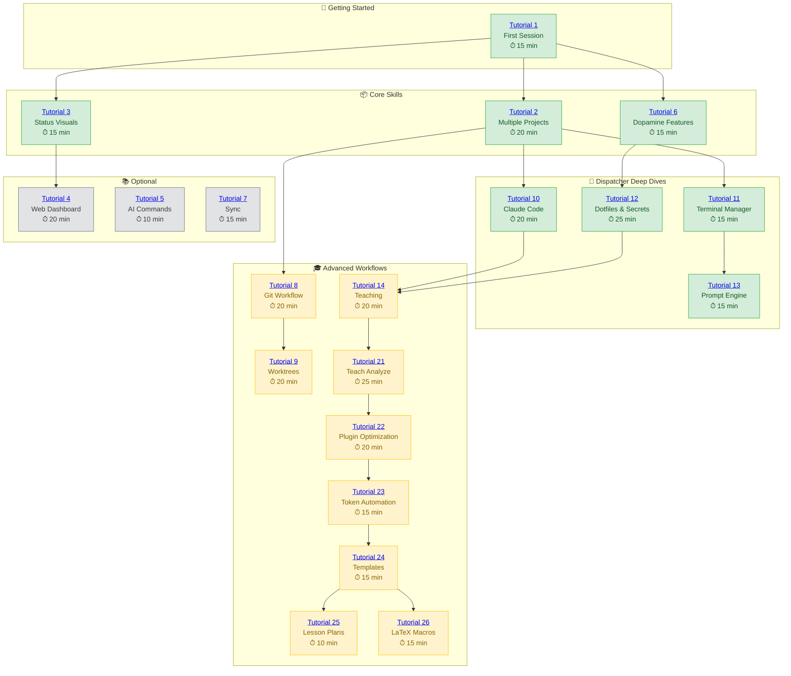

# Tutorials

> **Learn flow-cli step by step** - From your first session to advanced workflows.
>
> **Total time:** ~4 hours | **17 tutorials** | **Beginner → Intermediate**

---

## Learning Path

Choose your journey based on what you want to accomplish:



**Legend:** 🟢 Beginner | 🟡 Intermediate | ⚪ Optional

---

## Quick Paths

### 🏃 "I want to start using flow-cli immediately"

1. **[Tutorial 1: First Session](01-first-session.md)** - Track your first work session (15 min)
2. **[Tutorial 6: Dopamine Features](06-dopamine-features.md)** - Log wins, build streaks (15 min)

**Total: 30 minutes to productivity**

---

### 💻 "I use Claude Code daily"

1. **[Tutorial 1: First Session](01-first-session.md)** - Basics (15 min)
2. **[Tutorial 10: CC Dispatcher](10-cc-dispatcher.md)** - Launch Claude anywhere (20 min)
3. **[Tutorial 12: Dot Dispatcher](12-dot-dispatcher.md)** - Manage secrets (25 min)

**Total: 1 hour to Claude mastery**

---

### 🌳 "I work on multiple features simultaneously"

1. **[Tutorial 1: First Session](01-first-session.md)** - Basics (15 min)
2. **[Tutorial 2: Multiple Projects](02-multiple-projects.md)** - Project switching (20 min)
3. **[Tutorial 8: Git Feature Workflow](08-git-feature-workflow.md)** - Feature branches (20 min)
4. **[Tutorial 9: Worktrees](09-worktrees.md)** - Parallel development (20 min)

**Total: 1.25 hours to parallel workflow mastery**

---

### 📚 "I teach courses"

1. **[Tutorial 1: First Session](01-first-session.md)** - Basics (15 min)
2. **[Tutorial 10: CC Dispatcher](10-cc-dispatcher.md)** - Claude for content (20 min)
3. **[Tutorial 14: Teaching Workflow](14-teach-dispatcher.md)** - Full teaching workflow (20 min)

**Total: 55 minutes to teaching workflow**

---

## All Tutorials

| # | Tutorial | Time | Level | What You'll Learn |
|---|----------|------|-------|-------------------|
| 1 | [First Session](01-first-session.md) | 15 min | 🟢 Beginner | Track & complete your first work session |
| 2 | [Multiple Projects](02-multiple-projects.md) | 20 min | 🟢 Beginner | Manage multiple active projects |
| 3 | [Status Visualizations](03-status-visualizations.md) | 15 min | 🟢 Beginner | Understand dashboard visuals |
| 4 | [Web Dashboard](04-web-dashboard.md) | 20 min | ⚪ Optional | Web-based dashboard access |
| 5 | [AI Commands](05-ai-commands.md) | 10 min | ⚪ Optional | AI-powered features overview |
| 6 | [Dopamine Features](06-dopamine-features.md) | 15 min | 🟢 Beginner | Win tracking, streaks, goals |
| 7 | [Sync Command](07-sync-command.md) | 15 min | ⚪ Optional | Sync across multiple machines |
| 8 | [Git Feature Workflow](08-git-feature-workflow.md) | 20 min | 🟡 Intermediate | Git branching workflow |
| 9 | [Worktrees](09-worktrees.md) | 20 min | 🟡 Intermediate | Git worktree management |
| 10 | [CC Dispatcher](10-cc-dispatcher.md) | 20 min | 🟢 Beginner | Launch Claude Code with modes |
| 11 | [TM Dispatcher](11-tm-dispatcher.md) | 15 min | 🟢 Beginner | Terminal management |
| 12 | [DOT Dispatcher](12-dot-dispatcher.md) | 25 min | 🟢 Beginner | Dotfile & secret management |
| 13 | [Prompt Dispatcher](13-prompt-dispatcher.md) | 15 min | 🟢 Beginner | Prompt engine switching |
| 14 | [Teach Dispatcher](14-teach-dispatcher.md) | 20 min | 🟡 Intermediate | Teaching workflow (v5.9.0+) |
| 21 | [Teach Analyze](21-teach-analyze.md) | 25 min | 🟡 Intermediate | AI content analysis (v5.16.0) |
| 22 | [Plugin Optimization](22-plugin-optimization.md) | 20 min | 🟡 Intermediate | Load guards & performance |
| 23 | [Token Automation](23-token-automation.md) | 15 min | 🟡 Intermediate | Smart token management (v5.17.0) ⭐ **NEW** |

**Total estimated time:** ~5 hours (all tutorials)

---

## Prerequisites

Before starting any tutorial, ensure you have:

- [ ] flow-cli installed and loaded in your shell
- [ ] A project directory to work in
- [ ] Basic familiarity with the terminal

**Verify installation:**

```bash
# Check flow-cli is loaded
flow doctor

# If not loaded, add to your .zshrc:
# antidote bundle Data-Wise/flow-cli
```

---

## After the Tutorials

Once you've completed the tutorials, explore:

- **[Workflows](../workflows/)** - Real-world workflow patterns
- **[Guides](../guides/)** - In-depth feature guides
- **[Reference](../reference/)** - Complete command reference

---

**Tip:** Start with Tutorial 1, then follow the arrows in the learning path to your goal!
