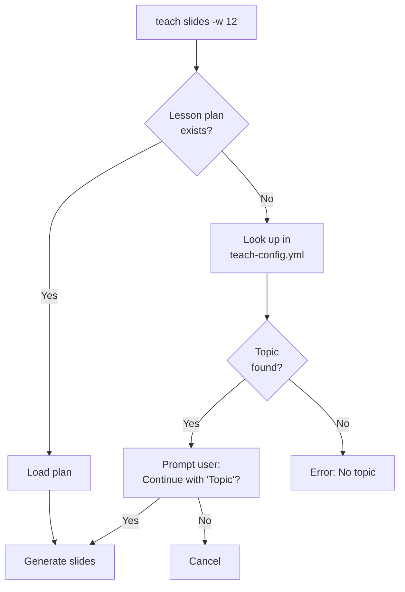

# Intermediate: Lesson Plans & Interactive Mode

**Duration:** ~20 minutes
**Level:** Intermediate
**Prerequisites:** [Getting Started Tutorial](01-getting-started.md)

---

## Overview

Take your Scholar skills to the next level with lesson plans and interactive wizards. Learn how to organize course content with YAML lesson plans and use step-by-step wizards for effortless content generation.

### What You'll Learn

- ✅ Create and use YAML lesson plans
- ✅ Use interactive mode for guided workflows
- ✅ Understand lesson plan fallback logic
- ✅ Combine lesson plans with custom flags

**Total Steps:** 11 (5 interactive)

---

## Step 1: Understanding Lesson Plans

Lesson plans are YAML files that define what to teach each week. They include:

- **Topic**: Week's subject matter
- **Style**: Default content style
- **Objectives**: Learning goals
- **Subtopics**: Sections to cover
- **Key Concepts**: Important ideas
- **Prerequisites**: Required prior knowledge

**Benefits:**
- 📝 Organize semester content
- 🔄 Reuse across semesters
- 🎯 Consistent generation
- ⚡ Faster commands (no need to specify topic/style)

---

## Step 2: Create Your First Lesson Plan

Create a lesson plan for Week 8.

```bash
# Create lesson plans directory
mkdir -p .flow/lesson-plans

# Create lesson plan file
cat > .flow/lesson-plans/week-08.yml <<EOF
week: 8
topic: "Multiple Regression"
style: computational

objectives:
  - "Understand multiple regression model assumptions"
  - "Interpret regression coefficients correctly"
  - "Perform model diagnostics in R"

subtopics:
  - "Model specification"
  - "Coefficient interpretation"
  - "Multicollinearity"
  - "Model diagnostics"

key_concepts:
  - "Partial regression coefficients"
  - "Adjusted R-squared"
  - "VIF (Variance Inflation Factor)"

prerequisites:
  - "Simple linear regression (Week 6)"
  - "Matrix notation basics (Week 7)"
EOF
```

<div align="center">


*Figure 4: Using `teach lecture --lesson week03.yml` to generate structured content from a lesson plan with learning objectives, activities, and teaching methods*

</div>

**File Location:** `.flow/lesson-plans/week-{NN}.yml`
**Naming Convention:** Use week number with leading zero (week-08.yml)

---

## Step 3: Generate from Lesson Plan

Now generate slides using the lesson plan.

```bash
teach slides -w 8
```

**What happens:**
1. Loads `.flow/lesson-plans/week-08.yml`
2. Extracts topic ("Multiple Regression")
3. Uses style from plan ("computational")
4. Includes objectives, subtopics, key concepts in prompt
5. Generates slides

**Comparison:**

```bash
# Without lesson plan (long command)
teach slides "Multiple Regression" --style computational

# With lesson plan (short command)
teach slides -w 8
```

Same result, but lesson plan is faster and more consistent!

<div align="center">


*Figure 5: Using `teach quiz --week 5` to auto-detect topic from semester schedule and generate aligned quiz content with prerequisite tracking*

</div>

---

## Step 4: Override Lesson Plan Style

You can override the lesson plan's style.

```bash
# Lesson plan says "computational", but generate rigorous instead
teach slides -w 8 --style rigorous
```

**Precedence:**

```
Command-line style > Lesson plan style > No style
```

**Use Case:** Create different versions of the same week's content for different audiences.

---

## Step 5: Lesson Plan Fallback

What happens if no lesson plan exists?

```bash
teach slides -w 12
```

**Fallback Flow:**



**Example Prompt:**

```
⚠️  No lesson plan found for Week 12

Topic from config: "Time Series"

Continue with this topic? [Y/n]:
```

Press Enter to continue, or `n` to cancel and create a lesson plan first.

---

## Step 6: Course Configuration

The fallback uses your course configuration file.

**File:** `.flow/teach-config.yml`

```yaml
semester_info:
  weeks:
    - week: 1
      topic: "Introduction to Statistics"
    - week: 2
      topic: "Probability Basics"
    # ...
    - week: 12
      topic: "Time Series"
```

**When to use:**
- Quick semester setup
- Fallback when lesson plans incomplete
- Topic lookup for interactive mode

---

## Step 7: Interactive Mode Overview

Interactive mode provides step-by-step wizards for content generation.

**Use Cases:**
- 🎓 Teaching mode (select from schedule)
- 🆕 Exploring without memorizing flags
- 📱 ADHD-friendly workflows

**Two Wizards:**
1. **Topic Wizard**: Select week from semester schedule
2. **Style Wizard**: Choose from 4 presets

---

## Step 8: Full Interactive Mode

Let's try fully interactive mode.

```bash
teach slides -i
```

**Wizard Flow:**

```
╭────────────────────────────────────────────────╮
│ 🎓 Interactive Teaching Content Generator     │
╰────────────────────────────────────────────────╯

📅 Select Week/Topic

  [ 1] Week  1  Introduction to Statistics
  [ 2] Week  2  Probability Basics
  [ 3] Week  3  Random Variables
  ...
  [ 8] Week  8  Multiple Regression

Your choice [1-16]: 8

📚 Content Style

What style should this content use?

  [1] conceptual    Explanation + definitions + examples
  [2] computational Explanation + examples + code + practice
  [3] rigorous      Definitions + explanation + math + proofs
  [4] applied       Explanation + examples + code + practice

Your choice [1-4]: 2

→ Generating slides for Week 8 with computational style
```

<div align="center">


*Figure 6: Using `teach exam --interactive` to walk through a step-by-step wizard for exam generation - Shows topic selection, style preset choice, question count, duration, and difficulty level configuration*

</div>

**Result:** Same as `teach slides -w 8 --style computational`, but guided!

---

## Step 9: Partial Interactive Mode

You can skip either wizard by providing flags.

**Skip topic wizard (week known):**

```bash
teach exam -i -w 8
# → Shows style menu only
```

**Skip style wizard (style known):**

```bash
teach quiz -i --style rigorous
# → Shows topic menu only
```

**Skip both (just use interactive flag for verbose output):**

```bash
teach lecture -i -w 8 --style computational
# → No menus, proceeds with provided values
```

---

## Step 10: Combining Everything

Combine lesson plans, interactive mode, and custom flags.

```bash
# Interactive + custom content
teach slides -i --diagrams --references

# Week-based + custom content
teach exam -w 8 --no-practice-problems --math

# Interactive + week hint + style hint
teach quiz -i -w 8 --style computational --examples
```

**Best Practice:**
- Use lesson plans for semester structure
- Use interactive mode for exploration
- Use flags for one-off customizations

---

## Step 11: Next Steps

You've mastered intermediate Scholar features!

**What You Learned:**
- ✅ Create YAML lesson plans
- ✅ Generate from week numbers
- ✅ Use interactive wizards
- ✅ Understand fallback logic
- ✅ Combine features

**Continue Learning:**

**→ [Advanced Tutorial](03-advanced.md)** - Master revision and context
- Revision workflow (improve existing content)
- Context-aware generation
- Complex flag combinations
- Batch operations

**→ [API Reference](../../reference/MASTER-API-REFERENCE.md#teaching-libraries)** - Complete flag documentation

---

## Lesson Plan Best Practices

### 1. Organize by Week

```
.flow/lesson-plans/
├── week-01.yml
├── week-02.yml
├── ...
└── week-16.yml
```

### 2. Required vs Optional Fields

**Required:**
- `topic` - Week's subject

**Optional (but recommended):**
- `style` - Default content style
- `objectives` - Learning goals
- `subtopics` - Sections to cover
- `key_concepts` - Important ideas
- `prerequisites` - Prior knowledge needed

### 3. Style Consistency

Choose styles that match your teaching philosophy:

**Theory Course:**

```yaml
style: rigorous  # Most weeks
# Occasionally use conceptual for intro weeks
```

**Applied Course:**

```yaml
style: computational  # Most weeks
# Occasionally use applied for case studies
```

### 4. Reusability

Lesson plans are version-controlled with your course. Use them semester after semester!

---

## Common Patterns

### Pattern 1: Semester Setup

```bash
# Create all 16 lesson plans at start of semester
for week in {01..16}; do
  cat > .flow/lesson-plans/week-$week.yml <<EOF
week: $week
topic: "TBD"
style: computational
EOF
done

# Fill in topics as you go
```

### Pattern 2: Quick Generation

```bash
# Generate week's content in one command
teach slides -w 8   # Uses lesson plan
teach exam -w 8     # Same topic, same style
teach quiz -w 8     # Consistent across materials
```

### Pattern 3: Interactive Exploration

```bash
# Explore different weeks without memorizing numbers
teach lecture -i
# → See full schedule
# → Pick the topic you want
```

---

## Troubleshooting

**Issue:** "yq not installed" warning

```bash
# Install yq for YAML parsing
brew install yq

# Or continue with fallback (limited functionality)
```

**Issue:** Lesson plan not loading

```bash
# Check file exists
ls .flow/lesson-plans/week-08.yml

# Check YAML syntax
yq . .flow/lesson-plans/week-08.yml

# Check required field (topic)
yq '.topic' .flow/lesson-plans/week-08.yml
```

**Issue:** Interactive mode shows no weeks

```bash
# Check teach-config.yml exists
ls .flow/teach-config.yml

# Check semester_info.weeks array
yq '.semester_info.weeks' .flow/teach-config.yml
```

---

## Summary

In this tutorial, you learned:

1. ✅ **Lesson Plans** - YAML files for semester structure
2. ✅ **Week-Based** - Generate with `-w` flag
3. ✅ **Fallback** - Config lookup when plan missing
4. ✅ **Interactive** - Step-by-step wizards
5. ✅ **Combinations** - Mix features for power workflows

**Time to Mastery:** ~20 minutes
**Commands Learned:** 8 (lesson plans + interactive)
**Ready For:** Advanced tutorial

---

**Navigation:**
- ← [Getting Started](01-getting-started.md)
- → [Advanced: Revision & Context](03-advanced.md)
- ↑ [Tutorial Overview](../index.md)
