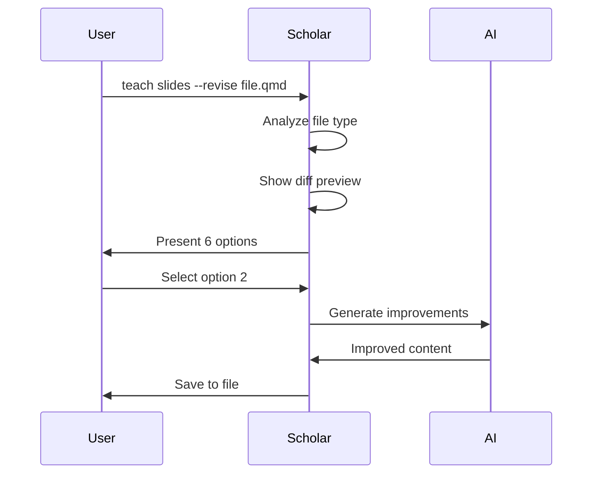

# Advanced: Revision & Context Integration

**Duration:** ~35 minutes
**Level:** Advanced
**Prerequisites:** [Intermediate Tutorial](02-intermediate.md)

---

## Overview

Master the most powerful Scholar Enhancement features: revision workflow for improving existing content and context integration for course-aware generation. Learn complex flag combinations and batch operations for maximum productivity.

### What You'll Learn

- ✅ Use revision workflow (6 improvement options)
- ✅ Integrate course context for consistency
- ✅ Master complex flag combinations
- ✅ Understand performance optimization
- ✅ Build custom workflows

**Total Steps:** 13 (7 interactive)

---

## Step 1: Revision Workflow Overview

The revision workflow improves existing content with AI assistance.

**Use Cases:**
- 📝 Update outdated materials
- 🔧 Fix errors and inconsistencies
- ✨ Add missing sections
- 🎨 Enhance formatting and style
- 💡 Update examples and exercises

**6 Revision Options:**
1. Add missing content (fill gaps)
2. Improve clarity/organization
3. Fix errors/inconsistencies
4. Update examples/exercises
5. Enhance formatting/style
6. Custom instructions

---

## Step 2: Basic Revision

Let's revise existing slides.

```bash
# Create test slides first
teach slides "Linear Regression" --style computational -o test-slides.qmd

# Now revise them
teach slides --revise test-slides.qmd
```

**Revision Flow:**



**What happens:**
1. **Analyzes** file to detect type (slides, exam, quiz, etc.)
2. **Shows** git diff preview (if in repo)
3. **Presents** 6 improvement options
4. **Applies** selected revision with Scholar
5. **Saves** improved version

<div align="center">


*Figure 7: Using `teach slides --revise slides-v1.md --feedback "Add more practical examples"` to iteratively improve existing content - Shows content analysis, gap identification, and targeted improvements (v1 → v2)*

</div>

---

## Step 3: Revision Menu

When you run `--revise`, you'll see this menu:

```
📝 Revision Options

What would you like to improve?

  [1] Add missing content          Fill gaps, add sections
  [2] Improve clarity/organization Restructure, clarify
  [3] Fix errors/inconsistencies   Correct mistakes
  [4] Update examples/exercises    Refresh examples
  [5] Enhance formatting/style     Polish presentation
  [6] Custom instructions          Your own guidance

Your choice [1-6]:
```

**Each Option:**

**Option 1 - Add Missing Content**
- Identifies gaps in coverage
- Adds new sections/explanations
- Fills incomplete examples

**Option 2 - Improve Clarity**
- Restructures confusing sections
- Adds transitions
- Simplifies complex explanations

**Option 3 - Fix Errors**
- Corrects mathematical errors
- Fixes code bugs
- Resolves inconsistencies

**Option 4 - Update Examples**
- Replaces outdated examples
- Adds modern code examples
- Improves practice problems

**Option 5 - Enhance Formatting**
- Improves visual layout
- Adds diagrams
- Better code formatting

**Option 6 - Custom**
- Type your own instruction
- Maximum flexibility

---

## Step 4: Revision + Content Flags

Combine revision with content flags for targeted improvements.

```bash
# Add diagrams to existing slides
teach slides --revise slides.qmd --diagrams

# Add math notation to exam
teach exam --revise exam.qmd --math --examples

# Remove practice problems, add references
teach lecture --revise lecture.md --no-practice-problems --references
```

**Workflow:**
1. Select revision option (e.g., "Add missing content")
2. Scholar adds missing content PLUS requested flags
3. Result: Improved content with new additions

**Example:**

```bash
teach slides --revise slides.qmd --diagrams
# → Select "Add missing content"
# → Adds missing sections + diagrams throughout
```

---

## Step 5: Content Type Detection

Scholar automatically detects what kind of content you're revising.

**Detection Method:**

```python
# Check YAML frontmatter
format: revealjs → slides
format: beamer → slides
title: "*Exam*" → exam
title: "*Quiz*" → quiz

# Check content patterns
"# Homework" → assignment
"Course: " → syllabus
"Criteria" → rubric
```

**Detected Types:**
- slides
- lecture
- exam
- quiz
- assignment
- syllabus
- rubric

**Why It Matters:**
- Different types need different improvement strategies
- Exams: focus on question quality
- Slides: focus on visual clarity
- Lectures: focus on depth and examples

---

## Step 6: Diff Preview

Before revising, Scholar shows what's changed.

```bash
teach slides --revise slides/week-08.qmd
```

**Preview Output:**

```
📝 Revising: slides/week-08.qmd
📅 Last modified: 2026-01-17 14:30

Git diff:
───────────────────────────────────────
@@ -45,7 +45,7 @@

 # Model Assumptions

-- Linearity
+- Linearity (updated)
───────────────────────────────────────

[Preview helps you decide which revision to apply]
```

**No Git Repo?**

```
📝 Revising: slides.qmd
📅 Last modified: 2026-01-17 14:30

(File is not tracked by git)
```

---

## Step 7: Context Integration

Context integration makes Scholar aware of your course.

**What is Context?**
Course-specific information that Scholar uses to:
- Maintain consistent terminology
- Align with course objectives
- Reference syllabus goals
- Match course difficulty level

**Context Sources:**
1. `.flow/teach-config.yml` - Course metadata
2. `syllabus.md` - Learning objectives
3. `README.md` - Project overview

---

## Step 8: Using Context

Add `--context` flag to any command.

```bash
# Generate slides with course context
teach slides -w 8 --context

# Generate exam aligned with syllabus
teach exam "Multiple Regression" --context --style rigorous

# Revise with course awareness
teach lecture --revise lecture.md --context
```

**Context Example:**

```yaml
# .flow/teach-config.yml
course:
  name: "STAT 440"
  semester: "Spring"
  year: 2026
  level: "Undergraduate"
```

**With Context:**

```markdown
# Multiple Regression

This lecture covers multiple regression analysis as part of
STAT 440 (Spring 2026). We build on linear regression from
Week 6 and prepare for time series in Week 12.
```

**Without Context:**

```markdown
# Multiple Regression

This lecture covers multiple regression analysis.
```

<div align="center">


*Figure 8: Using `teach assignment "Hypothesis Testing Practice" --with-readings` to integrate course materials - Shows reading citations, dataset integration, lecture references, and prerequisite tracking*

</div>

---

## Step 9: Context + Revision + Flags

Combine all three for maximum power.

```bash
teach slides --revise slides.qmd --context --diagrams --references
```

**What Happens:**
1. Loads course context (STAT 440, objectives)
2. Analyzes current slide content
3. Shows diff preview
4. Presents revision menu
5. User selects improvement option
6. Scholar improves with:
   - Course context awareness
   - Selected revision focus
   - Added diagrams
   - Added references

**Result:** Course-aligned, improved slides with visualizations and citations.

---

## Step 10: Complex Flag Combinations

Master advanced flag patterns.

### Pattern 1: Preset Override Chain

```bash
teach exam "Topic" --style rigorous --no-proof --diagrams --examples
```

**Resolution:**

```
1. Start: rigorous preset
   → definitions, explanation, math, proof

2. Remove: --no-proof
   → definitions, explanation, math

3. Add: --diagrams, --examples
   → definitions, explanation, math, diagrams, examples
```

### Pattern 2: Multiple Removals

```bash
teach slides -w 8 --style computational --no-code --no-practice-problems
```

**Use Case:** Lecture slides (concepts only, no hands-on)

### Pattern 3: Short Form Chain

```bash
teach quiz "ANOVA" -e -m -x -c -d
```

**Expands to:**

```
--explanation --math --examples --code --diagrams
```

### Pattern 4: Context-Aware Customization

```bash
teach lecture -w 8 --context --style rigorous --diagrams --no-proof
```

**Result:** Math-heavy lecture (no proofs) aligned with course, with visuals

---

## Step 11: Batch Operations

Process multiple files or weeks efficiently.

### Batch Revision

```bash
# Revise all week 8 materials
for file in week-08-*.qmd; do
  teach slides --revise "$file" --context --diagrams
done
```

### Batch Generation

```bash
# Generate all assignments for semester
for week in {1..16}; do
  teach assignment -w $week -o "hw/hw-$week.qmd"
done
```

### Batch Style Override

```bash
# Regenerate all exams in rigorous style
for week in {1..16}; do
  teach exam -w $week --style rigorous -o "exams/exam-$week.qmd"
done
```

**Pro Tip:** Add `--dry-run` to preview first!

---

## Step 12: Performance Optimization

Understand performance characteristics for efficient workflows.

### Timing Breakdown

| Operation | Time | Notes |
|-----------|------|-------|
| Flag parsing | <1ms | Instant |
| Lesson plan load | ~5ms | yq YAML parsing |
| Context building | ~10ms | File I/O |
| Interactive menu | User-bound | Waits for input |
| Scholar execution | 30-60s | Claude Code AI processing |

### Optimization Strategies

**1. Use Lesson Plans**

```bash
# Slow (type full topic each time)
teach slides "Multiple Linear Regression with Diagnostics" --style computational

# Fast (short command via lesson plan)
teach slides -w 8
```

**2. Batch Non-Interactive**

```bash
# Interactive mode requires waiting for each prompt
for week in {1..16}; do teach slides -i -w $week; done  # Slow

# Non-interactive is faster
for week in {1..16}; do teach slides -w $week; done  # Fast
```

**3. Cache Context**
Scholar reads context files each time. Keep them small (<500 chars) for speed.

**4. Use --dry-run**
Preview commands without calling Scholar:

```bash
teach exam -w 8 --style rigorous --dry-run
# Shows what would be generated (instant)
```

---

## Step 13: Building Custom Workflows

Create reusable workflows for your teaching needs.

### Workflow 1: Weekly Content Pipeline

```bash
#!/bin/bash
# generate-week.sh - Generate all materials for a week

WEEK=$1

echo "Generating Week $WEEK materials..."

# Slides
teach slides -w $WEEK -o "slides/week-$WEEK.qmd"

# Lecture notes
teach lecture -w $WEEK -o "lectures/week-$WEEK.md"

# Quiz
teach quiz -w $WEEK --questions 10 -o "quizzes/quiz-$WEEK.qmd"

# Homework
teach assignment -w $WEEK -o "homework/hw-$WEEK.qmd"

echo "Week $WEEK complete!"
```

### Workflow 2: Revision Pipeline

```bash
#!/bin/bash
# revise-all.sh - Revise all course materials

echo "Revising all materials..."

# Update all slides
for file in slides/*.qmd; do
  teach slides --revise "$file" --context --diagrams
done

# Update all exams
for file in exams/*.qmd; do
  teach exam --revise "$file" --context --math
done

echo "Revision complete!"
```

### Workflow 3: Style Variant Generator

```bash
#!/bin/bash
# generate-variants.sh - Create multiple style versions

WEEK=$1

# Conceptual (intro students)
teach slides -w $WEEK --style conceptual -o "slides/week-$WEEK-intro.qmd"

# Computational (main section)
teach slides -w $WEEK --style computational -o "slides/week-$WEEK-main.qmd"

# Rigorous (honors section)
teach slides -w $WEEK --style rigorous -o "slides/week-$WEEK-honors.qmd"
```

---

## Advanced Patterns

### Pattern 1: Progressive Refinement

Start broad, refine with revisions:

```bash
# 1. Generate initial version
teach slides "Topic" --style computational

# 2. Add missing content
teach slides --revise slides.qmd  # Select option 1

# 3. Add diagrams
teach slides --revise slides.qmd --diagrams

# 4. Polish formatting
teach slides --revise slides.qmd  # Select option 5
```

### Pattern 2: Cross-Format Consistency

Generate related materials from lesson plan:

```bash
# All use same week, ensuring consistency
teach slides -w 8     # Slides
teach lecture -w 8    # Detailed notes
teach exam -w 8       # Assessment
teach quiz -w 8       # Quick check
```

### Pattern 3: Collaborative Teaching

Different instructors, different styles:

```bash
# Main instructor (computational)
teach slides -w 8 --style computational -o week-8-main.qmd

# TA sections (conceptual, simpler)
teach slides -w 8 --style conceptual -o week-8-ta.qmd

# Honors section (rigorous)
teach slides -w 8 --style rigorous -o week-8-honors.qmd
```

---

## Troubleshooting

### Issue: Revision Doesn't Detect File Type

```bash
# Add explicit content type in filename or frontmatter
---
title: "Week 8 Slides"  # Add "slides" keyword
format: revealjs        # Explicit format
---
```

### Issue: Context Not Applied

```bash
# Check context files exist
ls .flow/teach-config.yml syllabus.md README.md

# Check context building
teach slides -w 8 --context --verbose
# Should show context in command
```

### Issue: Too Many Flags

```bash
# Use style presets to reduce flags
teach slides "Topic" --explanation --examples --code --practice-problems
# → Same as:
teach slides "Topic" --style computational
```

---

## Summary

You've mastered advanced Scholar Enhancement!

**What You Learned:**
1. ✅ **Revision** - 6 options for improving content
2. ✅ **Context** - Course-aware generation
3. ✅ **Combinations** - Complex flag patterns
4. ✅ **Performance** - Optimization strategies
5. ✅ **Workflows** - Custom automation

**Skills Acquired:**
- Improve existing materials with AI
- Maintain course consistency
- Build efficient workflows
- Batch process content
- Optimize for speed

---

## What's Next?

### Explore Documentation

**Complete References:**
- [API Reference](../../reference/MASTER-API-REFERENCE.md#teaching-libraries) - All 47 flags
- [Architecture Guide](../../architecture/SCHOLAR-ENHANCEMENT-ARCHITECTURE.md) - How it works

### Contribute

Found a bug? Have an idea?
- Issues: https://github.com/Data-Wise/flow-cli/issues
- Tag: `[scholar]`

### Share Your Workflows

Built a useful workflow script? Share it with the community!

---

## Advanced Tips & Tricks

### Tip 1: Revision with Custom Instructions

```bash
teach slides --revise slides.qmd
# Select option 6 (Custom)
# Type: "Add more real-world examples from recent research"
```

### Tip 2: Context from Multiple Sources

```bash
# Scholar combines context from all available files
.flow/teach-config.yml  # Course metadata
syllabus.md            # Objectives
README.md              # Overview

# All used when --context flag present
```

### Tip 3: Quick Style Preview

```bash
# Generate same content in all 4 styles quickly
for style in conceptual computational rigorous applied; do
  teach slides "Topic" --style $style -o "preview-$style.qmd" --dry-run
done

# Review previews, pick best style
```

### Tip 4: Incremental Improvement

```bash
# Small iterations work better than big changes
teach slides --revise slides.qmd  # Option 1 (add content)
teach slides --revise slides.qmd  # Option 4 (update examples)
teach slides --revise slides.qmd  # Option 5 (polish)
```

---

## Tutorial Series Complete

**Congratulations!** You've completed all three Scholar Enhancement tutorials.

**Journey Summary:**

**Level 1: Getting Started** ✅
- Style presets
- Content flags
- Basic generation

**Level 2: Intermediate** ✅
- Lesson plans
- Interactive mode
- Week-based workflows

**Level 3: Advanced** ✅
- Revision workflow
- Context integration
- Custom workflows

**Total Time:** ~65 minutes
**Commands Mastered:** 20+
**Ready:** Production use

---

**Navigation:**
- ← [Intermediate Tutorial](02-intermediate.md)
- ↑ [Tutorial Overview](../index.md)
- → [API Reference](../../reference/MASTER-API-REFERENCE.md#teaching-libraries)
