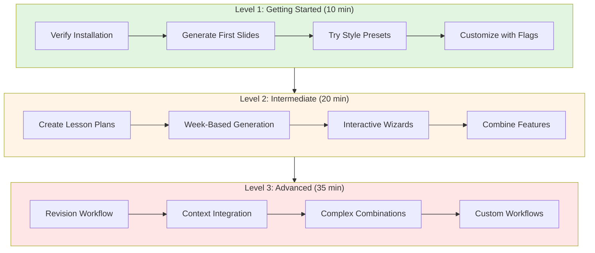

# Scholar Enhancement Tutorials

**Version:** v5.13.0
**Total Duration:** ~65 minutes
**Skill Levels:** 3 (Beginner → Advanced)

---

## Overview

Learn to use the Scholar Enhancement for AI-powered teaching content generation. These tutorials provide a progressive learning path from basic commands to advanced workflows.

### What is Scholar Enhancement?

The Scholar Enhancement extends flow-cli's teach dispatcher with AI-powered content generation. Create slides, exams, quizzes, and other teaching materials using Claude Code and the Scholar plugin.

> **See also:** [Scholar Wrappers Guide](../../guides/SCHOLAR-WRAPPERS-GUIDE.md) for complete command reference, and [All Commands Quick Reference](../../reference/REFCARD-TEACH-DISPATCHER.md) for all 30 teach subcommands.

**Key Features:**
- 🎨 **4 Style Presets** - predefined content styles (conceptual, computational, rigorous, applied)
- 🎛️ **9 Content Flags** - fine-tune what's included
- 📝 **YAML Lesson Plans** - organize semester content
- 🧙 **Interactive Wizards** - step-by-step guidance
- ♻️ **Revision Workflow** - improve existing content
- 🎯 **Context Integration** - course-aware generation

---

## Learning Path



---

## Tutorial Series

### 📚 [Level 1: Getting Started](01-getting-started.md)

**Duration:** ~10 minutes
**Prerequisites:** flow-cli v5.13.0+
**Difficulty:** ⭐ Beginner

**What You'll Learn:**
- ✅ Verify Scholar Enhancement is available
- ✅ Generate slides with style presets
- ✅ Customize content with flags
- ✅ Access help system

**Commands Learned:** 3
- `teach slides --style [preset]`
- `teach slides --help`
- Content flags (--diagrams, --no-proof, etc.)

[**Start Tutorial →**](01-getting-started.md)

---

### 🎓 [Level 2: Intermediate](02-intermediate.md)

**Duration:** ~20 minutes
**Prerequisites:** Level 1 Complete
**Difficulty:** ⭐⭐ Intermediate

**What You'll Learn:**
- ✅ Create YAML lesson plans
- ✅ Generate from week numbers
- ✅ Use interactive wizards
- ✅ Understand fallback logic

**Commands Learned:** 8
- Lesson plan structure
- `teach slides -w [week]`
- `teach slides -i`
- Lesson plan + flag combinations

[**Start Tutorial →**](02-intermediate.md)

---

### 🚀 [Level 3: Advanced](03-advanced.md)

**Duration:** ~35 minutes
**Prerequisites:** Level 2 Complete
**Difficulty:** ⭐⭐⭐ Advanced

**What You'll Learn:**
- ✅ Use revision workflow (6 options)
- ✅ Integrate course context
- ✅ Master complex flag combinations
- ✅ Build custom workflows

**Commands Learned:** 12+
- `teach slides --revise [file]`
- `teach slides --context`
- Batch operations
- Custom workflow scripts

[**Start Tutorial →**](03-advanced.md)

---

## Quick Reference

### Style Presets

| Preset | Includes | Best For |
|--------|----------|----------|
| `conceptual` | explanation, definitions, examples | Intro courses, theory |
| `computational` | explanation, examples, code, practice | Applied stats, data science |
| `rigorous` | definitions, explanation, math, proof | Graduate courses |
| `applied` | explanation, examples, code, practice | Hands-on workshops |

### Content Flags

| Flag | Short | Description |
|------|-------|-------------|
| `--explanation` | `-e` | Conceptual explanations |
| `--math` | `-m` | Mathematical notation |
| `--examples` | `-x` | Numerical examples |
| `--code` | `-c` | Code snippets |
| `--diagrams` | `-d` | Visualizations |
| `--practice-problems` | `-p` | Practice problems |
| `--references` | `-r` | Citations |

**Plus:** `--definitions`, `--proof`
**Negations:** `--no-explanation`, `--no-math`, etc.

### Common Commands

```bash
# Basic generation
teach slides "Topic" --style computational

# Week-based
teach slides -w 8

# Interactive
teach slides -i

# Revision
teach slides --revise file.qmd

# With context
teach slides -w 8 --context

# Complex combination
teach exam -w 8 --style rigorous --context --diagrams --no-proof
```

---

## Tutorial Features

### 📹 GIF Demos

Each tutorial includes GIF demonstrations of key commands:
- Installation verification
- Content generation
- Interactive wizards
- Revision workflow
- Context integration

**Total Demos:** 8 GIFs across 3 tutorials

### 📊 Mermaid Diagrams

Visual learning aids throughout:
- Learning path flowchart
- Fallback logic diagrams
- Workflow sequences
- Architecture overviews

### ✅ Checkpoints

Each tutorial includes:
- Step-by-step instructions
- Expected output examples
- Troubleshooting sections
- Success indicators
- Common issues & solutions

---

## Prerequisites

### Required

- **flow-cli:** v5.13.0 or later
- **Claude Code:** Latest version
- **ZSH:** 5.8+ (macOS default)

### Optional

- **yq:** For lesson plan YAML parsing (`brew install yq`)
- **Git:** For revision diff previews
- **VS Code:** For editing generated content

### Verify Installation

```bash
# Check flow-cli version
flow --version

# Check if Scholar Enhancement available
teach slides --help | grep "Universal Flags"

# Check optional dependencies
which yq      # Should show path
which git     # Should show path
```

---

## Success Metrics

Track your progress:

| Metric | Level 1 | Level 2 | Level 3 |
|--------|---------|---------|---------|
| **Time to Complete** | 10 min | 20 min | 35 min |
| **Commands Learned** | 3 | 8 | 12+ |
| **GIF Demos** | 3 | 3 | 2 |
| **Interactive Steps** | 3 | 5 | 7 |
| **Complexity** | Basic | Intermediate | Advanced |

**Tutorial Series Completion:**
- ⭐ Level 1: Basic Scholar user
- ⭐⭐ Level 2: Competent Scholar user
- ⭐⭐⭐ Level 3: Expert Scholar user

---

## Additional Resources

### Documentation

**Complete References:**
- [API Reference](../../reference/MASTER-API-REFERENCE.md#teaching-libraries) - All 47 flags
- [Architecture Guide](../../architecture/SCHOLAR-ENHANCEMENT-ARCHITECTURE.md) - System design

### Community

**Get Help:**
- GitHub Issues: https://github.com/Data-Wise/flow-cli/issues
- Tag: `[scholar]`

**Share:**
- Post your workflows
- Share lesson plan templates
- Contribute improvements

---

## Tutorial Development

These tutorials were created following:
- ✅ Progressive complexity (simple → advanced)
- ✅ Interactive learning (users do, not just read)
- ✅ Visual demonstrations (GIFs + diagrams)
- ✅ Real-world examples (actual teaching scenarios)
- ✅ Comprehensive coverage (all major features)

**Total Tutorial Content:**
- 3 tutorial documents (~15,000 words)
- 8 GIF demonstrations
- 5+ Mermaid diagrams
- 50+ code examples
- 20+ commands covered

---

## Frequently Asked Questions

**Q: Which tutorial should I start with?**
A: Start with Level 1 (Getting Started) even if experienced. It covers essential concepts.

**Q: Can I skip to Level 3?**
A: Not recommended. Each level builds on previous knowledge.

**Q: How long does the full series take?**
A: ~65 minutes total, but you can split across multiple sessions.

**Q: Do I need yq installed?**
A: Optional for Level 1-2, helpful for Level 2-3 (lesson plans require yq).

**Q: Can I use this for non-statistics courses?**
A: Yes! Examples are statistics-focused but work for any subject.

**Q: What if I get stuck?**
A: Each tutorial has a "Troubleshooting" section. Also check the API Reference.

---

## Next Steps

**Ready to start?**

1. **Verify Prerequisites**

   ```bash
   teach slides --help | grep "Universal Flags"
   ```

2. **Begin Level 1**
   - [Getting Started Tutorial](01-getting-started.md)
   - ~10 minutes
   - 3 interactive steps

3. **Track Progress**
   - Complete all steps
   - Try examples
   - Check success indicators

**Happy Learning!** 🎓

---

**Navigation:**
- → [Level 1: Getting Started](01-getting-started.md)
- ↑ [Documentation Home](../../index.md)
