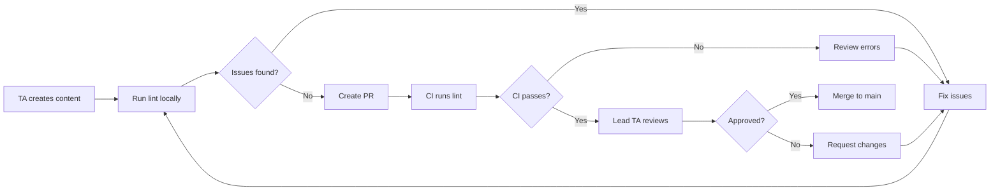

# Workflow: Quarto Lint Integration

**Purpose:** Integrate lint checks into your course development workflow
**Time:** 15 min setup, saves hours debugging
**Audience:** Course developers, TAs, collaborators

---

## Overview

This workflow integrates `teach validate --lint` into your daily course development to catch structural issues early.

### Benefits

- ✅ **Catch issues before rendering** - Save time
- ✅ **Consistent quality** - All files follow same standards
- ✅ **Team alignment** - Everyone uses same rules
- ✅ **Automated checks** - No manual review needed

---

## Workflow 1: Solo Developer

**Scenario:** You're the only person editing course materials.

### Setup (One-Time)

**1. Install flow-cli:**
```bash
brew install Data-Wise/tap/flow-cli
```

**2. Copy validator to course:**
```bash
cd ~/projects/teaching/my-course
mkdir -p .teach/validators
cp $(brew --prefix flow-cli)/share/validators/lint-shared.zsh .teach/validators/
```

**3. Create git pre-commit hook:**
```bash
cat > .git/hooks/pre-commit <<'EOF'
#!/bin/bash
set -e

# Get staged .qmd files
STAGED_QMD=$(git diff --cached --name-only --diff-filter=ACM | grep '\.qmd$' || true)

if [ -z "$STAGED_QMD" ]; then
    exit 0
fi

# Run lint (warn-only, doesn't block)
if command -v teach &>/dev/null; then
    echo "Running Quarto lint checks..."
    LINT_OUTPUT=$(teach validate --lint --quick-checks $STAGED_QMD 2>&1 || true)
    if [ -n "$LINT_OUTPUT" ]; then
        echo "$LINT_OUTPUT" | head -20
        echo ""
        echo "⚠️  Lint warnings found (not blocking commit)"
    fi
fi
EOF

chmod +x .git/hooks/pre-commit
```

### Daily Workflow

```bash
# 1. Edit files
vim slides/week-03.qmd

# 2. Lint check (optional, pre-commit will also do this)
teach validate --lint slides/week-03.qmd

# 3. Fix issues if any

# 4. Commit (pre-commit hook runs lint automatically)
git add slides/week-03.qmd
git commit -m "Add week 3 slides"

# 5. Lint runs automatically, shows warnings but doesn't block
```

### Weekly Audit

Run full lint check weekly:

```bash
# Check all files
teach validate --lint **/*.qmd > lint-audit.txt 2>&1

# Review output
less lint-audit.txt

# Count issues
grep "✗ Line" lint-audit.txt | wc -l
```

---

## Workflow 2: Team Development

**Scenario:** Multiple TAs/collaborators editing materials.

### Setup (Team Lead)

**1. Add validator to repo:**
```bash
cd ~/projects/teaching/my-course
mkdir -p .teach/validators
cp lint-shared.zsh .teach/validators/
git add .teach/validators/lint-shared.zsh
git commit -m "Add lint validator"
git push
```

**2. Document lint rules in README:**
```bash
cat >> README.md <<'EOF'

## Lint Checks

Before committing `.qmd` files, run:

```bash
teach validate --lint your-file.qmd
```

### Valid Callout Types
- `callout-note`, `callout-tip`, `callout-important`
- `callout-warning`, `callout-caution`
- NOT `callout-info` or `callout-danger`

### Code Blocks
All code blocks need language tags:
- ` ```{r} ` for R code
- ` ```python ` for Python
- ` ```text ` for output

See `docs/guides/LINT-GUIDE.md` for full details.
EOF
```

**3. Create CI check (`.github/workflows/lint.yml`):**
```yaml
name: Lint Quarto Files

on:
  pull_request:
    paths:
      - '**.qmd'

jobs:
  lint:
    runs-on: ubuntu-latest
    steps:
    - uses: actions/checkout@v3

    - name: Install flow-cli
      run: |
        brew tap Data-Wise/tap
        brew install flow-cli

    - name: Lint changed files
      run: |
        CHANGED_FILES=$(git diff --name-only origin/main | grep '\.qmd$' || true)
        if [ -n "$CHANGED_FILES" ]; then
          teach validate --lint $CHANGED_FILES
        fi
      continue-on-error: true
```

### Collaborator Onboarding

**New team member checklist:**

```bash
# 1. Clone repo
git clone https://github.com/org/my-course.git
cd my-course

# 2. Install flow-cli
brew install Data-Wise/tap/flow-cli

# 3. Set up pre-commit hook
cp .git-hooks/pre-commit .git/hooks/
chmod +x .git/hooks/pre-commit

# 4. Test lint
teach validate --lint slides/week-01.qmd
```

### Pull Request Workflow

**Developer:**
```bash
# 1. Create branch
git checkout -b add-week-05-slides

# 2. Add content
vim slides/week-05.qmd

# 3. Lint before commit
teach validate --lint slides/week-05.qmd

# 4. Fix any issues

# 5. Commit and push
git add slides/week-05.qmd
git commit -m "Add week 5 slides"
git push origin add-week-05-slides

# 6. Create PR
gh pr create
```

**Reviewer:**
```bash
# Check PR includes lint validation
gh pr view 123

# Look for CI check:
# ✅ Lint Quarto Files passed
```

---

## Workflow 3: CI/CD Integration

**Scenario:** Automated deployment pipeline.

### GitHub Actions

**File:** `.github/workflows/deploy.yml`

```yaml
name: Deploy Course Site

on:
  push:
    branches: [main]
    paths:
      - '**.qmd'
      - '_quarto.yml'

jobs:
  lint-and-deploy:
    runs-on: ubuntu-latest

    steps:
    - uses: actions/checkout@v3

    - name: Install flow-cli
      run: |
        brew tap Data-Wise/tap
        brew install flow-cli

    - name: Lint all files
      run: |
        teach validate --lint --quick-checks
      continue-on-error: true

    - name: Set up Quarto
      uses: quarto-dev/quarto-actions/setup@v2

    - name: Render site
      run: quarto render

    - name: Deploy to GitHub Pages
      uses: peaceiris/actions-gh-pages@v3
      with:
        github_token: ${{ secrets.GITHUB_TOKEN }}
        publish_dir: ./_site
```

### GitLab CI

**File:** `.gitlab-ci.yml`

```yaml
lint:
  stage: test
  image: ubuntu:latest
  before_script:
    - apt-get update
    - apt-get install -y curl git
    - curl -fsSL https://install.flow-cli.sh | bash
  script:
    - teach validate --lint --quick-checks
  allow_failure: true
  only:
    changes:
      - "**/*.qmd"
```

---

## Workflow 4: Watch Mode Development

**Scenario:** Continuous feedback while editing.

### Setup

Create `watch-lint.sh`:

```bash
#!/bin/bash

FILE="$1"
INTERVAL="${2:-5}"

if [ -z "$FILE" ]; then
    echo "Usage: $0 <file.qmd> [interval_seconds]"
    exit 1
fi

echo "Watching $FILE for lint issues (Ctrl+C to stop)"
echo "Checking every ${INTERVAL}s..."
echo ""

while true; do
    clear
    echo "=== Lint Check: $(date +%H:%M:%S) ==="
    echo "File: $FILE"
    echo ""

    teach validate --lint "$FILE" 2>&1 || true

    sleep $INTERVAL
done
```

### Usage

```bash
# Terminal 1: Edit file
vim slides/week-03.qmd

# Terminal 2: Watch for issues
chmod +x watch-lint.sh
./watch-lint.sh slides/week-03.qmd 5

# Output updates every 5 seconds
# === Lint Check: 14:23:15 ===
# File: slides/week-03.qmd
#
# → lint-shared (v1.0.0)
#   ✓ All files passed
```

---

## Workflow 5: Batch Fixing Legacy Files

**Scenario:** Existing course with many lint issues.

### Strategy: Incremental Cleanup

**Don't:** Try to fix all files at once (overwhelming).

**Do:** Fix incrementally as you edit files.

**1. Create baseline:**
```bash
# Count current issues
teach validate --lint **/*.qmd 2>&1 | grep "✗ Line" | wc -l
# Output: 243 issues
```

**2. Set goal:**
```bash
# Fix 10 issues per week
echo "Goal: Reduce from 243 to 0 by end of semester"
```

**3. Track progress:**
```bash
# Weekly audit
teach validate --lint **/*.qmd 2>&1 | grep "✗ Line" | wc -l > lint-count.txt
git add lint-count.txt
git commit -m "Lint audit: $(cat lint-count.txt) issues remaining"
```

**4. Fix as you edit:**
```bash
# When editing a file, fix its lint issues
vim slides/week-01.qmd

# Before committing, verify it's clean
teach validate --lint slides/week-01.qmd

# Commit clean file
git add slides/week-01.qmd
git commit -m "Update week 1 slides (lint-clean)"
```

**5. Celebrate progress:**
```bash
# Gamify the cleanup
echo "🎉 Down to $(cat lint-count.txt) issues! (was 243)"
```

---

## Workflow 6: Teaching Team Coordination

**Scenario:** Professor + TAs developing materials.

### Roles & Responsibilities

| Role | Responsibility |
|------|----------------|
| **Professor** | Set lint policy, approve exceptions |
| **Lead TA** | Maintain validator, review PRs |
| **TAs** | Follow lint rules, fix issues |
| **CI** | Automated checking |

### Communication Flow



### Weekly Sync

**Agenda:**
1. Review lint violations from past week
2. Discuss patterns (common mistakes)
3. Update lint rules if needed
4. Celebrate clean code

**Example:**
```
Week 5 Sync:
- 🎉 All week 4 materials are lint-clean
- ⚠️ 3 TAs still using .callout-info (invalid)
  → Reminder: Use .callout-note instead
- 💡 New rule suggestion: Check for empty code blocks
  → Professor approves, adding to Phase 2
```

---

## Best Practices

### 1. Start Early

Add lint to new projects from day 1:

```bash
# Course setup
mkdir my-new-course
cd my-new-course
quarto create-project

# Add lint immediately
mkdir -p .teach/validators
cp lint-shared.zsh .teach/validators/
git add .teach/
git commit -m "Initial setup with lint"
```

### 2. Document Exceptions

If you must violate a rule (rare), document it:

```markdown
<!-- LINT EXCEPTION: LINT_HEADING_HIERARCHY -->
<!-- Reason: Slide template requires h1 -> h3 for visual design -->
<!-- Approved by: Prof. Smith, 2026-01-15 -->

# Title

### Subtitle (intentional skip)
```

### 3. Automate Everything

```bash
# Pre-commit hook (auto-run)
# CI checks (auto-run)
# Weekly reports (auto-generate)
```

### 4. Educate Team

- Share this workflow guide
- Do live demos
- Answer questions promptly

### 5. Measure Success

```bash
# Track metrics
- Lint issues per week
- Clean files vs total files
- Time to fix (decreases over time)
```

---

## Troubleshooting

### Issue: Team resists lint

**Solution:**
- Show value (caught a real bug)
- Make it easy (pre-commit hook)
- Lead by example
- Gamify (who has fewest issues?)

### Issue: Too many false positives

**Solution:**
- Review rules with team
- Disable problematic rules (Phase 2)
- Document exceptions

### Issue: CI fails randomly

**Solution:**
```bash
# Lock flow-cli version in CI
brew install flow-cli@5.24.0  # Specific version
```

---

## See Also

- **Lint Guide:** [LINT-GUIDE.md](../guides/LINT-GUIDE.md)
- **Tutorial:** [27-lint-quickstart.md](../tutorials/27-lint-quickstart.md)
- **Quick Reference:** [REFCARD-LINT.md](../reference/REFCARD-LINT.md)

---

**Workflow Guide** | Created: 2026-01-31 | Maintained by: flow-cli team
