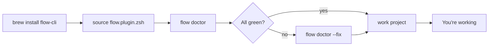
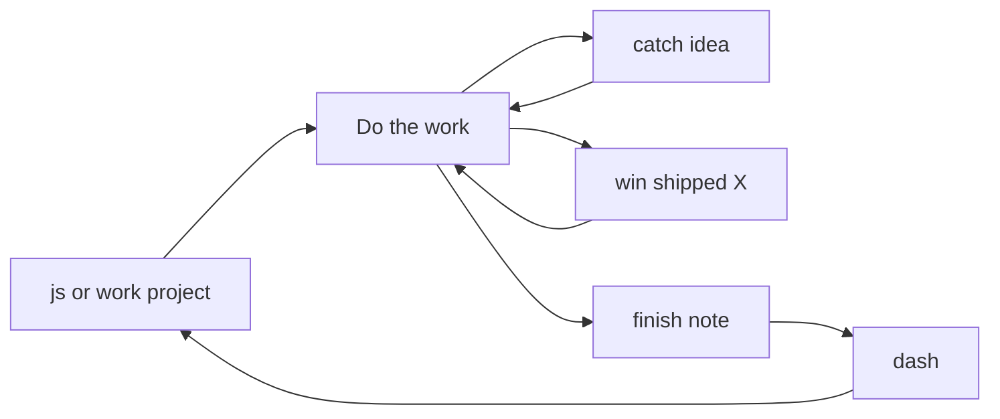
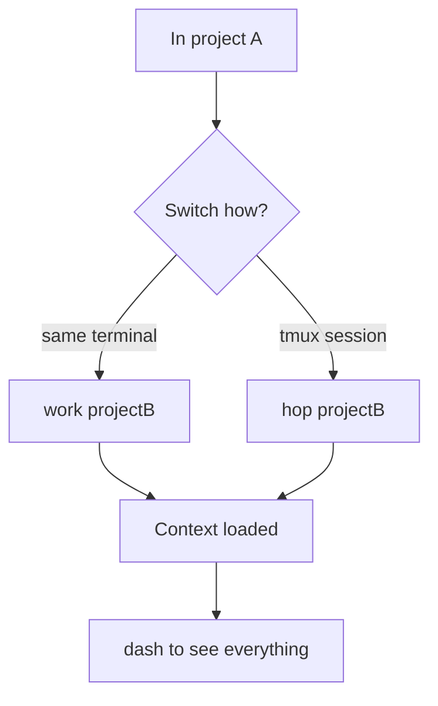
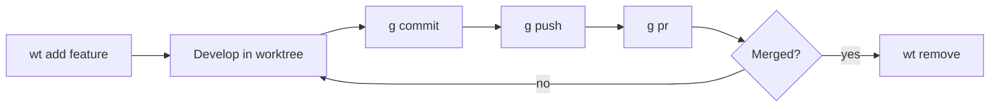
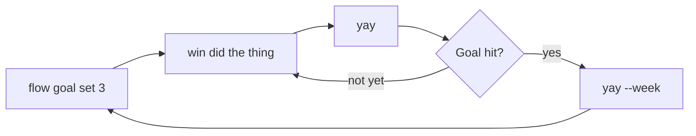

---
tags:
  - getting-started
  - adhd
  - workflows
---

# Visual Workflows

!!! tldr "📊 See how flow-cli flows"
    The core flow-cli journeys as diagrams — onboarding, your daily session loop, switching projects, the git feature flow, and the dopamine loop. Visual learner? Start here, then jump to the [text recipes](../help/WORKFLOWS.md) or [tutorials](../tutorials/index.md).

> **Scenario:** You learn faster from a picture than a paragraph.
> **Time:** ~3 minutes to skim
> **Difficulty:** ⚡ Easy

---

## 🚀 First-Time Onboarding

From zero to your first session.

**Next:** [Installation](../getting-started/installation.md) · [Quick Start](../getting-started/quick-start.md)

---

## 🔁 Your Daily Session Loop

The rhythm of a focused day.

**Next:** [Your First Session](../tutorials/01-first-session.md) · [Dopamine Features](../tutorials/06-dopamine-features.md)

---

## 🔀 Switching Projects

Jump context without losing your place.

**Next:** [Multiple Projects](../tutorials/02-multiple-projects.md) · [TM Dispatcher](../tutorials/11-tm-dispatcher.md)

---

## 🌿 Git Feature Workflow

Branch, build, integrate — with worktrees.

**Next:** [Git Feature Workflow](../tutorials/08-git-feature-workflow.md) · [Worktrees](../tutorials/09-worktrees.md)

---

## 🎉 The Dopamine Loop

Make progress visible — stay motivated.

**Next:** [Dopamine Features](../tutorials/06-dopamine-features.md) · [Quick Capture](../tutorials/44-quick-capture.md)

---

## 🗺️ Go Deeper — Diagram-Rich Pages

When you want the full architecture, not just the happy path:

| Page | What you'll see |
|------|-----------------|
| [Master Architecture](../reference/MASTER-ARCHITECTURE.md) | The complete flow-cli architecture reference, diagram by diagram |
| [Dotfile Safety](../architecture/DOT-SAFETY-ARCHITECTURE.md) | Safety rails in the `dots`/`sec`/`tok` dispatchers |
| [Teaching Workflow (Visual)](../guides/TEACHING-WORKFLOW-VISUAL.md) | The `teach` content-to-deployment pipeline |

---

## 📚 Related

- [Common Workflows](../help/WORKFLOWS.md) — the same patterns as copy-paste text recipes
- [Quick Reference](../help/QUICK-REFERENCE.md) — every command on one page
- [Tutorials](../tutorials/index.md) — learn one feature at a time
