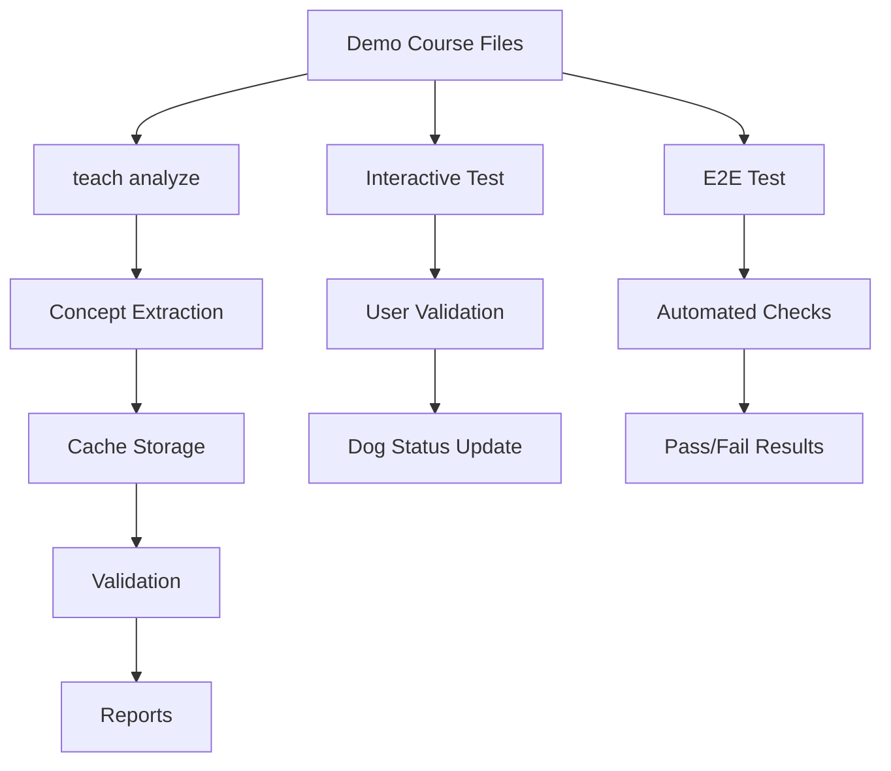

# E2E and Interactive Testing Guide

## Overview

This guide covers the end-to-end (E2E) tests and interactive dog feeding tests for teach analyze functionality using the demo course fixture.

## Test Suites

### 1. E2E Test Suite (e2e-teach-analyze.zsh)

**Purpose:** Automated end-to-end testing of teach analyze workflow

**Coverage:** 25 tests across 7 sections

#### Sections

##### Setup and Prerequisites (4 tests)

- Demo course directory exists
- Lecture files exist (week-01, week-02, week-03)
- concepts.json configuration exists
- Plugin sources successfully

##### Single File Analysis (3 tests)

- Analyze week-01: foundational concepts
- Analyze week-02: concepts with prerequisites
- Analyze week-03: advanced concepts

##### Prerequisite Validation (3 tests)

- Validate proper dependency chain
- Detect circular dependencies in broken file
- Validate concept ordering across weeks

##### Batch Analysis (3 tests)

- Batch analyze all lectures
- Cache created during batch analysis
- Second run uses cache (faster)

##### Slide Optimization (2 tests)

- Slide break analysis with timing
- Slide timing estimates

##### Report Generation (2 tests)

- JSON report generation
- Markdown report generation

##### Integration Tests (3 tests)

- Full workflow (analyze → validate → optimize)
- Dependency graph construction
- Bloom taxonomy level assignment

#### Running E2E Tests

```bash
# Run E2E suite
./tests/e2e-teach-analyze.zsh

# Part of full test suite
./tests/run-all.sh
```

**Expected Results:**

- 25/25 tests passing
- Cache files created in `.teach/analysis-cache/`
- Reports generated in `.teach/reports/`

### 2. Interactive Dog Feeding Test (interactive-dog-teaching.zsh)

**Purpose:** ADHD-friendly interactive testing with user validation

**Coverage:** 10 gamified tasks

#### Game Mechanics

- **Dog Status:** Tracks hunger (0-100%) and happiness (0-100%)
- **Task Completion:** 10 tasks total, each feeds the dog
- **Star Rating:** 0-5 stars based on completion (⭐⭐⭐⭐⭐)
- **User Validation:** User confirms output matches expectations

#### Tasks

##### Task 1: Analyze Week 1 Lecture (15 points)

Test basic concept extraction from foundational content.

**Expected:**

- 3 concepts: descriptive-stats, data-types, distributions
- Categories: fundamental, core
- Prerequisites shown for distributions

##### Task 2: Analyze Week 2 (With Prerequisites) (15 points)

Test prerequisite chain detection.

**Expected:**

- 3 concepts: probability-basics, sampling, inference
- Prerequisites: data-types, distributions
- Inference requires multiple prerequisites

##### Task 3: Batch Analyze All Lectures (20 points)

Test parallel processing of multiple files.

**Expected:**

- Processing: week-01, week-02, week-03
- Total concepts: 8
- Summary statistics

##### Task 4: Verify Cache Usage (10 points)

Test cache hit on second run.

**Expected:**

- "using cached data" or "cache hit" message
- Faster completion time

##### Task 5: Validate Prerequisites (Valid Files) (15 points)

Test prerequisite validation on proper files.

**Expected:**

- Validation: PASSED or ✓
- No circular dependencies
- All prerequisites satisfied

##### Task 6: Detect Circular Dependency (20 points)

Test error detection on broken file.

**Expected:**

- ERROR or FAILED validation
- "circular dependency" mentioned
- Shows: linear-regression ↔ correlation cycle

##### Task 7: Slide Break Optimization (Week 1) (15 points)

Test slide optimization features.

**Expected:**

- Slide break suggestions
- Timing estimates (minutes)
- Key concepts to emphasize

##### Task 8: Check Bloom Taxonomy Levels (10 points)

Test cognitive complexity classification.

**Expected:**

- Bloom levels: Remember, Understand, Apply, Analyze
- Week 1: Remember → Understand
- Week 2: Higher-order thinking (Analyze)

##### Task 9: Cognitive Load Assessment (10 points)

Test cognitive load estimation.

**Expected:**

- Cognitive load: low, medium, high
- Week 1: mostly low-medium
- Week 2 inference: high cognitive load

##### Task 10: Visualize Dependency Graph (20 points)

Test full dependency chain visualization.

**Expected:**

- Week 3 regression requires: correlation, inference
- Inference requires: probability, sampling, distributions
- Full chain visible

#### Running Interactive Test

```bash
# Run interactive dog feeding test
./tests/interactive-dog-teaching.zsh
```

**Tips:**

- Read expected output before running commands
- Carefully confirm if output matches expectations
- Dog happiness increases with correct validations
- Dog disappointment decreases happiness
- Perfect score: 10/10 tasks ⭐⭐⭐⭐⭐

#### Scoring

| Tasks Completed | Rating     | Message                      |
| --------------- | ---------- | ---------------------------- |
| 10/10           | ⭐⭐⭐⭐⭐ | Perfect! Extremely happy dog |
| 8-9/10          | ⭐⭐⭐⭐   | Excellent! Very happy dog    |
| 5-7/10          | ⭐⭐⭐     | Good! Satisfied dog          |
| <5/10           | ⭐⭐       | Needs work. Hungry dog       |

## Demo Course Fixture

**Location:** `tests/fixtures/demo-course/`

**Structure:**

```
demo-course/
├── README.md                    # Course documentation
├── .teach/
│   └── concepts.json           # Concept registry
└── lectures/
    ├── week-01.qmd             # Foundational (3 concepts)
    ├── week-02.qmd             # Intermediate (3 concepts)
    ├── week-03.qmd             # Advanced (2 concepts)
    └── week-03-broken.qmd      # Test file (circular dependency)
```

**Course:** STAT-101 - Introduction to Statistics

**Total Concepts:** 8

- Foundational: 2 (descriptive-stats, data-types)
- Core: 4 (distributions, probability-basics, sampling, correlation)
- Advanced: 2 (inference, linear-regression)

**Bloom Taxonomy:**

- Remember: 1 concept
- Understand: 4 concepts
- Apply: 2 concepts
- Analyze: 1 concept

**Cognitive Load:**

- Low: 2 concepts
- Medium: 4 concepts
- High: 2 concepts

See `tests/fixtures/demo-course/README.md` for complete details.

## Test Data Flow



## Development Workflow

### Creating New Test Cases

1. **Add concept to demo course:**

   ```bash
   # Edit lectures/week-0N.qmd
   # Add concept to frontmatter
   ```

2. **Update concepts.json:**

   ```json
   {
     "concept-id": {
       "name": "Concept Name",
       "category": "core",
       "week": N,
       "file": "lectures/week-0N.qmd",
       "prerequisites": ["prereq1", "prereq2"]
     }
   }
   ```

3. **Add E2E test:**

   ```bash
   # Edit tests/e2e-teach-analyze.zsh
   # Add test function in appropriate section
   ```

4. **Add interactive task:**

   ```bash
   # Edit tests/interactive-dog-teaching.zsh
   # Add task with expected output
   ```

5. **Clear cache and run:**
   ```bash
   rm -rf tests/fixtures/demo-course/.teach/analysis-cache
   ./tests/e2e-teach-analyze.zsh
   ./tests/interactive-dog-teaching.zsh
   ```

### Testing New Features

#### Example: Test New Analysis Flag

```bash
# 1. Add to demo course test
test_new_feature() {
    local output
    output=$(zsh -c "
        source '$PLUGIN_DIR/flow.plugin.zsh' 2>/dev/null
        cd '$DEMO_COURSE'
        teach analyze --new-flag lectures/week-01.qmd 2>&1
    ")

    if echo "$output" | grep -q "expected output"; then
        log_pass "New feature works"
    else
        log_fail "New feature missing output"
        return 1
    fi
}
```

#### Example: Add Interactive Task

```bash
# 2. Add to interactive test
echo -e "${BOLD}${MAGENTA} Task 11: Test New Feature${NC}"
echo ""
show_expected \
    "New feature output line 1" \
    "New feature output line 2"

echo -e "${BOLD}Command:${NC} teach analyze --new-flag lectures/week-01.qmd"
echo ""
teach analyze --new-flag lectures/week-01.qmd

if ask_confirmation "Did you see the new feature output?"; then
    feed_dog 15
else
    disappoint_dog
fi
```

## Continuous Integration

Both test suites can be run in CI:

```yaml
# .github/workflows/test-e2e.yml
- name: Run E2E Tests
  run: ./tests/e2e-teach-analyze.zsh
# Interactive tests require manual validation
# Skip in CI, run locally
```

## Troubleshooting

### E2E Tests Fail

**Issue:** Cache-related failures

```bash
# Clear cache
rm -rf tests/fixtures/demo-course/.teach/analysis-cache
rm -rf tests/fixtures/demo-course/.teach/reports
```

**Issue:** Plugin not loading

```bash
# Check plugin can be sourced
source flow.plugin.zsh
```

**Issue:** Demo course missing

```bash
# Verify fixture exists
ls tests/fixtures/demo-course/lectures/
```

### Interactive Test Issues

**Issue:** Commands not producing expected output

- Check plugin version (may need updated demo course)
- Run commands manually to verify output
- Compare with expected patterns in test

**Issue:** Dog status not updating

- Check task completion logic
- Verify feed_dog() calls
- Debug happiness/hunger calculations

## Best Practices

### Writing E2E Tests

1. **Test one feature per test function**
2. **Use descriptive test names** (`test_analyze_week01`)
3. **Check multiple output patterns** (don't rely on single string)
4. **Clean up resources** (cache, reports)
5. **Return early on failure** (`return 1`)

### Writing Interactive Tasks

1. **Clear expectations** (show_expected with exact patterns)
2. **Realistic confirmation questions** (did you see X?)
3. **Appropriate point values** (20 for complex, 10 for simple)
4. **Progressive difficulty** (start easy, build complexity)
5. **Meaningful feedback** (explain why it matters)

### Maintaining Demo Course

1. **Keep it minimal** (8 concepts, 3 weeks + 1 broken)
2. **Realistic content** (actual statistics course material)
3. **Clear dependencies** (easy to visualize graph)
4. **Document changes** (update README.md)
5. **Version control** (track fixture changes in git)

## Related Documentation

- [Testing Guide](../docs/guides/TESTING.md) - Complete testing overview
- [Teach Analyze Tutorial](../docs/tutorials/21-teach-analyze.md) - User guide
- [Teach Analyze API](../docs/reference/TEACH-ANALYZE-API-REFERENCE.md) - API docs
- [Demo Course README](fixtures/demo-course/README.md) - Course details

---

**Created:** 2026-01-22
**Status:** Production Ready
**Maintained By:** flow-cli testing team
