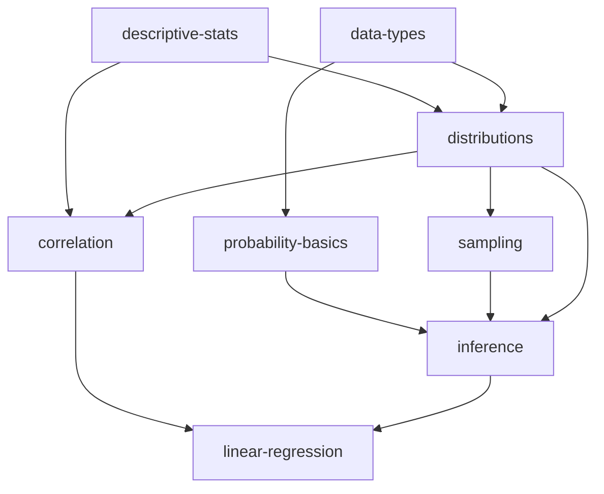

# Demo Course: STAT-101 - Introduction to Statistics

**Purpose:** Test fixture for teach analyze E2E and interactive tests

## Course Structure

### Week 1: Introduction to Statistics

**File:** `lectures/week-01.qmd`

**Concepts:**

- `descriptive-stats` (fundamental, understand, low load, 15 min)
- `data-types` (fundamental, remember, low load, 10 min)
- `distributions` (core, understand, medium load, 20 min)
  - Prerequisites: descriptive-stats, data-types

**Content:**

- Measures of central tendency (mean, median, mode)
- Categorical vs numerical data
- Distribution properties

### Week 2: Probability and Inference

**File:** `lectures/week-02.qmd`

**Concepts:**

- `probability-basics` (core, understand, medium load, 25 min)
  - Prerequisites: data-types
- `sampling` (core, apply, medium load, 20 min)
  - Prerequisites: distributions
- `inference` (advanced, analyze, high load, 30 min)
  - Prerequisites: probability-basics, sampling, distributions

**Content:**

- Probability rules and calculations
- Sampling methods (random, stratified, cluster)
- Statistical inference (estimation, confidence intervals, hypothesis testing)

### Week 3: Correlation and Regression

**File:** `lectures/week-03.qmd`

**Concepts:**

- `correlation` (core, understand, medium load, 20 min)
  - Prerequisites: descriptive-stats, distributions
- `linear-regression` (advanced, apply, high load, 35 min)
  - Prerequisites: correlation, inference

**Content:**

- Pearson correlation coefficient
- Simple linear regression
- Model fitting and assessment

### Week 3: Broken (Testing File)

**File:** `lectures/week-03-broken.qmd`

**Purpose:** Test circular dependency detection

**Issue:** Contains circular dependency:

- `linear-regression` requires `correlation`
- `correlation` requires `linear-regression` (CIRCULAR!)

This should be detected by `teach validate --deep`.

## Concept Graph



## Bloom Taxonomy Coverage

| Level          | Concepts                                                          |
| -------------- | ----------------------------------------------------------------- |
| **Remember**   | data-types                                                        |
| **Understand** | descriptive-stats, distributions, probability-basics, correlation |
| **Apply**      | sampling, linear-regression                                       |
| **Analyze**    | inference                                                         |

## Cognitive Load Distribution

| Load       | Concepts                                                 | Count |
| ---------- | -------------------------------------------------------- | ----- |
| **Low**    | descriptive-stats, data-types                            | 2     |
| **Medium** | distributions, probability-basics, sampling, correlation | 4     |
| **High**   | inference, linear-regression                             | 2     |

## Testing Coverage

### Single File Analysis

- ✅ `teach analyze lectures/week-01.qmd` - 3 concepts
- ✅ `teach analyze lectures/week-02.qmd` - 3 concepts with prerequisites
- ✅ `teach analyze lectures/week-03.qmd` - 2 concepts with complex dependencies

### Batch Analysis

- ✅ `teach analyze --batch lectures/` - All 3 weeks (8 concepts total)

### Validation

- ✅ `teach validate --deep lectures/*.qmd` - Valid dependency chain
- ✅ `teach validate --deep lectures/week-03-broken.qmd` - Detects circular dependency

### Slide Optimization

- ✅ `teach analyze --slide-breaks lectures/week-01.qmd` - Slide timing and breaks
- ✅ `teach analyze --slide-breaks lectures/week-02.qmd` - Advanced slide analysis

### Reports

- ✅ JSON report generation
- ✅ Markdown report generation

## Cache Testing

The demo course supports cache testing:

1. **First run:** `teach analyze --batch lectures/` - Creates cache
2. **Second run:** `teach analyze --batch lectures/` - Uses cache (faster)
3. **Modified file:** Edit any `.qmd` - Cache invalidated
4. **Cache clear:** `rm -rf .teach/analysis-cache` - Force fresh analysis

## Configuration

### Course Config

**File:** `.flow/teach-config.yml`

Contains:
- Course metadata (name, code, semester, instructor)
- Week definitions with topics, styles, and objectives
- Scholar settings and macro configuration
- Semester dates and break weeks

### Lesson Plans

**File:** `.flow/lesson-plans.yml`

Contains:
- Detailed weekly lesson plans (5 weeks)
- Learning objectives, activities, and assessments
- Materials and prerequisites
- Duration and timing information

### Teaching Prompts

**Directory:** `.flow/templates/prompts/`

Course-level prompt overrides:
- `lecture-notes.md` - Custom STAT-101 lecture generator
- `quiz-questions.md` - Quiz question generator with difficulty levels

These override plugin defaults, demonstrating 3-tier resolution.

### Concepts Registry

**File:** `.teach/concepts.json`

Contains:
- Full concept registry with week assignments
- Prerequisite mappings
- Bloom taxonomy and cognitive load metadata

### LaTeX Macros

**File:** `_macros.qmd`

Contains:
- Statistical notation macros (E, Var, Cov, etc.)
- Probability symbols
- Distribution notation
- Hypothesis testing symbols

## Usage in Tests

### E2E Test Suite

```bash
./tests/e2e-teach-analyze.zsh
```

**Coverage:** 25+ tests across all teach analyze features

### Interactive Dog Feeding Test (teach analyze)

```bash
./tests/interactive-dog-teaching.zsh
```

**Coverage:** 10 interactive tasks with user validation

### Interactive Dog Feeding Test (teach prompt)

```bash
./tests/interactive-dog-prompt.zsh
```

**Coverage:** 12 interactive tasks testing prompt management

### E2E Test Suite (teach prompt)

```bash
./tests/e2e-teach-prompt.zsh
```

**Coverage:** 33 tests for prompt list, show, edit, validate, export, advanced features

**See:** `tests/TESTING-SUMMARY.md` for complete test documentation

## Maintenance

### Adding New Weeks

1. Create `lectures/week-0N.qmd` with frontmatter
2. Add concepts to `.teach/concepts.json`
3. Update this README with new concepts
4. Update dependency graph

### Modifying Concepts

1. Edit concept definitions in `.qmd` frontmatter
2. Sync `.teach/concepts.json` if needed
3. Clear cache: `rm -rf .teach/analysis-cache`
4. Re-run tests to verify

---

**Created:** 2026-01-22
**Updated:** 2026-01-29 (Added prompts, lesson plans, macros)
**Version:** 2.0.0
**Status:** Production Ready
